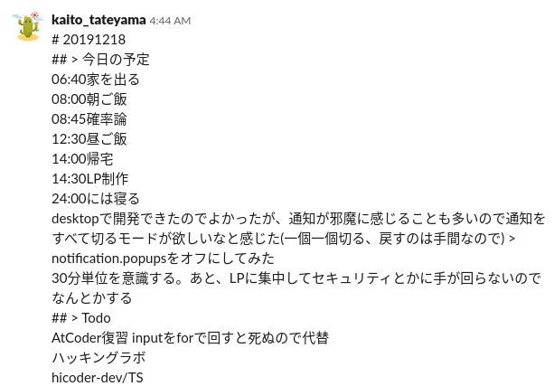

2019 年は体調管理と単位をとることに集中していました。大学での生活基盤を固めたので、2020 年は外に出て評価される体験を積みたいと思っています。

# 2019 年振り返り

## 1~3 月

- センター試験を受けた
- 二次試験を受けた
- 広島大学に受かった
- 東京大学を退学した
- [アセンブリの記事](https://qiita.com/kaito_tateyama/items/89272098f4b286b64115)を書いた
- CTF チーム StarrySky を mitsu さんと組んだ

このときから 2019 年の目標を意識していることが、ヴァネロピさんとの会話から分かる。

```text
ですね、大学入ったら1年の前期はおとなしく大学に集中して、だんだんギア上げていくつもりです(お心遣い痛み入ります、ありがたい🙏)
健康が一番効率に直結していることを身をもって知ったので…(それはそう)
https://twitter.com/kaito_tateyama/status/1102555151179558912
```

実際前期はかなりおとなしくしていた。

アセンブリの記事がかなり好評だったみたい。このときから[うーちゃんさん](https://twitter.com/uchan_nos)と仲良くさせていただいているので、今考えるとここが転機だったと思います。ここまではなんとなく競技プログラミング、CTF をする競技志向だったのですが、セキュリティミニキャンプへの参加など、CS(コンピュータ・サイエンス)志向になっていきました。

また、東京大学を退学しました。このことについてはいつかまとめようと思っています(はてなブログに書いた記事(現在非公開)もそのうち再公開したいなと考えています。)

## 4~6 月

- [けんしんさんの記事](https://blog.knshnb.com/posts/graduation-is/)を読んで、本格的に CS を独学で学ぶ決意をする
- 広島大学に通い始めた
- うーちゃんさんが広島に来てくださって、広島大学勢でお好み焼きを食べた
- VuePress を触った →Vuejs を触った
- セキュリティネクストキャンプへの応募をあきらめた
- Arch の環境構築をした([喜んでいる様子](https://twitter.com/kaito_tateyama/status/1145104807717302272))
- このあたりで HiCoderCTF のサーバーサイドとデザインを書いていた(後に挫折)

このあたりは新しい環境への慣れを目指していました。したがって、ネクストキャンプや夏のインターンなど応募をあきらめたものも多かったです。

Arch Linux はいいぞ。

## 7~9 月

- ICT トラブルシューティングコンテスト夏に出てボロ負けする
- ISUCON に出てボロ負けする
- オープンソースカンファレンス広島に参加([様子](https://twitter.com/kaito_tateyama/status/1173209311691997190))
- SECCON Workshop 広島に参加
- 低レイヤを知りたい人のための C コンパイラ入門で電卓程度まで実装する
- お絵描き(DeepLearning でフレーム補完)
- TSGCTF の復習で Writeup を眺めていて、型理論に興味が湧く
- ツカモさんとお話して自分はまだ未熟というか、考えていないことを知る
- 山梨ミニキャンプに行く
- 前期の単位をすべて取得する

ここは前期の総決算でした。

前期の単位をすべて取得できたのはすごく嬉しかったです。これまで 4 年間、前の大学では単位をとれずにずっと同じ薄暗い隅をぐるぐると回っていたような気持ちだったので。ここでなにか打開できたような気持ちになって、かなり人生に対して前向きになれました。

山梨ミニキャンプは準備しようしようと言いながら全く出来なかったので、早めに動くことの重要性を痛感させられました。準備は本当に早めにしたほうがいい。

また、この山梨ミニキャンプも今年の転機でした。最初はうーちゃんさんの講義を受けたい！という気持ちからの申し込みでしたが、受けてみると本番の講義よりも事前課題が重要で、その量に圧倒されながらも集中して時間を投下することでかなり成長できた気がします。[きさらぎさん](https://twitter.com/nabesan_C)がミニキャン後の復習の進捗目覚ましいので、僕もそろそろ復習に手をつけたい。

## 10~12 月

- hiro_it で CTF をはじめようという LT をする
- 情報処理学会ジュニア会員になった。論文を読もうと思ってそんなに読んでない...
- ICT トラブルシューティングコンテスト冬に出てボロ負けする
- blog_os の翻訳にチャレンジする(が、時間がかかりすぎてあきらめた)
- ディスコプログラミングコンテスト広島に行く
- 広島に来てくださったエンジニアの方々とお話する
- Rust でサーバーサイドを書きはじめる(hicoder-dev)
- waka-box を利用してコードを週に何時間書いたか、それを元に健康度を計測しはじめる
- Slack に今日の予定をその日の朝に書き留めてその通りに行動するように気をつける
- セキュリティ勉強会に参加する
- プラサミ関西に参加する

大学に通うことが意識せずにできるようになり、外に出ていこうとしていました。実際、意識して外に出てできるだけ評価される機会を増やそうとしました。それでいて自分の生活をきちんと送れているのでよかったと思います。

中でも Slack と waka-box で自分の体調管理、生産性の可視化を行えるようになったのは画期的でした。こういうものは体調が悪いときにこそやらねばならない(元気な時だけ体調管理しても意味がない)のですが、11 月にダウンしてから管理をはじめて、今までずっと続いているので意味のある活動になっています。朝起きたらその日の予定を決めてその通りに動く、タスクをきちんと管理する、これを今年も続けていきたい。

以下のような感じで毎日計画を立てています。



# 2020 年の目標

- 体調管理をする。体調が悪いときにこそ、自分の体調を分析したり、コード量から「今体調が悪いぞ」と気付けるようになる。
- 夏のインターン、冬のインターン、交通費支援のあるイベントに応募する。自分のどこが足りないのか、どこが強みなのか外部にさらされて評価される機会を積極的に掴みに行く。
- 言語処理系について学ぶ。具体的には、型理論を学ぶ。研究はこちらの方向でやってみたいと思っているので、本当にそれを研究したいのか？ということをはっきりさせるために手を動かす。
- CTF に出る。国内だけでなく、海外の歯が立たない CTF にも出るだけ出るようにする。
- 競技プログラミングを再開する。コンテストより、CS の基礎としてのアルゴリズムを学ぶことに力を入れる。
- CS の基礎を固める。cs_edu(CS について学んだことをまとめている自分の文書群)をもっと広く深くする。

# まとめ

Twitter で仲良くさせていただいている人々は、割とセキュキャンに行くとかインターンに行くとか就職したとか、そういうきらびやかな経歴を持っていてさらに上を目指している人ばかりで、さらに若い人ばかりなので僕には眩しく、うらやましいなと思うことが多いです。僕もきちんと大学卒業して就職したい。そうした、大学生活などは前提として自学を重ねた人々とは対象的に、僕は大学出席ガチ勢として、体調の維持管理と講義への出席といういわゆる当たり前のことに力を注いでいました。無理をしない、自分のできる範囲のことをやる、少しでも手を伸ばしたくなったらそう自分に言い聞かせて背伸びをせずに過ごした一年でした。

転機は 3 つあって、1 つめはアセンブリの記事を書いたこと。2 つめは前期の単位をすべて取得したこと、3 つめは山梨ミニキャンプに参加したことだと思います。どれもかなり頑張った末に手に入れた出来事なのでやはり正しい方向に戦略を立てて努力と時間を投下することの重要性を感じます。

また、あまり書いていないのですがいくつか学内や学外から Web 開発のお話を頂きました。ほとんど断ったのですがいくつか受けてしまって、今考えると、相応の時給が発生しない限りその手の話を受けるべきではありません。うーちゃんさんを見ていると特に感じるのですが、自分の本当に興味のあることに時間を使うべきです。誰もが好きなことに特化して生きていけるわけではないのですが、自分がやっていて心が踊らないものであればそこにかける労力を将来的に減らしていく努力をすべきです。

また、今年ずっと自分が何をすべきなのか考え続けていて、その中で自分のテーマのようなものを決めました。僕は割と昔から病気がちだったりいじめられたりとつらい状態が続いていて、今も大学を中退して入り直して就職できるのか分からない、自分の感情としてはつらい状態にあります。だからこそ、つらい状態の人が報われる、そういった救済をテーマにした物語が好きです。僕自身も、いつかこのつらい状態を抜け出して救済されたい。そういう思いが原動力となって僕を突き動かしています。その報われたい思い、これを僕は祈りと呼んでいます。その祈りを込めた自己表現ができるようになることが今の僕の裏のテーマです。もちろん体調管理、勉強、そういったものは大切ですが、自分の感情を回していくためには、僕には表現が、好きなものを好きということが、いつかは救済されたいという祈りを叫ぶことが必要なのではないかと思っています。具体的な手段として、お絵描きと音楽をやっていきます。これはあまり表には出してないので、いつか表に出せるようになりたい。

今年は体調管理をきっちりして手に入れた時間と努力を、自分の本当に興味のあることに投下して行きたいと思います。頑張ります。
