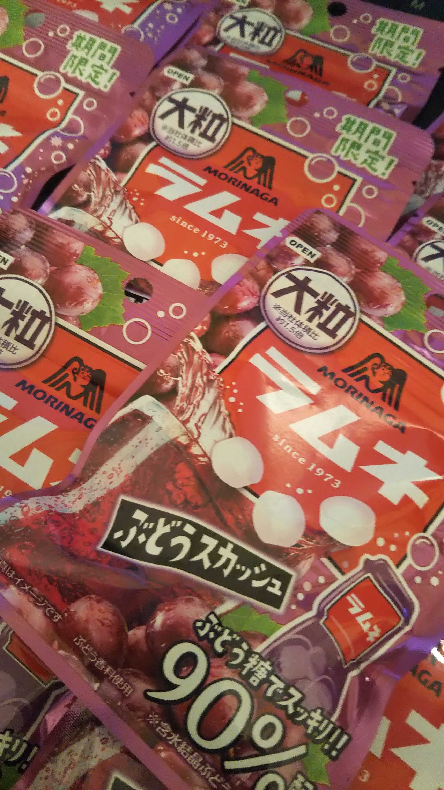

　ブログを新しくしました。Next.js を使い、TypeScript を書きました。
　映画大好きポンポさんの原作のネタバレを含みます。

# ラムネを買った

　Twitter の FF の方が最近、ラムネ・ぶどうラムネ・エナジードリンクラムネの 3 種類のラムネを上げて儀式めいたことをされているので、もともとラムネが好きな僕は「ぶどうラムネ、気になる！」となってしまいました。
　そして以下のようになりました。

　気づいたらあまぞーんでラムネを、購入...
　ぶどうラムネは美味しいので嬉しいのですが、間断なくラムネを口に運ぶようになってしまったので、箱買いも考えものだなあと思いました。あればあるだけ食べてしまうよね。

# 映画を見に行きたい

　こんなご時世なので、僕は普段家でおとなしくしています。ですが、どうしても見たい映画が出てきました...いやこのタイミングは悩むって... この映画、「映画大好きポンポさん」の話をしようと思います。
　原作が好きで、1 巻でかなり満足したので 2 巻は敢えて買っていません。なので 1 巻の話しかしません。
　まず映画化が決まったときにトレイラーが出て、そこで感動して何度もトレイラーを見ていました。はっと我に帰って、「この状況収まった後にぜひとも劇場で見たいなあ」と思ったのですが、劇場公開の 6 月までにどうも状況がよくなるとは思えないですね...悲しい...
　映画大好きポンポさんの中で僕が一番好きなシーンはかなり前半の方にあります。アシスタントのジーン君が、天才映画監督ポンポさんに「他に僕よりできる人はいくらでもいたのに、なぜ僕をアシスタントに選んだのですか？」と問うた後のポンポさんの返答シーンです。
　ポンポさんは「目に光がなかったから」と答えます。満たされた人間は考えなくても幸せだ。満たされない人間は、この世界ではなく自分の精神世界を創造する。これが創作活動だと言うのです。
　僕はこの考え方がとても好きで、ぼんやり思い出すと確かにこれはつらい時期に世界の解像度がぐんと上がって鮮やかに見えていたこととも関係しているのかなと思います。追い詰められた時には、外界と自分を切り離して創造活動を精神世界で行うのかもしれないし、それは健康からは程遠く離れているけれども、そもそも自分だけの何かを生み出すというのは苦しみやどん底で成し遂げられるものであって人生順風満帆のときには見えない世界があるのかもしれない。そういう意味でなんだか今のどん底も楽しく歩けるような、少し肯定できるような気がして、この考え方がかなり好きです。

# 夢を見た

　僕はあまり夢を見ません。具体的には、年に 10 回も見ない(起きたときには覚えていない)と思います。
　たいてい夢はワンパターンで、東京タワーに向けて走っていくと崖から落ちるやつとかなんですが、それ以外の非定形の夢は僕にとってタイムリーに重要な意味を持つことが多く、ちょっと身構えてしまいます。非定形の夢を見た後は、その内容を忘れていることが多いのですが、起きたら涙を流しているのでそれで非定形の夢を見たらしいことが分かります。
　今回の夢は高校時代にあたる、架空の出来事でした。陸上部の友達が陸上の推薦をもらって進学するという場面で、別れの空気が漂いつつ、高校時代を振り返るみたいなことをしています。
　夢の中で振り返るうちに、最近考えていた「アイデンティティはいつまで意識して持つべきなのか」という問いに答えを出すことができました。高校時代は僕は SNS をしていなかったしインターネットは辞書みたいなものだと思っていたし携帯電話も持っていなかったので、自分の世界というものが学校で閉じていました。アイデンティティはその世界、即ち学校に対して保たれるので、数学に絞って、「この人といえば数学」という感じになることで生き心地を良くしていたのだと思います。しかし大学生になり、精神がぼろぼろになる過程でアイデンティティどころか普通の人間になることすら難しくなってきました。まともになりたい、と思っても、もう僕はレールから外れてしまったようなのです。
　では僕はどんな世界に対してアイデンティティを保とうとするべきなのでしょうか？結局のところ、これは答えは自分の世界になると考えています。アイデンティティが比較によって成立するのが高校のときで、今、世界が広くなった時においては、比較がそもそも機能せず、自身の作り出す世界観に対し、自分の存在を証明する形で保たれるような気がしています。
　なんかあまりうまく言葉にできませんね。難しいです。
　夢の話に戻ると、僕が当時の観測可能な世界である学校においてわかりやすいキャラクターを得られたのはすごく幸せなことだったと思います。僕はこういう人間でありたいという願いから頑張って勉強できたおかげで今の自分があると思います。でも、いつまでも変わらないということはありえなくて、世界が変わっていくうちに僕も何を拠り所とするのか変わっていかないとなあと思ったのでした。

# 終わりに

　なんかキーボードの調子が悪くてエンターキーが連打されて大変です。キーボードをとりあえず変更して、近いうちにキーキャップを変更しようと思います。
