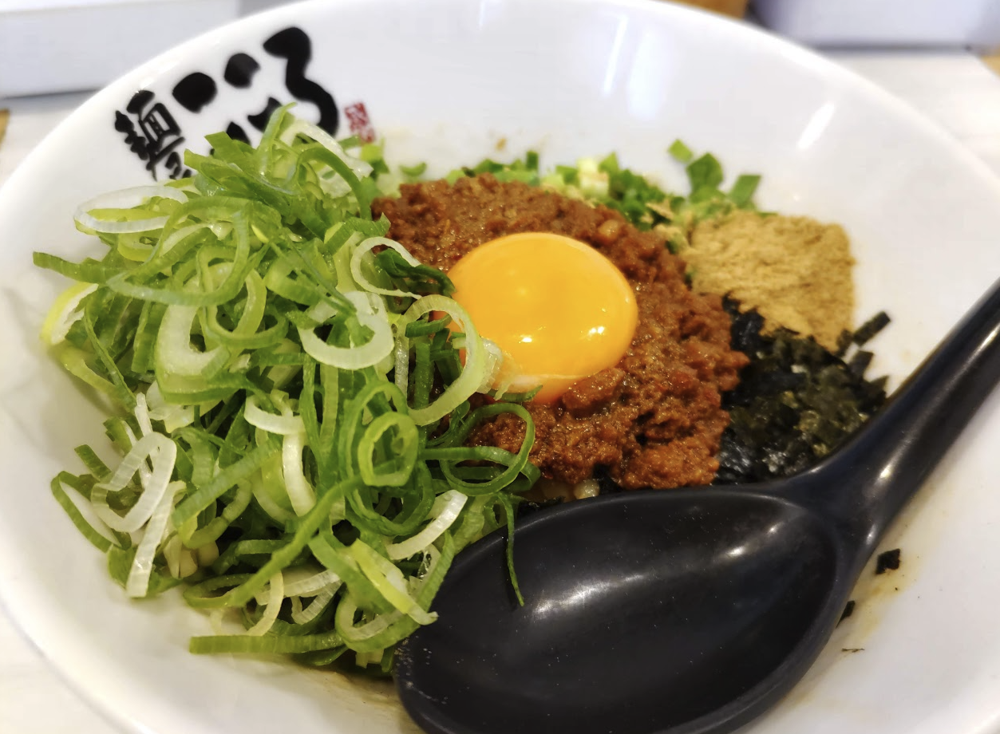

　しろねぎさんと会ってtraP聖地巡礼をした話をします。

## おおお

　思ったよりホテルをチェックアウトするのが早く、また渋谷 - 大岡山間が想像以上に短く、気づいたらおおおを貫通して洗足池にいました。

　土曜の午前の洗足池は水面がキラキラして、幸せそうな家族づれとランニングに勤しむ方、散歩するおじいちゃんおばあちゃん、都会の中にでかい池と公園があるとこんなのんびりした雰囲気なんだな〜と思いながら昼寝しました。足漕ぎボート、面白そうでちょっと興味ありますね。

　少し寝て起きても時間があったのでお家のサーバに繋ぎました。RustのPhantomDataが猛烈に気になったので調べたりコード書いたりしているうちに時間が来たので大岡山駅に向かいます。

これは洗足池の看板。千束という地名もすぐ近くにあり、この読みは「ちさと」ではなくこれも「せんぞく」

## すずかけ台...？

> 「すずかけ台で僕と握手」
> --- でっていう @d_etteiu8383 
> ref. https://twitter.com/d_etteiu8383/status/1586183171950858240

　このツイート朝に見かけた時東工大初心者すぎて「今日はでっていうさんと会えるのか！やった〜！」って思っていた。
　この後、W933講義室でhijiki51さんと会話している時に「あれここすずかけ台じゃないじゃん」とこのツイートの真意を理解して涙。traP LTも面白かったし3Dの講習会の作り込みも凄かったし、いつかお会いしてお話ししてみたい。研究お疲れ様です。

## こころ

　お腹がそれほど減っていなかったのでしろねぎさんの思い出の地と解説を聞きながら散歩して、ちょうど良い頃合いでこころに入りました。

　おいしかった〜！もっかい食べたい。

## 散歩

　自由が丘を散歩しました。ぶらぶらしてから本屋とスタバに行きました。

　本屋はいつも計算機のオタクと行くため、しろねぎさんは少し畑の違う人だから別の本棚にも立ち寄って面白かったです。建築のコーナーで見た装飾品図鑑的な本が面白そうだったし、アートコーナーとかはマジで立ち寄ったことなかったのでフォントの本などを眺めると結構楽しいことが分かりました。

　スタバではしろねぎさんのスケッチブックやクリスタの過去絵を見せてもらいました。僕はファンなのでかなりかなり嬉しかったですね...

　せっかくなのでクリエイターに共通する性質を探ろうと思っていくつか質問をしました。以前から僕は「審美眼」のようなものを磨くことが創作をする人に撮って大事なのかなという仮説を持っていたのですが大体正しそうなことがわかりました。あとやはり時間をかけている...！量を積んでいる先に創作は成り立っている...！ということが理解できました。

　これはスタバでyakudoしている様子

## traP

　15:50くらいに自由が丘を出ました。東工大に登校だい！をします。
　わーい！

　ゲームドーーンは夜明けのdawnなのね

　この黒板のロゴの写真撮っている横にhijikiさんらしき人がいたのですが名札が裏返っていて自信がなくチキっていたら僕のセキュキャンパーカーを認識してhijikiさんがどなたですか？と声をかけてくれてお話しできました。嬉し〜！
　onkyiさんの絵を眺めて、それから駅でしろねぎさんと別れて帰路につきました。

　この日はマジでただのtraPファンとして過ごしていました。やっぱ推している人やものを考えると元気でますね！気力が充実しました。僕はこれからも、traPもしろねぎさんも応援しています。
