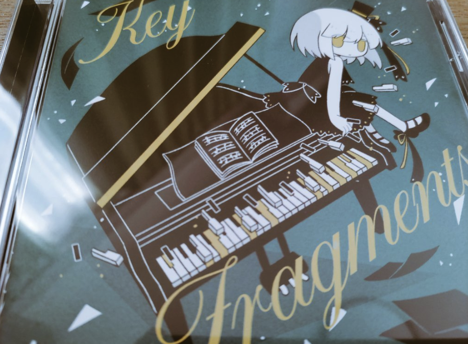

# [感想] KeyFragments

以下個人的な感想です。

## Link

- [Youtube - 【2022秋M3】KeyFragments - Piano Compilation](https://youtu.be/dkcgsoLmVlA)
- [Twitter - Rigel_Wired さん](https://twitter.com/RigelWired)
- [Twitter - しなちくシステム さん](https://twitter.com/ThinaticSystem)
- [Twitter - uynet さん](https://twitter.com/uynet)
- [Twitter - muyu さん](https://twitter.com/muyu_pianoN)
- [Twitter - いおぎりょう さん](https://twitter.com/Iogi_Ryo)
- [Twitter - T.B.S.A さん](https://twitter.com/deadmansqtbsa)
- [Twitter - やいぎ さん](https://twitter.com/_yaigi)

## 届いた！

やいぎさんのアートワークいいですね〜〜！！！やいぎさんは最近 [くらげバンチ同人誌奨励賞](https://kuragebunch.com/info/entry/dojinshi-selection) を受賞されていましたね！オワリのアトのそのアトで、人生を諦めて長く生きるタイプと貪欲に刺激を追い求めて早く死ぬタイプの人生が自然に交差して、生きることの本質に対する答えが出ないけど交差しているところが僕は好きでした。

## 聴いた！

### Admittance

イントロからガンガンに世界観に引き込まれてしまった〜、Youtubeの動画もCDの装丁もこの曲が一曲目であることでグワーと世界観に入り込める感じがしてめっちゃ好きですね。
世界観を保持したまま同じテーマを繰り返している感じで一貫性があって、ずっと浸ったまま2曲目に突入します。
一曲目！という感じでとても良い。

### Diff

落ち着いたイントロから入って、途中から盛り上がる感じが気持ち良いですね。
途中ドラムが消えてからのところいいっすね〜〜、その後の流れがすごい多彩で、ゲーム音楽で戦闘曲っぽい感じにワクワクします。

### Alice in underground

3曲目は入りがサンバっぽいような、でもアコーディオン入っているからヨーロッパのような、色々な音が自由に鳴っていて異国情緒という感じがします。入りのベース好きだな。
盛り上がりの後もう一度最初のテーマが流れているところからさらに多様な音が流れていて、レゲエホーン！？となったりした。
かなり自由な音楽でびっくりしました。

### Dream of rain with u.

はーーーーおしゃれーーー！おしゃれすぎる。好きですね〜
おしゃれカフェでかかってそうな音楽で、土曜の午後みたいな雰囲気の曲だと感じました。
いや〜これモテそうな曲！すごいかっこいいしおしゃれ！

### Air H

入りが特徴的で面白いですね。パンをめっちゃ振ってて空間を感じます
クールダウンする感じもあって、これも最後の曲という感じでいい位置にあるなあと感じました。
中盤ちょっと後の、いろんなところで音がいい感じに鳴るやつとても好き。バランス感覚に優れてないとできない芸当のような気がするので気持ち良い感じに決まっていて良かったです。

## M3いつか行ってみたい

友人(チョンボ)がM3に行っていて悔しかった〜、前日まで東京にいたんですが飛行機をM3の存在を知る前にとっていたので惜しくも行けなかったです。また機会あれば今度こそ行ってみたいですね。いい作品に出会うと心が豊かになるので。
