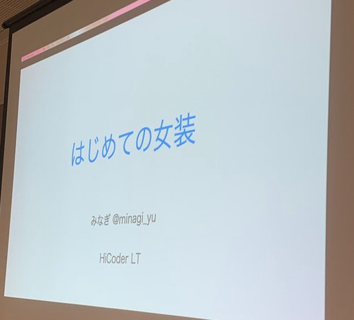
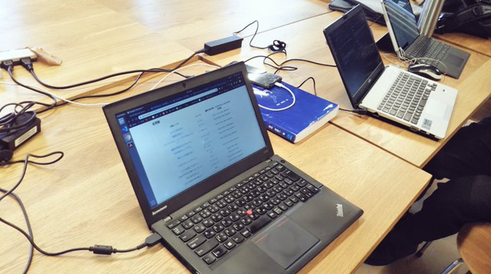
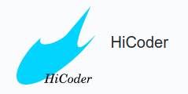

　これは [広島大学 HiCoder & ゲーム制作同好会GSD Advent Calendar 2022](https://adventar.org/calendars/7845) の25日目の記事です。アドベントカレンダー、楽しかったですね！他の記事もぜひ読んでみてください。

　僕は広島大学コンピュータサークル HiCoder の前代表を務めていました。2019年に、主にTwitterの知り合いでなんとなく始まったこのサークルはコロナ禍で厳しい局面もあるなか、ほぼ4年間続けてくることができました。コロナ禍の影響で潰れた小さなサークルの話を聞く中で、ここまでサークルが続いたのはこのサークルに興味を持って来てくれた人たちのおかげです。

　今日は HiCoder の昔話をしようと思います。

## はじめに

　広島大学でプログラミングをやっているサークルは僕が知っている限り2つあります。一つはゲーム制作同好会GSD。そしてもう一つが広島大学コンピュータサークル HiCoder です。
　GSDの歴史は [こちらのページ](https://home.riise.hiroshima-u.ac.jp/~gsd/?cat=about&page=history) にまとまっています。

## 2019

　この年は僕が広島大学に入学した年で、HiCoder設立の年でした。一番Twitterに常駐しているオタクが多い時代で、まだコロナ前で対面だったこともあり、いろいろ活発に会話をしていました。
　一方でみんなでコードを書くというよりは競技に参加したりそれぞれの活動を雑談で話したりと、当時から個人活動主体の空気がありました。そのため個人の活動を発表するLT会が盛り上がりました。

### 4月

- 当時情報科学部2年の方がHiCoderを非公認団体として設立。
- 設立当初はHiroshima University (Competitive) Programming CircleでHUPCという名前も案としてあった記憶。([HUPCのホームページ](https://hupc.web.fc2.com/) も作られていた)
    - ちなみにHUPCは北海道大学の有名な競技プログラミングサークルと略称がもろかぶりしている
- HUPCのホームページにも書いてあるように、元々は競技プログラミングをする団体としてHiCoderは設立された
- 当時の部員は情報科学部の1年生が4,5人くらい、2年生が2人くらい、あとは院生が4,5人と生物の4年が1人いた
    - 基本的にTwitterの知り合い + 僕の情報科学部1年の友人たち、で構成されていた
- 情報共有はSlackで行っていた。がほとんど動いてなかった。

### 5月

- 工学部のおもしろラボで水曜の放課後(主に16:00~18:00)に活動、終わったら工学部の食堂で会話しながら晩御飯食べて帰る生活
- 当時院生のtakがOculus Questなどを持ってきて、VRChat会をした(5/8)
- スクリーンに映画を流していたこともある(5/22)

### 7月

- 当時の情報科学部2年生で構成されたチームHiCoderがICPCの予選に出場(7/12)
- HiCoder LTが初めて行われる。僕は不参加だったのだけど、ここで自作キーボード沼のLTや、伝説のみなぎさんの「はじめての女装」LTが行われる(7/17)
    - 確かいみこさんという生物系の方がいろいろ発案や手配してくれて助かった記憶

### 10月

- HiCoder Web分科会を行う。LINE botの制作を講習会形式で教えるという内容だったけど、結局最後までできなくてLINE bot制作までたどり着けなかった。
- ICTSCの復習をする勉強会を行う。この翌年からICTSCには出場人数を集めることができなかったのでこれがICTSCに参加した最後の年になってしまった。

- HiCoderのGitHub organizationが作られる。ロゴもこの時ちゃちゃっと作られる。早くデザインバチバチにできる現代表にロゴを書き換えて欲しい(というか僕がお金出すから外部のロゴデザイナーに依頼しても良い)

### 11月

- ディスコプログラミングコンテスト広島に参加。 [東大のICPCチームGirigiri](https://xuzijian629.hatenablog.com/entry/2019/11/17/201556) が広島に遠征してきて賞を取って行きました。
  - サークルのみんなでバスを乗り継いで呉の山奥のディスコに行ったのはすっごく楽しかったです。コンテスト中に無料おにぎりとか無料パスタとかお菓子もらえたりするのも最高だった。
  - 2019年も僕はディスコプログラミングコンテストに参加しているんですが、その時はRedCoderの有名な方が遠征してきて賞を取っていましたね

### 12月

- [広島大学ITエンジニアアドベントカレンダー Advent Calendar 2019](https://adventar.org/calendars/4481) が開催される。いみこさんが頑張っていた。

## 2020

　この年はコロナ禍に突入し、サークル活動も対面ができなくなってオンラインで手探りで行っていました。kugiさんという方の力でCammelと一緒にLTを開いたりと、オンラインLTが夏頃活発に行われていました。
　進捗報告会は週に一回ありましたが、ずっとオンラインで新鮮味もなく、どんどん手詰まりになっていって苦しかったのを覚えています。

### 1月

- HiCoderが公式化(1/7)
- 卒業旅行を兼ねて島根で合宿を行う予定だったが、コロナの影響で頓挫

### 2月

- HiCoder LT #3 がオンライン(discord)で行われる。外部からkakiraちゃんとikanagoさんに来てもらってLTをしていただいた。(2/14)
  - この頃は外部の力も入れないと手詰まりだと思っていました。結果的には内部も萎縮してしまったので失敗でした。

### 4月

- 進捗報告会をdiscordで毎週行うようになる

### 7月

- kugiさんが主にorganizerをされていた [Cammmel LT #5](https://cammel.connpass.com/event/182234/) にHiCoderから kaito, kaz, aopi が参加。後のMomiji LTにつながる。

### 8月

- [Momiji LT #1](https://cammel.connpass.com/event/185099/) がHiCoderとCammel合同で開催される。Cammelはゲーム開発などを行う広島大学の開発系の団体。

### 9月

- [Momiji LT #2](https://cammel.connpass.com/event/187685/) が開催される

### 11月

- ICPCにHiCoderとblack kuwa saltの2チームが出場

### 12月

- [広島大学ITエンジニア Advent Calendar 2020](https://adventar.org/calendars/5209) が開催される

## 2021

　この年も2020年から引き続きコロナ禍の中でオンラインの活動しかできず、また当時代表の僕自身がインターンや就活などで忙しいこともあってdiscordでの活動は手詰まり感がすごかったです。
　少し流れが変わったのは10月のkeigomichiさんがHiCoderの公式HPをリニューアルしたあたりで、この後2022年3月にかけて入ってきた部員の方々がNand2Tetris輪読会を始めてくれたり、通話サービスhicordの開発メンバーに加わるなど、この年度にサークルに入ってくれた方々が2022年になってサークルを盛り上げてくれている印象があります。

### 10月

- HiCoderの公式HPが当時1年生だったkeigomichiさんによってリニューアルされる(10/15)

### 12月

- [広島大学 HiCoder Advent Calendar 2021](https://adventar.org/calendars/6509)

## 2022

　2022年は飛躍の年でした。GSDとの合同新歓説明会に始まり、未踏の成果報告会を眺める会で未踏に応募する人が出てきたり、HiCoderハッカソンが盛況だったり、技育博で東京に行って多くのサークルと会話できたりしました。
　また、サークルとは別の流れですが対面のワイワイペアプロ会が開かれて対面で会う機会があったり、東工大デジタル創作同好会traPとの交流があって駆け出したい講習会をGSDとHiCoderのメンバーが受けたりなど、今年は様々な取り組みが行われて、かつ毎週の進捗報告会も以前よりずっと盛り上がるようになりました。

### 4月

- HiCoderとGSDの合同新歓説明会を行う。全面的に keigomichi さんに任せた。

### 6月

- HiCoderハッカソン#1を行った。
- 技育博に参加
- 代表が keigomichi さんに交代

### 7月

- ICPCにHiCoderとMIRAI CREAの2チームが参加。

### 9月

- HiCoderハッカソン#2を行った。

### 10月

- ふれっしゅITあわ～ど2022作品部門でHiCoderのメンバー3人によるプロダクトhicordが最優秀賞・総務省中国総合通信局局長賞を受賞

### 12月

- HiCoderハッカソン#3を行った。

## 終わりに

　明らかにコロナ禍に入ってからの2020年と2021年があっさりしていて苦労していたことが伺えます。いろいろやったようでいて何もやっていない無力感と共に過ごしてきた4年間だったように感じます。
　僕の基本姿勢は「やりたいことがある人を応援する」「やりたいことがない人は好きなことや憧れを会話で引き出して方向性を探る手伝いをする」「サークルに来てせっかく僕と喋ってくれた人には、相応の時間をかけて応援する」という感じでした。他にもいろいろサークルをやってみて感じたことはありますが、あまり喋りすぎても後世に対してプレッシャーになってしまいそうなのでやめておきます。

　僕は3年ほど代表を務めてこられたのは、HiCoderという、コンピュータに興味のある人のためのサークルにメンバーが来てくれたからです。特に2022年は僕の手を離れた場所で物事が進んでいく様子を見て、少し寂しさを感じると同時にここまでなんだかんだ投げ出さずに場を守ってきてよかったなと思いました。
　卒業をしたら以前ほどサークルにやってくることはなくなりますが、社会でお金を稼いで焼肉を後輩に奢ったり、ハッカソンの賞品を提供したり、とやってみたいことがまだまだあります。これからはちょうどいい距離感を保ちつつ、応援をしていきたいです。

　このサークルで好き勝手やってこれたこと、色々なお話ができたこと、全てを幸せに思います。願わくばこれからのHiCoderで人々が過ごす時間が素敵なものになりますように。
