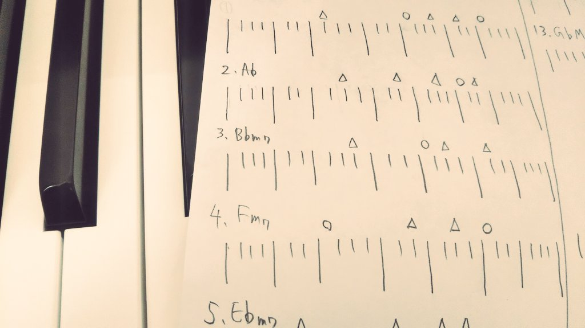
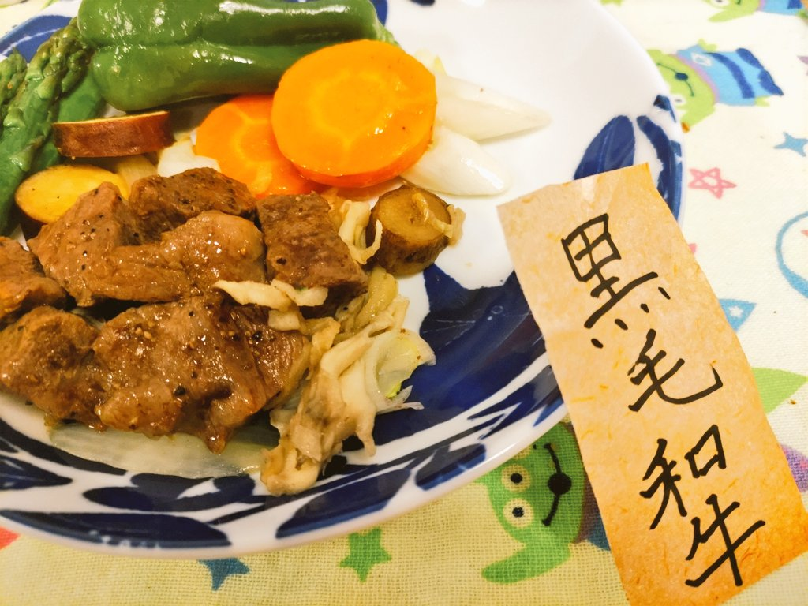
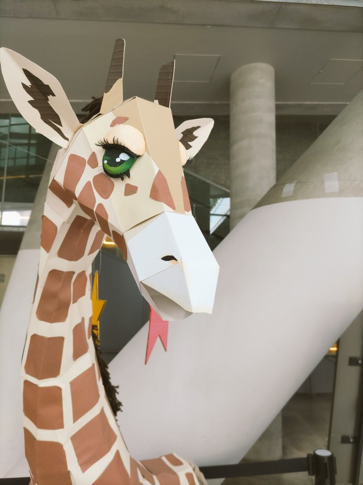
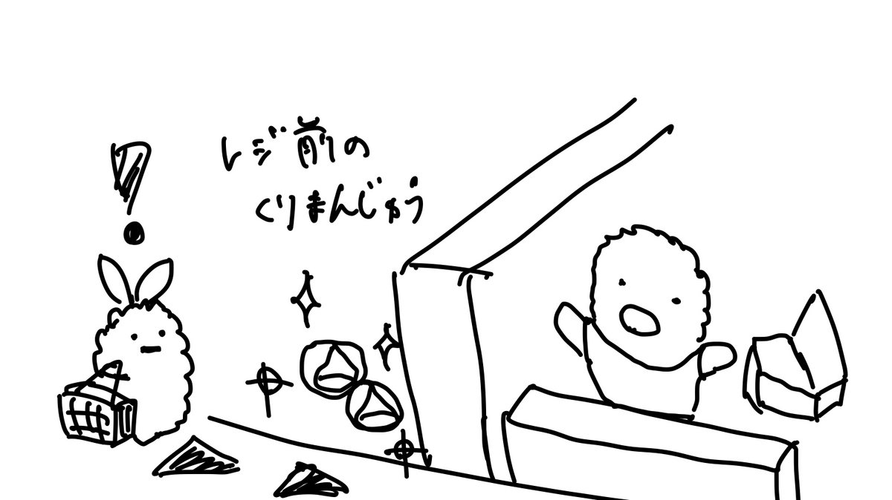
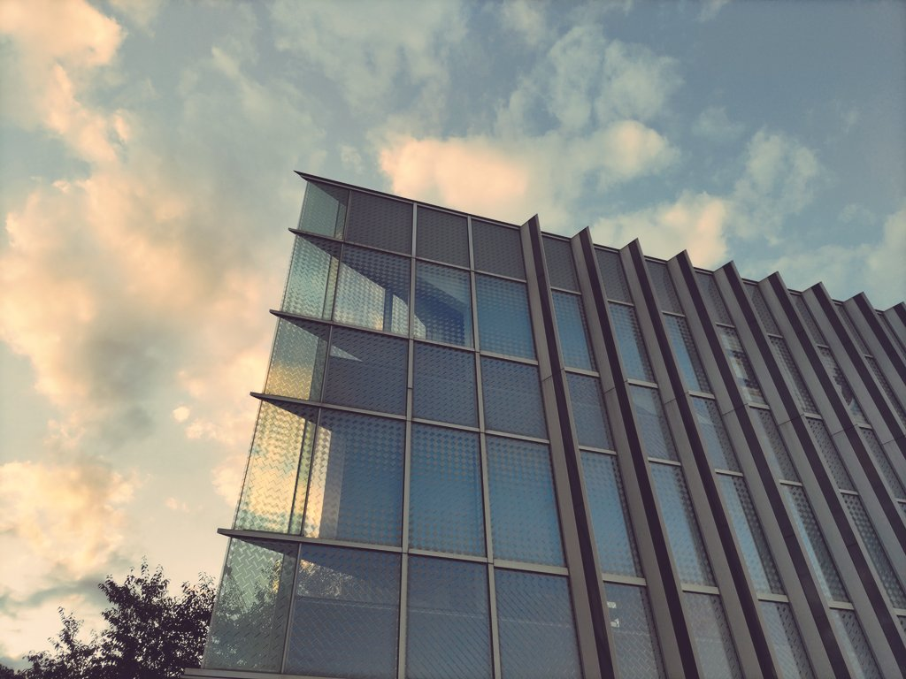

[2020年振り返り](https://blog.uta8a.net/diary/2020-12-28-goodbye/) は書いたけど、2021年年末は体調が終わっていてホロライブの配信を一日14時間とか眺めてたので振り返っていません。2022年は無事に振り返ることができそう。

文章がとても長いです。一年は長いので。

## 概要

- 日常は永遠ではないから、会いたい人と一緒に遊ぶと良い。写真も撮ると良い。
- 信頼できる人が楽しそうにしているコンテンツを素直にチェックしてみると自分もハマることが多い。
- 技術を学ぶときには自分の中のどんな憧れが満たされたいのか明確にしてから作業内容を決めると良い。

## 今年一年の出来事

### 1月: 気持ちが戻ってきて開発

2021年末に終わりに終わっていて、1月末あたりから就活の内定を確定させて気持ちと体調が安定しました。

この辺はサークルでのハンズオンに向けて知識の集積に興味を持ち、 [Next.js製のよくある静的サイトジェネレータ: uta8a/maido](https://github.com/uta8a/maido) を作成していました。これNext.jsなの過剰なので今だったら [deno](https://deno.land/) で書き直したい... npm対応もdenoにstableで入ったのでMarkdown parserとかもいい感じにライブラリ使えそう。

M1 Mac miniをセットアップしました。今ではずっとMac使っているけど値上がりしたからこれ壊れたらWindowsに戻るんだろうな。UI面では圧倒的にMacがいいので戻りたくない〜

Tweet

> 記録によると一日12時間以上Youtubeを開く生活をしていたらしい(まずい)

> Vの切り抜きをあらかた見尽くしたらYoutubeのサジェストが海外のクマの動画やアラビア語の謎のライブ中継とかになってきたのでそろそろ正気に戻ろうと思います

> 区民 道民 ホーチミン

### 2月: 迷走

この月は変に時間があって無謀なプロジェクトを立てて調査時間を費やすことを繰り返していました。private repositoryに、「Rustで書くCコンパイラ」「C++コンパイラとLinter」「Motion Graphics Editor」「TCP/IPプロトコルスタック」「LLVM的なコンパイラ基盤」が未完成のままあります(それはそう)

あとPop!OSを入れて遊んでいました。そんなに使い心地は尖ってなかったです。Archの方がシンプルで好きかも。Pop!OSでは一日1時間触って新しいものを触る(Vim plugin、SKK、Nix、cloudflare Zero Trust tunnelなど)というキャンペーンをしていて、この発想自体は良いので今後再開したい。

高校からの親友(昔からプログラミングできる人)と一緒に開発したのも良い思い出です。Notionに英単語のリストを置いておいて、それをfetchしてWebページ上でクイズ形式に表示するものを作りました。

Notion APIの経験を活かして、[RSSをfetchしてnotionに入れる: uta8a/grss](https://github.com/uta8a/grss) を作りました。これは結構長く稼働していて便利だったのですが、今はRSSを [inoreader](https://www.inoreader.com/) で管理しているので使っていません。長く使うプロダクトを作るのはとても難しい。

denoがいいなと思って [slide作成器: uta8a/tomlide](https://github.com/uta8a/tomlide) を作りました。denoいいですよ。

家族が藤井風にハマって、一緒に [藤井風 / 優しさ](https://youtu.be/vzhTpIIQR5I) のイントロをピアノで練習したりしました。

Tweet

> サークルで、意欲があり毎週技術的な話を聞いてくれる後輩に恵まれておるので、フィードバック得られるうちに色々ハンズオン資料とか作りたいなと考えとる

> 「勉強会開く！と言ってあまり続かんコミュニティ作るくらいなら自分なりに調べたり研究的なことしたものをまとめて記事にしたほうが身になる」という言葉が昔刺さって、それからは記事を書いたりハンズオンを作ることに興味を持っている

> 補完のない zshなど 夏休みのない8月のよう(なんでもないや)

### 3月: 講習会

サークルでインフラ講習会として [ICTSC](https://icttoracon.net/) の過去問を再現したものを解いてもらいました。[お茶大のチームの勉強会資料](https://hunachi.github.io/ictsc-418/index.html) に大変お世話になりました。問題はMariaDBのトラブルシューティングと、Dockerのネットワークに関する問題でした。

サークルでRust講習会を3回に分けて行いました。ほとんど [TRPL](https://doc.rust-jp.rs/book-ja/) の焼き直しでしたが、速習できるように工夫しました。メモリ関連でRustだと嬉しくてCだと辛い例はC側で未定義動作になることがあり、その場合参加者の手元でCのコードが正常に動いちゃったり動かなかったりするので嬉しさが分かりにくくて困りました。

Twitterにコミュニティ機能が降ってきました。今はもう使っていないですね。技術の話をTwitterですることが怖いので一時期読んだ記事を貼ったりするのに使っていました。今はNotionに書き留めるだけでアウトプットをしていません。

研究室が決まりました。第一希望に行けたのでよかったです。

趣味LTvol2をしました。またやりたいですが、僕のフォロワー規模が大きくなって内輪感を出すのが難しくなってきたので別のやり方がないかなとも思っています。

traPLTがとても楽しかったです。 [感想も書きました](https://blog.uta8a.net/diary/2022-03-28-trap-lt/)

Tweet

> よし今日も21時までTwitter開かないぞ〜

> うっかりTwitter開いちゃったので今を21時とします

> 型付き言語、型なし言語、型揚げポテト

> インターネット・ランダムウォーク・コンテキストフリー・ツイート・バトルで俺と勝負！

### 4月: 研究室に慣れる

研究室のゼミで忙しかったです。また、この頃体調が悪くてあまりコードも書けませんでした。

サークルではWeb講習会としてPRのレビューをする目的で登録されたリポジトリのコミットログが眺められるWebページを作りました。あまり活発でなくてすぐにinactiveになっちゃったけど、少し技術的な交流が生まれた気がする。

iPad miniを買いました。以前使っていたものは、数学オリンピックの春合宿帰りで最高に頭が冴え渡っていた時に、東進からの挑戦状という、エレガントに問題解いたらiPad miniあげるよ！な問題が15分で解けてしまったので出したらもらえた時のやつなので、実に8年ぶりくらいに新しくなりました。今も便利に使っています。

主な使い方は以下の通りです。手軽に電源を入れられるのが大きい。

- GoodNotesでアイデアを書き留めたり、ゼミの図の下書き
- ボイスメモでピアノの好きなメロディー思いついたらメモ
- Jamboardでdiscord画面共有しながら絵を描いて説明
- Sidebooksで技術書のpdf買ったやつを読む
- Spotify, soundcloudで音楽を聴く

Tweet

> 同じもふもふが大量におると個性の違いがわかり、楽しい

> 今年は修行の年にしたくて、努力したと思いたさが根底にある。今まで本質的な努力をしていないという感覚にずっと囚われているので...

### 5月: オタク迷走

CPCTFに出たり、みかん本をやったりしていた。大学のゼミが本格的になった。いつもの色々やっている人みたいな感じで迷走。

VTuberになるために環境構築をした。動画だけ撮って動画編集が重すぎて結局お蔵入りに。

サークルではneovim講習会がしたくて準備をしていた。やっぱりNotionにデータベースの概念が入っているのとても偉いよ。

アニメはまちカドまぞくとかSPY×FAMILYを見ていた。まちカドまぞく2期でシャミ子の声を聴くだけで感極まって涙が出ていた。

この辺はマジで木札焼肉に魂を奪われており、黒毛和牛と紙に書いて家で食べる肉の横に添えていた。

Tweet

> スタァライトをオタク語りしながら見るオタクたちの最終系「わかります」

> 親友ができたオタク構文: 「知己を得た」

> 好きなものが昔は本当に好きか自信が持てなかったが、現在は人生に後がなくなり楽しむしかねえ！となり好きなものを好きという気持ちだけで力が備わり、昔に比べて様々な困難を突破できるように

### 6月: 木札焼肉から解放される

ISUCONに申し込んだ。

SECCON Beginners CTF 2022に参加。95位で嬉しかった。特にrev, pwnの問題も競技時間中に考えることができたのが成長を感じた。TLの人々に比べたら成長速度が遅いが、コツコツ好きなことは余裕を持って取り組むというのもありだと信じて取り組みたい。

サークルではHiCoderハッカソンが突然生えて面白かった。とーふさんという1年生の子とチームを組んでdiscord botを作った。とーふさん最近あまり見かけないけど、かなり強くなる素質がありそうだったのでまた戻ってきてくれるといいなあ。

技育博に [@keigomichi](https://twitter.com/keigomichi) と参加した。実はkeigomichiとは通話はしたことがあっても1度くらいしか会ったことがなく、その距離感で二人でシングルか？と思うくらい狭いベッドに寝たのガチでウケた。

技育博の翌日に [@tsukammo](https://twitter.com/tsukammo) さんと [@ykmcx](https://twitter.com/ykmcx) さんと会って木札焼肉を食べた。その前の週くらいに [Maruさん](https://twitter.com/GmS944y) と [minagiさん](https://twitter.com/minagi_yu) と食べた広島の叙々苑の肉もよかったし、このあたりで木札焼肉に対する執着心が完全に浄化されて、肉とは適度な距離感を保てるようになった。

Tweet

> 閃いた！オタク集めてオタク×ファミリーやろうぜ！僕も入る！(コペルニクス的転回)(結婚したいよ〜)

> 人はすぐいなくなってしまうので、気になるなら声をかけておいた方がいい

### 7月: 人はいつかいなくなってしまう

友人の研究デバッグ手伝ったらお礼にサマーウォーズ謎解きをプレゼントしてもらう。謎解きの面白さと綺麗な作りに感動する。対面の脱出ゲームとか吉祥寺にあるらしいので行ってみたいんだよね。

[ブログ: 自身の人生に、小さじ一杯ほどのゆるやかで身体性のある楽しい時間を追加したい](https://blog.uta8a.net/diary/2022-07-02-physical/) を書く。結構自分の考えを書けた気がして今年書いた日記系文章の中でもお気に入り。

[いかなごさん](https://twitter.com/ikanag0) と会ってチーズケーキを食べたり、 [CAMPHOR-](https://camph.net/) にお邪魔したりした。ああいう計算機人間がたくさんいる場所で学生生活を、それも京都で送れるというのは世界中を見ても一つの理想の到達点だなと思う。

そむにあちゃん / にどねどりーむ！のCDがBoothから届いて最高になった。

祖父が亡くなり、葬式が執り行われた。その帰りに東京を経由したので、以前から友人に勧められていた[劇場版 少女☆歌劇 レヴュースタァライト](https://cinema.revuestarlight.com/)を立川シネマシティで見た。鑑賞前は人は死ぬんだな、と思い悲しい気持ちになっていたが、映画を見た後は「列車は必ず次の駅へ ---」という気持ちになり、僕も次の駅に行こうという気持ちになった。

ISUCONにでた。0点だったので復習したいと思いつつできてない。

リコリコが最高で、`filter:follows さかなー` をtweetdeckのカラムに登録していた。

技術面ではElmをやった。特にelm-drillが良い教材だったので完走して [ブログも書いた](https://blog.uta8a.net/post/2022-07-30-elm-drill/)

Tweet

> ツカモさんの言葉は結構考えて理解するのに時間かかって、今回だと若いとか学生のうちはチヤホヤされるが…という話はようやく理解できてきた気がする radwimpsの蛍という歌に、光ってないとね　誰も僕を見ないんだよ、という歌詞があるのを思い出した

> 「ちいかわ、酒のつまみではないか？」

> 秋田県民「ウマ娘(うまっこ)」

> 劇場版レヴュースタァライトを立川シネマシティで初見できたことを大変嬉しく思います………最高だった………

> エビフライのしっぽ エビフライのシュッポッポ🚂

### 8月: 外に出る毎日

まちカドまぞくを見終えた。とても良い最終回だった。いづも先生が健康に無理なく今後もご活躍されることを祈っています。

[今日のスタァライト 卒業後](https://booth.pm/ja/items/3397499) という二次創作を買って読んだ。とても良くて、スタァライトに言及する時に本編への言及をしているのかこの創作内の事象への言及か混乱するくらいには原作に近づく解像度の高さがあった。

椅子を買った。1.5万円くらいのにしたが、いつかはシルフィーとかエルゴヒューマンとか、実際に店頭で座ってみて決めたい。今回は椅子が破壊されているので時間がなく仕方がなかった。

[@aumy_f](https://twitter.com/aumy_f) さんが広島に来たのでエンカした。地味に広島に来てくれて僕と会う人は珍しかったので嬉しかった。

[西条公会堂](https://saijokokaido.com/) に友人と行った。雰囲気が良いカフェが西条にもあるんだ！？という感じでとてもよかった。目当てのマンゴーパフェがなくて悲しかったので来年また行きたい。

外出が多かったので技術には触れなかった。

Tweet

> 積極的な睡眠リズムの破壊 生活リズムを変拍子にする！

> キラキラ大学名候補: エーアイブロックチェーンウェブスリークオンタムコンピューティング大学

> コイル/レアコイル/リコリスリコイル

> optさんの「暇であることを美徳と感じている」、かなり共感できる

### 9月: 友人は誘って旅行に行くと良い

なんかこの辺もスタァライトに囚われていたように思う。今年はとにかく次の駅に行きたくてもがいていた。

自作エミュレータで作るx86アーキテクチャ本を読み切った。昔読んだ時は難しくて諦めたけど今読んだら [opv86](https://hikalium.github.io/opv86/) のおかげで大した詰まりもなくすらすら読めた。

FPGA大全を読みながらFPGAでHDMI出力に取り組んだ。ピンとか色々合わなくて苦労したけど、出力された時は感動した。まだUART周りが理解できてない。

三ツ矢サイダー飴が美味しいことに気づいた。定期的に買っていて、一時期狂ったようにラムネを食べていたみたいになっている。

珍しく技術でない本を2冊購入した。たった1°のもどかしさ 恋の数学短歌集はこういう王道物語がいいんだよという感じでよかったし、 [DIE WITH ZEROは感想を書いた。](https://blog.uta8a.net/diary/2022-09-14-zero/) 特にDIE WITH ZEROの方は最近考えていたこととリンクして今後の人生の指針のヒントを得られた。

サークルの友人とサイコロ切符で旅行をした。そのうち一人は広大1年からの長い付き合いで、なんでも話せる仲なので、そういうなんでも話せる仲の友人がこの歳でできるのは奇跡みたいなことだし、もっと誘って遊びに行けばよかったなと思った。

Tweet

> 星見〜笑とか言っとられんわ、僕も頑張らんといけん！

### 10月: やりたいことをやった

日帰りでいかなごさんと有馬温泉に行った。温泉はとてもよかったし、炭酸サイダーは思ったより炭酸がきつかったし、いかなごさんは何を話しても面白い友人だし、夜に食べた焼き鳥屋はとても美味しかった。

codeblueの学生スタッフをやった。codeblueで泊まる部屋が一緒の人が気さくで、気を使わずに過ごせてありがたかった。また会いたい。codeblueは講演内容も楽しかったしブースも面白いし、何よりセキュリティに関心のある学生とセキュリティの様々な話ができるので最高だった。

東工大の学園祭に行った。うぃにおんさんは以前から会ってみたかったので、ここで会えたのは本当に嬉しかった。しかもtraPの聖地巡礼という感じで麺屋こころに行ったり散歩したり、とても楽しかった。また会いたい。

技術面ではminecraft風ゲームを作ろうとしていた。これも未完。

Tweet

> 冴えカノの霞ヶ丘詩羽回を見た、やっぱりこのキャラクターがとても好きだなあとなっている(お嫁さんにしたい！という感情とはちょっと違う、キャラとしての好きさみたいなものを感じる)

> 落ち込んでいるとき、肉が答えです

### 11月: 研究が忙しく、免許に向けて何もしない日々

研究の進捗報告が週に2回あって大変だったし、12月最初の中間発表に向けて頑張っていた。

[tak](https://twitter.com/bgdaewalkman) と会って環境構築オタク特有のNix, Vim, Emacs, JVM系言語(Scala, Java)の会話をしたり、自作キーボードで有名な [遊舎工房](https://yushakobo.jp/) に行った。

技術的には言語処理系に興味を持ち、Scalaのサブセットとなる言語を書いていてどこまで本家に寄せるか悩み、世の中に存在する有名言語のサブセットを調べていた。現状関数型言語をコンセプト別に学ぶ [The Programming Languages Zoo](https://plzoo.andrej.com/) が教材として良さそうで取り組みたい。

後はアドベントカレンダーの準備をしていた。やっぱり一ヶ月前から準備して万全の状態で臨んだほうが良い。

Tweet

> メンキョ！(鳴き声)

> ケンキュー！(鳴き声)

> 地球最後の日は特別なことをせず普通に過ごしたいから、Twitterが終わる日に向けて無益なツイートをしていきたいな！

### 12月: 研究が大変

研究が大変だった。頑張った割に進んでいないような気もする。

一回Twitterを消してみた。結果、Twitterを消すとTweetが見づらいということが分かったのでアカウントを元に戻した。

アドベントカレンダーは3つ書いた。そのうち [Gitは最初1244行しかなかった](https://zenn.dev/uta8a/articles/b7169fd147fb31) が結構多くの方々に読まれて嬉しかった。

サークルでHiCoderハッカソン#3があった。寒かったけど、対面ってやっぱいいなと思った。keigomichiさんありがとう。

技術的には研究からの逃避としてrustcのHIR部分を調べて少し詳しくなったり、minecraftからk8sを管理するものを書いていたりした。

Tweet

> コケコッコー(ケコッコーの双対)

## 今年考えたこと

今年を通して新しく得た考えをまとめます。

### 人と会って遊ぶことは大事

この人話していて面白いなとか、会話していて気張らなくていいなと思える友人がいるなら、そういう人を誘って遊びに出かけると良い。会いたいなと思った人はいつまでも自分と会える関係のままいられるわけではなく、だからこそ会えるチャンスがあるなら声をかけるだけかけたほうがいいんだなって思った。
特に行ってみたい場所に行く、何かテーマがあると良い。美味しいものを食べると良い。写真は撮って残したほうがいいし、短い動画もたくさん撮っておいたほうがいい。今はもう大容量SSDが安く買える時代なんだから、富豪的に思い出にコストをかけて残したほうがいい。
人と話をすると、自分一人でくよくよ悩んだり絶望したり変な袋小路にハマることが減った。周りの人を見ると意外とみんな完璧じゃなくて、なんだ、と思うことで自分も大した人間ではないんだなと受け入れることができる。落ち着いてゼロから始められる。だから人と話すことは健康に良いのだと思う。
何かを望む気持ちは無くなってしまう。会いたい人にも会えなくなる。だから今こうしたいと思うのなら、日常が忙しくても予定をねじこんで自分の気持ちを満たすために時間を使った方が良い。

### 自覚をした上で決定を行う

やりたいことを全てやる、ということを念頭に置くとコロコロとやることが変わっていく。僕はそれでもいいと思うけど、そのことに対する自覚が必要だなと感じる。今年は思考が同じルートを通ることに気づいたのでキャッシュしておくことを目的に「思考典型」というscrapboxメモを書いて、そこに考えをまとめて、同じ思考の袋小路に入らないようにしている。大体同じことを考えているので、どうせなら繰り返すよりも過去の考えを参照してショートカットしたほうがいい。
あと、「暇であることを自覚する」というのは大事だと思った。いつも目の前のことを集中していると、ふと視点を引くことができなくなる。今暇だな〜と思うところから、暇だからなんかやるか、とやることを決める。自覚をすることで落ち着く面がある。
技術についても、例えばコンパイラ作りて〜！となったならコンパイラを作ってどういう気持ちを満たしたいのか、裏側に潜む自分の感情を自覚するように心がけていた。実際のところ、コンパイラの構文解析をしたいのか、codegen部分に興味があるのか、関数型的な仕組みを知りたいのか、様々な感情がある。どこにフォーカスするかで作りたいものは変わってくるし、労力をかけるべき場所も変わってくる。自覚をした上で決定を行うと、自分の感情にマッチした行動が取れるようになり満足できるようになる。

### 強い人と議論できる場が見つかったら楽しい

今年は強い人と議論できる場が見つかった。大学では僕よりも格段に強い人を見かけなかったので、議論できる場が見つかってとても嬉しかったし、やっぱり自分が太刀打ちできないくらい知らないことを知ること、質問できる内容を議論できるのはとても楽しいことだと改めて思った。
そういう場を作れるようになりたいという思いが強いので、セキュリティキャンプ的な形で実現できるようになりたいと思っている。

## 来年の抱負

来年もやっていくぞ

### 諸行無常に逆らって生きていきます

社会に出ても、人に会いに行ったり、興味のあることに取り組んだり、Twitterをしたりします。

### VTuberとして動画を一本出す

具体枠として抱負を一つ置いておきたかったので。内容はこれから考えます。

### 満たしたい気持ちを自覚して、やりたいことを全て実行する

気持ちを自覚した上で、やりたいことを明確にして、実行します。
