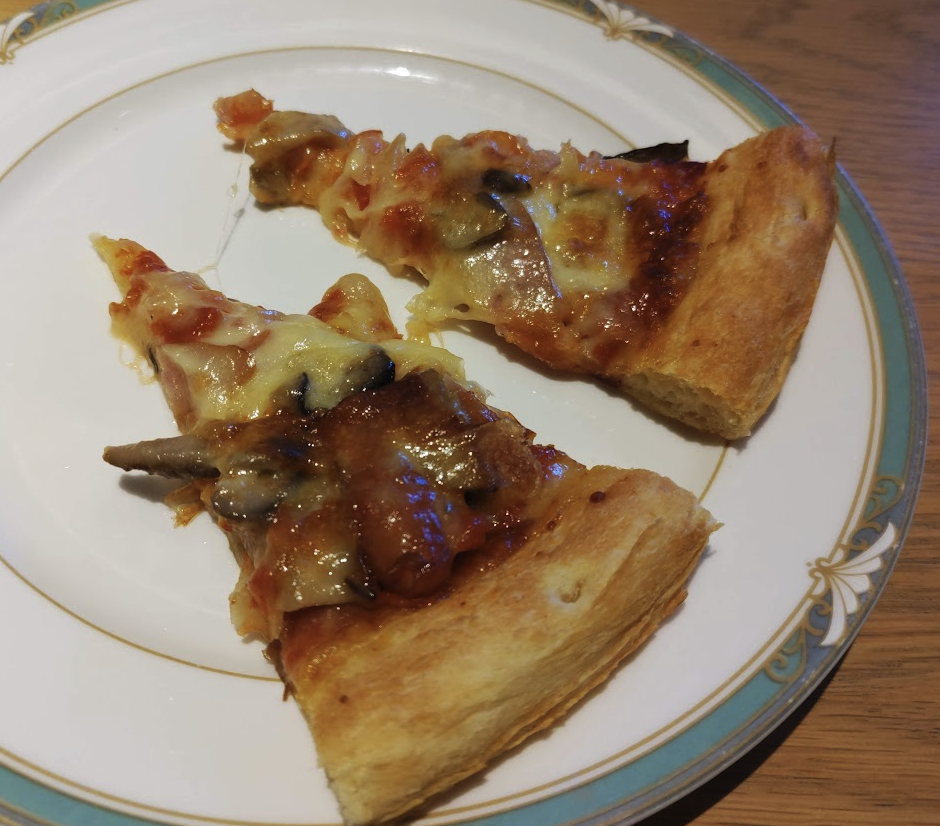
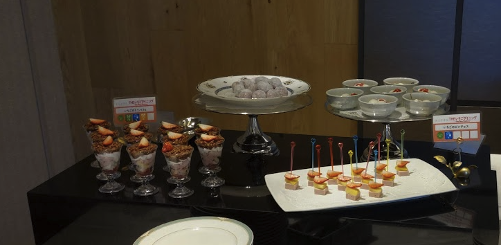
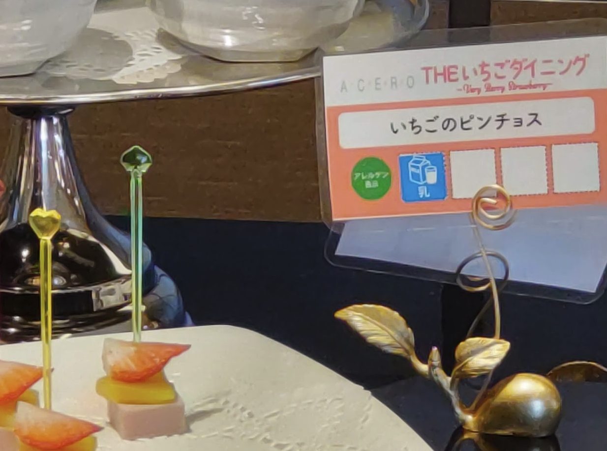
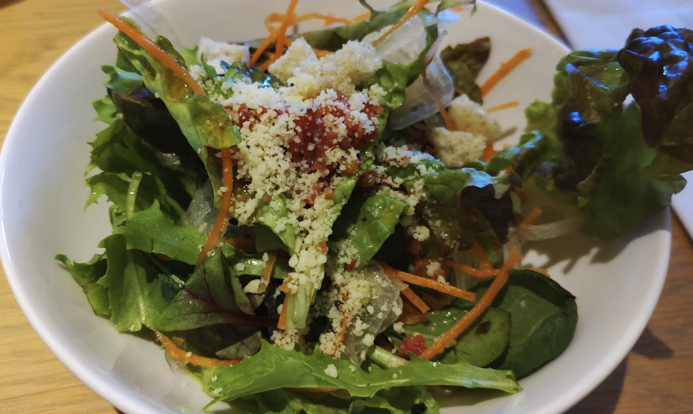
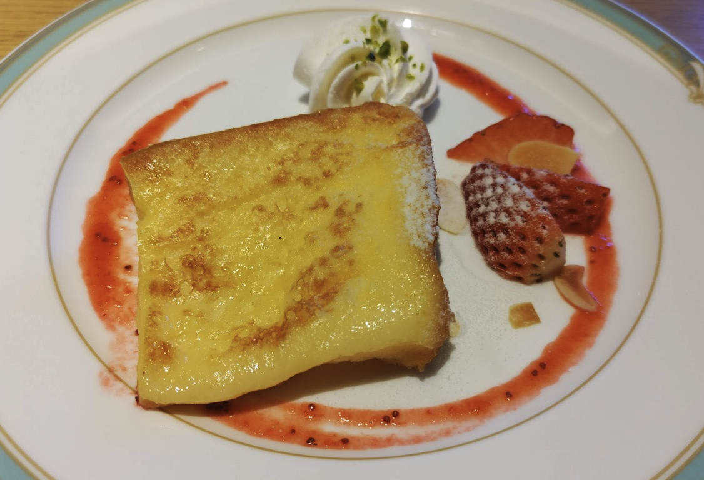
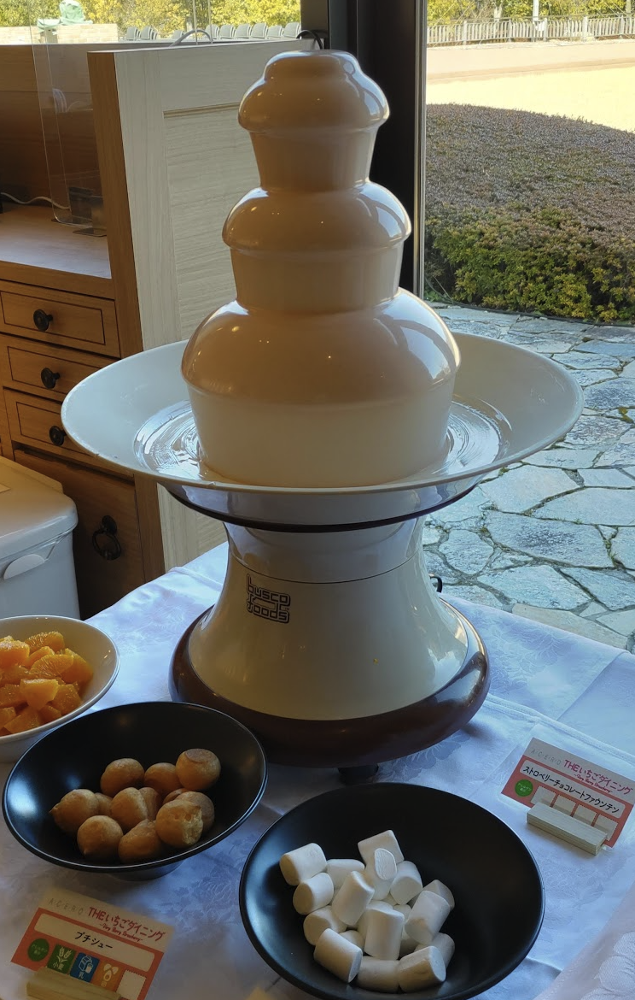

<!-- titleは自動で入る -->
ちょっと遠出してオシャレビュッフェに行ってきました。美味しかったのでメモ。

あとこういうの一人で行くのは初めてなので次回このような決戦の時のためにメモ。

# 心得

個人的に心に留めていること

- 事前に体調を整えるべし。元気でないと美味しいと感じられない。
- 自分が食える分だけ取るべし。お残しはゆるしまへん。
- 満足したら手を引くべし。気持ち悪くなるまで食べるより、少し足りないと感じるくらいがちょうどいい。
- 並んでいる様子の写真を撮るなら許可を取るべし。

# 内容

インスタ映えするやつだけ載せます。

ピザ

デザート

いちごのピンチョス

> じゃあ私、アボカドとクリームチーズのピンチョス！

おおお、これが例のピンチョス...！(感動)

野菜

フレンチトースト

これがオシャレ料理...！

ファウンテン

初めてやった気がする。ずっと昔に泊まったホテルで見かけたけど勇気なくてできなかったんだよね

# 攻略法

## 緊張

緊張して謎のステップを踏んでしまう。場数に慣れた方がいい。
陽キャの趣味を一周遅れで追いかける陰キャは場数に慣れていないので仕方ないけど、緊張を自覚した挙動を心がけた方がいい。

## KPI

食べた量や制覇した種類をKPIに持つと、なんか辛い
満足したら時間がまだ余っていても帰る、くらいの気概を持つと良さそう。

## 時間配分

90分だった。僕は1時間と少し経って満足したので会場を後にした。

残り30分は周りを見る限りご飯やデザートに満足しておしゃべりタイムっぽかったので、一人で行くとその時間がお腹一杯ですることがなくなる。

## 美味しかったもの

ピザ
ピラフ
いちごのピンチョス
アイス
フレンチトースト

かなあ。どれも美味しかった！

# 感想

外に出るといつも一人でお家で煮詰まっているのとは違うやる気がでます。それは例えばオシャレしたいなという欲であったり、普段寝かせているアイデアが関係ないところで閃いて前進したり。

最近よく思うのが、色々なものが食べられる期間はそれほど長くはないということです。ラーメンやステーキはそうだし、ビュッフェで満足できるまで食えるというのも若いうちにしかできないことの一つのように思えます。
とはいえそれほど稼いでいないうちはなかなか高級なお店に行くことは難しく、バランスを取りつつ背伸びを時々して、美味しいものを食べてニコニコしていきたいものです。

あと今回はPayPayを初めて外で使いました！無事に使えてよかった〜。今回のビュッフェは3500円(税込)でした。
