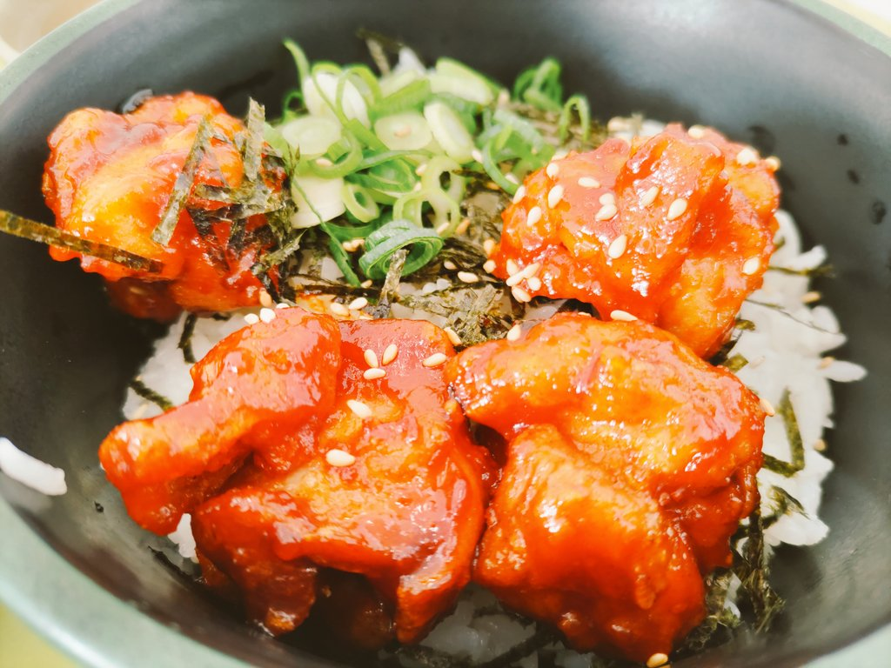
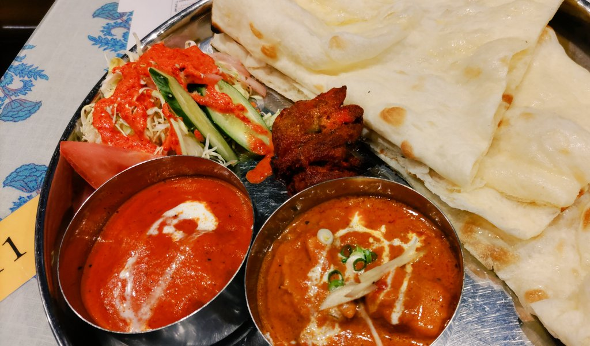
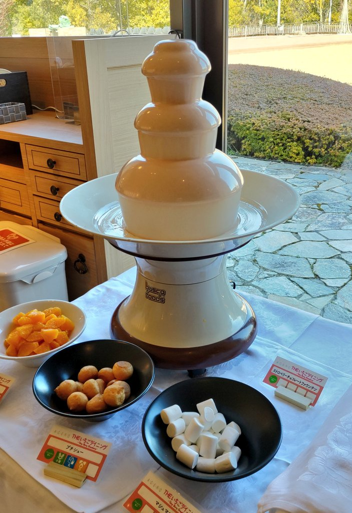
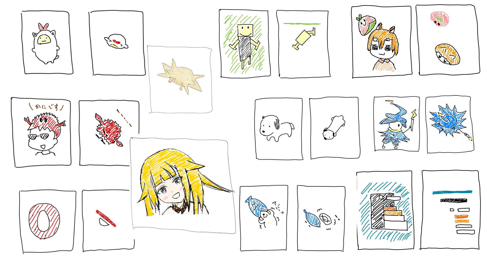

<!-- titleは自動で入る -->
今月は卒論をやっつけて、自作キーボードに入門しました。

# 技術

ブログデザインを一新した。以前はhugo製で、今はlume製。やはりブログはTypeScriptと親和性が高い方がいい。

環境構築オタク活動の一環としてNeovim weeklyのプラグインを一通り試して動かすdevcontainer環境を作った。発想を学ぶことができて、新しいものを触る欲も満たせて良い。流れでhelixを触ったら思ったよりコマンド体系の意味がしっかりしていて体験が良い。

自作キーボードに入門し、RustyKeysを作った。ブログに書いた。: [RustyKeysのビルドログ](https://blog.uta8a.net/post/2023-02-09-rustykeys/)

dotfilesをおーみーさんのdotstingrayを用いて移行した。

Flatt SecurityのDevelopers' Quizを解いた。

Linux From Scratchにチャレンジしたが、失敗した

配信環境を整えた

Rust std読み会 preを行って、動的な所有権について理解を深めた。ブログに書いた。: [Rustのstd読み会 pre を友人とやってみた感想](https://blog.uta8a.net/post/2023-02-19-rust-std-reading-pre/)

# 飯

学食 ヒロティー丼

タンドール

ビュッフェ(ブログに書いた: [バトル・ビュッフェ](https://blog.uta8a.net/diary/2023-02-27-battle-buffet/))

# 音楽

<iframe style="border-radius:12px" src="https://open.spotify.com/embed/track/6PLxXK82pZ10AfD48XT6Ob?utm_source=generator" width="100%" height="152" frameBorder="0" allowfullscreen="" allow="autoplay; clipboard-write; encrypted-media; fullscreen; picture-in-picture" loading="lazy"></iframe>

**仮死化 / 遼遼,初音ミク**
入りから神。

<iframe style="border-radius:12px" src="https://open.spotify.com/embed/track/5JrWsGfXvqgrTMqVcVlLal?utm_source=generator" width="100%" height="152" frameBorder="0" allowfullscreen="" allow="autoplay; clipboard-write; encrypted-media; fullscreen; picture-in-picture" loading="lazy"></iframe>

**誰彼スクランブル Remixed by Snail's House / halca**
ちょうど5分くらいなので休憩中に流してた。テンション上がる。optさんありがとう。

<iframe style="border-radius:12px" src="https://open.spotify.com/embed/track/7C37yaKPoOJHUvlNYv991q?utm_source=generator" width="100%" height="152" frameBorder="0" allowfullscreen="" allow="autoplay; clipboard-write; encrypted-media; fullscreen; picture-in-picture" loading="lazy"></iframe>

**テレパス / ヨルシカ**
とっても美しい。こんなに美しいと感じて心を奪われたのは結構久しぶりな気もするくらいに何もせずただこの曲を聴く時間を過ごしていた。

<iframe style="border-radius:12px" src="https://open.spotify.com/embed/track/0L1E2JmrZk6QU9261PtJWQ?utm_source=generator" width="100%" height="152" frameBorder="0" allowfullscreen="" allow="autoplay; clipboard-write; encrypted-media; fullscreen; picture-in-picture" loading="lazy"></iframe>

**アルジャーノン / ヨルシカ**
とっても優しい。優しさを包むsuisさんの歌声がとても心地よい。

**ミラクル☆キラッツ - ロケットハート (M!R4 Jersey Club Edit) #イセジョEP / M!R4**
踊れる

**ピノキオピー - 神っぽいな (M!R4 JerseyDrill Edit) / M!R4**
ダークな感じで好き

**片思い / Killske**
こういう80sっぽいポップス感の豪華さを持ちつつ現代スタイルなの好き

# その他日記

- たこ焼きガチャが去年から止まっていた。MokoさんTwitterから離れてしまったし悲しい。諸行無常。
  - 一方でTwitter APIが有料化の噂が出ても元気に動き続けるしゃくらたんがんばれ！botくん...
- 個人discord鯖を作った。まあまあ運用に難しさを感じることも多いけど人々のおかげでおおむね楽しくやれている。
  - 以下の方針でやっている
    - コミュニティとして運用する気は全くない
    - 僕と人が連絡手段を残すためであって、特に人同士が仲良くなることは求めない。自由に。
- ぼざろに狂っていた。
  - 同時視聴会を2回やった
- MacのIMEがNotionでやばいくらい遅い(5秒とか待たされる)問題、Notionをアプリにしたら解決した。
- ブルーアーカイブのユウカASMRを購入した。かなり良くて、特に進捗を尋ねられるところを聞くと目が覚めるので逆睡眠ASMRとして使っている。
  - シャッキリするというか、頑張って責務を果たそうとする姿に感銘を受けて僕も必死にやることやって進捗出すぞという尊い気持ちになる
- サークルで辞世のQを置いてきた。
  - 内容的には、「人を強くして自分も強くなれば、自分だけが強くなるより上限が上がり自身の強くなれる高さがもっと高くなる」というものでした。
- モンドリアンキーキャップを買い損ねた
  - 自作しようと画策しています
- 人々の真上をお絵描きした。
  - 卒論修正返答待ちで気持ちが狂っていたので良い息抜きになった

- TwitterのRTはアーカイブダウンロードでその画像も含まれることが分かり、積極的に画像をRTする人の理由がわかった。
- スクールオブロックを久々に聞いた。ゲストがぼざろの声優さんで、久々にあのラジオのノリを聴けて変わらないことにとっても安心してゲラゲラ笑っていた。
- 柚子胡椒をつけると油っぽいタイプの肉が味変となって美味しいことを発見した。
- みやぎハッカソンに落ちて、数年ぶりに心が荒れた
  - でも僕がメンバーの提出しようとした自己アピールを添削しなかったのはその人の素の熱意を低くても大事にすること、もし落ちても誰かのせいにできないことでそれぞれ自分自身にダメージを入れることを想定していたので、高い買い物だけど良かったと思う。
  - 実際メンバーの一人は「外に出ていかないといけないですね」と成果を外に出す重要性を身にしみて感じたみたいで、その後OSSにPRを出してmergeされていた。えらい。
  - 僕も強くなります。キャリーできなくて本当に申し訳ない。
- サークルを抜けた
- keigoさんとお好み焼き店 たまご でご飯を食べた。
  - kentyさんにリコリコ(ハッカソンの賞品)を渡した。UH!の場所で記念写真を撮った
  - 良い思い出だ

# ツイート

> 父はツヨシ 母はタケル

> 会話なんて、連想と共感のレヴューだから...

> 儚さ←虹夏ちゃんの推しポイント

> 冬のラッキーアイテムは→→ぼ喜多！
> 暖かくて湿気がある(？)

> 人は見た目が9割⇔俺はぼ喜多が9割

> 🐧🌵🌱🔜🍣！！

> ごはんですよ！！=== true

> 布団が眩しいから 私は横になれる

> ラジオ体操第一！まずは大きく息を吸って「きくりお姉さんだよ〜ほらほら〜」とぼっちちゃんに無視されないように大きく腕を振る文化祭ライブを観にきた廣井きくりの運動〜

> 「SMS認証やめるなんてセキュリティ終わっている」という主張をニコニコ眺める悪魔

# やり残したこと

- 本を読む
  - 1000ページ級の本を2冊買ったので進捗出さないといけない...
- VTuberとして動画を一本出す
  - ネタは決まったので手を動かして準備しています

3月はでかい長期イベントがあるのでそれに取り掛かるため進捗はなさそう。無理せず流れに身を任せる形で一旦は技術進捗とかなくても良いかなと思っています。
