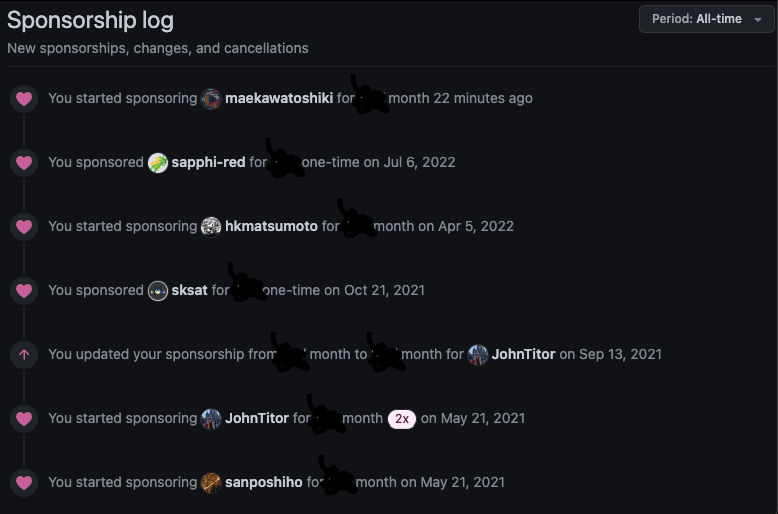

<!-- titleは自動で入る -->
これまでの支援遍歴と、支援に対する現時点での僕のスタンスを残しておく。

**免責事項**: 支援している方々とこの記事の間に一切の関係はなく、記事の内容や責任は私にあります。何か不都合がございましたら [@uta8a](https://github.com/uta8a) までご連絡ください。(メールアドレス等を記載しています)

# GitHub Sponsors

支援した期間が長い順に紹介します。

- [さんぽし](https://github.com/sanposhiho) さん
  - k8s scheduler周りをされている方
- [JohnTitor](https://github.com/JohnTitor) さん
  - rust, libc crate, glacier, rustc-dev-guide 他に nodejs/i18n や semver 周辺にもいらっしゃる印象がある。OSSの化身。
- [hkmatsumoto](https://github.com/hkmatsumoto) さん
  - [roogle](https://github.com/roogle-rs/roogle) で有名な方
- [uint256_t](https://github.com/maekawatoshiki) さん
  - 自作〇〇を昔からたくさん作っておられていて、コンパイラとRustに気持ちがある方

Past Sponsors (onetime)

- [sksat](https://github.com/sksat) さん
  - 宇宙と計算機と開発者体験に気持ちがある方
- [翠](https://github.com/sapphi-red) さん
  - Viteのcore teamにいらっしゃる、めちゃくちゃパワーがある方

# 基本スタンス

基本的に以下のスタンスでやっています。上から大事な順で。

- 無理をしない。自分の生活状況が変わったら撤収する。
  - スパチャは美味しいご飯を食べてから！
- 応援したい人に投げて、関わりを持とうとしない
  - 見返りが欲しい気分すら持たず、忘れてしまうのが良い
- 自分の収入や財産に応じて、寄付をする額を決めてその中で運用する
  - Amazon欲しいものリストで送る、やFANBOX, GitHub Sponsorsは全部僕の中では寄付扱いで気持ちの整理をつけている。予算内でやりましょう。

OSS周りの活動をしていてGitHubでの活動が見える方々のうち、そんなにSponsorsがついていない方々に投げています。おそらくすでにたくさん投げ銭をもらっている人に必要なのは企業レベルのパトロンで、僕ではないという気持ちがあるからです。(この考え方は人による)

応援してえ！スパチャ投げてえ！という原始的な感情を大切にしています。

# 感想

uint256_tさんに投げ銭したいが...と思っていて、当時はSponsorsをされていなかったのでぐぬぬ...と思っていたのですが、開設されていらっしゃったことに気づいたのでいい機会だしと思って支援すると同時に振り返りのログを残しておくことにしました。

多分僕の課題としては予算をもう少し厳密に組んで支援を切る時の判断材料を作ることかなと思っています。やっぱり追加だけし続ける訳にはいかないので...

いっぱい稼いでいっぱい使って、金は天下の回りもの！をやっていきたいです。

# 参考

- [GitHub Sponsorsで支援している方を勝手に紹介する記事【2022年度版】](https://blog.syum.ai/entry/2023/01/02/172204)
  - syumaiさんの記事。主にフロントエンド周りの方々の紹介が載っている。僕にはこんなふうにうまく紹介はできないんですが、Sponsors関連の記事って書いていいんだ！という気持ちになったので記事を書いてくださったことに感謝。
