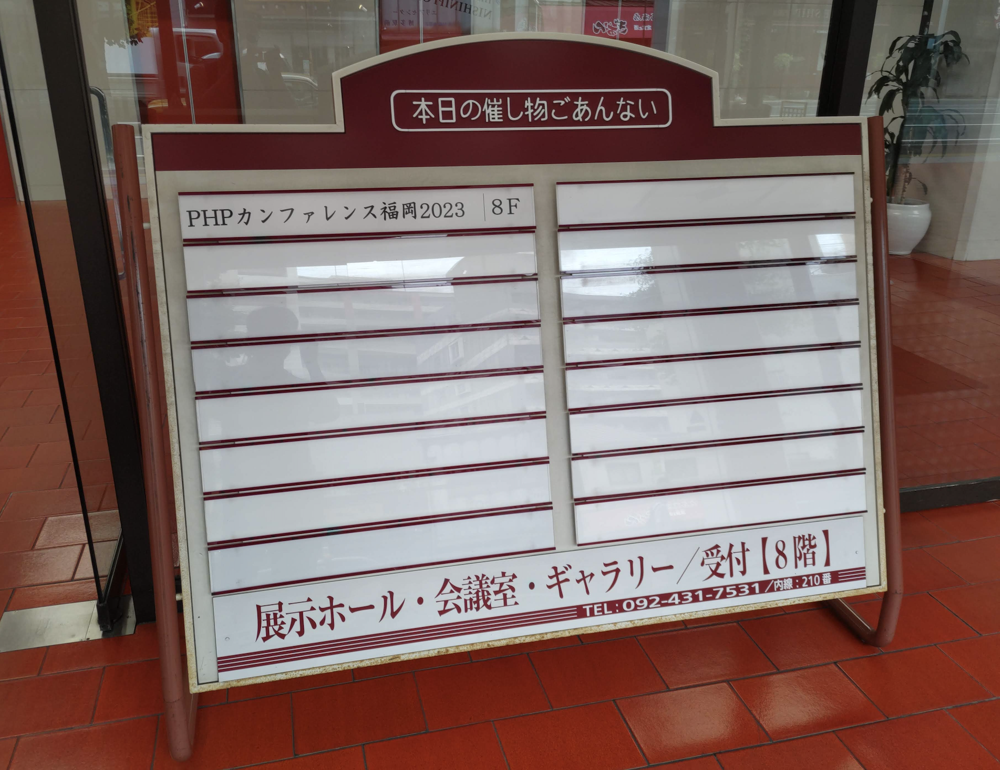
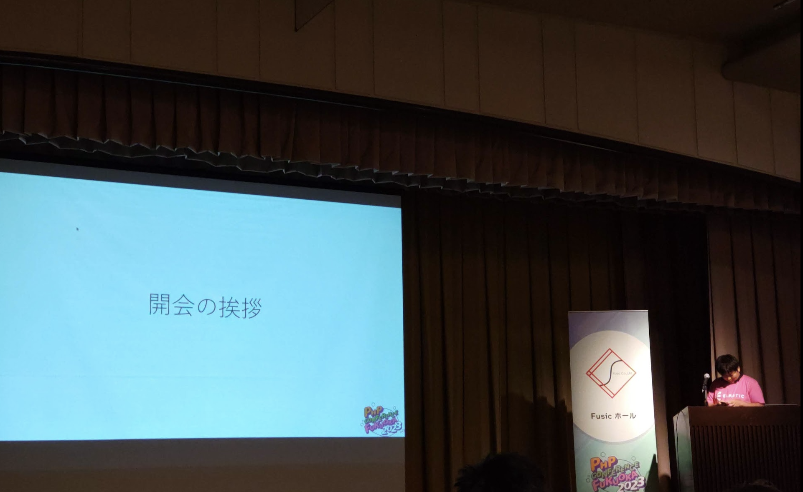
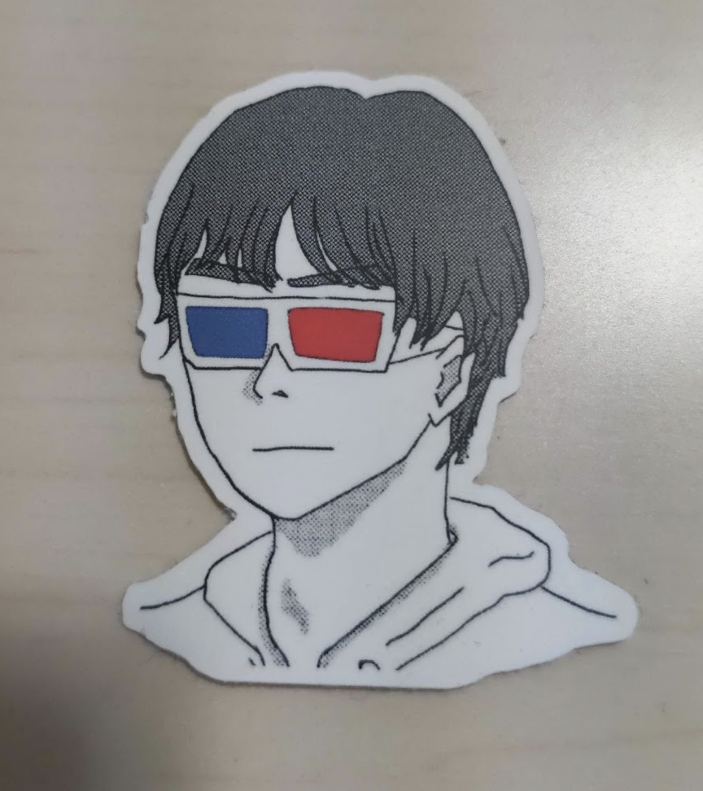
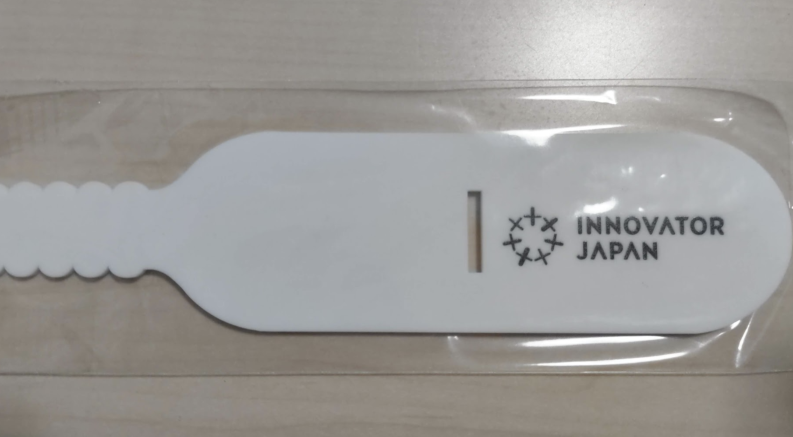

<!-- titleは自動で入る -->
PHPカンファレンス福岡2023 #phpconfuk に一般参加してきました。体験記・感想を書きます。

# まとめ

- PHPに限らず多様な発表があるので、PHP詳しくないかも...と思っても興味を持ったら参加してみよう
- オフライン開催は様々な人と直接話せて楽しい
- 次回は沖縄、北海道でPHPカンファレンスが開かれるのでチェック！

# 当日の様子

サイト

- [公式サイト](https://phpcon.fukuoka.jp/2023/)
- [fortee](https://fortee.jp/phpconfukuoka-2023)

大きなFusicホール、中くらいのVAddyホール、小さなDホール、スポンサー部屋の4つの部屋を自由に行き来できました。
Twitterにログインできる方は当日の様子をハッシュタグで追ってみるとよさそうです。 [#phpconfuk](https://twitter.com/search?q=%23phpconfuk&src=typed_query&f=top)

- Fusicホール [#phpconfuk #hall_fu](https://twitter.com/search?q=%23phpconfuk%20%23hall_fu&src=typed_query)
- VAddyホール [#phpconfuk #hall_va](https://twitter.com/search?q=%23phpconfuk%20%23hall_va&src=typed_query)
- Dホール [#phpconfuk #hall_d](https://twitter.com/search?q=%23phpconfuk%20%23hall_d&src=typed_query)

# 出来事時系列

個人的な出来事込みで雑多に書いてます。

**9:10**: 一緒に行った [@kofuk](https://twitter.com/man_2_fork) が先に会場着。10:00開始、9:30から受付開場とのことで、@kofuk はちょっと待って9:30少し過ぎに入場。

**9:40**: 僕([@kaito_tateyama](https://twitter.com/kaito_tateyama))も会場に到着。

会場のFFBホール

入口がおしゃれ

本日の催し物であるところのPHPカンファレンス福岡

10:00の正式なオープン前から「今日はどこから来られましたか？」といった質問で場が暖まっていて、ワクワクしてきます。
四国や東海ブロックの人が少なくて、やはり関東から来られた方が多かったです。僕は広島から来たのですが、中国地方の人はレアでした。

名札が渡されて会場入って左にペンが置いてあって名前を書くシステムでした。本名かハンドルネームか迷ってハンドルネームにしました。
名札は裏にタイムテーブルが書いてあって、すぐに講演次どこ行こうか確認できるのがありがたい。

**10:00**: PHPカンファレンス福岡、オープン！！

開会の挨拶！！！ウオオ！！！

PHPカンファレンス福岡2023実行委員長の [せいけしろー さん / @seike460](https://twitter.com/seike460) の挨拶。
コロナ禍の影響を受けて久々の開催であること、前身となる勉強会がずっと前からあってその流れでPHPカンファレンス福岡があること、せいけさんのリスペクトとアツい思いが伝わってきて、今日は注意事項に気をつけて楽しむぞ〜！の気持ちになりました。

〜ここからはあまり写真を撮ってなくて記憶も曖昧なのでざっくりです〜

**10:30**: [@tadsan](https://twitter.com/tadsan) 先生による [【令和最新版】開発者フレンドリーなHTTP SDK作るには](https://fortee.jp/phpconfukuoka-2023/proposal/a94f382a-8da3-4405-ab52-fe4d20e075f5)

HTTPリクエストを発行して外部サービスに対するSDKを提供している時に、そのSDKを使う開発者の目線で見て開発者フレンドリーにするには？という話
[php-http/discovery](https://github.com/php-http/discovery) と、ちょうぜつソフトウェア設計入門がいい本という話が気になりました。
後で @tadsan さんに聞いたところ、SDKはこれまで触ってきた「このSDK...つらい！」という経験を踏まえてのものだそうです。個人的には不用意なGuzzleの依存を減らしたいとか、HTTPに関するPSRの話でシンプルさを強調していたところとか、こうあってほしいよねという美学のようなものを感じて分かる〜〜となっていました。

@kofuk はこの講演が一番楽しみだったらしく、実際とても良くて最高という気持ちに。

**10:45**: スポンサーブースに遊びに行きました。まずPixivさんのところに行きました。

[kamikoさん](https://twitter.com/kamiko_koho) とは学生の時に逆求人イベントでお話ししたくらいだったので、対面で会えて個人的にめちゃ嬉しかったです。
Pixivブースではクイズがあり、@kofuk と二人であれこれ悩みながら回答しました。1問目のpixiv gitは正解して、2問目の福岡オフィスクイズは外してしまいました...！後でアルバイトとして来ていた [logicaさん](https://twitter.com/logica0419) と会話したのも含めて、Pixivはさまざまなデータをフル活用して意思決定をしているんだなと思いました。

クイズに答えたら色々グッズを頂きました。ありがとうございます！

いや〜Pixiv社めっちゃ好きなので応援です。

**11:00**: [スタヰル](https://twitter.com/stwile871) さんによる、 [フレームワークが生み出す負債や複雑さに対して、PHPUnitと付き合っていく](https://fortee.jp/phpconfukuoka-2023/proposal/e1acbd97-9263-4edc-99b1-ed736b0fad8a)

Laravelでのテストをどのように有効なものにしていくかというお話でした。個人的に最近会社で単体テストの考え方本を読んでいるのでこれは知っている！分かる〜！な話がところどころあって内容がしっくり分かりました。
個人的にいいなと思ったのは、こういうテストの改善ってともすると教科書的なふわっとした議論になりがちなところを、具体的な例としてTodoリストを題材にすることで具体的な状態を保っていた点です。単体テストの考え方本で言われる単位についても、自分たちのチームで考えた定義を与えていて、本の内容を踏まえて具体的な話をしているのが発表内容的に参考になりました。

**11:15**: Fusicさんと、VAddyさんのスポンサーブースに行く

Fusicさんのブースに行きました。友人の [あっとさん](https://twitter.com/AT274_) が働いているんですよ〜という話をしたらあっとさんの話が聞けました。ギター最近練習してて上手いとのこと。元気そうでよかった(？)

Fusicさんは福岡で発信もめっちゃ頑張っておられるので僕もブログ記事読んでISUCONとか競プロ会みたいなの楽しそう...！と思っています。開発合宿も確かされていたはず。こういうエンジニアのこれがやりたいというパワーに上手く会社が寄っていって発信につながって好循環生まれてそうなのは好きなので応援しています！

続いてVAddyさんのブースに行きました。セキュリティの診断作業をサポートするプロダクトを作っておられる会社で、ユーザによるシナリオベースの操作を元にピンポイントで診断を行うのは便利そうに感じました。
アンケートに答えてタンブラーをもらいました！ありがとうございます！！

**11:30**: [岡嵜 雄平 さん](https://twitter.com/Y_uuu) による、[育成力 - エンジニアの才能を引き出す環境とチューターの立ち回り -](https://fortee.jp/phpconfukuoka-2023/proposal/df5f06e8-900e-4e71-94d7-d0c3cc57a0ac)

Fusicのスポンサーセッションです。主にFusic内の新人研修(中途含む)を例に、具体例を交えつつFusicで行っている育成力を高めるための工夫の紹介でした。
個人的には、「エンジニアから出たこれやりたいという要望は基本的にはやってもらう」というのがいいなと感じました。例として自作キーボードとISUCONが挙げられていましたが、他にも様々なイベントが有志によって行われていることが企業ブログから分かります。また、IoTを活かしたシステムを作ってみてよかったら社内運用するというのもWeb企業に勤めている身としては新鮮で面白かったです。

**11:50**: [cakephper市川](https://twitter.com/cakephper) さんによる、[脆弱性もバグ、だからテストしよう！と唱えて8年が経ちました](https://fortee.jp/phpconfukuoka-2023/proposal/b282fcfd-1fbb-4d4d-8e48-740c75be68cd)

VAddyのスポンサーセッションです。まずcakephperというIDがかっこいい。IDをつけた当時の覚悟がすごそう。
とってもいい話でした。内容としては、VAddyのこれまでの苦労を振り返りつつ今までやってきたことを紹介していくもので、基本的には初期のつらめな話がメインでした。といってもcakephperさんの語りがうまく、当時は本当に辛かったんだろうなと思う話でも面白く聞くことができて、会場もたびたび笑いが起こっていました。発表が上手い...！
特に無料で使ってもらうところからエンタープライズ向けで日本向けに切り替えるところなど、うまく立ち回るための方針転換の難しさを感じてとても面白かったです。

**12:10**: お昼休憩

@kofuk とキャナルシティに行ってラーメンを食べました。

福岡、本当に飯がうまくて最高です。

**13:10**: [uzulla](https://twitter.com/uzulla) さんによる、[あなたのPHPアプリ、ログはでてますか？あるいはログをだしてますか？](https://fortee.jp/phpconfukuoka-2023/proposal/b5f7099b-b87b-401d-994e-6cced4cd2aca)

僕はこの発表を聞くために来たので聞けてとても嬉しかったです。元々PHPに興味を持ったのが [@jdkfx](https://twitter.com/jdkfx) のWebフレームワーク自作話を聞いてuzullaさんの [オレオレフレームワーク](https://speakerdeck.com/uzulla/gui-tutekita-ping-cheng-zui-hou-falseoreorehuremuwakufalsezuo-rifang) が面白いと思ったからだったので、uzullaさんの発表はとても楽しみにしていました。
今回はログの話で、ログはそのログを受けてどうアクションするかが大切という話をメインに、ログにまつわる考え方を紹介するというものでした。
個人的にはログを適当に出していたのでチームでやる時にはログを見てアクションを取る人は別の人のこともあるから、そこを考える必要があるというところが確かになあと思いました。まだ会社入って3ヶ月とかで研修中の身ではあるんですが、このあたりは今からでも気をつけて行けるので個人開発とかから取り入れて素振りしていきたいです。

**14:00**: LTを色々聞いたり、スポンサーブースに行ったり

ここで [そーだいさん / @soudai1025](https://twitter.com/soudai1025) の「失敗から学ぶ技術的負債との正しい歩き方」を聞きました。個人的に最近Twitterで目にして考えていた、「どうでもいいことは流行に従い、重要なことは標準に従い、ドメインのことは自らドメインフレームワークを設計し実装する - [@koriym](https://twitter.com/koriym)」の言葉のそーだいさんから見たコンテキストが聞けたのがよかったです。技術選定した結果が負債になる頃に技術選定の評価ができるから、新規に選定だけして転職するのはちょっとアレみたいな話も分かりが深かった。

**14:35**: [やまゆさん](https://twitter.com/akai_inu) による、[秒間 10,000 リクエストを "簡単に" いなすゲームサーバーを Laravel で作る設計](https://fortee.jp/phpconfukuoka-2023/proposal/c81a3325-052a-4bbe-8fc9-a80d620d0333)

札幌と仙台に拠点を置く会社からの登壇。全国色々な場所から人が集まっていてすごい。
内容はゲームサーバはDB Write Heavyなところがボトルネックになるので、それに合わせてDBを扱うライブラリがシャーディング等に対応するか調べて工夫すればLaravelがボトルネックになることはなく普通にスケールしますというもの。
PHPは遅いと言われがちで実際差はあるにせよ、こうして実例で可能性を示して、その上で必要な工夫を示すのはとても納得感のある発表でした。こういう内容のある発表ができるようになりたい。
後日負荷試験についてのフォローアップブログが上がるそうなので、とても楽しみです。

**15:05**: LTを聴く

[tomioさん](https://twitter.com/tomio2480) のLTを後ろだけ聞きました。なんか北海道の話からの [来年2024年の1月に開催予定のPHPカンファレンス北海道](https://twitter.com/phpcondo) の宣伝に華麗に繋げているところを見ました。tomioさんは地方の勉強会に気持ちがめちゃくちゃ入っている方で、北海道を主軸にわけのわからないスケールで全国のIT系勉強会に出没する魔人のような方です。

北海道からの沖縄ということで、[ビーチ駆動開発のLT](https://speakerdeck.com/bumptakayuki/shui-temojian-dan-nishi-merarerubdd-hitiqu-dong-kai-fa-falsesusume) を聞きました。古き良きLTという感じで小さなホールDに笑いが絶えなくて、オフラインのLTってやっぱこうだよな！という気持ちに。最高です。[PHPカンファレンス沖縄](https://phpcon.okinawa.jp/) が今年2023年9月に開かれます！！スポンサーも登壇したい方も応募中とのことなので応募しましょう。

Crell/Serdeに関するPixivの23卒の方のLTを聞きました。PHP8から使えるアノテーションを活用するとRustのSerdeのような体験を得られるという内容で、僕は普段Rustを趣味で書くので気になり〜！になりました。[Crell/Serde](https://github.com/Crell/Serde) の内部が気になるので調べてみようと思います！僕も23卒なので登壇していてスゲー！ってなりました。

かな入力に関するLTを聞きました。こういう小さなホールだと誰でもLTができるので、もちろん色々胃が痛くなる出来事が起こる可能性もありますが、こういう小さく始めて成功体験を得られる機会があるのがいいなと思いました。僕も次のオフラインイベントでこういう自由LTみたいなところがあったら一本発表を持っていきたいと思えるナイストライな発表でした。

結婚式アプリについてのLTを聞きました。なんか詳細は写真なしでとあったので細かくは触れないのですが、とてもウケました。僕もああいう感じの振り切った結婚式開いてみたい。

**16:00**: tomioさんに連れられて色々な人と会話する

tomioさんに連れられてtadsanさんを探してスポンサーブースの端っこで様々な人と会話をしました。tomioさんの顔がマジで広くて、色んな人と会話することができました。お話ししてくださった方全員を覚えているわけではないので、 [@kaito_tateyama](https://twitter.com/kaito_tateyama) にリプライとかくださったら嬉しいです。一方的にフォローしにいきます(FFにならなくても大丈夫です)

始めにPixivスポンサーブースに [logicaさん](https://twitter.com/logica0419) がいたのでお話しました。logicaさんのPixivでのアルバイトの話や、kofukの紹介をしてプリンターの話をしたりしました。logicaさんとは技術記事を読む会でお話ししたことがあったので声でわかりました。こういうオンラインからのオフラインでのつながりはとてもアツいのでいいですね。

hatenaの方でPerlに強そうな方とお話ししました(お名前忘れてしまった...！すみません)広島の来年のYAPCの話をしました。YAPC行きたいな〜と思いつつ何もしてなかったのでCfP出したり、何かできないか考えたいです。

uzullaさんにログの発表の感想を伝えることもできました。めっちゃ嬉しかったですね。アメリカ横断の話とか、uzullaさんが体調悪い話などをしました。

tadsanさんともお話しました。kofukがEmacs使っているという話をすると「cc modeのコード読んだことありますか？」とkofukが言われたりしていてすごい面白かったです。やっぱ強い。北海道の流れでtomioさんとtadsanさんが10年以上の仲であることなど、様々な話をしました。

あと、tomioさんが所持していたMooちゃん(むーちゃん)とツーショットを撮りました。嬉しい。

**17:00**: LTセッション

個人的に好きだったのは「The PHP Foundation の活動を外野から勝手に（俺は 1 円ももらってないのに）早口で大紹介する」と「月に一度の大規模リファクタリングでレガシーコードと向き合う取り組み」と「「MVPから作る」ってどういうこと？」の3つです。

**17:50**: 閉幕

あっという間に閉幕です。せいけさんの「今日楽しかったという気持ちを次に繋げていく」という想いがとても伝わってきました。今年9月に沖縄で、来年1月に北海道でPHPカンファレンスが行われます。福岡でもクラウドに関するイベントが夏にあるそうです。
こういうどんどんタスキを繋いでいく感じが伝わってきて、アツいなと思いました。

本当にスタッフの方々、スポンサーの方々、登壇者の方々、関わっている方々、素敵な会をありがとうございました！！！

# 感想いろいろ

## 頂いたグッズの紹介

ELASTIC社がTシャツのスポンサーをしてくださったそうです。ありがたい。

ちゃんとTシャツにPHPカンファレンス福岡2023のロゴも入ってます。

Pixivブースで頂いたグッズです。可愛いの最高です。

トートバッグの両面にスポンサーのFusicとVAddyのロゴが！！

手拭い。カオナビは仕事ができる。

PRTIMESのポーチ。ステッカーなど細かいものを入れるのに役立ちます。header location Fukuokaもおしゃれ〜

VAddyでアンケートに答えるともらえるタンブラー。いいですね〜

ステッカー色々

関係ないけど kofuk も自分のアイコンステッカーを持っていて、もらいました。ウケる。

Fusicボールペン！ロゴいいよね

Linkageのサイコロ。座りすぎないようにします！！！

Innovation Japanのリストバンド。

Pixivのバグ知らずの防虫グッズ。これで俺のコードは堅牢や

たくさんのチラシ。結構地元色あって読むの楽しい。

## PHPに詳しくなくても楽しめる広さが良い

ログに関する話や技術的負債への向き合い方など、主題がPHPではないが業務上とても大切でPHPerに役立つ話があるのはいいなと思いました。そういう懐の広さを取ると参加者のレンジが広くなって、dホールのLTのような気軽さが生まれるように感じます。また、そういう広さは場の空気が暖かくないと成立しなくて、ここはきっと歴史と運営のホスピタリティ、参加者のやさしさが支えているんだろうと感じました。

<!-- 
## 持ち帰ったものを次に繋げたい

## オフラインでの話のうまさ

 -->

# 最後に

めっちゃ楽しかったです！！！！本当にありがとうございました！！！また来ます！！！
