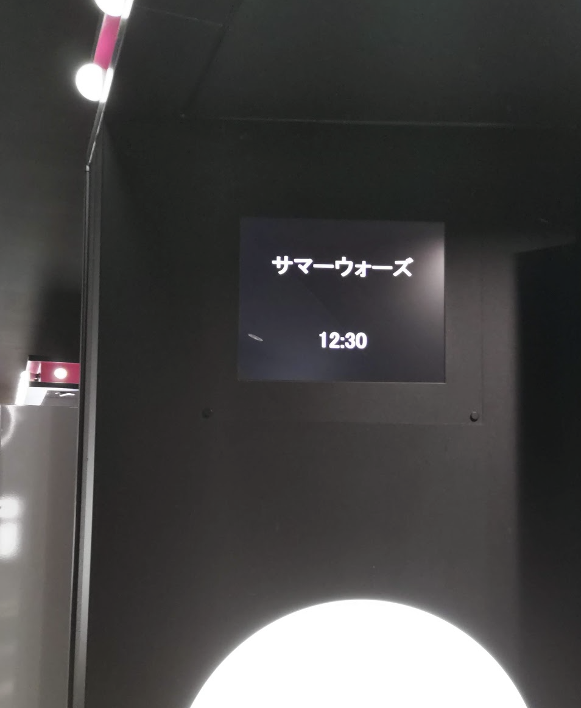
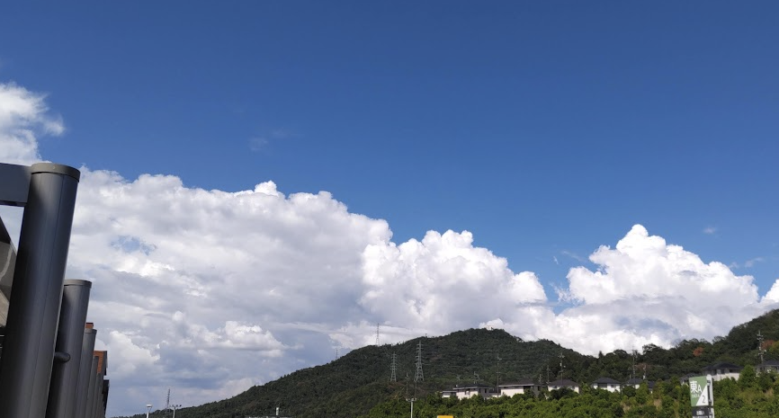

<!-- titleは自動で入る -->
好きだ〜！という気持ちと、自分語りをします。以降はネタバレ全開です。

# ここが好き

2023/7/30に西広島の方まで出て行ってサマーウォーズを観てきました。やっぱりいい映画ですね。終始泣いていました。

何度も観たことのある映画だったのですが、僕が初めて観たのは金曜ロードショーだったので、映画館で観たのは初めてでした。気づいたことを列挙します。

## よろしくお願いします、は最初の方でも登場する

主人公の小磯健二が「よろしくお願いしまーす！ｯﾀｧﾝ」とやるシーンはめっちゃ有名なんですが、よろしくお願いしますという言葉自体は作中で他にも登場しているんですね。特に最初の夜に家族の前で親戚一族を紹介されてから、よろしくねと言って晩御飯を食べ始める時に健二が小さく「よろしくお願いします...」というシーンが印象的でした。

僕の中でずっと、最後の小惑星探査機あらわしにGPSの偽の補正情報を送り込むシーンでのよろしくお願いしますはなんでよろしくお願いしますなんだろう？という疑問があって、これに対して正解というより自分なりの納得を得たいと思っていました。これに関しては僕の中での答えが出た気がします。

多分最後の場面ではそれこそ時をかける少女の真琴のように「いっけえええーーっ！」でもいい気がしていたので、「よろしくお願いします」自体に何か意味があると自分としては納得するなあと思っていました。
僕の中では「よろしくお願いします」自体にコミュニティに入る際の挨拶みたいな意味があると思っています。最初の晩御飯は分かりやすくそうですが、最後のGPSに偽の補正情報を送るシーンも、諸々の感情の中に、たった数日ではあってもお世話になった陣内家に対する守りたいという感情もあるように思いました。

ここら辺あまりうまく言葉にできないのですが、意味を感じて自分の中で納得できて良かったです。

## 佳主馬が、巨大化したラブマシーンにヤケクソで向かっていくところで涙出た

サマーウォーズを観たのは結構久しぶりで、以前何回も観てた時と比較して僕の受け取り方が変わったなと感じたのはここでした。

果たし状を送って戦い、その後スパコンの熱暴走で巨大化したラブマシーンにOZ内の城を壊されてしまい、ラブマシーンに掴まれたキングカズマが放り投げられて壁に激突するところからの話です。

佳主馬の心境として、おそらく以下のような流れになっていると思います。

- ラブマシーンに初回で負けて、果たし状を出すまで
  - →戦って勝つのが好きという気持ちがメイン
- 巨大ラブマシーンにつかんで投げられて完敗
  - →翔太兄許さん！
- 小惑星探査機が核施設に落ちることを把握
  - →多分ここで初めて、勝つために戦うのではなくて母さんと妹を守るためという意識が強く自覚されている

「やつとどう戦うかって話。リベンジだよ」や、「こんなヤツ、僕一人で！」など、前半の佳主馬は一貫してクールでちょっと年齢相応の感じもある勝利のために戦っている感じがします。一転して、後半の小惑星探査機が核施設に落ちることを把握したあたりからの焦り、無茶な戦いをしてなす術なくやられてしまうところ、「おばあちゃん、母さんを、妹を、守れなかった...」のところまでがとても辛くて、涙が出てしまいました。

そもそも背景からしていじめられっ子だったり、新潟のおじさんにOZ経由で少林寺拳法を教わったりとおそらく佳主馬としては強さを追い求めるところが結構強くて、それは純粋に戦って勝つのが好きだからだったのが、家族を守るために無茶でもやるしかないと思って無理な戦いに向かう、という構図がやばくて、涙しか出てこない。
インターネットの声ではなく、自身の母親の「それ、ゲームの中の話よね...？」という言葉で体が反射的に動いて無理でも戦うと決めているのも良かった。この作品における人と人とが手を取り合って〜という側面が表現されているように感じました。

中学生から見た世界はまだまだ狭くて、きっと佳主馬にとっての居場所がOZ Martial Artsだったのだろうと思います。母親よりもきっとファンの方が佳主馬のやっていることを理解している。それでも自分を突き動かす理由が家族にあるというのはこの作品において強いメッセージだなと思いました。

今だと家族という枠組みで語ること自体が議論を呼ぶ感じがします。それでも、誰か大事な人を守るために絶対に勝てっこないと思う場面で立ち上がってやぶれかぶれに戦う姿勢が、僕はとっても好きです。

## 翔太や子供達が邪魔をするのは実はそんなに問題じゃないのかもしれない

昔小さい頃にサマーウォーズを観た時、スパコンの熱暴走の原因となった翔太がめちゃくちゃ嫌なやつだなあと思ったのを覚えています。お前なんの役にも立っとらんやんけ！みたいな。でも今回映画を改めて観ると、実はあそこで失敗したことや、OZが混乱したせいで栄おばあちゃんの心臓のアラートが機能せずすぐに手当できなかったこと、子供達がうろちょろしていること、そういった「勝利というゴールに対する非効率な動き」自体が実はそんなに問題ではないのかもしれないと思うのです。

手紙にもある通り、描かれている世界観としては「一番いけないことは、お腹を空かせていることと、一人でいることだから」というのが根底にあります。そういう観点からは栄おばあちゃんが侘助が帰ってきて「あんた、ご飯食べた？」と聞くことや、手紙の中で侘助に関する記述が多いことも納得できます。きっと、一族は仕事もしていてご飯もしっかり食べているしみんなわいわいしているのでそんなに心配してなくて、侘助はどこで何をしているのかもわからずきっと一人だろうから栄おばあちゃんは心配だったんだろうなと思います。
この根底の世界観からして、少々の失敗は別にどうだっていいわけです。スパコンが暴走して作戦が失敗してもいいし、栄おばあちゃんが亡くなってしまうのはマジで悲しくて泣いたけど、いつか別れは来るものだし。失敗は一族総出で片をつければいい。負けたっていい。負け戦だって毎回戦うんだから。
諦めなさんな、諦めないことが肝心だよ。というところも踏まえて、今回劇中で描かれる失敗とかが許せる感じがして、しくじることがあってもお腹が空いていないこと、一人ではないことが満たされていたらそこからまた諦めず立ち上がっていけるのだろうと思いました。

# 映画に影響を受けて生きている

自分語りをします。個人的にサマーウォーズには人生を支えてもらっているので、どうしてもありがとうと伝えたいです。

元々中学1年生の時にバスケをしたのですが、足の病気になってかなり詰みました。医者には治らないので一生病気と付き合っていくしかないと言われました。今は医者とは別ルートでかなり色々頑張って完治してピンピンしているのですが、当時中学生の僕にとっては好きなバスケができなくなって一生このままというのが耐えられませんでした。

中学校にも通わず毎日療養しながら、昼はずっと空を眺めていました。空を眺め続けて夏になる頃に、サマーウォーズが金曜ロードショーで放映されました。

当時の僕にとっては、主人公が眩しく見えました。それと同時に、僕も数学ができたらこうやって楽しいことがあるかもしれないと思いました。

毎日毎日金曜ロードショーを録画したやつを繰り返し観ていました。月に30回は観ていたと思います。当時も今も劇中のセリフを覚えて真似することができます。
それから暗号についてインターネットや図書館で調べて時間が過ぎていきました。どうやったらあの暗号が解けるのだろう？そもそもあの暗号はどういう仕組みなんだろう？調べても分からないことだらけの日々が続き、当時の僕は「これ高校数学をやらないと分からないっぽいな」と結論を出しました。

街に出かけて書店でZ会の数IAの問題集を買いました。それをやって、父に数IIBと数IIICの本も買ってもらって、中学3年生の夏に問題集を全て終わらせました。年が明けて数学オリンピックの予選と広中杯にも出て、どちらも予選で落ちて家に帰って自分の弱さに泣きました。

中学には相変わらずあまり行ってなかったのですがなんとか高校に行けました。高校に入ってからもずっと数学をしていて、それでも高校1年の数学オリンピックでも予選落ちでした。僕はもう健二みたいにはなれないことに薄々気づいてきたのを覚えています。僕はそもそもOZのバイトをしてないし、夏希先輩のような関係もないし、僕の人生にサマーウォーズのようなことは起こらないし、僕は数学オリンピックでも予選落ちで止まるくらいの人生なんだろうと思いました。

それでもその頃には数学自体が楽しくなっていたので高校2年生は高校にそんなに通わずに毎日数学のことを考えて過ごしていました。獲得金メダルという本が当時あって、この本と辞典をひたすらやっていました。周りには数学オリンピックの問題を相談できる先生も友人もそんなにいなくて、ずっと僕は一人で問題を四六時中考える生活をしていました。

そうして高校2年の最後のチャンスで数学オリンピックの予選を突破しました。

それから高校に全く行かずに1ヶ月ほど本選に向けてずっとずっと問題を解いていました。考え過ぎて熱が出て、布団の中でも幾何を解いていました。そうして、本選の日を迎えて、僕は無事に4問目の幾何を解いて日本代表選考合宿(春合宿)に呼ばれました。

春合宿では僕よりもすごい人しかいなくて本当につらかったです。僕は結局問題は1完すらできませんでした。会場の雰囲気に飲まれてしまったのもあると思いますが、実力不足のせいです。他の参加者は韓国の過去問とかも把握していて、獲得金メダルと辞典くらいの演習量では太刀打ちできませんでした。

そうして僕は日本代表にはなることができないまま、高校3年生になりました。

高校3年生の夏に夏季セミナーというイベントがあり、ここで数学書の輪読をしました。ここで僕は挫折してしまって、それまで建築士か数学者になろうと思っていたのですが僕には数学者は無理だなと思って建築士になるのをがんばろうと思いました。

その後東大に進学してまた病気になって辛い4年間を過ごして中退し、療養しながら地元の大学で働けるくらいに元気になり、無事にこの春から周回遅れで社会人として働いています。結局建築も数学もできないし、研究では暗号をやったのに暗号のことまるで何も知らないけど、無事にしっかり働いて、ご飯を食べて生きているので最高です。

ここまでめっちゃ勢いで書きましたが、改めて映画を今回観てみると僕の価値観や人生観の形成にサマーウォーズってめっちゃ影響してるなと思います。人生に辛い時期がたくさんあって、それでも今生きているのは間違いなく「諦めなさんな、諦めないことが肝心だよ」とか、「まだ負けてない」とか「人生に負けないように」「負け戦だって戦うんだうちは、それも毎回」「あんたならできるよ」といった数々の映画の中で登場する言葉に精神的に支えられているからです。

改めて僕はとってもサマーウォーズという映画が大好きで、とてもとても感謝しています。きっと僕を生かしている気合いや価値観や諦めない気持ちはサマーウォーズからもらった光で、僕はこの大きな光を抱えてこれからも生き続けるし、人生に負けないようにしっかり働いて生きていこうと思います。
