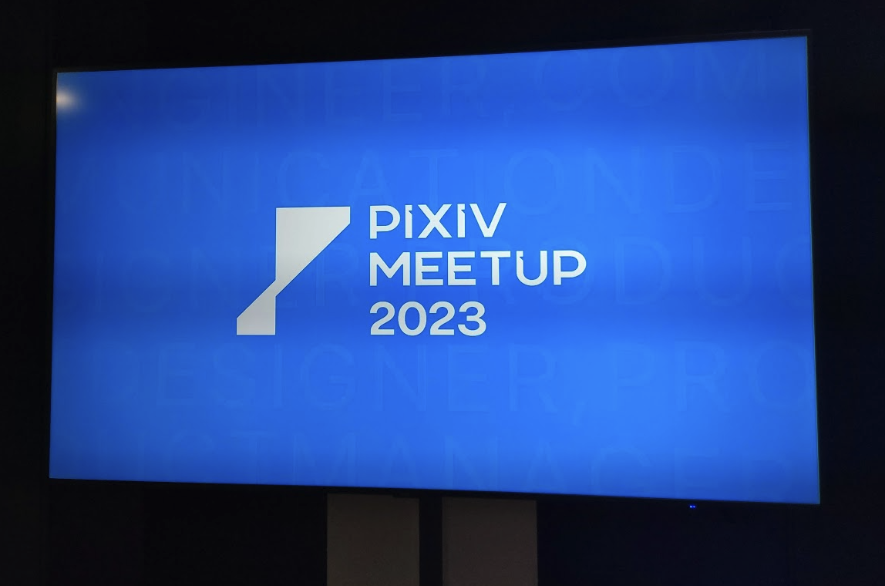

<!-- titleは自動で入る -->
[PIXIV MEETUP 2023](https://conference.pixiv.co.jp/2023/meetup) は2023年9月29日に開催された、招待制のカンファレンスです。ピクシブのイベントとても楽しそうなので行きたいな〜と思ってTwitter(X)で行きたい〜〜と言っていたら招待していただけてとても嬉しかったです。

当日の様子は [#pixivmeetup](https://twitter.com/search?q=%23pixivmeetup&src=typed_query) を辿ると分かります。また、参加者の びきニキ さんが出している [カンファレンスに参加したら小中高時代の気持ちに逆戻りし、昔のオタクになっちゃった大学生による「PIXIV MEETUP 2023」参加レポ｜びきニキ](https://note.com/012xx_/n/naba4cdf01cff) がとてもよくまとまっているのでぜひ読みましょう。

ここでは個人的な話として2つ、「色々な人とお話できて楽しかった」「ピクシブのビジョンと取り組みが尊くて、僕も僕で頑張ろうと思った」について詳しく書きます。

# 色々な人とお話できて楽しかった

色々な人間と話せて楽しかった〜、所属を公開してない方もいるのでTwitter(X)での言及がない方は伏せています。

- ピクシブの社員さんと話せて良かったです。色々話した中でも、最近中途で入ってきたコーナーの方が楽しそうにされていたのが印象的でした。あと以前discordで好きな作品(ｱｰｯ)について語り散らかしてた人と会って最近の好きな作品について話せたの最高すぎた。
- traPの方、ex-traPの方とたくさん会えて最高でした。traP勢が多すぎて、ピクシブとtraP仲良しかよという気持ちに
  - たらりらさんとあいさつできて良かったです、いや嬉しい〜〜
  - Neoshowcaseバックエンド勢のpikachuさんや、ときさんと話できたのも嬉しかった〜
  - 他にもeyemonoさん、toshi00さん、mazreanさん、oribeさん、trastaさん...などたくさんの方々とお話したりあいさつできてとっても満足です。
  - 僕がtraP大好き人間として割と認知されていることに驚きました。ただの外野のファンなのですが、これからもtraP応援してます！ブログも読みます！
- Notchyさんとお話できました。結構長時間話してくれて、個人的にかなり嬉しかったです。Notchyさん自身の興味のあることの話や、keigoさんの話も聞けて良かった〜
- やまのくさんの名札を認識して話しかけたらやまのくさんでした。ちらっと音楽の話ができて嬉しかったです。
- 碧黴さんと会えたのも良かったですね、忙しそうな人が元気そうにしている様子を確認できるとめっちゃ嬉しいことが知られていて、嬉しかった。
- その他にもSNSで見たことある方々と対面でたくさんお会いできて最高でした。名刺受け取ってくださってありがとうございました。

# ピクシブのビジョンと取り組みが尊くて、僕も僕で頑張ろうと思った

Opening TalkとKeynoteとても良かったですね。「創作活動を、もっと楽しくする。」というミッションに始まるミッション、ビジョン、バリューの話はピクシブらしいものを掲げられていて、とても好きだなと思いました。
こういう会社として掲げるものってなかなか地に足がついていて違和感がないものにするのって難しいと思っているのですが、ピクシブのミッション、ビジョン、バリューは全く違和感がなく、これはピクシブらしいなって思うと同時に、次の時代に向けてワクワクするような像を描けていて素敵だなと感じました。
特にこのmeetupの会場の雰囲気からもバリューのEntertain(遊び心で楽しませよう)が伝わってきたように、掲げているものが一貫して実現されるよう力が込められているところがマジで好きだ〜〜ってなりました。
Keynoteでのコミックの位置付けについての話も、サービスが一貫して創作を盛り上げるために存在しているということが感じられて良かったです。
あとChatRoidも楽しかったです。やっぱ技術を使って命を吹き込むの最高すぎ！

僕自身ピクシブのサービスはpixivをはじめとしてBOOTHやFANBOXなど使っていて、創作を受け取って感動して生きる活力をもらっているので、そうしたプラットフォームを提供し創作活動を盛り上げていくピクシブの取り組みはとても尊いなと感じます。これからも応援しています。

僕も僕で頑張るぞーー！！と思えるいい会でした。たくさんの元気と気力と気合をもらいました。

# その他

- After partyのDJイベント初めて参加したけどめちゃ最高だった！
  - 初めてだったので音楽に合わせて体動かすのよく分かんなくて、ゆらゆらオタクになっていた(楽しい)
  - Kiridarumaさんとmimoさんの選曲がかなり好みで良かった
  - Remixの原曲が分かったり、好きな曲が爆音で流れるのに合わせて体を動かすのってこんなに楽しいんだ！って思った
- Artists in シリーズ気になる
- あるぱかさんやNotchyさんあたりのおかげで色々と会いたい人に会えたので感謝
- 個人的に発表の中ではcilviaさんとsueさんがめちゃ好きです。
  - cilviaさんめちゃ分かりやすい構成でLT慣れしてるな〜って思いました。テンポよくCharcoalの困ったことと対応が分かってふむふむと聴けました。
  - sueさんの発表は内容的に僕が興味を持っている領域だったので良かったです。GitLabのGCP移行の話など、いくつかpixiv inside等で見たことのある話が、大きな「ピクシブでのパブリッククラウド利用」という観点からまとまっていて理解しやすかったです。というかこれほとんど一人でやっているの偉業すぎる... 俺も頑張りますという気持ちに。個人的にGitLab CI runner周りの話を聞きたかったのですがAsk The Speakerで話しかけられなかった...
- 会場で話した人から、「やっぱピクシブはエンタメがうまくて場を作るのは流石ですよね」「転職を次にするならピクシブありだなって思っちゃいますよね」「ピクシブに気持ち引っ張られちゃう」という話を聞きました。やっぱりそうですよね〜って思いました。人に応援してもらえる素敵な姿勢、ファンに思わずなってしまうような魅力、これらがピクシブの良いところだなと感じました。

# 終わりに

めちゃ楽しかったです！！ピクシブ応援してます！！たくさんの感動と衝動をもらったので僕も頑張るぞ〜！
