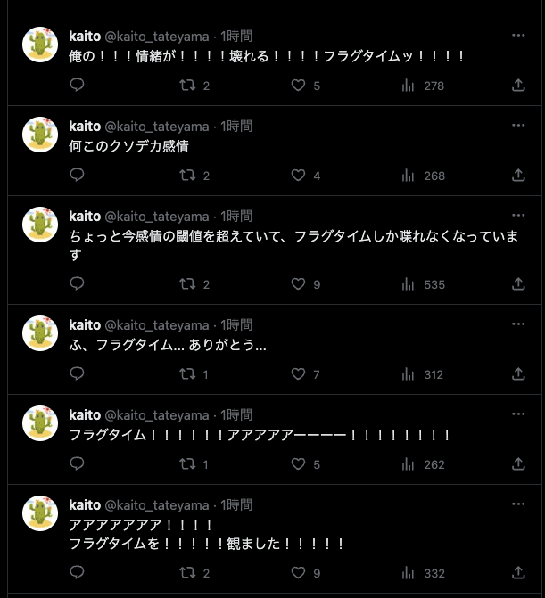

<!-- titleは自動で入る -->
身の回りのオタクがみんな観ていて、口々にオススメと言うアニメが、僕のdアニメの気になるリストに永遠にストックされています。フラグタイムもずっと観たいな観たいなと思いつつ今まで見れていませんでした。
今日視聴して分かったのですが、どうやら僕は人生を間違えていたようです。このまま観ないまま死んでいたら人生が終わるところでした。

何が言いたいかというと、フラグタイムはとても良いアニメだということです。

# なぜ人を好きになるのだろう

きっと初めて森谷さんが時間を止めた時は、現実から目を背けたいとか、そういう些細な出来事だったのでしょう。その力をいつも使うようになってしまって、力を使うことに慣れきってしまったある日、村上さんと出会って物語は動き出したのだろうと思います。
視聴側にはその前の出来事が明かされず、なぜ森谷さんが村上さんを好きになったのか。村上さんがその前から森谷さんを好きだったのはなぜか。それらは明かされることがありません。僕はこの納得や理由を視聴者側に与えないままに「好き」という気持ちを鮮烈に描き切っていることがとてもとても好きです。

そもそもこの年代においては世界はクラス1つ分の大きさで、誰が誰の噂をしているとか、些細な言葉がずっと残ってしまって悩んでしまったりとか、ほんの少しの笑顔とか、そういった世界全体から見ればちっぽけなことで目まぐるしく自らの世界の色が変わります。きっと世界全体で見れば誰だっていいといってしまえそうなことも、小さな世界の中では特別になる。
なぜ人は人を好きになるのか。それはその人である必然性は世界全体から見れば全くなくて、きっと誰だって良いのだろうと思います。それでもその小さな世界では時間を止めるくらい、止めた中で動けるくらいに人は人を好きになる。その理由のないシンプルな力強さはこの年代特有で、一瞬で、刹那で、美しく、僕はただただそれを尊いと感じました。

# デカくない？感情

この時間がずっと続けばいいのに。逃げるために止めた世界の中で、現実の嫌な出来事を回避した後は時間が経つのをじっと待っていた森谷さんが、その時間の中で生き続けたいと思うようになっているのが、世界が色付いているみたいでとても感情がデカいなと思いました。
そして村上さんの芯に迫ってからの最終局面での動き、これ感情デカすぎる！！！助けてくれ！！！ここの誰も正解を持っていない感じ、それでももがいてて好きな人に伝えたい気持ち、溢れる想い、もう全てがデカい。終わり。人生終了。来世でまた会おう。

エンドロールで流れる音楽もとても最高です。本当に世界から見ればなんの変哲もないつまらないことで一喜一憂してしまって、でも出逢えたことから全てが始まっているというこの年代特有の不器用さ、刹那、それがただただ心に沁みます。

もうこの人がいればなんとかなる、この人がいれば他に何もいらない。素敵だ... 素敵だよ... (涙) 俺もそうなりてえよ...

# なぜ時間を止められなくなったんだろう

なんで時間を止められなくなったんでしょう？
物語的には、人を好きになることを通して森谷さんが変わっていく様子を描いているので、現実から目を背けたい気持ちの反動として生まれた時間を止める力が、村上さんとのやりとりを通して現実と対峙する準備ができて、結果的に現実に向かえるようになったから時間を止める力を失った観たいな感じなのかな...

いや考察なんてどうでもいいや！やっぱ人を好きになる気持ちってデカいよ。最高。もう何も考えられない。このまま世界一旦閉店ということで...

# 終わりに

まだまだ気になるリストにストックされているアニメがたくさんあります。きっと今まで視聴せず生きてきた人生を後悔するんだろうな！観るのが楽しみだなああああ！！！

俺は時間を止められる能力があったらアニメを観たい！とか言うてる暇と気合いがあるならアニメを観て情緒を破壊しろ！！いますぐに！！！

フラグタイムの直球さは最近観たアニメの中でもかなりのストレートで、僕にはとても刺さりました。とってもとってもいい作品をありがとう。
