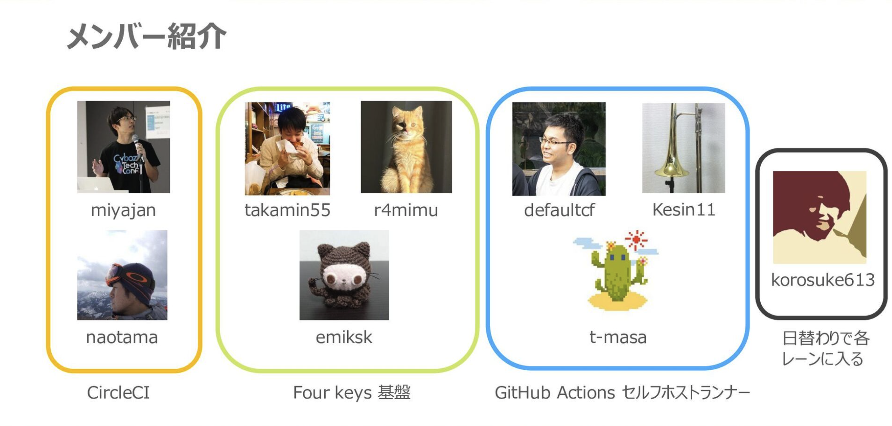

<!-- titleは自動で入る -->
# はじめに

2023年4月にサイボウズに新卒入社した t-masa (a.k.a. @uta8a)です。研修を経て生産性向上チームに7月にジョインしました。まだ配属されて半年ですが、今の個人的な気持ちを残しておこうと思います。

# 生産性向上チームについての宣伝

生産性向上チームのイカしたメンバーを紹介するぜ！

<a href="https://speakerdeck.com/cybozuinsideout/engineering-productivity-team-recruitment-information?slide=8"><i>生産性向上チームの紹介<i></a> より引用

これは10月時点でのメンバーで、現在はkorosuke613とr4mimuが他チームへ体験で移動しています。また、defaultcfはCircleCIレーンへ移動し、CircleCIレーンはAWS SSOレーンに名前を変えました。今はKesin11と僕の2人でGitHub Actions セルフホストランナーの運用を担当しています。
こんな感じで2ヶ月も経たないうちにチームメンバーが大きく変動するような変化の激しいチームです。そもそもこの表の9人のうち5人は2023年にjoinしています。

激動の中で生産性向上チームが見失わないでしっかり握っているキャッチコピーは何か。それは...

**「「「〜 ビーチへ行く余裕をあなたに... 〜」」」**

です！

...

生産性向上チームのミッションは **「多様で価値あるサービスを迅速に提供するため、部署やプロダクトを横断して、生産的でオープンな開発基盤を整備する」** です。
個人的に半年間チームにいると以下のような意味合いが込められているなと感じています。

- 「多様で価値あるサービスを迅速に提供するため」
  - 生産性向上チームは扱っている開発基盤としてのプロダクトが非常に多いです
  - 運用対象の基盤はずっと運用する・増え続けるわけではないです。使われなくなったり、状況の変化に応じてクローズ・移行も行います
- 「部署やプロダクトを横断して」
  - 他チームとのやりとりを積極的に行います
  - 個人的には、開発チームがあまり拾わない・拾い損ねている案件を見つけると積極的に拾っていく姿勢があると思っています
- 「生産的でオープンな開発基盤を整備する」
  - やっぱ生産性向上チームと名がつくからには、生産性あげてかんといけんじゃろう！という意気込み
  - オープンな開発基盤の「オープン」の意味は実はいまだに僕は理解できていません...

こんな感じのミッションを軸にして、日々様々な種類のタスクに対応しています。チームの雰囲気ややっていることについて、詳しくは [生産性向上チームの紹介 - Speaker Deck](https://speakerdeck.com/cybozuinsideout/engineering-productivity-team-recruitment-information?slide=8) に書いてあるのですが、この記事では「生産性向上チームのここが推し2023」を書こうと思います。

# 生産性向上チームのここが推し2023

チームの推しという点では厳選して2点挙げることにしました。

## 改善をその場で行う。その場ですぐにできない改善はタスクにして必ず対応する

どのチームもきっとまだ改善できるところがあるように、生産性向上チームも完璧ではありません。それはチーム運営的な話でもそうだし、日々のタスクや会議の進め方、具体的なタスクに渡って色々なところで改善点が生まれます。
僕が推しだなあと思うところとして、「改善ポイントに気づける人が多い」「見つけた改善ポイントを流れに関係なく言い出せたり、後で週の振り返りで出せる」「改善がすぐに行われていくサイクルが回っている」という点があります。

まず改善って気づくことが難しいです。一旦自分の作業に対して俯瞰した目で見て「これ、めんどくない？」と思えることは慣れから脱する必要があって結構難しいです。チームにはなるほどな〜と思うような着眼点を持った人々がいて、それぞれ違うところに気づくので、多くの改善ポイントが発見されていると感じました。

次に改善したい点、自分の違和感を口に出せるという環境が良いなと思います。今まで積み重ねられてきたフローに対して「これ、ここ微妙かもしれないです」と言い出すのは言葉を選んでいうとはいえ、結構心理的なハードルが高いものです。最初の方はこれ微妙だな〜と思っても言い出せなかったのですが、だんだんチームの雰囲気が分かってくるにつれて積極的にドキュメントの修正やこれはこうしたらどうですかという提案ができるようになってきた気がします。

最後にサイクルが回っていることが好循環になっているところです。改善ポイントを洗い出して、改善したいです！と言い出して、でもそれが実際に改善された実績がないと「きっとチームにこれ言ってもなあ...」みたいになってしまうのはよくある話です。生産性向上チームでは改善が常に回っているので、些細なことでも言ってみようというモチベーションが生まれます。それによって小さな改善が回り、さらに改善ポイントが提示され...という良いサイクルが回っているのを感じます。
ここは結構びっくりしたところで、改善って回っていると回すのが楽になるんだ！という学びを得ました。

この先様々な要因からチームが今よりよくないなみたいな状態になることが仮にあったとしても、生産性向上するぞ、改善を回すぞ、という魂がある限り改善が回って良くなっていくだろうという安心感があります。だから今の僕はさほど将来に対して不安なく、何が来ても大丈夫だろう、と思いながらのびのびとタスクに取り組めています。

## 雑巾掛けレーンがある

生産性向上チームについての宣伝 で書いたように、現在のメインプロダクトは セルフホストランナー・Four keys基盤・AWS SSOの3つです。ではそれ以外の他チームからの相談依頼対応や、突発的に発生したあれこれはどこが受け持つのでしょうか？

生産性向上チームには、「雑巾掛け」という概念があって、そういった細々としたレーンに紐づかないタスクはレーン持ち回りで対応することにしています。例えば昨日はSSOレーンが雑巾掛けとしてタスク対応していたから、今日はセルフホストランナーレーンが雑巾掛けを担当します！といった感じです。絶対受け持ったレーンがレーンに紐づかないタスクをしなくちゃいけないということもなく、必要ならレーンのタスクを進めても良いのですが、生産性向上チームには雑巾掛けが好きな人がたくさんいるのでそういった細々としたタスクはどんどん片付いていきます。

こういった仕組みでモブで様々な細かいタスクに取り組むことで、レーンで扱うプロダクト以外の開発基盤に詳しくなることができました。今では僕も一人でいけるなと思った雑巾掛けタスクはシュッと取って取り組んだりしています。僕も雑巾掛け好きですね。

以上がチームを見ていていいなと思うところでした。他にもいいところはたくさんあるのですが、多くは生産性向上チームのメンバーの良さによる気がします。
続いて、僕が新卒としてこのムーブはしてよかったなというのを振り返ります。

# 生産性向上チームでこのムーブをしてよかったな2023

## 色んなタスクに興味を持って手を挙げてみてよかったな

仕事を始めて最初の方は、新卒でチームに入ったのが僕一人ということもあって「このタスク僕が取っていいのかな...？」「もうちょい手頃なのを取った方がいいんじゃないか...？」と思うことが多かったです。でも、チームの人に聞いてみたら「お？やってみる？興味あるならやっちゃえやっちゃえ」と気軽に取っていって良さそうな雰囲気を感じたので、新卒が取るべきかこれ...？と思うタスクでも色々取ってみました。

- オンボーディング資料の改善
- 採用資料の改善
- インターンのメンター対応

このあたりは初期に取ったタスクです。ドキュメント周りが最初はとっつきやすいというのは後から感じました。やる前は「え？入って1ヶ月くらいなのに採用資料を更新するのを担当していいのか...？めっちゃ興味あるけど俺が取ってもいいのかな...」みたいな気持ちになって結構個人的には苦戦したのですが、結果的にはチームのことを知る機会になってよかったです。そこからだんだん障害調査やセルフホストランナー周りのタスクも一人や複数人で取ることができるようになっていきました。

僕が興味を持ったタスクに手を挙げられたのは、背景としてチームの雰囲気の中でも以下がよかったなと思っています。

- 興味を持っている領域をなんとなくそれぞれが把握している
  - kintoneでコメントしていることをなんとなく見ているので、自分の興味領域をチームの人がなんとなく把握してくれているし、僕もチームメンバーが何に興味を持っているのか把握している
- 無理になったら引き継いでもらえそう感がある
  - 基本的にタスクに取り組む時にはドキュメントに実況を残すので、いつでも引き継げる状態になっています。加えて、一度タスクを取ったら最後までやらねばという圧力もなく、相談したり、降参したりするのが自由な雰囲気があります。そこが気軽にタスクを取れた理由かもしれないです。

色んなタスクに手を挙げやすい環境があり、色々やってみた結果チームのことをよく知ることができたのはよかったです。

## 色々記録しておいてよかったな

僕は元々文章を書くタイプなので、手元のMarkdownで `2023-12-27.md` みたいなのを毎日作って非公開でなんでもメモしています。それに加えて、社内のドキュメントではタスクに取り組んでいる過程を実況するかのようにたくさん書き、社内のkintoneの環境では自分が思ったことを本当になんでも書いています。大体割合としては非公開のが少なめで3000文字/日、kintoneでの自分の分報(timesのようなもの)コメントが多くて20 ~ 50コメント/日(大体一日多い時で5000文字くらい？)、社内ドキュメントはタスクによるという感じです。

こうして色々記録をしていると振り返ったり困ったときに情報を辿ったりが楽になります。また、僕は広島からリモートで働いているので、チームの人に自分のことを知ってもらうという意味でも色々書いていてよかったなと思います。

kintone上に書く内容は、仕事の内容やプライベートでの取り組み、真面目な話、真面目じゃない話まで様々です。大体なんでも書いていいTwitter(新X)みたいなものですね。僕は思考をぐるぐると自分の中に持っておくのが苦手で、全てを標準出力に吐き出して自身はステートレスに生きていると楽に生きられるので、こういう環境はありがたかったです。

チームという意味では、自分がこう思っているという発信をすることで「こういうのに興味持っている人」として認識されてもらって、取り組みたいタスクに手を挙げた時にそれが納得感と共に受け入れられている感じがします。唐突に話題を出すよりも僕としても一回社内環境に出力する時点で表現が固まっているので言い出しやすいです。一回書き出すことによって自身にキャッシュされて、それ以降楽に自分の考えをまとまった形で引き出せるところが良いです。

## アラートが鳴った時に初動の調査を取りにいってよかったな

朝早めに始めるのでアラートが夜鳴っているのを朝に確認することが多く、アラート対応の初期調査を多くこなしていました。
最初は何がなんだかわからないことが多く、セルフホストランナーを中心にアラートが鳴ったら色々調べるということを繰り返していました。
すると周辺知識がついてきてだんだん社内ドメイン知識も入ってきて、初手取れる選択肢が自分の中で固まってきてアラート対応が楽しくなってきました。

これは本当に様々なことが起こって経験値積んだな、と思っています。

## 雑談の機会に積極的に出向いていってよかったな

社内で雑談の機会が多かったので、色々参加していました。勉強会もいくつか主催したり、参加したり、単なる雑談をしたり... 様々な人と話をする中で、他チームの状況を知る機会にもなって視野が広がったのはよかったなと思っています。
生産性向上チームは、ミッションにもあるように他チームとの関わりが多いチームです。そのため、他チームでどんなことが行われているのか、それがセルフホストランナーにどう影響するか、生産性向上チームとして変化する状況で開発チームのために何かできることはないか、そういったことを考える上で他チームの状況を知っているというのはそれだけで非常に強いアドバンテージになります。

実際、製品側を体験した人の肌感覚みたいなものは僕にはまだないので、製品チームで働いたことのある人の話を聞くと視野が違うなあと感じることが多いです。そのため僕もそのうち体験で他チームへ行ってみようと思っています。

あと同期との雑談はいつやっても最高ですね！めっちゃ安心して脳を使わずに喋れる友人としての同期に感謝しています。

結論、何をしても頑張ったことがどこかしらで役立つので、きっと何をしてもこのムーブをしてよかったなと思っただろうなと思います。
頑張った経験はどこかしらで効いてくるのでとりあえずやってみてしくじったら聞いてみるみたいな積極的なムーブを取っています。

# タイムライン

時系列順に書けることについて振り返ります。

## 7月

- チームにジョイン
- オンボーディングが1日あって、2日目でオンボーディングに対するフィードバックを伝えてモブへ参加
- セルフホストランナーのネットワーク転送量が増えている問題に取り組む

## 8月

- インターン生受け入れ
- インターン生のメンターの一人として、成果発表会でメンターコメントを担当した
- オンボーディングドキュメント改善
- 数年間塩漬けにされていたタスクの整理と、その開発基盤の利用状況調査

## 9月

- セルフホストランナーのエラーの根本原因調査
- セルフホストランナーの運用手順改善
- 採用資料の更新

## 10月

- セルフホストランナーのライブラリメジャーバージョンアップ
- 様々な開発基盤のエラー調査

## 11月

- 障害対応
- セルフホストランナーの利用者へアンケートを取って、開発チームとのコミュニケーションを取る
- 一人で雑タスクがこなせるようになってくる

## 12月

- 障害対応
- 社内イベントに向けた運営
- 一人時間に色々タスクを取った

# 終わりに

やっぱ健康で元気に働き続けるのが一番で、それができてたら改善が回って生産性が向上していい感じになっていくんだろうと思います。
来年も楽しく健康に働き続けていこうと思います！

# 参考文献

- [新卒入社としてサイボウズ生産性向上チームにジョインしました - ペペロンチーノ街道](https://chimpan.hateblo.jp/entry/2022/12/02/103407)
  - 1つ上の代の @r4mimu による新卒振り返り記事
