<!-- titleは自動で入る -->
今年は [2022年の振り返り](https://blog.uta8a.net/diary/2022-12-31-recap-2022) をたまに読み返すことがあったので、思い出に支えられるというのは良いものだ、と考えて今年も振り返りをします。これが来年の僕を支える力となりますように！

# 概要

- ハードルを感じる行動は、その行動を取ることでハードルを下げられる
- 飯・早寝・気合のうち飯要素を頑張った
- 色々とこれまで止まっていたものや感情が、環境の変化によって動き出した一年だった

# 今年一年の出来事

今年は就職したので環境の変化、心境の変化が大きい年でした。会社関係のことは [サイボウズ生産性向上チームに入った2023年新卒が今年を振り返る](https://blog.uta8a.net/diary/2023-12-27-ept-first-1y) に書きました。

ここではなるべく仕事以外のことを書きます。
振り返るに当たって以下を眺めています。

- ツイートのアーカイブ
  - 全部のツイートに目を通しました
- スクショ
- Google Photos
- 書いたブログ

## **1月: RISC-Vマシンと格闘、卒論**

### RISC-Vマシン

新年はひたすらVisionfive2と格闘していました。記事も書いた。[VisionFive 2 のセットアップ記録](https://zenn.dev/uta8a/articles/87262048da5327)

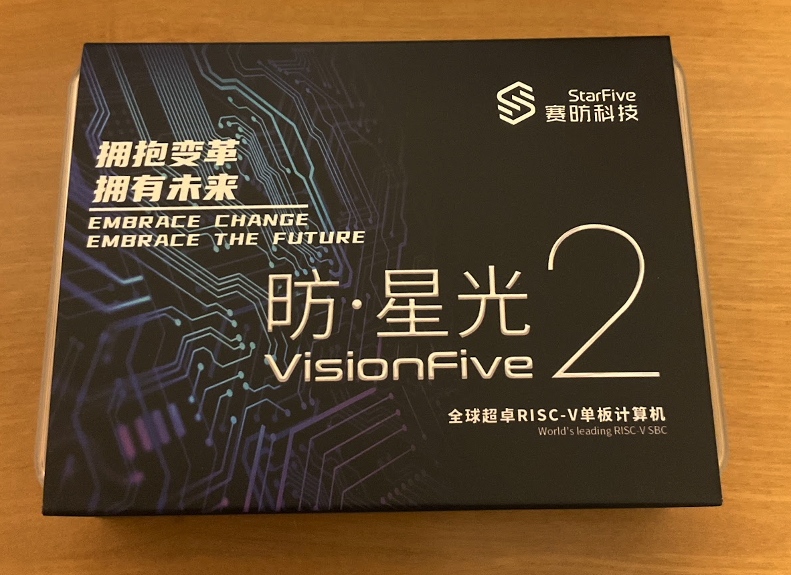

### 無賞品ビンゴ・新年の抱負くじ

> 新春ワクワク無賞品ビンゴ大会やるかーーー

謎にTwitter spaceでビンゴ大会を開いていました。ビンゴの勝者は おーみー さん、逆ビンゴの勝者は よーでん さんでした。賞品はありませんでした。

> 友人に抱負くじ見せたら「行きたいところには行け！食いたいものは食え！」と言われている。正しい

[新年の抱負くじ](https://lottery.uta8a.net/) を作りました。思ったより多くの人が予想を立ててくれて面白かった。

### 社会への心構え

> ツカモさんはやっぱ真面目に仕事やってて楽しそうな姿に説得力があるのが推しだな。仕事の環境が楽で楽しいとかでなく、仕事そのものに正面から取り組んでおられる雰囲気があり、説得力がある

結構ツカモさんの仕事に対する姿勢を感じ取っていたおかげで社会に対してポジティブ寄りになれていた気がします。

### Raycast

Raycastを利用開始。Raycastは今年使い始めたソフトウェアの中で間違いなく一番良かったものでした。以下は年末に分かるRaycast Recapの画像で、ウィンドウの縦1/3分割をraycastに任せているので、年間で5910回も使っていたみたいです。

### 音楽・アニメ

> ぼっち・ざ・ろっく！の影響でアジカンの曲色々聴いてみて、ブラックアウトがMV含めて好きだなと思った
> [ASIAN KUNG-FU GENERATION　『ブラックアウト』 - YouTube](https://www.youtube.com/watch?v=M1BLL-Zp6rE)

> 映画大好きポンポさん劇場版、dアニメで見た。非常に非常に良かった...最高の映像
> ポンポさん、原作が好きで劇場に行きたかったけどコロナ禍で諦めてから心残りだったのですが、今回見られて映像としての良さがフルに出ていてすごい良かったです

### お絵描き

> ぬくぬくにぎりめし先生のおさげちゃんの表情が豊かなことを知ったのでファンアート頑張って描いてみた
> もちもち感を出すのが難しいことがわかった

## **2月: 自作キーボード、真上bot**

### RustyKeys

> #rusty_keys 組み立て & ソフトウェアサンプル動かしてKOBA789出すまでできた〜

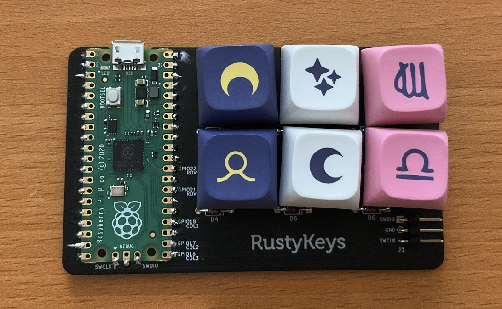

へいほぅさんの記事を参考にしつつ、公式ドキュメントを見て組み立てた。参考: [RustyKeys ビルドログ :: #a5ebec](https://blog.h3y6e.com/posts/rustykeys-buildlog/)

ブログ記事も書いた。 [RustyKeysのビルドログ](https://blog.uta8a.net/post/2023-02-09-rustykeys)

### 人のTwitterアイコンの真上を書く

> なんかもう卒論で疲れてるのでコバトン真上botで爆笑してる

卒論で疲れたので [コバトン真上bot](https://twitter.com/kobatonmauebot) を見ていたら、僕も描きたくなってきて描いていた。
これはいい気分転換になった。

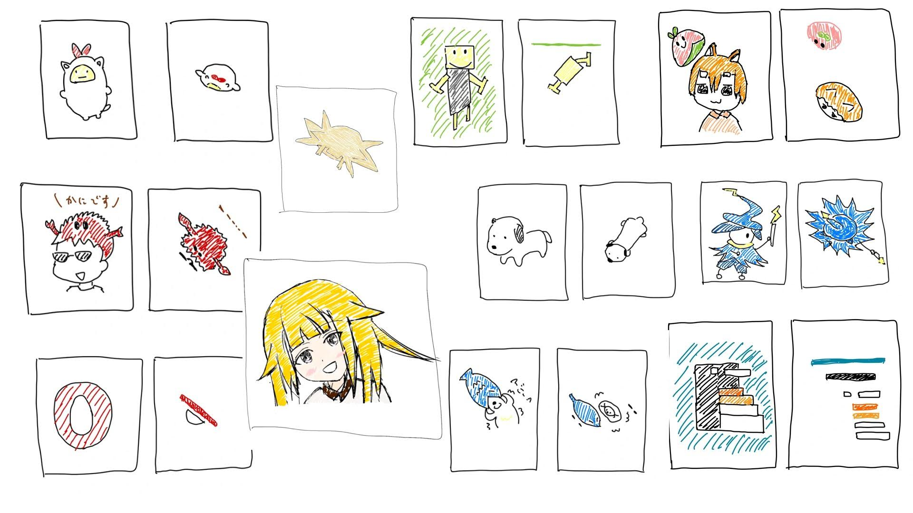

> 絵を一生懸命描くと、他人からどう見られるかとかとは独立に、自分がいいと思う像になるべく近づくよう努力した結果が出力されて下手くそでも謎の愛着が湧く

### Twitter botたちがAPI有料化の煽りを受ける

しゃくらたんがんばれ！botやたこ焼きbot(以前から停止)など僕がTwitterを始めた初期に楽しませてもらっていたbotたちが停止していって悲しかったです。

### 木札焼肉

友人と木札焼肉を食べた後に映画 すずめの戸締り を見ました。あとなんかアクセサリーみたいなのを見たりして楽しかったですね。いつもと違う感じがした。

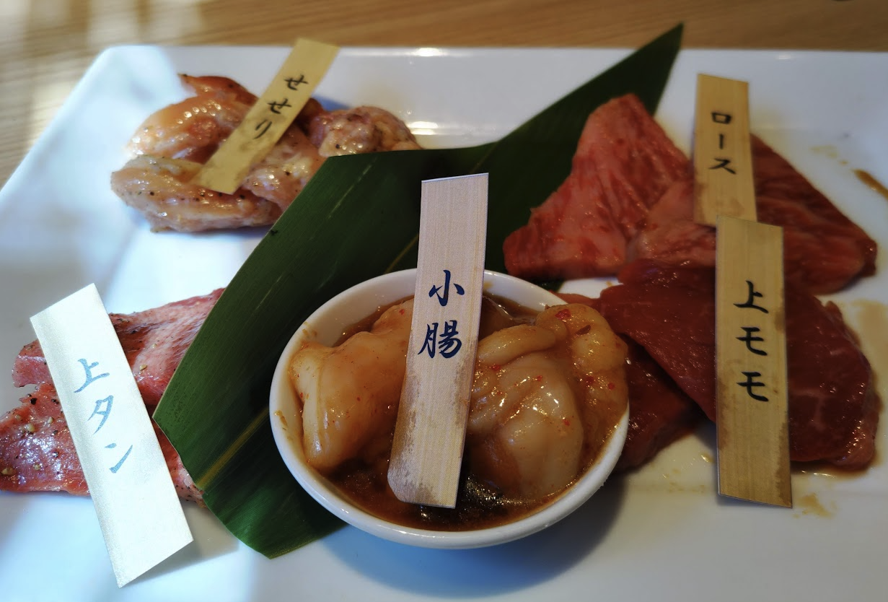

### その他

> 僕は人より4年遅れて生きてるから最近もつらいことあったのだけど、それでも挑戦すること、自分の好きなことに正直でいる気持ちで全部吹き飛ばせたらいいなと思ってすごい元気出た

これはかえでさんが [AtCoder株式会社に入社しました - 競プロ始めました-kaede2020-](https://kaede2020.hatenablog.com/entry/2023/02/01/190234) でAtCoderに入社したということを知った時の感想。やっぱり好きなことに正直でいたいと思わせてくれるいい記事でした。

> 儚さ←虹夏ちゃんの推しポイント

> 諸行無常のアンチは、僕の解釈では「みんな元気によろしくやってくれ。あと俺から見えるところで元気でいてくれると助かる。」になった。

## **3月: 免許、免許、免許**

### 年下のお姉さん概念

昔はあれほど年下のお姉さん概念が推したったのに、最近はそうでもなくなってしまった。
代わりに友人たちが家庭を持ったりしていきどんどん周りから人がいなくなる現実が迫ってくるようになり、少し厳しい現実を感じていた。
周りから人がいなくなるのは寂しいので今のうちに遊べる人とは遊んでおきたい。かといって遊べる対象を年下に求めて老害化するのも避けたい。結構このあたりは匙加減が難しいように感じるし、年下には基本的に声をかけづらいから同年代と思っている人、上の世代だと思っている人に積極的に声をかけていきたいという結論に落ち着いた。

### 思い出を大事にする

> 月の振り返り、進捗！進捗！だと面白くないから飯の写真とか音楽の写真とか、そういう楽しかったことも記載するようにしてみた
> 思い出を記載すると、次の月も楽しいことするぞ！という気持ちが湧いてくるため

振り返りを始めた。この後5月頃に会社の研修でスクラムについて学ぶ機会があり、そこでフレームワークを得たので改良された。でも一貫して「思い出を大事にする」というのはテーマとして持ち続けていて、それが力になった感触がある。

### 免許合宿に行く

> 免許合宿、噂に聞く通り確かにうるさかったり行儀の悪いグループやカップルの巣窟ではあるんだけど、そういう思い出はその時期にしか作れないよなあと思うと不快な気持ちにもならなくて、微笑ましいというのが素直な感想です

結構文化の違いを感じて面白かった。運転は難しかったです。
あと免許取れたのに全く運転できてないのでもったいない。今年旅行をして交通手段車なしの限界を感じたのもあり、来年は運転するぞという気持ち。

> 仙台に前来たとき利久行ったなと思い、ふらっと入った
牛タンに寿司をつけると贅沢すぎてなんか罪深そうな夕食になる 

> みれんくさんと牛タン食べて、無印良品や島村楽器やeイヤホンを巡っておもろかった

免許合宿の帰りにみれんくさんと会えたのはとても楽しかった。

### その他

> #もっと飯を食え喜多郁代 めっちゃ好きだから、 #しらす丼を食え伊地知虹夏 とかもこのノリで出て欲しい

> 虹夏ちゃん幸せになってくれーッ
> しらす丼いっぱい食べて、なんかこういい感じに夢を叶えてくれーッ

> 今年の目標、「去年BoothやAmazonで届いたグッズやディスクを神棚に置かずにちゃんと使おう！」かもしれん

無理でした。叶えられてません

> 社会人になったら旅行とか遊び企画したいな
> ようやく人を誘うことの大切さを理解して、かつ僕自身にも余裕が備わってきたので(ただし社会に出てこの余裕が残るかは分からず)

これは今年振り返ると結構誘ったりできたはず！

## **4月: 新社会人**

### 新社会人

> 新社会人TL、なんか安心するぜ(意識レベル的に)

新社会人になりました。TL見てるとみんな不安だったりやらかしたりしていていつも通りという感じで良かった。

> 僕がその身を社会に捧げると僕がなくなって潰れてしまって社会からもドロップアウトしてしまう。そのとき社会は俺を助けない。だから心にいつも自分を持っておかないとまずい。

社会に対する感想は今でもこれで、僕は心に自分を持っておきたいと思い続けています。

> 一日8時間を費やして、家に帰って趣味コードを書けるのはかなり超人ぽいことをかなり理解してきた。でも俺は超人になりたい。

結構余暇の時間があるのに元気はなくて厳しい思いをしていました。今もこれは思っています。気力と体力が大切。

> 僕の社会出荷前メモ眺めてたら「社会入りしても趣味進捗出すやつが本物。人生にうつつを抜かすやつはFAKE」と書いてあって、趣味進捗も人生もできずにTwitterと無駄な技術遊びしている僕に100ダメージ。

> 社会性とは、思いついたツイートを書いては消し、書いては消し、ついにはつぶやくことを諦めることである --- モーダ・メーダ(299 - 345)

### 初任給

> 初任給確認！踊り！踊り！踊り！

> ん？クレジットカードの引き落とし…？妙だな…

> クレカ額と、今月の出費と、入った額を比較して、無事マイナスだったので踊りをやめました

> 初任給出た人に奢ってもらう文化、学生のときはヒャッホウって感じだったけどその立場にいざなると現実が見える。こうして人は大人になってゆく。

またひとつ大人になった。

### MisskeyやMastodonの流れが始まる

> Camphor-鯖使ってみる

今は自鯖とわくわく鮟鱇ランド鯖を使用していますが、Camphor-鯖にお世話になったことで今年はTwitter以外のSNSも使うようになった年でした。

### その他

> ほんとにツイッタおすすめぼ喜多しか出てこなくなっちゃった…

> 音楽、去年より聞いてない(意識的に減らして他のことやつている)
> 最近はGigaとアメリカ民謡研究会とVeltpunchの曲をよく聞きます

> オールドレンズにいくらかけたかな〜って数年前計算して2桁万円いったとき流石に声出た

今年はレンズが5本は増えましたね。マジで金がない。

> ものすごい速度でいいねするオタク、もはやTwitterにおける光

> トゲの無いトゲピー、ピー ← これめちゃくちゃ好きすぎる

> 今年のテーマの「飯、早寝、気合」のうちの飯だな。いきなり人生進捗は無理だからまずは誰かと飯に行くところから頑張ろう。

実際これはがんばれたし楽しかった。taikifさんがノリ良くて一緒にご飯の予定を考えてくれたのとか助けられたな。

あとfishさんと下北沢一緒に回ったり、東京滞在中に色々な人と会えたのも楽しかった。

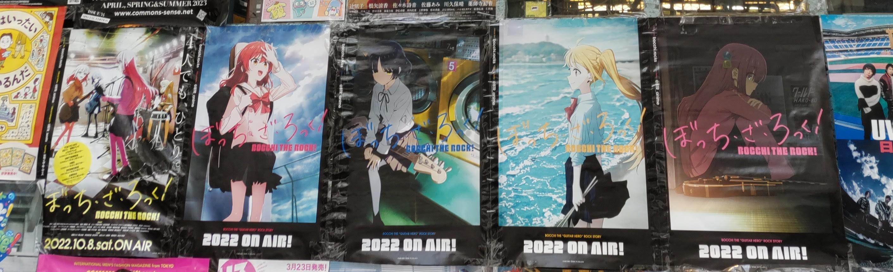

## **5月: 好きな音楽、好きなアニメ、母の日**

### 【 cover 】気になるあの娘 - 相対性理論 ｜somunia がマジで良い

[【 cover 】気になるあの娘 - 相対性理論 ｜somunia - YouTube](https://www.youtube.com/watch?v=7UjuRvU07E8) が本当に良い。ブログも書いた。 [\[感想\] 「somunia / 気になるあの娘 - 相対性理論」というcover曲がとても好き](https://blog.uta8a.net/diary/2023-05-01-love-somunia)
こうして好きなものを好きと言い続けたい。

> 諸行無常のアンチ的には、社会に出て学生ほど余暇を取れなくなろうとも好きなものにかける丁寧さを惜しみたくはないし好きなものは好きと言っていきたい

### アニメ

> 推しの子1話ようやく見た！最高につらくて面白い
> 僕 高橋李依さんのファンで、大層辛い

なんだかんだで今年もアニメを見ていました。

> ぼざろLIVE恒星配信チケット買った〜 楽しみ〜

恒星、作り手の熱い思いが伝わってきて良かったです。アニメに入れ込んだ後のbackstageを見ている感覚でした。

### 初任給イベント

母の日を初任給で親に恩返しイベントとしてスタバに行きました。5000円くらい使った気がする。母も父も喜んでいたので良かった。

5月に父の日イベントもやって、ちいかわの本を渡したりしました。

### その他

> 僕が引退したサークルで、Haskell勉強会が開かれるらしく、大量のHaskell本が購入されていて笑う

> 考え尽くしたし行動しながらでも考えられるから言語化をやめるべき時なのかも

考えすぎてしまう癖があるので、行動によって思考の幅を広げたり手札を広げる探索フェーズにもっと時間をかけたいと今でも思っています。

> ツイッター楽しいけど、僕に本当に必要なものはSNSとYoutubeを断って一人で黙々と進捗を生み出したりぼんやりしたりする時間、友人と通話をしたりご飯に行く時間だということが分かってきている。でもそれじゃ寂しいじゃん

今でもインターネットから消えることに対する悲しみ、寂しさを感じてはいるけど同時に友人とオフラインで会ったり通話したりした方がSNSよりも健康的なのは事実で、来年は比重を変えたいと思っています。

> "an infinite iterator has no upper bound" めっちゃかっこいい。しばらく座右の銘にしてます。
> [Iterator in std::iter - Rust](https://doc.rust-lang.org/std/iter/trait.Iterator.html#method.size_hint)

> 北海道勢のMOOちゃんかわいいのですき、欲しい

まだ手に入れていません。

> 周りのオタク、なんか休日パソコンしかしたことないですという雰囲気を出しながら実は健康的に水泳とか登山してるので僕も運動しよ〜と思っていて、流石にします

運動もしていません。

> 色々な人: 「星座になれたら」と言いながら第二宇宙速度で地球を飛び出し衛星軌道に入る人

> 人の影響を受けて、誠実に、誠実にbotになってしまった
> やれることを誠実にやっていくしかねえ

> お医者さんに「疲れてると感じるときは休んだほうがええ」と言われてそれもそうだなと思ったので、慣れるまで人生や趣味進捗はしばらく諦めます

vs社会は結構9月くらいまで続いていました。やっぱり環境の変化に弱いので慣れるまでが大変。

> えっ！一月でキーキャップを3セット、キーボードを2つ、デスクマットを2個買う人がいるんですか！？
> 腕は二本しかないのに？？

キーボードは自作含めて今年で6個増えました。マジで場所も取るし辞めたいんだけどEndgameがまだ来てくれない。

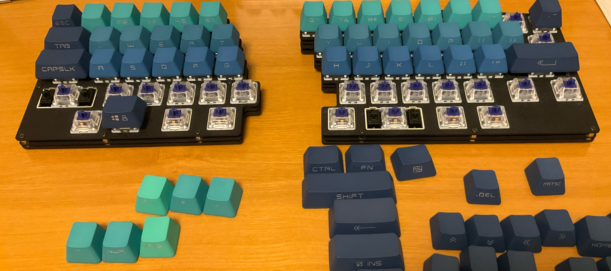

## **6月: 技術、福岡**

### M5Paperに触れる

M5Paperでtogglが回っているかどうかを表示するやつを作りました。結構長く愛用してて、togglのタイマー止め忘れが防げて良かったです。最近はtogglを使うのからちょっと離れているので今は使っていません。
この過程でIoT周りいいなと思ったり、ハッカソンの景品のM5Paperがようやく活かせたりして良い気持ちでした。

### logseq触った

> logseqちょいちょい触ってた

以下のような感想を持ちました。

- Outlineモード強制は下書きを雑に突っ込むのに向いてそう。scrapboxで箇条書きでなんでも書く人はすぐに慣れそう
- excalidraw入っているの良い
- 箇条書きの点をクリックするとそこ起点のページができるのが良い。一個のファイルにガーッと書いて1ページとして、そこ起点に切り出しを行えると良い。

### Rust std読み会

> ブログ書いた。Rustのコンパイラをビルドしたり、is_numericの裏にUnicodeの文字から文字への変換テーブルがあるのを眺めたりしました。
> [Rust std読み会 char編 2](https://blog.uta8a.net/post/2023-06-04-rust-std-reading-char-2)

Rust std読み会をikanagoさんと2人で始めていました。これは結局長くは続かなくて、形を変えて週一回の雑談として続いています。この雑談からkaitocampが生まれたり美容院へ行くが生まれたので起点としてすごい良かった。

それはそれとしてRustの勉強が今年はそんなにできなかったので来年はもっとbetしていきたい。

### 飯

> keigomichiさんとビュッフェ行ってきた〜🤞

> 今日学んだ単語
> 「プロシェット」：串焼きをカッコよく表現した単語
> 「パンナコッタ」：杏仁豆腐をカッコよく表現した単語

keigoさんとビュッフェ行ってきたの楽しかったですね。最近やっている技術の話とか興味を聞けて良かった。

> 舞茸の出汁、馬出

PHPカンファレンス福岡に行くために福岡にやってきた。カンファレンス前日に福岡入りして仕事して、夜に配属希望先の人とご飯を食べていた。

PHPカンファレンスは友人と2人で回ったのだけど、かなり楽しかった...
オフラインイベントの熱気と、福岡の美味い飯ですごいいい思い出です。

> 博多南を新幹線の駅だと知らずに宿を取り、博多から博多南までの間新幹線に乗って宿へ赴きます
> でも330円で新幹線に乗れるのはアドという話もある

でも博多南は罠すぎた。

翌日は焼肉をしたり、友人2人と高いタルトを食べたりとかなり満喫しました。

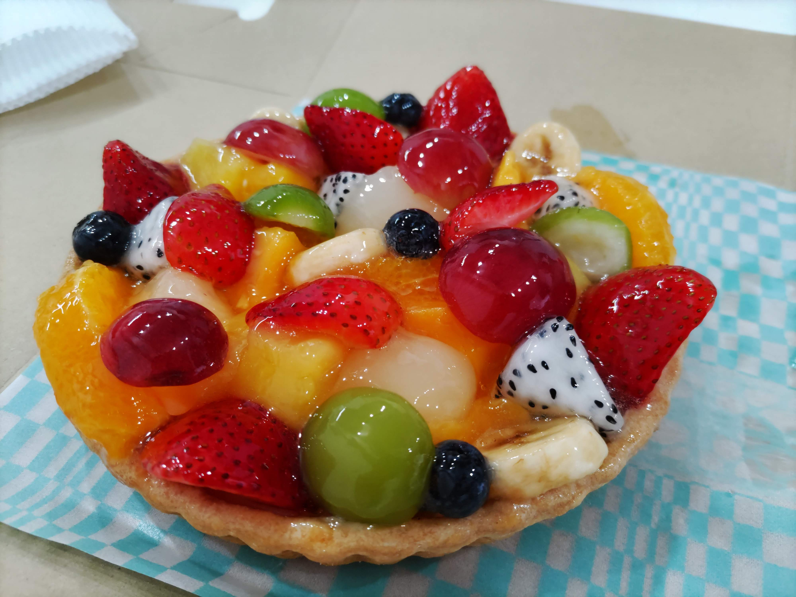

### 社会との向き合い方に葛藤

> 最近外で何を発言しても社会に紐付くので慎重になって、内側に淀みが溜まってくるのを感じます。
> 考えたことを真っ当に議論したい気持ちがあるが、これは単に消化したいだけなのかもしれなくて、よく分からないまま淀みが溜まる。

自分が思っていることを人に共有する形で吐き出すことで気持ちが保たれるという特性と、社会に出ると色々外部に話せないことが増えるという環境の相性が悪く苦しんでいました。会社に場を作ることと、適当に気晴らしをするためにIQ3の会話を人とする機会を作ることが大切だと思っています。

### その他

> 星見、オタクから好かれがち、謎の思いを託されがち

> 全部天気のせいでオーケー

> アンリミテッドルールブック
> 僕はキメ顔でいいねした

> 読んだ。南場さんの言葉やっぱり選び方が素敵だと感じる。
> あとAtCoderとかAJLの広告？後ろにあってウオオ！頑張れ〜〜！という気持ちになった。
> [pdf: 南場さんの情報オリンピックへの寄稿](https://www2.ioi-jp.org/documents/newsletter/NewsletterNo34.pdf)

南場さんの言葉は丁寧に選ばれている感じがして好きです。不恰好経営も読んでいます。

> この前通話したとき思ったが、中退したりうまく行かなかったりすることが誰かにとっての救いや助けになるし、そう信じることが自分にとって生き延びる力になるので、全てうまくいくとは思わないけど生き延びることだなと感じた

通話した時にでっていうさん(eyemonoさん)にkaitoさんのブログ読んでますという話をされて、これはとっても嬉しかったです。ここでもしかして雑に誘ってもいいな？と思いeyemonoさんをThePixelStreetを一緒に観にいくのに誘うきっかけになりました。

> コード進行少し勉強？したので作ってみた

Deno KV Hackathonに出ようとしてコード進行勉強したけど完成せずに終わってしまった
クリエイティブ系のプロダクト作るの昔からやってみたいことの一つだな〜、おそらく原点がCSS Animationにあるのでずっと憧れがある。

> ナイトルーティーン、マジで良い曲だ…
> まだこの世の中には僕が知らない曲がたくさんあって、僕はそれを聞いて好きになるだろうから今すぐ聞きにいかなくちゃと思える

この辺からナイトルーティーンを聴き始めて、Spotifyで今年一番聴いた曲になりました。

> 改善は破壊ではなくリスペクト、全てを覚えて備えて誠実に積み上げる、は大事にしたいな

色々よくしたいと思う時にはまず築き上げた先人へのリスペクトを忘れずに。

> 「Twitterをやめよう」ではなくて、「Twitterより楽しいことがあるので結果的にTwitterを触らない時間が増える」方が建設的みたいなやつか

## **7月: 人に会えるようになった・劇場で見る映画は受け取る感情が一味違う**

### 東京でたくさん人に会う

研修で東京に滞在している間、たくさんの人に声をかけてたくさんの人とご飯を食べました。毎晩金を使っていた気がします。
でもここがお金の使い所としては正解でした。会う友人は学生のことも多く、こちらが奢ることも多かったですが全く後悔がなくて正確にお金を使うべき時を判断できたなと思います。
学生の頃よりも人と飯を食いやすくなったなと思う要因の一つに、お金によって生まれた心の余裕があります。なんだかんだで社会に出る前は一生稼げず人生を終えるものだと思っていたので、色々な遠慮をしていたり踏み込めなかったり、その時は気づかなかったけど暗黙のうちにお金に縛られている感覚がありました。でもお金を稼ぐようになって、「この店に行きたい！」と思った店にそんなに制限をかけずに行けるようになったので、昔のように外食は上限1000円だなあとか考えることも減りました。一人の時は節約する傾向があるけど、あまり会わない人のせっかくの機会は惜しみなく使い切ります。
ただ学生の頃は奢ってもらうことも申し訳なく感じていて、そういう感情を向こうに持たせていたら申し訳ないなとも思っています。このあたりは関係性もありそうなので、僕にはコントロールできない範囲ではあるけれど。

> オタクと飯を食い、今年の抱負ポイント96ptを獲得

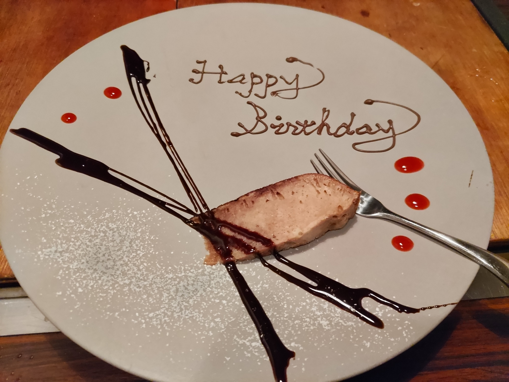

あと岩倉しおりさんという、とっても好きな写真家の個展に行けたのも嬉しかったです。

### Twitter障害

> ぼ喜多！！！！！！！！！！！！！ぼ喜多！！！！！！

> 虹夏ちゃんの！！！！！ドリトス！！！！！

> 友人に通話で恥ずかしいツイートを音読されても止まることなく己のツイートを行う、それがノーガード・インターネットじゃ

Twitter障害でのツイートをikanagoさんに音読されていました。そのうち黒歴史になる、もはや黒歴史かもしれない己の行動を人は思い出と呼ぶ。

> 俺もコンテンツになる勢いで人生したいな

### 映画を劇場で見て受け取った感情

> 時をかける少女を見てきました、マジで最高で劇場っていいですねの気持ちに

> ガーネットをピアノで弾けるようにする...！その発想があったか
> 僕もやるか

時をかける少女、元々好きな映画だったのでリバイバル上映で観れたのはとてもよかったです。
なんだか夏だなって思いました。この夏の輝きを今の自分は持っていなくて、それでも羨ましいとは思わなくて、今の自分に足りない進む力みたいなものを受け渡された気持ちになりました。

> 書きました。僕はこの映画が好きで、この映画に生かされているという話です。
> [サマーウォーズという映画に感謝している](https://blog.uta8a.net/diary/2023-07-30-summer-wars)

サマーウォーズについてはブログも書きました。僕にとって人生のターニングポイントに出会った大切な作品です。

### その他

> ギター始めたのですが、むずくて心折れそう
> おすすめのyoutubeチャンネルとかアプリあったら知りたいな
> 今のところ かずきのギターチャンネル みてテンション上げてます

ギターをしばらく練習しましたが最近はパソコンへのモチベが高くてやっていない...

> tokizoさんと通話したぜ
> 2019年頃からSNSをしているのでその頃に知っていた人とはかなり長い縁になり、そういうのは大事にしたいし達者でいてほしいという気持ちになった

結構今年は2019年頃からの友人と話をする機会があって、諸行無常のアンチという感じでかなり嬉しかったです。

> 三文字で今の気持ちを表明！
> ぼ喜多
> せいざ

> ポケモン睡眠始めた
> ユーザ名雑に入れたらNixOSになっちゃった

ポケモンスリープも結構転機でした。一瞬でゲーム要素がいらないなと思ってやめたのですが、代わりにスマートウォッチを買って睡眠時間と歩数を計測するようになりました。これは振り返りにも組み込まれていて、健康かどうかを把握するのに役立っています。

> 色々な杯
> ・ウーロンハイ
> ・天皇杯
> ・Spotify

> CV をとは のCevio AI出るの予想外すぎてビビってる

> INTERNET YAMERO ←→ 人生開始

> たまに聴いては朝焼けが広がるような寂しさのあるいい音楽だなと思う
> [どうか貴方は感情を汚さないで。 / 結月姉妹 - YouTube](https://www.youtube.com/watch?v=5fQGfk1LdQo)

アメリカ民謡研究会の音楽は3月の免許合宿の時からハマっていて、ずっと継続的に聴いています。

## **8月: 夏は人混みに行くべきではない・趣味進捗を出したい**

### 旅の教訓: 夏は外に出ない、家に引きこもるか、涼しい方の田舎に行こう

友人とBBQと、奈良に行ってかき氷を食うをしました。結論から行くとBBQは人里離れた涼しい高原だったのでとってもよくて、奈良と大阪は人混みがすごくて改めて非常に厳しい環境でした。
熱中症にもなったので本当に気をつけたい。

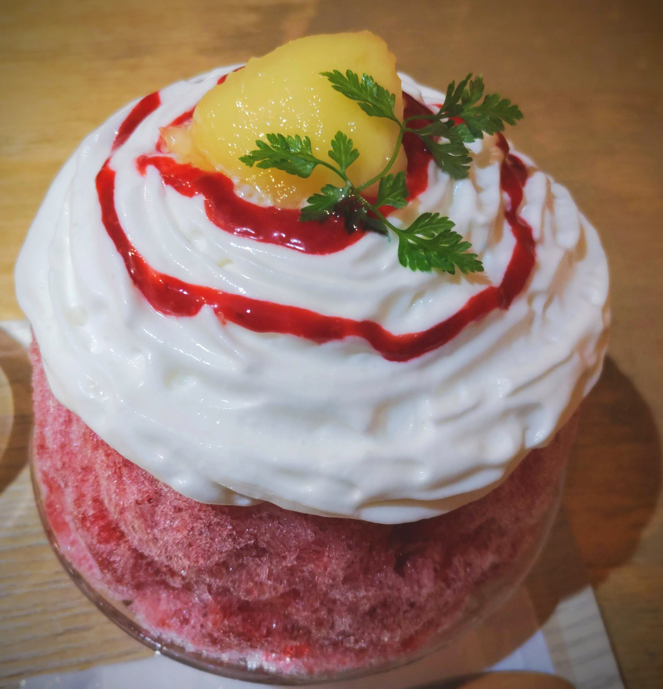

あと久々に親友と飯を食べました。そこから写真を撮りに行ったり隔週でオンラインで会話をするきっかけになったので、めっちゃいい手を打ったなと思っています。

親友と行ったサイゼ。別にこれ自体はなんともないけれど、久々に会えたのが嬉しくて思い出ですね。

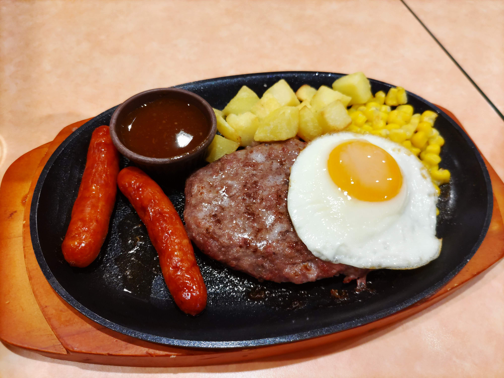

### traPのコンテンツ、プライスレス

traP大好き人間なのでNeoShowcaseすごいな記事を書いてました。[\[感想\] NeoShowcaseすごい](https://blog.uta8a.net/diary/2023-08-11-ns-sugoi)

あとは昔のtraP LTのhukudaさん回を見返して、社会人になった今改めて色々考えることがあり、刺さることがあるという感じでした。特に環境については本当に恵まれているなと思っています。

> 今年残り5ヶ月だし2022年振り返りもう一度見直そう
> →traPLTのhukudaさんの社会人における趣味進捗もう一度見るか
> →ウオオオオオ(刺さり)
> になっている

> traP LTのhukudaさん回、今日なにかやった感を仕事で出しちゃうと趣味進捗はええかとなる、もわかりが深いけど周りの環境は大事だなとも思った。幸い僕は恵まれているので自身も趣味進捗出さねばという気持ちが生えているけど、そうじゃない環境だともっとアレだったかも

### その他

> 一緒に美味しいもの食べたり国内レンタカー旅行する人って表現いいな
> 僕もそういう人を見つけたいな

外に出ていくと、人生を豊かにする気力が生まれます。疲れはするんだけど、どうせ家にいて寝てても疲れるので外に適度に出た方がいい。
ただ夏はマジで人混みに行かない方がいい。

> 今の所、スプラトゥーンと桃鉄とスマブラとリングフィットに興味がある

結局Nintendo Switchを秋頃に買いました。桃鉄だけやっているが一人でゲームをしないので人を誘う必要がある。

> いかなごさん「A地点と、BとC結ぶと... 星座やん」
> kaito「3点結べばなんでも星座じゃない？」

> ぼ喜多！(起床の挨拶)

> 寝るか！と言いながら寝れないものなーんだ！
> →おれ！

あまり寝ていませんでした。これは9月くらいに解消された気がします。

> ぼざろ6巻ありがとう...

> インターンに行った2年後に、その会社に入り同じチームでインターン受け入れ側をしてるのシャボンディ諸島すぎる

インターン生の受け入れをしていました。感慨深いものがありますね。やっぱり学生の方は優秀なので僕も負けないように頑張ろうと思えて、インターン期間は結構好きです。

## **9月: 8年に渡る写真のスランプを脱する・PIXIV MEETUPで気持ちを受け取る**

### 俺はまだ写真全盛期を迎えられる

> 写真撮るの、高校の時がピークで一生超えられないと思ってたんですが週末に超えられそうな写真が2枚取れたので今後も精進しようという気持ちになった

友人と鞆の浦に行った時に撮った写真がマジで今年の最高写真でした。ここでずーっと高校を卒業して8年ほど「俺って全盛期は高校生の頃だったなあ...」と思っていたぐるぐるとした気持ちを解消できて、この後も調子が良くなって写真を撮るたびに楽しくなって実際いい写真が撮れるようになっていきました。

まだまだ写真をたくさん撮るし、もっともっといい写真が撮れる。そういう確信を持ち続けることが希望で、その希望を持つターニングポイントが9月でした。

### PIXIV MEETUP

Pixiv Meetupめっちゃ良かったです。招待していただけてありがたかった。

詳しくは [PIXIV MEETUP 2023 に行ってきたよ](https://blog.uta8a.net/diary/2023-10-01-pixivmeetup) に書きました。

やっぱChatRoid, AI技術を使ってキャラクターに命を吹き込むのに痺れました。クリエイティブと関わる人ってすごい、と改めて思うと同時に、僕もクリエイティブに関わる技術領域触りたいな〜という気持ちにもなりました。人の可能性を広げる取り組みが好き。

僕も僕で仕事を頑張るぞという気持ちを受け取りました。このイベントは本当に元気をもらえた気がします。

### その他

> Adomiori Remix マジでいい曲が多い

Adomioriさんの曲は本当にいい曲が多くて、remix好きにおすすめ。

> 俺はキーボードマニア 今欲しいものは腕

スマートウォッチを購入したので俺もナウいヘルシープログラマってやつになるぜ

> 開発を駆動するもの、開発かもしれん

外に出ることもそうだけど、あるハードルを感じるならばそのハードルの先にある行動を取ることでハードルを下げて次の行動が取りやすくなるので、フットワークが軽いことは大事だと感じた一年でした。

> イタリアンで注文する狗巻棘くん「ホ゛ン゛コ゛レ゛ヒ゛ア゛ン゛コ゛！」

> 労働時間無下限術式によって労働時間をゼロにして、その重みをエネルギーに変換しバカンスを謳歌するッ

> 若いうちに美味しいものをたくさん食べると良いから強めのラーメンを今のうちに食べておきたい...

> やっぱ初心忘れず、同じ被写体を違う画角で100枚撮る覚悟をライトに持たねば

> しぐれうい、好きすぎて狂うので避けていたのだけど、久々に見たらやっぱり良かった

しぐれうい、声が最強です。

> 広島で食べたラーメン(塩)の中では群を抜いて一番美味かった 

塩そば まえだ という三原のお店のラーメンは頭ひとつ抜けて本当に美味しいです。平日でも行列らしいので行くときは色々調べましょう。(駐車場も小さい)

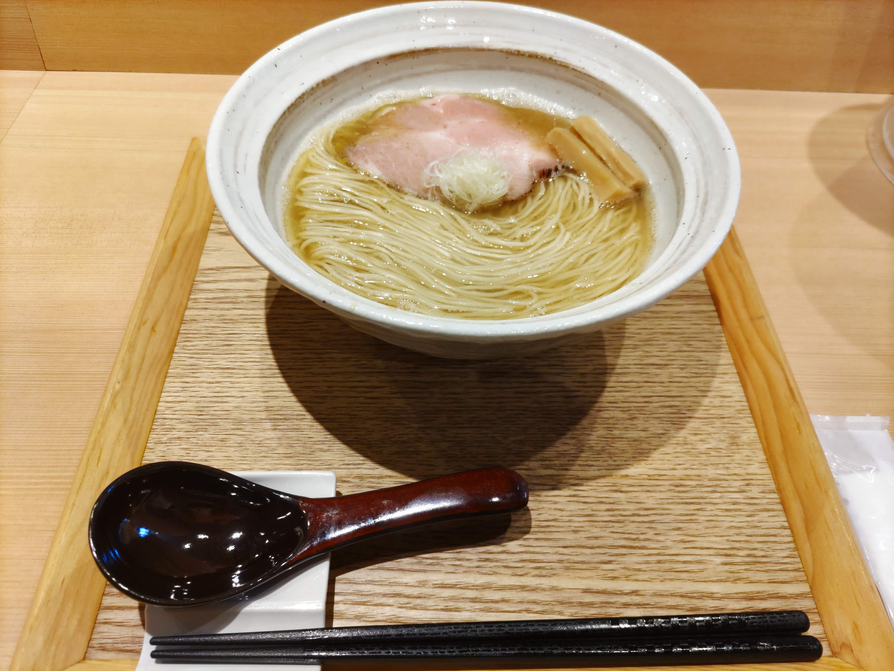

> 信じるものはsquirrel

## **10月: kaitocamp・人生の真理はゆるゆり・ThePixelStreet**

### 友人と旅行に行くことは楽しい

> 北陸郁代 #kaitocamp

富山に僕・ikanago・塚本の3人で行きました。

> 万物の秋
> 秋にないものの方が少ない
> #kaitocamp

> 〜ゆるゆり健康法〜
> 1.有給を取る
> 2.昼寝をする
> 3.ゆるゆりを見る
> 〜これで君も健康〜

> 人生の真理はゆるゆりの可能性が高くて、

> 「はいお疲れ」 #kaitocamp

> やっぱサンハイってことよ #kaitocamp

おおまかに言うと、ゆるゆりと海鮮丼と伏黒甚爾でした。

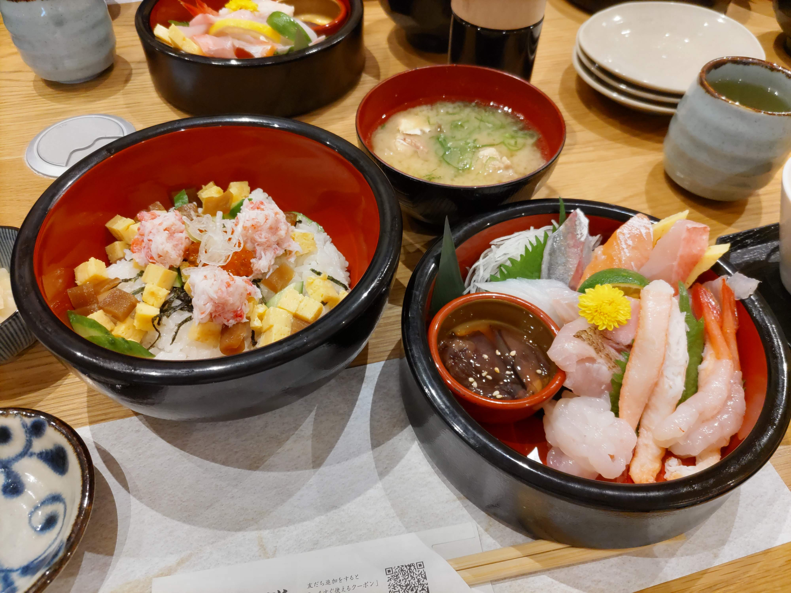

> ストリートピアノ空いたのでikanagoさんとちょっと弾いた #kaitocamp

ストリートピアノを弾くと、練習モチベが上がってとても良い。

### ThePixelStreet

友人のしろねぎさんが出展していたのでeyemonoさんを誘って行きました。マジでこのためだけに東京に行ったの今考えても時間の使い方が贅沢すぎる。でもしろねぎさんが元気そうで、色々グッズも買えて、さらに作り手の情熱というか、オフラインイベント特有の活気からもらえる創作への意欲の高まりが最高でした。
この感情を絶やさないように楽しいことがしたいですね。いっぱい楽しいことがしたい。

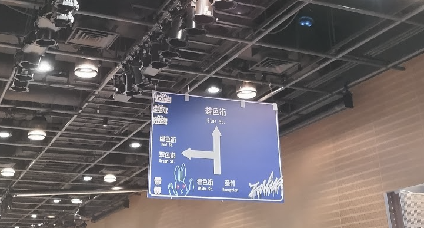

そのあと京都に移動してLTをしました。結構攻めた日程だったけど健康に無事にこなせて良かった。

### その他

> アアアアアアア！！！！
> フラグタイムを！！！！！観ました！！！！！

フラグタイムで発狂していました。ブログも書いた。 [アニメ感想文: フラグタイム](https://blog.uta8a.net/diary/2023-10-03-fragtime)

> 神は「状態あれ」と言った。すると状態管理ライブラリが無数にできた。

> ウォッチパーティーで夏トンと呪術廻戦を観てターンエンド

塚本と夏トンを観ました。2人とも初見ではなく、ワイワイ応援上映的に見るのは楽しかったですね。

> フリーレン見てないのまじ？みたいな感じだったので僕もまじ？と思っていて、みようと思いました

ウォッチパーティーで「え？kaitoさんフリーレン見てないんすか？」と言われたので見ることにしました。

> kaitoさんフリーレン好きそうなのに見てないのマジ？と言っていた友人の解像度が高くて、観てみたらその通りで僕はフリーレン大好きになった

フリーレン大好きです。

あと初めて美容院に行きました。とってもテンションが上がって身だしなみモチベが上がるので良い。年末で行けてないので来年また行きます。髪結構伸びちゃったな。

## **11月: 精神的な落ち込み・ISUCON**

### アニメ・音楽でまた救われる

> リゼロを11話まで観てかなり心が落ち着いてきた

> [【ボカデュオ2023】Repultion【team Ammobium】 - YouTube](https://www.youtube.com/watch?v=so7OdyTpGWs)
TentaQle楽曲提供

> [ちっちゃな私／重音テトSV - ニコニコ動画](https://www.nicovideo.jp/watch/sm42595400)
> でかい 空

> 何度か目にすることのあったバンバードって曲初めて聴いてみた。めっちゃ俺冒険しとる！みたいな気分になってすごい。

季節の変わり目もあって精神的に落ち込みに苦しめられていました。仕事もあまりうまく行かなかったように思います。
こういう時はコンテンツに頼って現実を忘れると良いです。大抵は自分がどうしようもない問題に囚われていることが多いので、まず現実逃避をして自分の状況を客観的に把握できるようにします。把握できると視野も広がってネガティブループからは抜け出せます。そこからは改善を回すか、気力を充填するか... いずれにせよコンテンツのおかげで生かされています。

### ISUCONで初めてまともに改善っぽいものを出せた

[ISUCON13に出た](https://blog.uta8a.net/post/2023-11-25-isucon13f)
ブログにも書いたのですが、ISUCONにはこれまで3回参加して4回目にして初めて改善っぽいものを入れることができました。といってもメンバーのSQL力にほとんど助けられていましたが...
でも純粋な実力不足で悔しいと思えているのでとっても気分は晴れやかで、その後も勉強をのんびり続けています。最近だと計測に絞って、pproteinの使い方を調べてサーバで動かしていました。

### その他

> 列車は必ず次の駅へ行くが、なんか次の駅が元の駅だったりもする

オタク、いつも同じコンテンツを周回してる

> しずかなインターネットのデザインに感動していました。サービスから哲学や指向性を感じる。

> マリオカート初見で友人と対戦して一度だけ1位取れて嬉しいです、最高のゲーム

Switchを買って遊んでいる様子

> This Week in Rust読み会が続いてていい感じです
> 詳しくなりたいというモチベが生えている

Rustに今年全額betしたかったけど結局できなかったな〜

> 昨日友人とお互い撮ってきた写真を見せ合う会をしたんだけど、僕の写真に対する言葉にできなかったスタンスが言葉になってめっちゃモチベも上がって収穫だった

僕は写真の中でも「一瞬を切り取る」ことを好みとしているみたいです。

> 「おじいちゃん、またぼざろ見てるの！去年のアニメでしょ一年間も見続けて...！」状態になってる

> 就職とかいうのできないと思ってたし社会に出れないと思ってたからね、今年は本当によく頑張ったよ

本当によく頑張ったと思います。

> 結束バンドの音楽に心からの感謝を。今年は「転がる岩、君に朝が降る」をずっと聴いていました。#Spotifyまとめ

## **12月: 自作キーボード・爆速開発**

### 自作キーボードイベントで熱を高める

> 自作キーボードイベントに行って、自作キーボード熱が高まる

以下は持っている自作キーボードまとめです。
特に Momoka shark switchとOEM Gradient Engraved Series Blue keycapとMOMOKA Mondrian keycap はお気に入り

今はkeyball44が欲しいです。どちらかというと組み立てをする時間の捻出が大変。

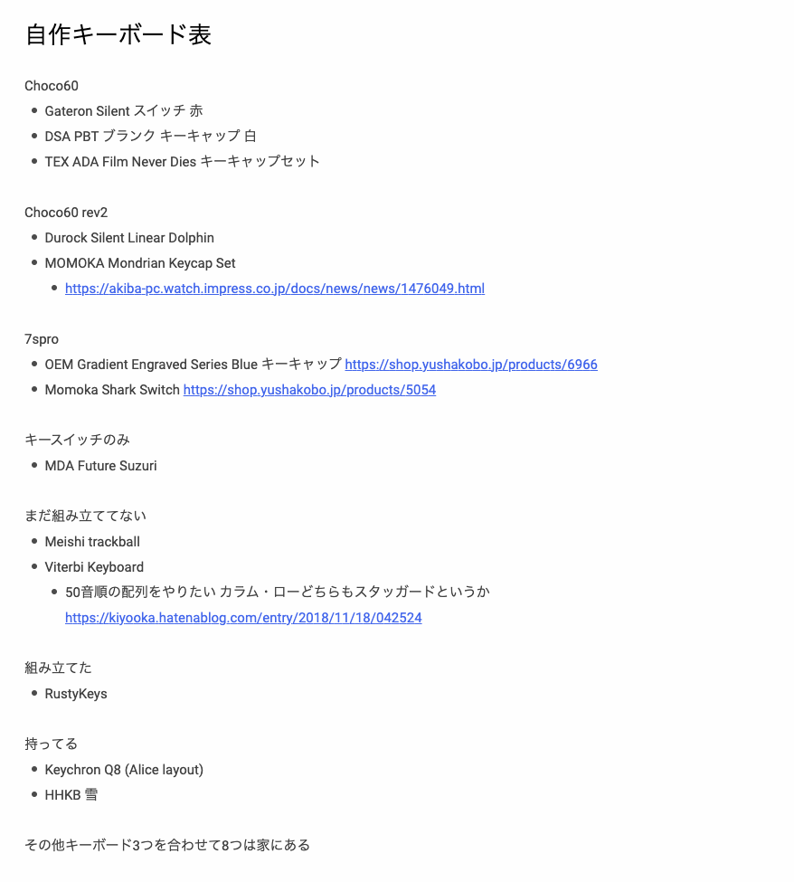

### アニメを見る・1yMusicLT

> 俺もフェルンと踊りたい以外の感情を失う

結局アニメを見ていました。呪術廻戦でつらくなってフリーレンとSPY×FAMILYを見て回復しました。
なんだかんだでアニメを視聴継続できているくらいには仕事に慣れてきたということかもしれません。

あと1yMusicLTという、5人でdiscordサーバに集まって好きな音楽のオタク語りLTをするイベントをしていました。めちゃくちゃ楽しかったです。やっぱり好きなものを語って、人の好きなものを語る様子を聴いて、俺もそれ好き！とかこれ知らなかったけど好き！とか言うのって最高です。

あとtaskさんがSECCONと被ってて来れないの悲しいと思ってたらブログ書いてくれたのでこれはこれで嬉しい。 [2023年に出会って良かったと思える曲5選 - note](https://blog.task4233.dev/posts/review-music-2023/)

### 開発とか

Google DomainsからCloudflare Domainsへ移行しました。その過程で自鯖を破壊してしまって、もうこれ作り直しではというところまで来たのですが無事に復旧できました。
参考: [ポストモーテム: 自鯖の障害振り返り (2023/12/19)](https://blog.uta8a.net/post/2023-12-19-postmortem-of-my-mstdn)

あとクリスマスぐらいから友人に「フロントエンド書いてくれへん？」と言われて真に受けてしまってゴリゴリ書いていました。フロントエンドとかいうのマジで書いてないのでカスのコードなのですが、動いたし間に合わせたしでかなりいい体験でした。ありがとう。

### その他

> ninzinさんという方のRADWIMPS coverが好き

> 物理ポモドーロタイマーが気に入っている

> 「生産性向上とはなにか？」という話に友人となって、僕は変わらず「やりたいことがある人がやりたいことができるようにするのが生産性向上だ」という考えを今でも持ってることがわかって良かった

> [Aiobahn feat. ナナヲアカリ - しあわせになんてならないで (Official Music Video) - YouTube](https://www.youtube.com/watch?v=yfrBPWDTCpE)

# まとめ

長くなったけど自分が来年見返して大事な感情を思い出すために書いているのでこれで十分かなと思います。

来年頑張りたいことはいくつかあるんですが、最近は頑張ることを目標にすることよりも改善サイクルを回せる環境を整えることの方が自分にとって大事だと思っています。なので、振り返りを続けて軌道修正をし続けることを目標にしようと思います。

- 2024年のキャッチコピー「歩く・寝る・行動・改善」
  - 歩数を計測しているのでたくさん歩いて健康を目指します。
  - 睡眠時間も大事にしたいです。最初の2つは健康要素ですね。
  - 行動は好きなものやなりたい像を目指して手を動かすことを指しています。
  - 改善は振り返りを続けることを指しています。
