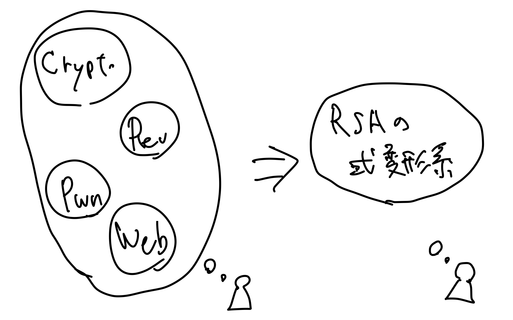
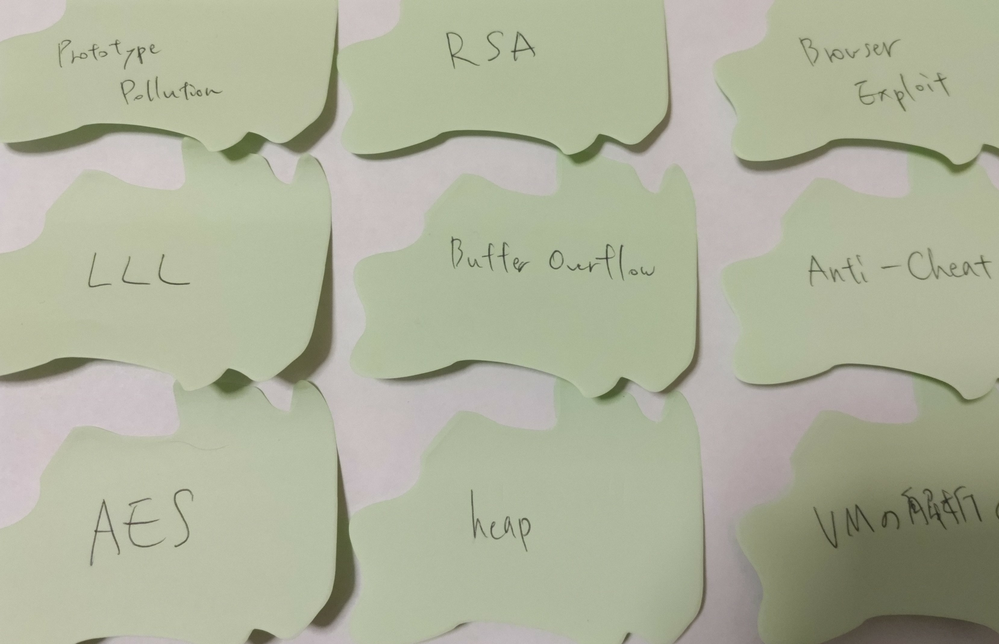

<!-- titleは自動で入る -->
[エンジニアの知的生産術 ――効率的に学び、整理し、アウトプットする \| Gihyo Digital Publishing](https://gihyo.jp/dp/ebook/2018/978-4-7741-9877-4) を読みました。様々な知識獲得のための方法、そもそも知識を得るとはInputするようなものなのか？(実は単なるデータの取り込みが知識獲得を指すわけではない)など、これまでどうやったら効率よく知識を得られるだろうかと考えたことのある人なら、自分の体験と照らし合わせて納得しながら読めるような本でした。

実際に書籍を見たら抽象的な内容については学べると思うので、ここでは実際に僕が読みながら考えていたことを書きます。CTFが例に出てきますが、本書ではCTFについては一ミリも触れていません。僕の思考過程で具体的な例として考えたかったので出しています。

# 本を読む前

この本を読む前に、個人的に「タスク管理はうまく回るようになってきたから短期的なタスクを忘れることなくこなせるようになれた。でも長期的なタスクを実現できないな...」という悩みを抱えていました。そのため以下の3つのトピックを想像しながら読んでいました。

- 仕事どうやったらうまくなるかなあ
- CTF、やりたいけど全体像よく分かんないしやった方がいいことが無限にあってやる気出ないんだよな〜
- 技術書典に本を出してみたいけどまだ動けてないな〜

今回はこのうち、2つ目のCTFについて考えていたことを書きます。

---

関係ないのですが、gihyoのPDFはAppleのbookだとしおりとかペンで書き入れる時に「所有者のパスワードを入力しないと、この書類を保存するための権限がありません。」というエラーが出ます。公式にはAdobe Acrobat Readerで開くように書いてあるのですが、[書類のロック解除　所有者のパスワード - Apple コミュニティ](https://discussionsjapan.apple.com/thread/250669702?sortBy=best)を参考にしてPDFを保存し直すとうまくペンで描けるようになります。ただし、目次は消える。

# まず頭の中にあるものを書き出そう

CTFでもっと問題が解けるようになりたいなあ、と思っていたので、どうなりたいかを考えます。

- CTFの全ジャンルが解けるような体系的な知識が欲しいなあ
- 暗号で1桁solveの問題解けたらカッコいいよなあ
- オンサイトCTF行ってみたいなあ
- 作問して、一人CTFを開催してみたいなあ

色々出てきます。そしたら、その目標設定を評価します。

# 気持ち段階を評価して目標に変換する

観点は以下になります。

- 具体的か
- 計測可能か
- 誰がやるのか
- 現実的か
- 結果が出るまでどのくらい時間がかかるか

ぼんやりとした気持ちを具体的に落とし込んでみます。
例えば、「CTFの全ジャンルが解けるような体系的な知識が欲しいなあ」は、体系的が何を指すのか不明瞭です。ちょっと考えると時代によってCTFの問題を解くための知識は激しく追加されたり入れ替わっていくので普遍の知識を手に入れたら急に問題が解けるようになるみたいなモデルはあまり正しそうにありません。ここは具体的に一つ絞ってみて、そこから広げていくのが良さそうに見えます。

例えば、「RSAの式変形系の問題を3つ探してwriteupを読む」とかなら「体系的な知識を得る」よりはステップが具体的です。

こうしていくつか書き出そうとすると、「やるべきこと」「やった方がいいこと」が生成できます。
しかし一方で、「いや〜やる気が出るわけではないんだが？」「無限にやることがありすぎて辛い」みたいな気持ちにもなります。

その気持ちの原因は、僕の場合は結局のところ「自分の気持ちを満たすような目標を手っ取り早く達成できない」というところに帰着できました。要は努力を1ミリもせずに問題が解けるようになったらいいなみたいなやつですね。そんな上手い話はないし僕は天才型ではないので、もうちょっと目標の持ち方を変えたり、全体像をつかんでどれくらいの努力が必要か感覚値を出したいと思います。

# 全体像をつかむ

色々やった方がいいことを書き出してみたけれど、そもそも現在の僕はSECCON qualsで100位に入れたことがないくらいには弱いプレイヤーなので、現在の仮説が間違っている可能性が高いです。さらに全体像が把握できている感覚もあまりない。

そこで自分がどのくらい全体像を見れているかを考えるために、「ここ数年のSECCONで出そうなジャンル」に絞って付箋にキーワードを書き出していきます。

...意外とあまり書けませんでした。やっぱり全体像がつかめてなさそうです。
書籍には、こういう時は情報を仕入れるフェーズなので付箋が100枚を超えるくらいになるまでは情報収集フェーズ、発散フェーズとあったので僕の次のステップはハリネズミ本とか迷路本を読んで単語や概念を収集するところに来そうです。

# やる気を出す

やる気が出ない時はやる気が出る他のことをするといいとあったので、無理にCTFを勉強するぞ！みたいなことはしない方が良さそうです。僕は結構計画を立ててやるぞ！と言って何もしないで昼寝してるみたいなことがよくあるので、そういう時は昼寝に対してモチベがあるのだから昼寝をしようと思います。

ただ、観察することの重要性はあるなと思いました。自分が何をしているか記録を取って、こういう時にCTFで強くなりてえ〜というモチベが上がるんだ、みたいな情報を溜めておくと適切なタイミングで学習が開始できそうです。

あと、CTFに限らずなんでも「ちょっとやってみたらなんかモチベ上がってしばらくハマる」みたいな現象はあると思っていて、なんも考えずに週末のCTFに出てみるというのも有効そうです。picoCTFが3月にあるらしく、近いので出てみようと思っています。

目標の持ち方としても、遠い目標としてSECCON quals通過！とか掲げてみてもうまくいかないのは明らかなので、まずは探索してみて気になるな、と思ったものを全部メモしておいて、重要度の高いものとかが特になければ片っ端からちょっとずつ調べたりwriteupを読んだりすると良さそうです。

# 次の行動

- ハリネズミ本を読む、迷路本を読む
  - 単語とか概念とか、気になることとか、なんでも付箋に書き出してみる
- 付箋が100枚を超えたらグループ化してみる
  - ジャンル別分類ではなく、主観的に意味のある分け方をしてみる
- picoCTFに出る
  - とりあえず出てみて、どのくらい時間をかけて問題を解いているのか把握したり、どういう問題のジャンルに自分が興味を示すのか観察する

# 終わりに

紹介したのは一例で、もっと色々な話題が書いてありました。

- 知識とは箱を積み上げるようなもので、他人の積み上げた箱の頂点を持ってきても地面に置かれた箱にしかならないのでなんか違うとなる
  - 人のwriteup読んでもすぐに自分のものとして使いこなせないやつだ〜
- 検証しやすい分野がよく発展する
  - 環境構築に時間がかかるジャンル(Kernel exploitとか？)は確かにとっつきづらいから取り組みにくいのはあるなあ
- 部屋の片付け: まず基地を作れ
  - 一つのジャンルをまずしっかりやるというのが、満遍なくやるよりも先に取るべき
  - もちろんこれは全体像をざっくり把握してからの方がモチベ的には良いのだろう

などなど、CTFについては一ミリも言及されていないですが僕の中では色々と納得できたので、人の心にある気持ちを思い起こしながら読むといい本になると思います。
