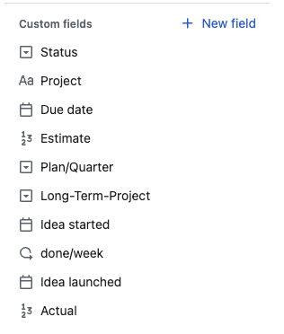
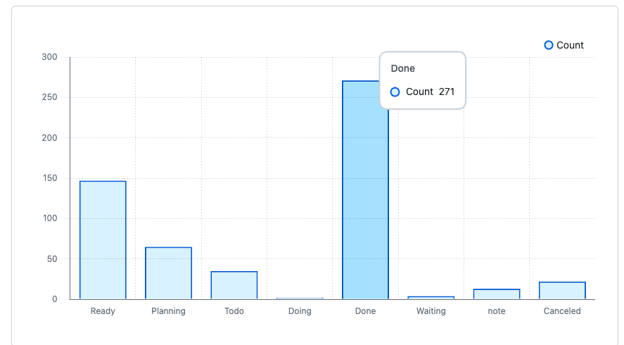

<!-- titleは自動で入る -->
# 個人的なタスク管理方法

## タスク管理をするモチベーション

タスク管理をしようと思ったのは、社会人になって、「おやおや？社会人は時間がないぞ？」と思い始めたのがきっかけでした。また、自分の興味があることは挫折してもやっぱり興味があり、何度もやるぞ！と思っては挫折してまた白紙からのスタートをしていたのも非効率に思っていました。あとそもそもやらなきゃいけないことを忘れてしまう。この辺の要素が重なって、タスク管理を2023年の6月に始めました。ちょうど1年と少しが経ったことになります。

## タスク管理の方法

色々やり方を変えつつ今は以下のような構成に落ち着いています。

### タスク1つあたりのスキーマ



- Title
  - Issueのタイトル。タスクは完了するものになるよう書く
  - 例: ⭕️英語の学習方法を決めてドキュメントに記載する ❌ 英語が上手くなるよう勉強する
- Content
  - Issueの本文。Project(タスクID), Description(タスクの背景), Ref(参考リンク), Todo(checkboxでやることリスト)の4項目がある。
  - Todoは最初は埋められないので、受け入れ条件としてのDescriptionを書いて後はタスクIDを入れるくらい。
- Status: (Single select)
  - 現状のタスクのステータス。
    - Inbox: とりあえずここにメモする
    - Ready: Contentを埋めたらここ(普段よく使うViewからは見えないようにして認知負荷を下げている)
    - Planning: 今のQでやる予定のタスク
    - Todo: Planning以外でやりたい割り込み系タスク
    - Doing: 今やっている
    - Done: 完了したもの
    - Waiting: 他の人の返事を待ってるとか、待ちの状態のタスク
    - note: メモ
    - Canceled: 実行を諦めたタスク
- Project: (Text)
  - タスクID
    - GitHub Proを使っていたときは `UPJ-<num>` をタスクごとのMarkdown `https://github.com/USER/REPO/blob/main/UPJ/UPJ-<num>.md` にリンクして便利だった。がそれほど使わないので今はやめてる。
    - 例: UPJ-300
- Due date: (Date)
  - 締切日、もしくはこの日にやるという予定日
- Estimate: (Number)
  - 見積もり時間を30分を1として記入
  - 大体雑に2とか10とか入れてる
- Plan/Quarter: (Single select)
  - 現状は `{年}Q{Quarter-Number}` みたいな感じ
  - 今は2023Q4とか2024Q1とかが灰色になっていて、現在以降のQがカラフルになっている
- Long-Term-Project: (Single select)
  - 長めのプロジェクトは一覧したいのでタグをつけている
  - 例
    - 雑巾: 銀行に行く、とか掃除をする、とか
    - 人生進捗: 美容院に行く、友人と遊ぶ、とか
    - 技術書を読む
    - 技術力をつける
  - 正直これをmulti-selectにしたい。(GitHub Projectsにはmulti-selectがない)
- idea started: (Date)
  - タスクをプランニングでProjectとかContentを埋める時に、その日の日付を入れる
  - 古いタスクをやらないことが多かったので、アイデアを思いついてから実行するまでのリードタイムを短くしたくて設定している
- done/week: (Iteration)
  - 1スプリントを土曜開始金曜終わりの1週間として、そのスプリント番号
  - 例: done/week 20
  - 土曜始まりなのは、金曜に振り返りをすると土日に振り返りの成果を生かしやすいため(意気込んでも月曜開始だと時間が取れず結局何もできない)
- idea launched: (Date)
  - タスクをDoneに回す時に、その日の日付を入れる
  - idea startedと比較している
- Actual: (Number)
  - 実際かかった時間を30分を1として記入
  - 体感でやってるのでそんなに正確な値ではない

### タスクが作られてからDoneになるまで

朝のデイリーの流れ: ここでInboxからPlanningやTodoへ

- Raycastで「daily」と打ち込みデイリーのドキュメントを開く
- `{日付}.md` を作る。この日感じたこととかはここに書く
- ドキュメントに沿って進める
  - 予定確認: カレンダー眺める
  - タスクの確認: メモし忘れているタスクがないか、昨日のメモを眺める
  - プランニング: Due dateが1週間以内のviewで期限の近いタスクを確認、昨日のDoneを確認、Waiting, Doing, Todo, Planningを確認(ここでInboxに必要事項を埋めて、Todo等へ移動)
  - 1週間の振り返りメモを確認

ReadyからTodo, Planningへの移動は1週間の振り返り・プランニングで行われます。

Planning, Todoからその日やるぞ！と決めたものをDoingへ移動させ、終わったらDoneにします。

### 実際にタスクに取り掛かる時

- Doingにタスクを移動させる
- タスクIDに対応するMarkdownファイルを開いて、色々メモしながら進める
  - 場合によってはVS Codeの検索を使い、過去に類似の作業をしてないか調べる
- 時刻はRaycastで `@` で `[2024-06-23T16:25:40+09:00]` のように呼び出せるようにしておいて、以下のように書いてます

```md
[2024-06-23T16:15:04+09:00]

Rustなんも分からん

[2024-06-23T16:26:17+09:00]

多分reqwestのheaderがoptionalにするにはどうしたらいいかを調べたらいい
```

### 実際どうなんですか？

- 作成したタスク数: 今のIDの最大値が452なので、タスクID振ってない時のも含めて550くらい
- 期間: 2023-06-10 ~ 2024-06-23
- 文字数: `` wc -m `find . -name '*.md'` `` 918739 =(91万文字)
  - これはコマンドを実行した時のログも含まれている
- Doneの割合は以下のように271/550がDone



- 朝会は5分で終わるくらいで、週の振り返り・プランニングは1時間30分かけている

# ツールの移行先検討

結論から行くと移行しませんでした。

## 移行のモチベーション

GitHub Projectsはとても好きだけど、以下の点がもうちょっと...！って感じがします。

- multi selectがない
- Automationが貧弱
  - 現状、タスクIDは手動で埋めています
- モバイルのViewが貧弱
- 時間計測ができない
  - toggl連携するChrome拡張を書いて対応してる [uta8a/chrome-extension-timetrack](https://github.com/uta8a/chrome-extension-timetrack)
- APIが使いにくい
  - 僕がGraphQLに慣れてないだけ説はある

この辺を解消してくれるいい感じのが欲しいなと思って調査しました。

## 観点

- ロックインを避ける
  - データexportがCSVでできて、全てのフィールドがexportされること
- APIが充実しているか
  - webhookがあると嬉しい。ある時点でのタスクViewの再現をしてみたい
- 有料でも無料でもいいが、できれば無料が嬉しい

## 検討したツール

- ClickUp
  - APIが充実していて、webhookもある
  - 時間計測も可能
  - 実際にGitHub Projectsから移行してみたら、移行の体験がとてもよかったです。
    - GitHub Projects to CSVはこれを使用 [fiedl/github-project-to-csv](https://github.com/fiedl/github-project-to-csv)
- Linear
  - 無料枠だと250までしかタスクが作れない
  - 割と機能は多いが、チーム向けな感じもして機能が多すぎる感じがある

## 結論

検証した結果、ClickUpが優勢だったのですがデータExportの時にCustom fieldsがexportされませんでした。
[https://www.reddit.com/r/clickup/comments/17uo43w/can_custom_fields_be_exported_using_the_csv/](https://www.reddit.com/r/clickup/comments/17uo43w/can_custom_fields_be_exported_using_the_csv/)
このあたり見るとexportされそうだけど実際にall workspace export, list exportどちらもやってみるとどちらもCustom fieldsがexportされなかった。

これはロックインを避ける点で困るのでなし。しばらくはGitHub Projectsの運用が続きそうです。

# 感想

- 今の運用は複雑になってきていて、automationなどの技術の力でなんとかしたい
  - 課題: タスクを雑に作れなくなってきている(モバイルviewが弱いのも原因)
- タスク管理をしたおかげでやりたいことを計画立てて必ずどこかで実行できるようになってきた
- ツール移行の際にはデータのimportだけじゃなく、exportが完全かどうかも検証しましょう
- GitHub Projects + GitHub Actionsで何か書きたい
- ゆくゆくは自前でタスク管理ツールを書きたい。が今回の検証でClickUpがかなり理想系だったので新しさを出せる気はあまりない。
