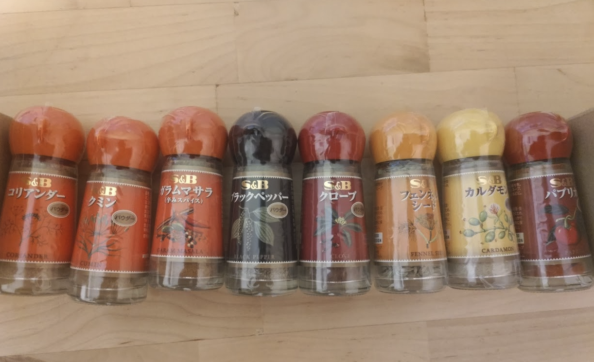
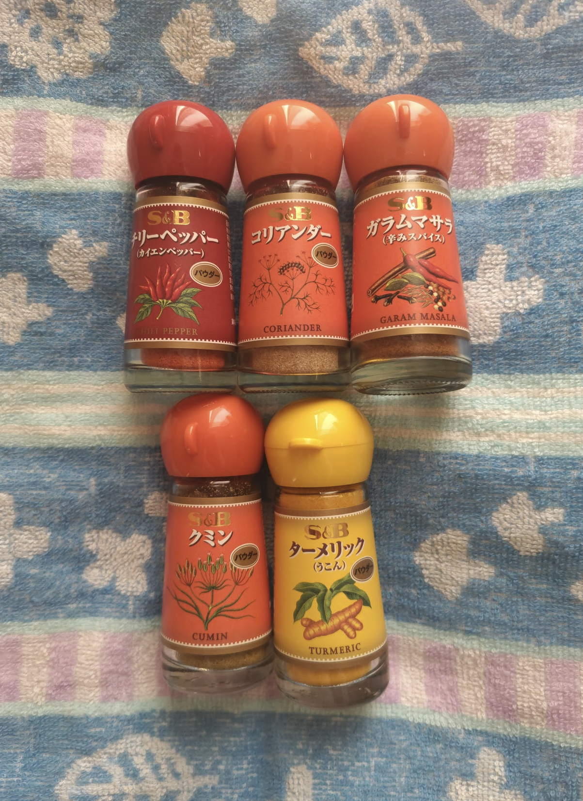
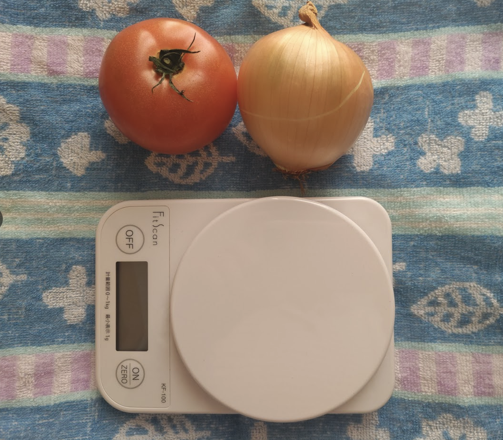
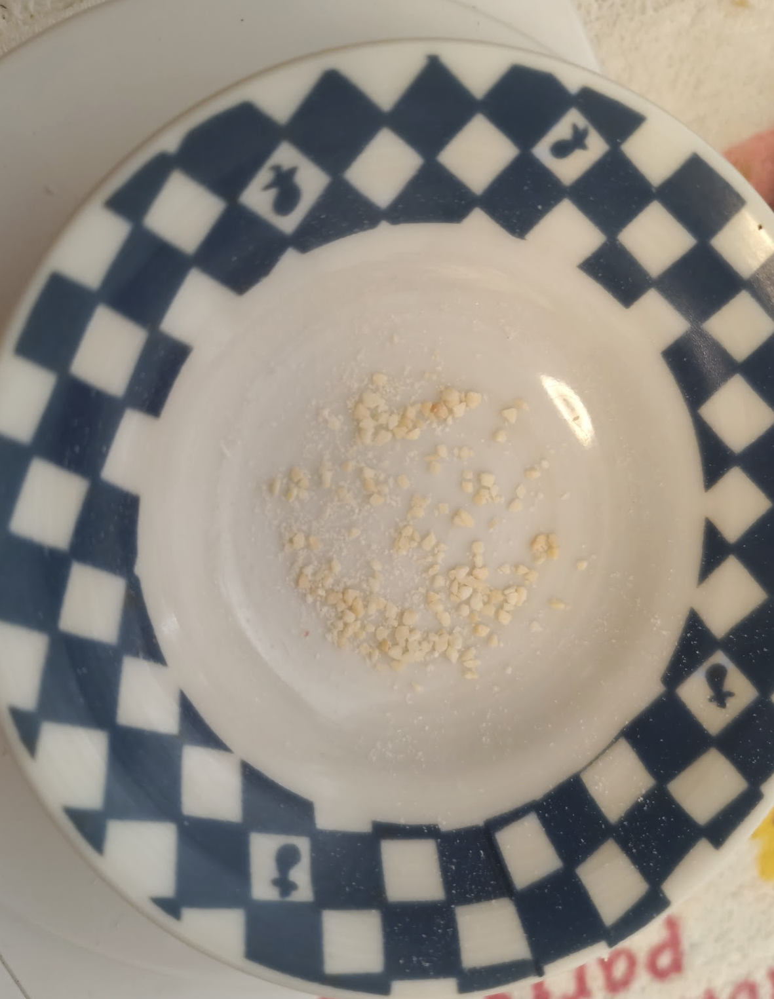
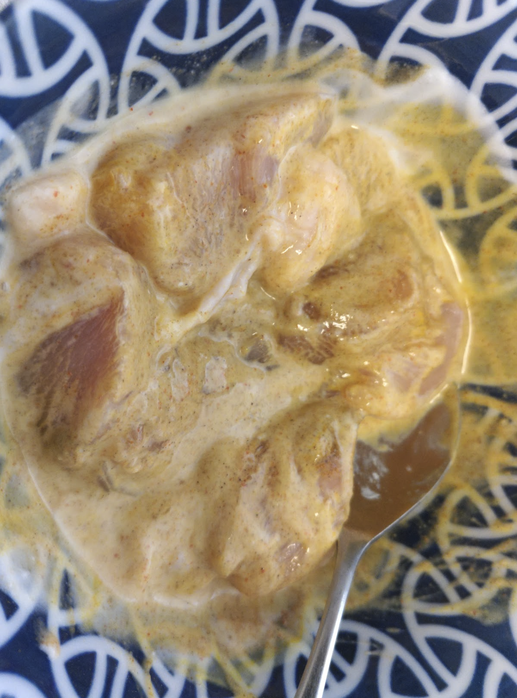
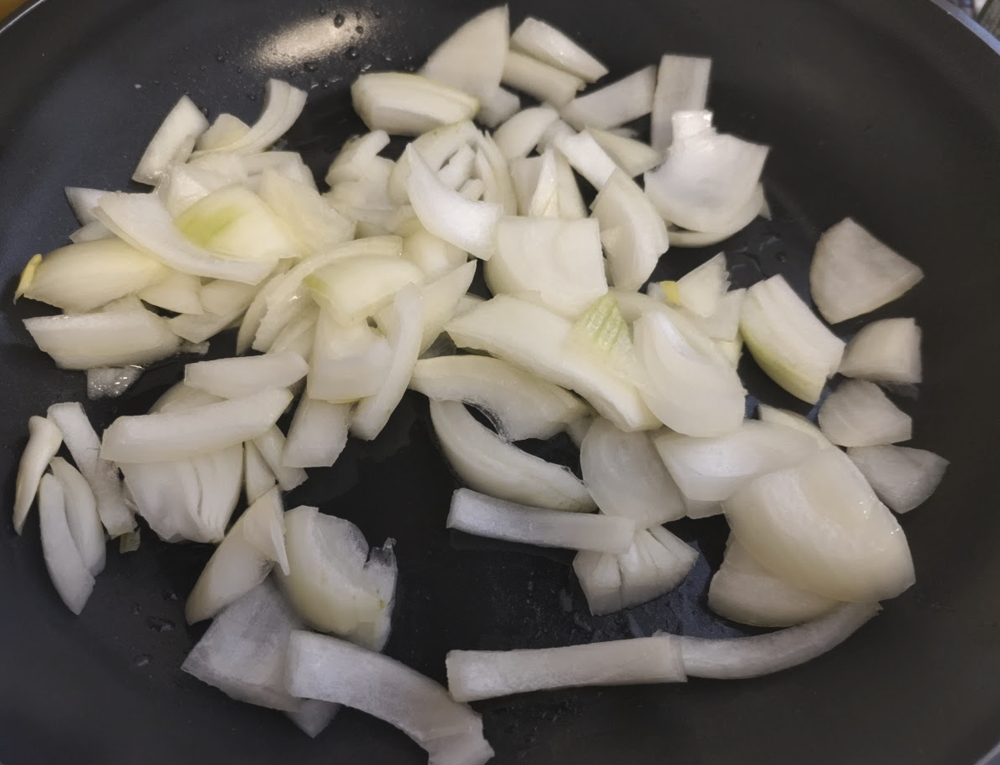
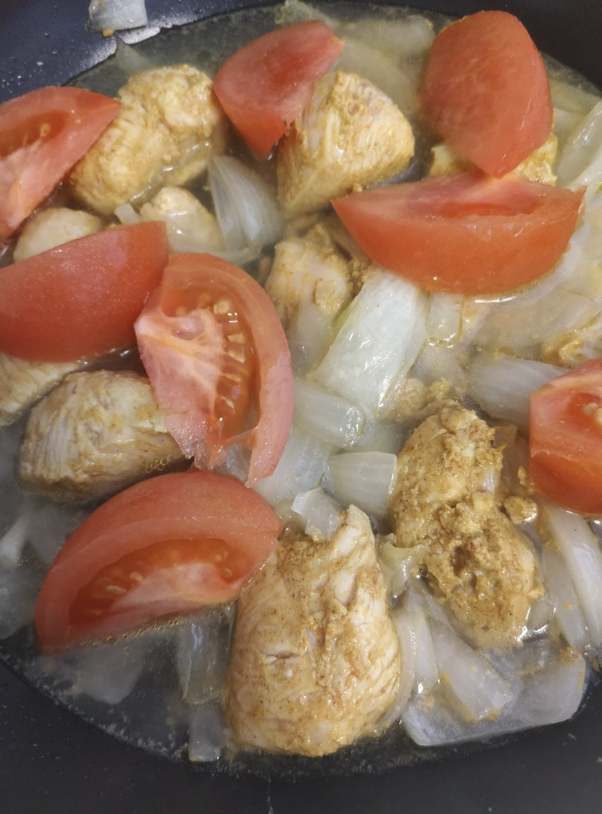
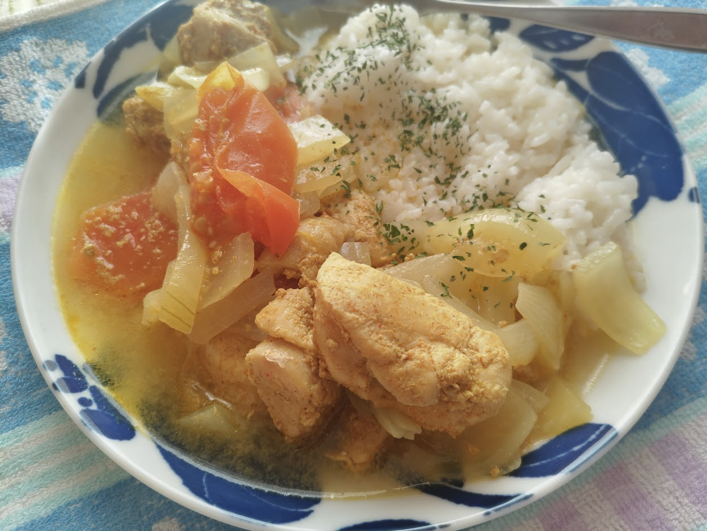
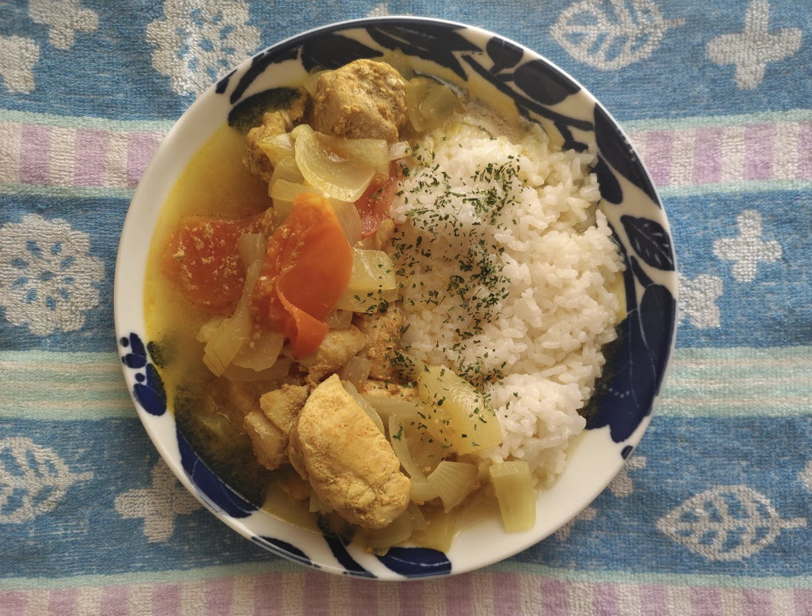

<!-- titleは自動で入る -->
身内のLT会みたいなイベントで「オタクに インドカレーを 作らせたい」というLTがありました。[「エリックサウス」稲田俊輔のおいしい理由。インドカレーのきほん、完全レシピ](https://books.sekaibunka.com/book/b10102932.html) に登場するクイックスパイシーチキンカレーをお手軽な感じにしたレシピが載っていて、それを作ることにしました。

なお、僕は大昔に一人暮らしをしていた時期に自炊をしていましたが、最近はまともな料理を作っていません。

# 材料を集める

まずは材料を集めることにします。スーパーに行ってスパイスを探したのですが、全部揃えられないことが分かったので通販を頼ることにしました。

[エスビー食品公式通販 お届けサイト](https://www.sbotodoke.com/shop/default.aspx)

エスビー食品のスパイス&ハーブというのがおすすめらしいのでそれを買います。購入金額が5000円以上なら送料無料らしい、じゃあ本に載っている他のレシピに登場するスパイスも買っておくか... あ、あれも... それも...

〜数日後〜

？？？？
なんか多くない？？？？(これに加えてシナモンと5つのスパイスが届いた)
ちょっと調子に乗って購入し過ぎたようです。

何はともあれ材料は揃いました。
もも肉の代わりにむね肉を使ったり、ニンニクはパウダーを使うことにしたけど大丈夫っしょ！

スパイス用意OK！

デジタルスケールも家にあったし！準備万端！

# 下ごしらえ

まずは肉を漬け込むやつをします。

ここで問題が発覚しました。

デジタルスケールがなんかおかしい。具体的には塩を4g測りたいのですが、塩をいくら足しても0gから変わらない... おかしいと思って、0g調整をせずに容器を乗せて同量の塩を入れると3gになりました(55g → 58g) 0g調整が機能してないのか？

デジタルスケールくんが信用できないので、諦めてスパイスを目分量で入れていきます。

というか4gのコリアンダーパウダーとか、正気を保っていると「えっこんな入れんの！？」みたいな気持ちになります。デジタルスケールが信用できない以上、己の感覚を信じるしかありません。俺が、俺がインドカレーだ！くお〜！！ぶつかる〜！！ここでアクセル全開、インド人を右に！

というかにんにくパウダーないんだが。

下ごしらえの段階ですでに諦めムードが漂いはじます。

下ごしらえが終わりました。

玉ねぎも切ってトマトも切りました。

# 調理

サラダ油がないのでオリーブオイルで玉ねぎを炒めます。

玉ねぎはケララ切りにするようにとあったのでそれっぽく切っているつもりです。

玉ねぎが飴色になるのが待ちきれなかったので、透明になってきた段階で肉を入れます。

さらに、肉の表面が焼けて色が変わってきたので、水とトマトを投入。

15分くらい煮込みました。完成です。

# 結果

何はともあれ出来上がりました。全部で45分くらいかかりました。

お味は...

...

...？

スパイススープです。

カレーだと思うと味が薄く、でもスパイスはそこはかとなく効いている。なんかコメントに困る味になっていました。普通にまずいわけではないので食べられるし、体が温まっていい感じです。

# 分析

- トマトを2倍量入れていた。これにより水分が多くなっていた。
- デジタルスケールが機能しないことにより、スパイスが本来より少ない量になっていたかもしれない
  - もっと正気を失ってガンガンぶち込んだほうがいい
- にんにく要素がほぼ無かった & もも肉ではなくむね肉を使ったのでパンチが薄かった

# 最後に

美味しかったです。また再挑戦したいですね。あとスパイスをうまいこと消費するためにスパイスを軸に料理を調べなくては...

感想としては、「化学実験みたいで面白いな」と思いました。以前自炊をしていた時は測りとか使わずできる簡単なもの(唐揚げ、野菜炒め、カレールーを使ったカレー、鍋キューブを使った鍋、餃子...)を作っていたので、こうしてスパイスの調合をしていくというのは面白い体験でした。

自炊モチベが上がったのは良かったですね。自分で作ると失敗してもおもろい。
