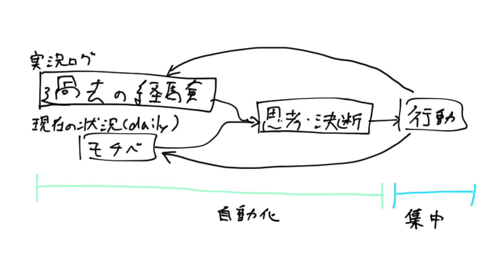

<!-- titleは自動で入る -->
僕は2021年くらいから行動ログをつけています。当時のインターン先での実況スレ文化(タスクに取り組む際に実況のようにやっていることや考えていることを書き出す)がいいなと思って私生活に取り入れたのがきっかけでした。

それから5年くらい行動ログをつけていて、色々課題が見えてきたので整理しようと思います。

# なぜ行動ログをつけるのか

もちろん生活の一挙手一投足を記述することはできないので、何のログを残すのか、それはなぜかという話になります。僕がログを残すのは大体以下のような時です。

- 日記
  - 時刻と行動をなんとなく残す
- タスク
  - 1つのタスクがあまりにも軽いものでなければ基本的に実況ログを残します
- 考えたこと・調べたこと
  - パッと考えていたことが言語化できた瞬間に書き留めます
  - 行動ログというよりはストックドキュメントに近い

記法としてはmarkdownで、ツールはObsidianです。
大体下のような感じ。

```md
# 2025-04-25 ← Obsidianのタイトル。`daily/` 下にある

5:37 ← これはスマホから `いま` って打って変換で出してる
起きた

2025-04-25 06:14 ← これはPCからRaycastで `@now` で出してる
25分くらいISUCONに取り組んでみる。
```

Logseqのような箇条書きスタイルもCosense(Scrapbox)使っていた時にやっていたけど、ここ3年くらいはずっと時刻 + その下に書くみたいな感じですね。

本題のなぜ行動ログをつけるのかというところに入ります。こういった形でこまめに記録をしていると、以下の点で嬉しいなと感じることが増えました。

- 一度やったことを苦労なく再現できる
- 覚えることが減る
- 時間軸で俯瞰して自分の興味や指向性が分かる

順に書きます。

一度やったことを苦労なく再現できるというのは、例えば勉強していてQEMUでUbuntuを立ち上げた時にImageはどこから取ってきたかとか、Desktop, Server, Cloud imageどれでやったのか、qemuコマンドの引数はなんだったのかとかそういったものを過去のログから引っ張ってこれるみたいなのを指します。日常生活だと、以前行った旅行で予約した時のログが残っていて近い地域に行くときに交通手段の検討が楽だったり、同じ飲食店の予約を思い出す時に過去のログを参照したり、確定申告の前年の記録を見ながら今年の差分と照らし合わせたり、みたいな感じです。
一度やったことをもう一度やるというシーンは日常生活を眺めてみるとたまに発生します。特に日を空けてやるものは綺麗さっぱり全てを忘れているので、ログがあると重宝します。

覚えることが減る、も1つめの再現の話に関連します。記録に頼れば自身は何がしたいかだけを知っておけばよく、状態を持たずステートレスに暮らせます。僕は基本的にあんまり考え事を溜めておけないタイプなので、ガンガン書いてガンガン忘れます。この人からこのプレゼントもらった、みたいな忘れたくない情報もメモしていて、とにかく覚えることを減らして、忘れても大丈夫にします。

時間軸で俯瞰して自分の興味や指向性が分かる、は1年くらい記録を取っていて気づいたことでした。割と自分の興味ってぐるぐる回っているな、と感じます。暖かい季節には写真が撮りたい気持ちになる。音楽が好き。CLIP STUDIO PAINTを買ったはいいけどちょっと触ってよく分かんなくなっては数ヶ月放置するのを繰り返している。時間軸で俯瞰すると自分は何もしていないように見えても色々やっていて、それらはあるジャンルに収まっているような気がします。それによって、「自分は何をしたいのだろう」という気持ちに陥ることが減りました。むしろやりたいことがたくさんあってそれらが全部記録されていてどの段階まで取り組んだかがログに残っているので、人生時間足りねえ！という気持ちになります。

そういった効果を得られるので、実況ログをつけています。

# 変化

最近MCPサーバ経由でAIにObsidianを読ませると、色々検索してまとめてくれるので便利だということに気づきました。シークレットとか人と会話した内容のうち秘密なものはObsidianに書かないようにしているので、まあええかなと思ってAIに投げています。シークレットはパスワードマネージャに書いてリンク貼ったり、人と会話した内容でこれは秘密みたいなやつはそもそも忘れるようにしています。

ログが溜まってきたので、取りたい行動に応じてログを検索して回る作業が大変担ってきました。でもこの検索してまとめる作業って、要はそれっぽいワードで何回か検索して出てきた日記やタスクログをまとめてその時点でのストックドキュメント(スナップショット)に変換するだけなので、AIが得意なことです。

というわけで最近は以下のようなことができるのではないかと考えています。



入力として過去の経験と、現在のモチベを入れて、それを思考や決断の篩にかけると次の行動が決まります。
このうち人間がすべきことは行動です。行動は手を動かしてコード書いてコマンドを実行してみたりとか、外に出て写真を撮るとか、ピアノの練習をするとか、そういうのを指します。

行動に集中することで、思考の材料となる経験が補充できるのでさらに思考を前進させることができます。僕は考えることが好きなので、AIでも考えられるレベルのGetting startedなことはもうAIに任せてしまって良いと思っていて、その先の経験を通じて一段解像度を上げた思考を行いたい。そういう頭の捻り方をすると楽しそうだなと思っています。

# 残された課題

現状まだまだうまくいってないところがあります

- コンテキスト長の圧縮
  - AI向けコンテキスト長という意味と、自分が短期間記憶できる分量の2種類の意味を指しています。
  - 要は世の中の情報を自分なりにカスタマイズした情報 + 経験がObsidianに蓄積されているので、その蓄積は世の中から自分に向けてコンテキストを圧縮したものと見れます。ただこれでも膨大なので困っています。Obsidianに書いたことをジャンルに分けてストックドキュメントを自動で作りたい... 行動に必要な大きさになるまで圧縮するにはどうしたらいいだろうと思っています。
  - 記録のハードルを下げる方向が正しいと思っているので残ったログが雑多になるのはしょうがないと思っていて、そこを整理して圧縮する部分を自動でやりたい感じ。
- 記録のハードルを下げる
  - もっと記録を雑に取っていきたいです
  - 音声入力とかを試したいなと思っています
- やりたいことを適切にコントロールする
  - 例えば逃避みたいな形でやりたいことが生まれるように、「やりたいこと」というのは自分の意志のみに依存するのではなく、環境に影響されるものだと考えています。そういった意味では大きく向かいたい方向に対して自分がやりたいことを適切に実行できるように、モチベーションが自然に向かう環境を作れるのではと思います。
  - 特に時間がかかるものを回避しがちな傾向があるので、ここは改善が入れられそう。

# 最後に

行動を決めるための思考の一部をAIに任せて、自分は行動の方向に寄っていく話を書きました。結局は行動する or notの局面に素早く辿り着いて行動することに集中する、その試行回数を重ねることで自分が行きたい場所に届く勝算が高まるという話なのだろうと思います。AIとかの話は割とツール寄りで、本質的にはそこだと思っています。
