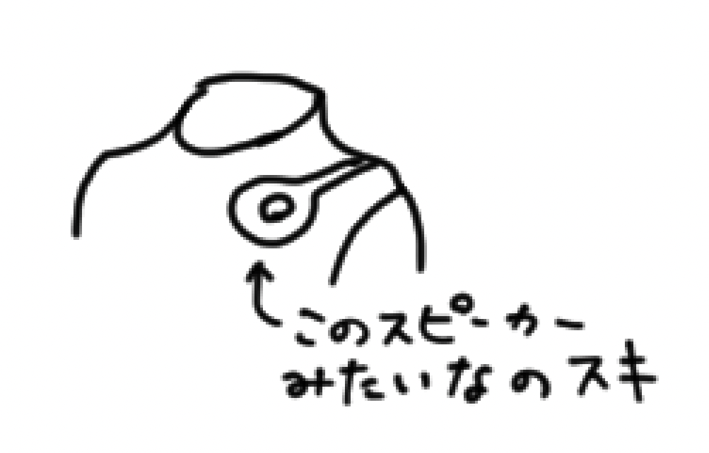

<!-- titleは自動で入る -->
広島市現代美術館の特別展、Perfume COSTUME MUSEUMに行ってきました。とってもよかったので感想を書きます。

今回は学芸員さんの解説を聞こうと思い、時間を合わせて行きました。

美術館は山の上みたいなところにあります。路面電車で近くまで行ってから坂道を登ります。バスやタクシーで行った方が楽かも。

こんな感じで大きくPerfumeののぼりがあります。テンションが上がる！

上から見た図はこんな感じで、最初どこに入場口があるのか戸惑いました。チケット売り場のカウンターで質問したら受付の場所を教えていただきました。ありがとうございます...

会場は基本写真撮影禁止で、一部写真撮影OKのエリアがある感じでした。なので基本的にブログには僕がおぼろげに思い出しながら描いた図を載せています。

展示は4章構成になっていました。学芸員さんの解説から自分なりに理解したことを書きます。

- 1章 近未来型の挑戦者
  - スタイリスト内澤研の手がけた初期の衣装。既製服を利用することで、服飾メーカーとのタイアップやファンとの繋がりができて、Perfumeのファッションリーダー的方向性の基礎が築かれたそうです。
  - リニアモーターガール、Dream Fighterなど
- 2章 止まらない進化
  - テクノロジーと融合した服飾や、幾何学模様をモチーフにしたデザインといった路線。時期的にはユニバーサルミュージックへの移籍、世界への進出、Rhizomatiksとの連携といった現在に続く流れがありました。
  - Spring of Life、FAKE ITなど
- 3章 「未来」を超えて
  - さらに進化して、ダンスとの融合やこれまでの定型を崩す多様なデザインにつながっています。
  - FLASH、TOKYO GIRLなど
- 4章 ステージに立つの
  - 3章までの進化系の流れと別で、ステージ上に立つ演者観点から、メンバーのセレクトした衣装などが展示されていました。

1章は初っ端のリニアモーターガールからPerfumeっぽい近未来・かっこいいって感じで驚きました。

リニアモーターガールのスピーカーみたいなところ好き

あとDream Fighterのマスタードカラーの衣装がブランド色々組み合わせて作られているというのにも驚きました。どうやってあの統一感を出すんだ...

2章が一番僕がよくPerfumeを聴いていた世代って感じでした。MVの！あれだ！ウオオオ！みたいなことが多くて楽しかったです。

Spring of Lifeの衣装が背中の家電話みたいな線ごと展示されていて光るんですが、横に置いてある靴も光るんですよ！Spring of LifeのMV、当時死ぬほど見たのに靴が光ること知らんかった！みたいな気持ちになりました。靴が！光る！最高！

あとは幾何学模様も最高すぎて、最高ですね〜
三角形がモチーフとして多いなというのはなんとなく頭にあったのですが、まじまじと衣装を見るとマジでカッコ良すぎる。
特にSXSWの白黒グレーの衣装はアリスインワンダーランド的なかっこよさを感じました。スタイリッシュ〜！

あと服飾デザインの資料も展示されていました。
3人の髪型で3人の誰が誰か識別できて面白かったです。絵描くのむずいから人々は美術館に行って本物を見てほしい！
服飾デザイン資料コーナーで思ったのですが、服の型？原型？って平面の紙なんですね。立体的に構成される服が平面的なパーツから構成されるというのは僕にとっては不思議に感じられて、すごいなと思いました。立体にした時にどうなるかって分かるものなのか...？空間に対する能力が高いな...？

他にも色々好きな衣装があったのですが、やっぱSpending all my timeと、Perfume 5th Tour 2014ぐるんぐるんの衣装がトップで好きです。

Spending all my timeは僕が単にめちゃくちゃMVが好きというだけなのですが、美術館の中でも階段を降りたところの、ちょうど階段の下に当たる光が綺麗に入る場所に展示されていました。

囚われた超能力が使える少女たちという設定のMVの中で、綺麗な箱庭のようなイメージに合う制服のような衣装が綺麗で、色合いも良いし展示されている場所も良いしもう最高でした。あとSpending all my timeは微妙に3人の衣装のデザインが異なるんですよ！腰らへんとか襟あたりとか！！！知らんかった！！！MV死ぬほど見てるのに！！！

幾何学的な美しさ、色彩の絶妙な美しさ、そしてそれを支える裏方の衣装やプロジェクションマッピングやダンスの振り付けといったPerfumeを守る周りの人たちの熱意や創意といったものを勝手に感じて感極まってしまいました。人が裏に見えるものづくりっていいなーー！！！

最後に、Perfumeの3人自身がセレクトしたメンバーコメントが添えられた衣装の紹介がありました。これも最高だった...
僕はPerfumeのコアなファンというわけではないので(曲がめっちゃ好きというだけ)、ライブに行ったりインタビューを追いかけたりしているわけではないです。それでもたまにYoutubeでPerfumeのメンバーと別のアーティストの交流みたいなのが流れてくると、「3人ともポジティブな言葉がうまいな！」みたいな気持ちになって元気をもらえます。
そうした、Perfumeの持つポジティブな感情をストレートに芯から打ち抜くような言葉が感じられて、このセレクトしたメンバーコメントと衣装のコーナーはとっても好きだなと感じました。衣装の褒め方がうますぎる！！！マジで好きな衣装なんだな〜とこちらもウキウキしてきます。あとちょくちょく「この衣装はスタイルがよく見えます」「無限にウエストが細く見える魔法の衣装」みたいなコメントがあって、この人ら無限にスタイルいいのにさらにスタイルがよく見える衣装...？？？？みたいな感情になってウケました。Perfumeの3人の魅力は音楽やダンスももちろんそうなのですが、お茶目なところやポジティブさを丁寧に言葉に落とし込めるその人柄みたいなところも魅力の一つだ、と改めてPerfume推せる！！となりました。

とてもいい展示でした。行く価値が5億あります。おすすめです。
