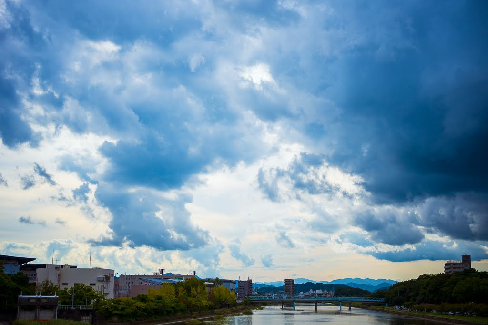
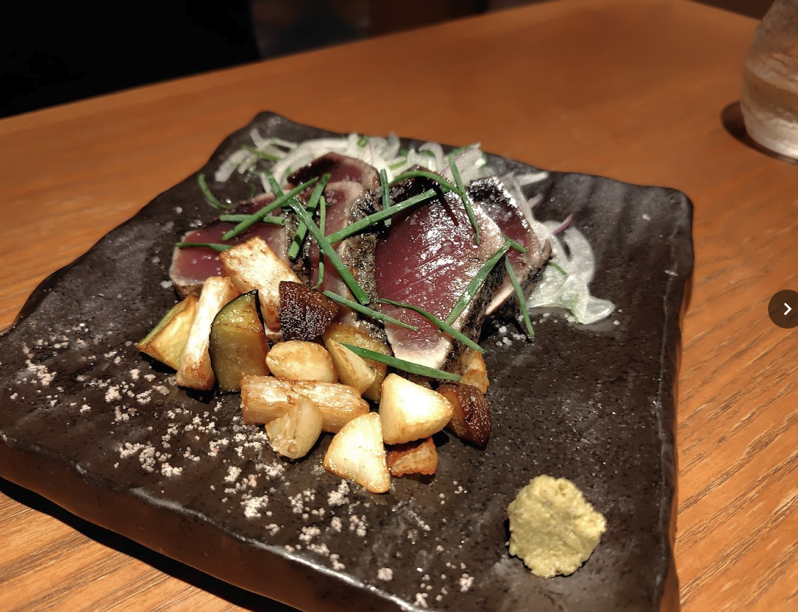
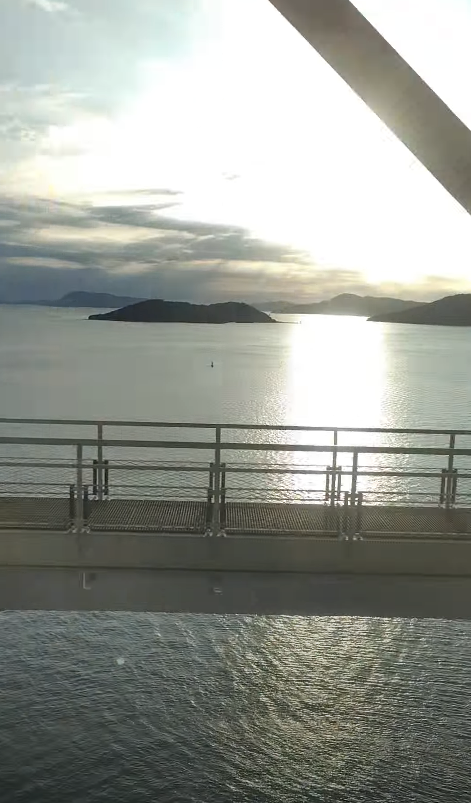

<!-- titleは自動で入る -->
2025-09-21から1泊2日で高知旅行に行ってきた話をします。

# なんでも美味しい高知

ついて昼は [ひろめ市場](https://hirome.co.jp/) へ行きました。
ここはたくさんお店があって、特徴的なのは飲食店にひろめ市場で購入した魚の刺身パックとかを持ち込んでも良いことでした。僕らが入ったお店ではカツオのたたきは持ち込んじゃダメだよ、という注意書きがありました。なのでカツオのたたきはお店で注文して、その他にウツボのたたきとかをひろめ市場の他の店で買ってくるという動きになりました。

夜は [明神丸 はなれ](https://shop.myojinmaru.jp/shop/hanare/) に行きました。コースにしたのですが、ここのカツオのたたきはまじで美味かったです。今まで食べていたカツオのたたきはなんだったんだ... 臭みがないとかそういう次元を遥かに超えた美味しい魚って感じで、食べると無くなってしまうのが悲しいくらいです。

高知はなんでも美味しくてやばかったですね。また行きたい。

# 車窓を一瞬で過ぎていく人の暮らしが好き

帰りは南風(なんぷう)という列車に乗って帰りました。広島までざっくり4時間かかるので下手したら広島 - 東京間よりも広島 - 高知間の方が遠いです。

僕は鉄道には詳しくないけれど、車窓をぼんやり眺めて旅情を感じるのが好きです。今回の南風はその点とても最高でした。この路線は高知の真ん中、縦に短い部分を突っ切る形で伸びています。清流の脇を走る感じになっていて、高知→岡山方面だとおそらく左の窓際の席がいい感じな気がします。

高知の川は綺麗というけれど、実際に列車から遠く下にある川の底が見えるくらいには透明度が高かったです。なんとなく川の底の方に大きな岩があるな、とか見えた気がする。トンネルも多いですが、景色は綺麗でした。

車窓をぼんやり眺めていると、時々人の姿を見かけます。畑仕事をしている人、学校の校庭で体育をしているような様子、ラフティングの準備をしている人... そうしたその土地にいる人々の暮らしぶりの一端を一瞬だけ垣間見れる瞬間が好きです。こんなに山奥なのに車がたくさんあるんだ、とか、開けたところに出てきて家の数が多くなって安心したりだとか、目まぐるしく変わる景色をぼんやり眺めながら、人の暮らしを感じられるのが好きです。

# 終わりに

高知とってもよかったです。

