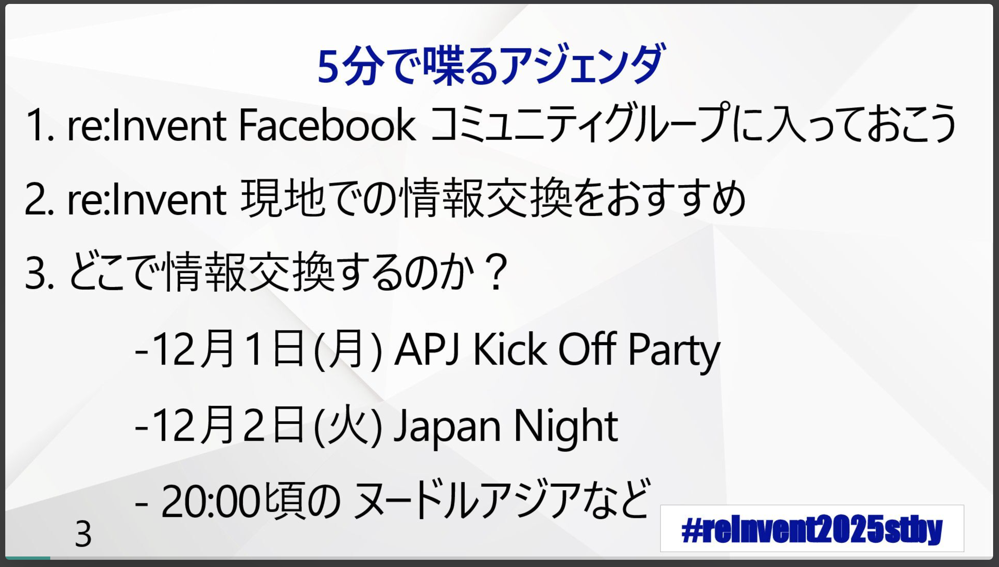
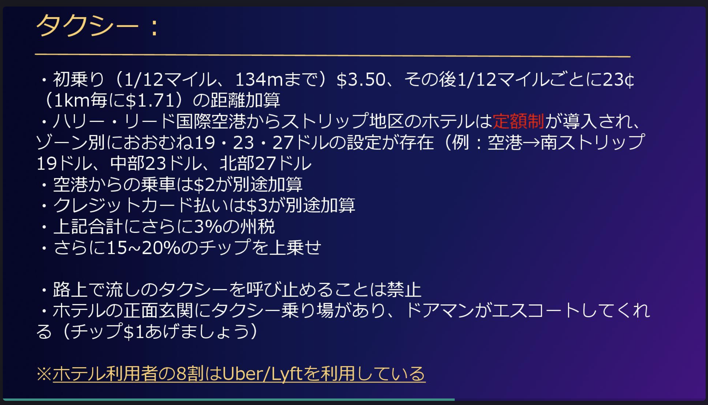
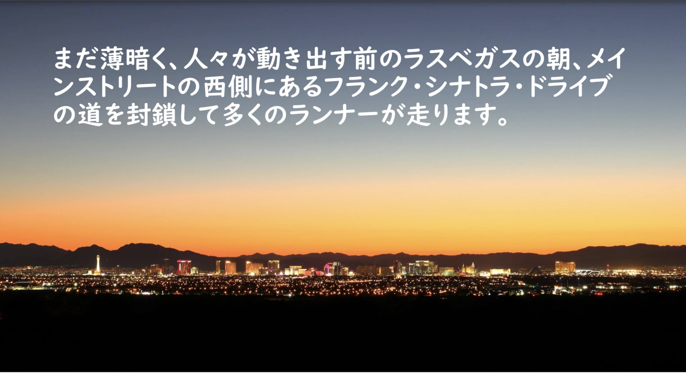

<!-- titleは自動で入る -->
re:Invent2025 事前勉強会 (有志で開催) に行ってきました。
会場は白金高輪近くで、サイオステクノロジーさん提供でした。サイオステクノロジーさんありがとうございます！！広いキャパで多くの人と交流できました。
また運営・ドリンクスポンサーはNotionさんでした。Notionさんありがとうございます！！飲み物がもらえて嬉しい。

僕は「Blog,イベントレポートOutput 枠」でこの会に応募したので、この記事で当日の様子や個人的にためになったポイントを紹介していこうと思います。

- 当日の [connpassページ](https://connpass.com/event/366557/)
- hashtag [#reInvent2025stby](https://x.com/search?q=%23reInvent2025stby)

# ざっくり概要

毎年行われるAWSの祭典、AWS re:Inventに初めて参加する方、まだ歴が浅い人向けのLT会 + 懇親会でre:Inventに向けて仲間を作ろう！という趣旨の会でした。

LTの内容はラスベガスに行く準備やre:Inventを楽しむための準備、心構えが中心でした。

参加者層はAWSを扱う人たちが幅広くいたように思います。クラメソさんのようなAWSと言えば、な方もいましたし、Web系の人もSI系の方もいました。re:Inventに今年初めて参加される方が大体半分以上、7割くらいでした。

LTの雰囲気は面白い寄りで砕けた感じで、皆さんre:Inventに何度も行った経験から具体的なアドバイスを惜しみなく提供してくださっていました。本当に具体的すぎてメモを取る手が止まらん。
そんな面白いLTの後の懇親会では和気藹々と知らない人とも名刺交換したりSNSを交換したりと、とてもフレンドリーな会でした。

# LTの詳細

LTのスライドはほとんど[connpassにアップロードされている](https://connpass.com/event/366557/presentation/)ので、そちらを参照されると良いと思います。

全部を紹介すると量が膨大になってしまうので、前半部分をピックアップして紹介します。気になったものはぜひスライド本編を見てみてください。

## [5分で前説"なぜre:Invent現地へ行くのか？" - Shinichiro Kawano](https://speakerdeck.com/shinichirokawano/number-reinvent2025stby-lt00-change-your-life)

Shinichiro Kawanoさんのイントロ的な発表でした。

(引用元: [https://speakerdeck.com/shinichirokawano/number-reinvent2025stby-lt00-change-your-life?slide=3](https://speakerdeck.com/shinichirokawano/number-reinvent2025stby-lt00-change-your-life?slide=3))

今回LTが10本以上あったので似たようなメッセージが被ることがありました。そういった共通のメッセージはre:Inventに行った人誰もが感じる重要なメッセージなんだろうと思って聞いていました。
この発表に登場する「re:Inventでクラウドサービスの未来を語り合う」という話は別のLTでも登場していました。
僕の中でのAWS re:Inventのイメージは新しい発表を現地で聞いてくる、ワールドクラスのカンファレンスを体感して業務のモチベに繋げる、くらいの解像度で持っていました。なので、「未来について語り合う」という点は新しいなと感じました。確かにAWSによって未来が変わるかもしれない、将来こういうサービスがあったらいいよね、という話ができたら楽しそうです。

また、そういった心構えの話に加えてお得な情報もたくさんありました。Facebookグループには入っていたのですが中身をあんまり見てないので見ておこうと思います。あと、ネットワーキングパーティの存在知らなかった... 調べます。

以下のサイトでベンダーパーティについて調べられるようです
[re:Invent Parties 2025 – Unofficial list of AWS re:Invent 2025 Conference and Vendor Parties](https://conferenceparties.com/reinvent2025/)
([こちら](https://x.com/Typhon666_death/status/1983474784005738536)のツイートで知りました)

## [ラスベガスの歩き方 2025年版（re:Invent 事前勉強会） - JunjiKoide](https://speakerdeck.com/junjikoide/rasubegasunobu-kifang-2025nian-ban-re-invent-shi-qian-mian-qiang-hui)

次はJunjiKoideさんからre:Inventを楽しく過ごすための健康管理や現地情報メインの発表でした。

(引用元: [https://speakerdeck.com/junjikoide/rasubegasunobu-kifang-2025nian-ban-re-invent-shi-qian-mian-qiang-hui?slide=28](https://speakerdeck.com/junjikoide/rasubegasunobu-kifang-2025nian-ban-re-invent-shi-qian-mian-qiang-hui?slide=28))

海外旅行に慣れていない・初めてという方がre:Inventに行く場合このスライドは絶対役立つので見ておいた方が良いです。
健康管理の話からタクシーを呼ぶときに電波が通りにくい場所の話まで、具体的な話が盛りだくさんでした。
個人的には去年のSWAGのボトルが薬品臭いからマイボトルを持って行った方がいいとか、冷蔵庫がホテルにない話とかが知らなかったのでためになりました。

SNSでもre:Invent経験者がお役立ち情報を書いてくれていました。

- [海外保険は治療費無制限が吉](https://x.com/yuj1osm/status/1983476425928908912)
- [去年買ってパスポートや、キャリーバックに仕込んで安心を買ったなぁ、、。 (Anker Eufy)](https://x.com/tetutetu214/status/1983476424146350426)

また、Re:PlayなどのパーティのDJ情報も面白かったです。楽しみだ〜

## [現地でのMeetUpを成功させるためのアレコレ - Shota Shiratori](https://speakerdeck.com/shotashiratori/xian-di-denomeetupwocheng-gong-saserutamenoarekore)

次はShota Shiratoriさんからラスベガス現地でMeetupを開くための発表でした。
re:Invent現地で勉強会をするという発想がなくて、びっくりしながら聞いていました。すごい熱量だ...！
内容としてはAWSの方に相談しようとか、いい会場はすでに抑えられているぞ、といった実際に開こうとしないと分からない貴重な情報が多かったです。

ちょっと今回初参加の僕にはハードルが高い話でしたが、現地でパーティに参加するときは裏側でこんな感じの苦労があるのかな、と感謝しつつ参加しようと思いました。

## [reinvent 5k の走り方 - Akifumi Niida](https://www.docswell.com/s/nid/52Q3XR-2025-10-29-190726)

Akifumi Niidaさんからre:Invent 5Kというイベントについての発表でした。
5K気になってたんだよね〜と思いながら聞いてたらかなりガチ勢の方でびっくりしました。

(引用元: [https://www.docswell.com/s/nid/52Q3XR-2025-10-29-190726#p4](https://www.docswell.com/s/nid/52Q3XR-2025-10-29-190726#p4))

re:Invent 5Kはre:Invent中の朝に5km走るランニングイベントです。Niidaさんは2位、4位、2位ときているらしくてすごすぎる。
発表もとても興味を惹かれるおもしろい内容でした。流石に今回チャレンジするかはだいぶ迷うけど、ちょっと気になりますね...！

SNSでは他にも参加された方がいたようでした。みんなすごい...！

## [それでもいきたいre:invent2025 - おーつき](https://speakerdeck.com/otsuki/soredemoikitaire-invent2025)

おーつきさんによるre:Inventに行ったら人生が変わった話。
[re:invent ラスベガスざっくりMapおーつき版](https://speakerdeck.com/otsuki/re-invent-rasubegasuzatukurimapotukiban) もぜひ。

(引用元: [https://speakerdeck.com/otsuki/re-invent-rasubegasuzatukurimapotukiban](https://speakerdeck.com/otsuki/re-invent-rasubegasuzatukurimapotukiban))

AWS re:Inventに行ってみたら何が変わるとか思ってなかったので、他の方もLTで言ってましたが「AWS re:Inventで人生が変わる」というメッセージに驚きました。
それくらいの気合で行ったら得るものも大きそうです。

自腹勢がSNSでもちらほらいてビビります。どれだけAWS愛がすごいんだ...
また、去年の話でAIの話をしててそれが今年実現されている話など、AWS re:Inventとはこういうものだ、という情報が知れてとても良かったです。心構え面とLTの面白さがかなりすごかった。

疲れたら無理せずホテルで仮眠を取ろう、というのも大事なメッセージだなと思いました。

# 終わりに

以上、LTの前半部分を紹介してきました。現地でのAWS re:Inventに向けた高まりを感じていただけたら嬉しいです。
LTの後半部分や、紹介したLTの詳細は [connpassページ](https://connpass.com/event/366557/presentation/) から辿れるのでぜひみて見てみましょう。

僕は初めてのre:Invent参加なのですが、準備のやる気や現地参加で何を持ち帰るか考える気持ちが湧きました。
素敵なイベントをありがとうございました！
