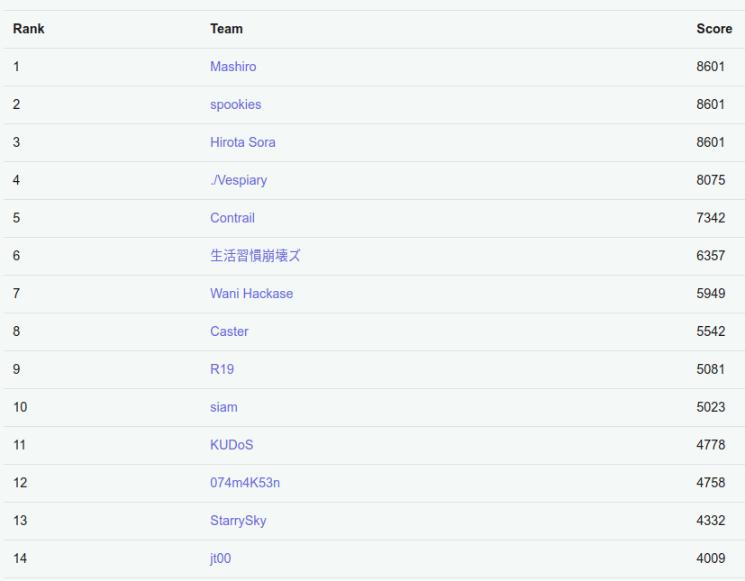
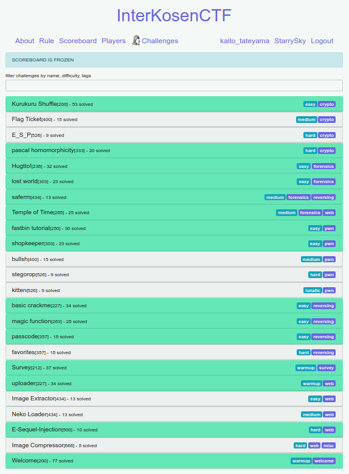
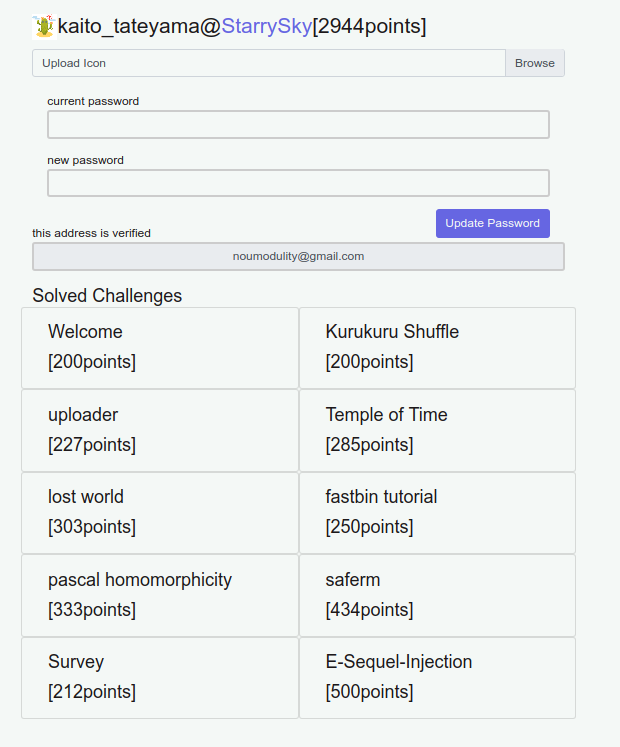

# InterKosenCTF 2019 Writeup

InterKosenCTF2019 に mitsu さんと二人で、チーム StarrySky として参加しました。成績はチームで 13 位/91 人が正の得点、個人では 12 位でした。得点は、4332pts のうち 2944pts を入れました。



勝手にライバルだと思っている おたまこうせん, Wani Hackase, 生活習慣崩壊ズ, Contrail には完敗です。今回 Contrail 強かったですね...



Pwn と Web が課題ですね



saferm と E-Sequel-Injection が通せたのは嬉しかったです


うごくペンギンさんかわいいです

## Writeup

- [InterKosenCTF 2019 Writeup](#interkosenctf-2019-writeup)
  - [Writeup](#writeup)
    - [Welcome](#welcome)
    - [Kurukuru Shuffle](#kurukuru-shuffle)
    - [uploader](#uploader)
    - [Temple of Time](#temple-of-time)
    - [lost world](#lost-world)
    - [fastbin tutorial](#fastbin-tutorial)
    - [pascal homomorphicity](#pascal-homomorphicity)
    - [saferm](#saferm)
    - [Survey](#survey)
    - [E-Sequel-Injection](#e-sequel-injection)
- [最後に](#最後に)
- [復習](#復習)
  - [basic_crackme](#basic_crackme)
  - [ref](#ref)

### Welcome

[200pts, 77solved, warmup, welcome]
Slack で flag がアナウンスされました
`KosenCTF{g3t_r34dy_f0r_InterKosenCTF_2019}`

### Kurukuru Shuffle

[200pts, 53solved, easy, crypto]
`shuffle.py`を見ると、ランダムに`0`から`L-1`の数字を 3 つ作り、それをもとにして flag の 2 つの文字の swap を`L`回繰り返しています。ランダムが出てきたときは、全探索するか、ランダムな数値をいっぱいとってきて次が予測できないか、結果からのエスパーのどれかを考えるとよさそうなので、全探索を考えます。
`L=53`と`secret.py`から分かるので、$O(L^3)$をしても大丈夫です。`a`, `b`,`k`の値を全探索していきましょう。
また、`i`の値は`k->2k->3k->...->(L+1)k(mod L)`と変化し、最後の`(L+1)k`は使われないので、`Lk`からこれを逆順にたどればよいと分かります。

```py
for k in range(1,L):
    for a in range(0,L):
        for b in range(0,L):
            e = list("1m__s4sk_s3np41m1r_836lly_cut3_34799u14}1osenCTF{5sKm") # secret
            i = 0
            for s in range(L):
                i = ((L-s)*k) % L
                s = (i + a) % L
                t = (i + b) % L
                e[s], e[t] = e[t], e[s] # swap

            # encrypted = "".join(encrypted)
            print("".join(e))
```

実際はこれでたくさんの候補がでてきてしまいます。

```shell
$ python3 shuffle.py | grep ^KosenCTF{
KosenCTF{5s4m1m1_m4rk_s3np41_1s_s38l9y_cut3_34769l1u}
KosenCTF{5s4m1m1_m4rk_s3np41_1s_s38l9y_cut3_34769l1u}
KosenCTF{5s4m1m1_m4sk_s3np41_1s_r34l9y_cut3_38769l1u}
KosenCTF{5s4m1m1_m4sk_s3np41_1s_r34l9y_cut3_38769l1u}
KosenCTF{us4m1m1_m4sk_s3np41_1s_r34lly_cut3_38769915}
KosenCTF{us4m1m1_m4sk_s3np41_1s_r34lly_cut3_38769915}
```

これらを順に submit していくと、当たりました。
`KosenCTF{us4m1m1_m4sk_s3np41_1s_r34lly_cut3_38769915}`

### uploader

[227pts, 34solved, warmup, web]
ソースコードが与えられているので読んでみると、以下の 2 点に気づきます

1.SQLite なので、SQL Injection ができそう。特に search 2.`if (count($rows) == 1 && $rows[0][0] === $name && $rows[0][1] == $_GET['passcode'])`が、passcode のところで`==`が使われていて怪しい。

ここで、2 番に時間を使ってしまったのですが間違いでした。`==`の両端がユーザー入力に起因するものであれば話が早いのですが、今回は片方が固定されているので難しいようです。例えば、passcode が`0e123`なら`0e123==0`が True になるのですが、今回は違いました。 1.を考えていきます。searchbox に`') -- `を入れてみるとうまく動いたので、`UNION`して passcode も一緒に抜き出せばよさそうです。
`') UNION SELECT passcode FROM files --`と searchbox に入力して、色々出てくるものを片っ端から入力していきましょう。今回はユーザーがアップロード可能なのでハズレもたくさんあります。
`"the_longer_the_stronger_than_more_complicated"`が`secret_file`の passcode になることが分かりました。これで`secret_file`がダウンロードできます。
`KosenCTF{y0u_sh0u1d_us3_th3_p1ac3h01d3r}`

### Temple of Time

[285pts, 25solved, medium, forensics, web]
pcapng ファイルが与えられています。Network 問ですね！
wireshark で開くと、パケットの量が多いのでとりあえず一つ`TCP follows`します
すると、どうやら以下のような payload を送っていることが分かります。

```text
/index.php?portal='OR(SELECT(IF(ORD(SUBSTR((SELECT+password+FROM+Users+WHERE+username='admin'),1,1))=57,SLEEP(1),'')))#
```

Blind SQL Injection ですね。パスワードを復元しましょう。
...wireshark の使い方が分からないので以下のように`string| grep`して text ファイルに出力し、それを python で処理しました。

```shell
$ strings 40142c592afd88a78682234e2d5cada9.pcapng | grep GET > text.txt
```

python code

```python
import urllib.parse
f = open('./text.txt', 'r')
string = f.readline()
import re
ans = [0]*40
while string:
    mod = string.split(" ")[1]
    tex = urllib.parse.unquote(mod)
    # pattern = "/index.php?portal='OR(SELECT(IF(ORD(SUBSTR((SELECT+password+FROM+Users+WHERE+username='admin'),(\d+),1))=(\d+),SLEEP(1),'')))"
    pattern = ".*?(\d+).*?(\d+).*?(\d+).*?(\d+).*"
    result = re.match(pattern, tex)
    if result:
        where = int(result.group(1))
        charcode = int(result.group(3))
        print(where, charcode)
        ans[where] = charcode
    string = f.readline()
for i in range(40):
    print(chr(ans[i]), end="")
```

出力

```text
...
37 92
37 93
37 94
37 95
37 96
37 123
37 124
37 125
37 126
KosenCTF{t1m3_b4s3d_4tt4ck_v31ls_1t}
```

flag が得られました。
`KosenCTF{t1m3_b4s3d_4tt4ck_v31ls_1t}`

### lost world

[303pts, 23solved, easy, forensics]
最初に VirtualBox で入ってみると`root`で入れなかったので、もしかしてと思って vdi 自体を`strings | grep`しました

```shell
$ strings lost_world.vdi| grep KosenCTF{
Jul 30 21:54:58 interkosenctf kernel: [  384.221654] KosenCTF{???????????????????????????????}^
Jul 30 21:56:03 interkosenctf kernel: [    7.089636] KosenCTF{???????????????????????????????}^
Jul 30 22:02:00 interkosenctf kernel: [    5.650095] KosenCTF{???????????????????????????????}^
Jul 30 21:54:58 interkosenctf kernel: [  384.221654] KosenCTF{???????????????????????????????}^
Jul 30 21:56:03 interkosenctf kernel: [    7.089636] KosenCTF{???????????????????????????????}^
Jul 30 22:02:00 interkosenctf kernel: [    5.650095] KosenCTF{???????????????????????????????}^
Aug 11 12:26:37 interkosenctf kernel: [    1.134291] KosenCTF{u_c4n_r3s3t_r00t_p4ssw0rd_1n_VM}^
Aug 11 12:26:37 interkosenctf kernel: [    1.134291] KosenCTF{u_c4n_r3s3t_r00t_p4ssw0rd_1n_VM}^
MESSAGE=KosenCTF{???????????????????????????????}^
MESSAGE=KosenCTF{???????????????????????????????}^
MESSAGE=KosenCTF{u_c4n_r3s3t_r00t_p4ssw0rd_1n_VM}^
```

一回起動したおかげで、strings で解けるようになってしまったみたい。
`KosenCTF{u_c4n_r3s3t_r00t_p4ssw0rd_1n_VM}`

### fastbin tutorial

[250pts, 30solved, easy, pwn]
面白い問題でした。が、適当に malloc と free を繰り返し read すると解けてしまった...偶然ガチャを引いてしまった気分なので復習したいです(手順も覚えてません、すみません...)
`KosenCTF{y0ur_n3xt_g0al_is_t0_und3rst4nd_fastbin_corruption_attack_m4yb3}`

### pascal homomorphicity

[333pts, 20solved, hard, crypto]
まずは手元で与えられたものを動かして感覚を掴みます。よくみると、`pow`のとり方が変なことに気づきます。

```text
c = pow(1 + n, key, n * n)
```

今知りたいのは key です。二項定理で展開すると、 $k=key$ として $c=(1+n)^k=1+nk\mod n^2$ となります。ここで、`c-1`は key を因数に持つこと、`n`はとても大きな 2 つの素数の積であることを考えると、`c`を問題サーバから 2 つとってきて、その gcd を求めてやればよいとわかります(`p`,`q`がかぶる可能性がゼロではないので、実際には 3 つとって 3 パターン試しました)

```python
enc = 1117592785756945002738587405183374707997236278832876752382077257896599451757365415136677068649202271625728711821443802541774251719291043243174615118338499367764139108608978912484729674259016683702441635510210410592886340310951498663601956453368016849654044425358486660239829076023396143385365334100325762893863056704023424484236267267163330075803211115662510582831949315847282719696491488496688402066546770670414750388491616 # とってきた値
enc2 = 1426474518666386316952373644886367601067639538435511328875578111313507804333236413595323851672437342906978654624082015584969147016118358685644525710591604212444576378649957985369742169965571282944581336873961524078849506868840212988217246723168750947170868834263585239768592166304488082428998836788690037084234273668740247284858651061564029780768978530663053893783468283981333638372026457086457504452676555823252793501250656 # とってきた値
def gcd(a, b):
	while b:
		a, b = b, a % b
	return a
key = gcd(enc-1, enc2-1)
ans = key.to_bytes(200,'big')
print(ans)
```

得られた結果は以下の通りです。gcd は高速なのでそれほど時間はかかりませんでした。

```python
b'\x00\x00\x00\x00\x00\x00\x00\x00\x00\x00\x00\x00\x00\x00\x00\x00\x00\x00\x00\x00\x00\x00\x00\x00\x00\x00\x00\x00\x00\x00\x00\x00\x00\x00\x00\x00\x00\x00\x00\x00\x00\x00\x00\x00\x00\x00\x00\x00\x00\x00\x00\x00\x00\x00\x00\x00\x00\x00\x00\x00\x00\x00\x00\x00\x00\x00\x00\x00\x00\x00\x00\x00\x00\x00\x00\x00\x00\x00\x00\x00\x00\x00\x00\x00\x00\x00\x00\x00\x00\x00\x00\x00\x00\x00\x00\x00\x00\x00\x00\x00\x00\x00\x00\x00\x00\x00\x00\x00\x00\x00\x00\x00\x00\x00\x00\x00\x00\x00\x00\x00\x00\x00\x00\x00\x00\x00\x00\x00\x00\x00\x00\x00\x00\x00\x00\x00\x00\x00\x00\x00\x00\x00\x00\x00\x00\x00\x00\x00\x00\x00\x00\x00KosenCTF{Th15_15_t00_we4k_p41ll1er_crypt05y5tem}'
```

flag が得られました。
flag から推察するに、[Paillier 暗号](https://ja.wikipedia.org/wiki/Paillier%E6%9A%97%E5%8F%B7)なるものがあるそうです。flag を得る前に、mitsu さんが問題で扱われている暗号に加法準同型性があることを指摘していました。流石 mitsu さんだ...
`KosenCTF{Th15_15_t00_we4k_p41ll1er_crypt05y5tem}`

### saferm

[434pts, 13solved, medium, forensics, reversing]
ディスクイメージが与えられるので、調べてみます

```shell
$ file disk.img
disk.img: DOS/MBR boot sector; partition 1 : ID=0x83, start-CHS (0x0,0,2), end-CHS (0x1,70,5), startsector 1, 20479 sectors
```

USB デバイスとのことなので、ファイルシステムが FAT かな？と思って [fatcat](https://github.com/Gregwar/fatcat) を試しましたがうまく行かず。
そこで、7zip で無理やり解凍してみました。

```shell
$ 7z x disk.img

7-Zip [64] 16.02 : Copyright (c) 1999-2016 Igor Pavlov : 2016-05-21
p7zip Version 16.02 (locale=en_US.UTF-8,Utf16=on,HugeFiles=on,64 bits,12 CPUs Intel(R) Core(TM) i7-8700K CPU @ 3.70GHz (906EA),ASM,AES-NI)

Scanning the drive for archives:
1 file, 10485760 bytes (10 MiB)

Extracting archive: disk.img
--
Path = disk.img
Type = MBR
Physical Size = 10485760
----
Path = 0.img
Size = 10485248
File System = Linux
Offset = 512
Primary = +
Begin CHS = 0-0-2
End CHS = 1-70-5
--
Path = 0.img
Type = NTFS
Physical Size = 10485248
File System = NTFS 3.1
Cluster Size = 4096
Sector Size = 512
Record Size = 1024
Created = 2019-06-20 21:30:30
ID = 5966558221663459341

Everything is Ok

Folders: 3
Files: 14
Alternate Streams: 2
Alternate Streams Size: 262428
Size:       2319696
Compressed: 10485760
```

`File System = NTFS 3.1`が見えますね。どうやら NTFS のようなので、別のツールを探します。
探してみると、[RecuperaBit](https://github.com/Lazza/RecuperaBit)が見つかりました。このツールを使って、`document.zip`というファイルが復元できました。
しかし、zip は開けません。7zip で展開した時の`saferm`というファイルに注目します。ためしに適当に`a.txt`というファイルを作って`saferm`を使ってみます。

```shell
$ ltrace ./saferm a.txt
fopen("a.txt", "rb+")                                      = 0x5653ddbd4260
fopen("/dev/urandom", "rb")                                = 0x5653ddbd4490
fread(0x7fff8571ac98, 8, 1, 0x5653ddbd4490)                = 1
fclose(0x5653ddbd4490)                                     = 0
fread(0x7fff8571acd8, 1, 8, 0x5653ddbd4260)                = 0
fclose(0x5653ddbd4260)                                     = 0
unlink("a.txt")                                            = 0
+++ exited (status 0) +++
```

unlink(削除処理)の前になにかしているようです。どうなっているのか知るために、[radare2](https://github.com/radare/radare2)を用いて unlink 部分を`ff`で潰します。saferm を実行すると SEGV しますが、unlink 以降の流れは無視して良いので OK です。ltrace を見るに、8byte 区切りで何かが行われてそうなので、8 文字区切りでわかりやすくなるよう a.txt を作り、`$ ./saferm a.txt`します。

```text
12345678876543219
```

が、

```text
����7,)����2) 9
```

のように変化しました。
Ghidra で見てやると、以下のような関数`saferm`を発見します。

```c
​
void saferm(EVP_PKEY_CTX *pEParm1)
​
{
  int iVar1;
  undefined4 extraout_var;
  EVP_PKEY *pkey;
  EVP_PKEY_CTX *ctx;
  long in_FS_OFFSET;
  ulong local_30;
  FILE *local_28;
  ulong local_20;
  size_t local_18;
  long local_10;

  local_10 = *(long *)(in_FS_OFFSET + 0x28);
  pkey = (EVP_PKEY *)&DAT_00100af4;
  ctx = pEParm1;
  local_28 = fopen((char *)pEParm1,"rb+");
  if (local_28 == (FILE *)0x0) {
    perror((char *)pEParm1);
  }
  else {
    iVar1 = keygen(ctx,pkey);
    local_20 = CONCAT44(extraout_var,iVar1);
    while( true ) {
      local_18 = fread(&local_30,1,8,local_28);
      if (local_18 != 8) break;
      local_30 = local_30 ^ local_20;
      fseek(local_28,-8,1);
      fwrite(&local_30,8,1,local_28);
    }
    fclose(local_28);
    iVar1 = unlink((char *)pEParm1);
    if (iVar1 != 0) {
      perror((char *)pEParm1);
    }
  }
  if (local_10 != *(long *)(in_FS_OFFSET + 0x28)) {
                    /* WARNING: Subroutine does not return */
    __stack_chk_fail();
  }
  return;
}
```

本質的には

```c
while( true ) {
      local_18 = fread(&local_30,1,8,local_28);
      if (local_18 != 8) break;
      local_30 = local_30 ^ local_20;
      fseek(local_28,-8,1);
      fwrite(&local_30,8,1,local_28);
    }
```

ここが大事で、要はある定数 local_20(=`C`とおく)と、消したいファイルから 8byte とってきたものを XOR して元のファイルを書き換えているという処理がされています。
この定数がわかれば、`X xor C xor C = X`より、元の zip が復元できそうです。
定数はランダムなので全探索を考えましたが、計算量は`256^8`と厳しいので、推測できないか考えます。
いくつかの種類のファイルで zip を作り前の 8byte を見たところ、

```text
50 4b 03 04 14 00 08 00
```

となっていたので、これになるような定数を探すことにしました。前の 8byte だけ見ればよくて、定数`C`は

```text
C = [46, 87, 173, 46, 255, 200, 194, 73]
```

となります。これを用いて 8byte ずつ読み込んで XOR して新しいファイルに書き込むスクリプトを書きましたが、それでもうまくいきません。`hexdump -C edit.zip`とみてやると、`locument`などの文字が見えたのでこれが`document`となるように`C`を修正しました。(以下のスクリプトの`xor_vec`にあたります)

```python
xor_vec = [46, 87, 173, 46, 255, 200, 202, 73]
import struct
f = open("document.zip", "rb")
x = list(f.read())
outdata = bytearray([])
print(x)
for i in range(len(x)//8):
    part = x[8*i:8*i+8]
    xo = [a^b for (a,b) in zip(xor_vec,part)]
    print([chr(a) for a in xo])
    outdata.extend(xo)
outdata.extend(x[8*i+8:])
f.close()
outfile = open("outfile.zip", "wb")
outfile.write(outdata)
outfile.close()
```

zip を解凍すると、ねこちゃんがいる pdf が出てきました。
`KosenCTF{p00r_shr3dd3r}`

### Survey

[212pts, 37solved, warmup, survey]
Survey が時間によらないとアナウンスされていたので、ゆっくり埋めることができました。終わった後だと埋める気にならないので、競技中にアンケートをフェアに行うのはとても良いシステムだと思います。
`KosenCTF{th4nk_y0u_f0r_pl4y1ng_InterKosenCTF_2019}`

### E-Sequel-Injection

[500pts, 10solved, hard, web]
個人的に好きな分野です。いくつかの単語が使用禁止されているときに、それを Bypass してください。という jail escape 系と解釈しています。(自分の中では)
まず、方針を考えると、admin としてログインするのが最終目標なので、
1.admin の password の leak->username でリークさせられないだろうか？
2.admin として、後ろでなんとかする
の 2 つが思い浮かびました。
次に、与えられたソースコードをよく眺めます。

```text
$pattern = '/(\s|UNION|OR|=|TRUE|FALSE|>|<|IS|LIKE|BETWEEN|REGEXP|--|#|;|\/|\*|\|)/i';
```

ここで禁止される単語がわかりますね。OR が潰されているので passw"or"d もダメです。というわけで、1.の方針はやばそうです。
password だけでなんとかしてみます。[SQLi についての記事](https://medium.com/@gregIT/ringzer0team-ctf-sqli-challenges-part-1-6ceff556f4a8)を見ると、比較系は以下のようになっています

```text
= (comparison), <=>, >=, >, <=, <, <>, !=, IS, LIKE, REGEXP, IN
BETWEEN, CASE, WHEN, THEN, ELSE
NOT
AND, &&
XOR
OR, ||
= (assignment), :=
```

`IN`, `NOT`あたりが使えそうですね。
実際にいろいろ打ち込んでいきます。

`' or 1=1 #` 定番。スペースとシャープとイコールと OR で引っかかります。
`'or(1=1)#` スペースなしで出来ました
`'IN('Tokyo')#` #だけでできるようになりました
`'IN('Tokyo')order by 'Tokyo'` or が入っています
`'IN('Tokyo')and!'0'` これで通りました。 -> `SELECT username from users where username='admin' and password=''IN('Tokyo')and!'0'`
流れとしては、まずは禁止文字を使って、徐々に禁止文字の種類を減らすように頑張っていくとよさそうです。
`KosenCTF{Smash_the_holy_barrier_and_follow_me_in_the_covenant_of_blood_and_blood}`

# 最後に

もっともっと精進して、一つでも多くの flag を速く通せるようにがんばりたいです。悔しいです。
作問者はすごい人々だなあと思いました。ツールゲーではなく、頭をひねるものが多くてとても楽しかったです。ありがとうございました。

以降は、2021/10/05 に追記しました。

# 復習

復習をします。

## basic_crackme

ghidra でデコンパイルして `main` 関数を見る。

```c
while (sVar1 = strlen((char *)param_2[1]), (ulong)(long)local_cc < sVar1) {
local_d0 = local_d0 |
            ((((int)*(char *)((long)local_cc + param_2[1]) & 0xfU) << 4 |
            (int)(*(char *)((long)local_cc + param_2[1]) >> 4)) + local_cc) -
            local_c8[local_cc];
local_cc = local_cc + 1;
}
```

`param_2[1]` は `argv[1]` なので、入力値の長さ分だけ while ループを回して正当性チェックをしている。実際、prefix の `Kosen` を入れると以下のように正解とみなされる。

```shell
$ ./crackme Kosen
Yes. This is the your flag :)
```

よって、前から文字を確定させていけば OK。 $len\times 256(utf8)$ だけループを回せばよい。

```python
import subprocess
flag = b""
for j in range(39):
    for i in range(20, 256):
        tmpflag = flag + i.to_bytes(1, 'big')
        print("tmpflag", tmpflag.decode())
        out = subprocess.run(['./crackme', tmpflag.decode()], check=True, stdout=subprocess.PIPE).stdout
        print("out", out)
        if b'Yes' in out:
            print(flag, "char at ", j)
            flag = tmpflag
            break
# KosenCTF{w3lc0m3_t0_y0-k0-s0_r3v3rs1ng}
```

`KosenCTF{w3lc0m3_t0_y0-k0-s0_r3v3rs1ng}`

## ref

- 問題 link [theoremoon/InterKosenCTF2019-challenges-public](https://github.com/theoremoon/InterKosenCTF2019-challenges-public)
