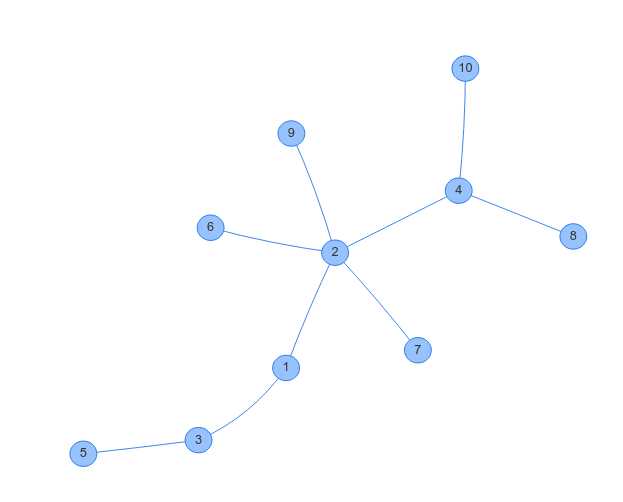

# 木の作り方

ABC138D Ki を本番で嘘解法で通してしまった(after_contest で気づいた)ので、AC コードと自分のコードにランダムにケースを入れて Hack ケースを探そう！と思いました。このとき、木のテストケースの作り方が分からなかったので Twitter で教えてもらいました。以下、それらをまとめておきます。意見をくださった方、ありがとうございます。

# 便利なツール

グラフの可視化には[GRAPH×GRAPH](https://hello-world-494ec.firebaseapp.com/) が便利です。

# 木を順に構成する

Python3 で書きました。

```py
import itertools, random
N = 11
R = 10
l = list(range(1,N))
h = list(itertools.permutations(l))
seed = list(h[R])
graph = []
edge = []
for i in seed:
    if len(graph) != 0:
        edge.append([i, graph[random.randrange(len(graph))]])
    graph.append(i)
print(edge)
for i in edge:
    print("{} {}".format(i[0], i[1]))
```

output

```text
[[2, 1], [3, 1], [4, 2], [5, 3], [6, 2], [8, 4], [10, 4], [7, 2], [9, 2]]
2 1
3 1
4 2
5 3
6 2
8 4
10 4
7 2
9 2
```

GRAPH×GRAPH での結果



木ができています！

## 原理

$1$から$N$までの順列からランダムにひとつとってきて`seed`とします。以下のように木を構成します。`graph`はその時点での木の頂点、`edge`は出力する辺の集合を表します。

- 1.まず`seed[0]`を`graph`に加える
- 2.`seed[i]`と、`graph`からひとつだけ任意に選んだ頂点`K`をつなぐ。具体的には、`edge`に`[seed[i], K]`を追加する。
- 3.`seed[i]`を`graph`に加える。

以降、`seed[i]`がとれなくなるまで手順 2,3 を繰り返す。
手順 2 で連結かつ閉路が存在しないことが確認できるので、これは木になります。

注意点としては、このコードでは`itertools.permutations`に時間がかかっているので、適当に順列を指定してあげればよいです。

# UnionFind を使う

これたぶん次の完全グラフを間引く方法と似ている気がします。(よく分からなかった)
おそらく Kruscal が UnionFind をつかうので、それと近い…？

# 完全グラフを間引いて全域木を作る

(後でやる)

# Prufer Sequence

https://en.wikipedia.org/wiki/Pr%C3%BCfer_sequence
(後でやる)
