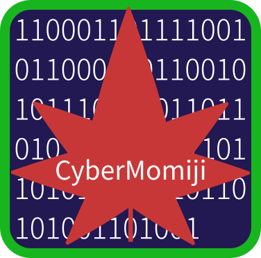
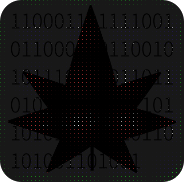
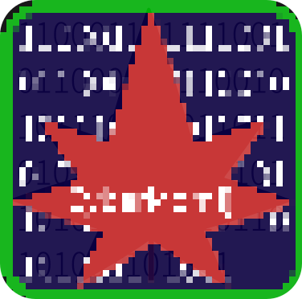
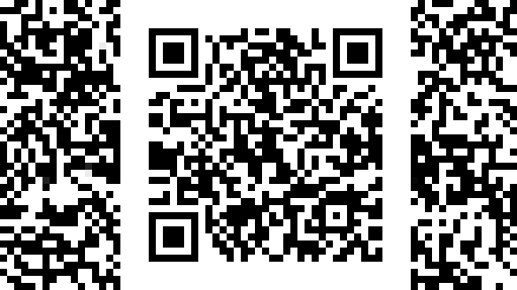
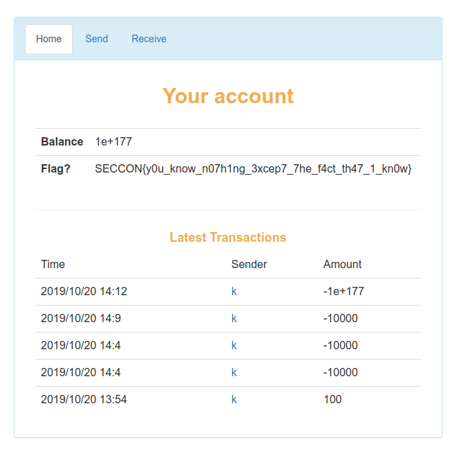
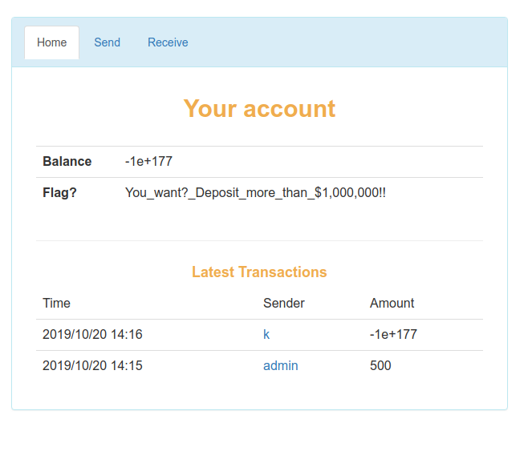

2019/10/19(土)15:00-2019/10/20(日)15:00 まで開催されていた、SECCON CTF 2019 qual にチーム StarrySky で参加していました。今回は mitsu さんが基本情報を受けるのでお休みで、一人チームでの参加となりました。  
結果は Welcome, Thank you for playing!, coffee_break, Sandstorm, ZKPay の 5 問を解いて 743 ポイントを獲得し 102 位(正の得点を取った人数は 799 人)でした。以下、解いたものの Writeup を書きます。

# Welcome

```
Welcome to the SECCON CTF.

Read rules and check the IRC topic.
```

IRC に行くと flag が書かれています。  
`SECCON{Welcome to the SECCON 2019 Online CTF}`

# Thank you for playing!

```
SECCON{We have done all the challenges. Thank you!}
```

そのままです  
`SECCON{We have done all the challenges. Thank you!}`

# coffee_break

```
The program "encrypt.py" gets one string argument and outputs ciphertext.

Example:

$ python encrypt.py "test_text"
gYYpbhlXwuM59PtV1qctnQ==
The following text is ciphertext with "encrypt.py".

FyRyZNBO2MG6ncd3hEkC/yeYKUseI/CxYoZiIeV2fe/Jmtwx+WbWmU1gtMX9m905

Please download "encrypt.py" from the following url.

encrypt.py
```

# Sandstorm

```
I've received a letter... Uh, Mr. Smith?
```

最初はいつものように file, foremost, stegsolve, exiftool をかけて調べました。  
exiftool で妙なものを見つけます。  
`Interlace : Adam7 Interlace`  
Adam と画像に書いてあるし関係ありそうです。調べてみると、先に画像の一部を送り、徐々に後から追加情報を送ることで、解像度が低くともおおまかな情報を伝えられるみたいなアルゴリズムだと理解しました。  
では手元の画像で試してみましょう。(これは僕が所属している、広島でセキュリティ勉強会を開こうとしている団体のロゴです。)ImageMagick を使いました。



この画像に補完なしの Adam7 と、補完ありの Adam7 をかけてみました。[ImageMagick で PNG の形式を変換 2016 awm-Tech](https://blog.awm.jp/2016/01/26/png/)を参考にしています。

```
convert p-1.png -filter Point -fx "!(i%8)*!(j%8)*u" p-2.png
```



```
convert p-1.png -filter Point -fx "p{i-i%8,j-j%8}" p-3.png
```



なんとなく分かりました。では、問題の画像にもこの処理を加えてみましょう。

```
convert sandstorm.png -filter Point -fx "p{i-i%8,j-j%8}" p-4.png
```



QR コードが出てきました。これを読み取ると flag が表示されます。なんというか、とりあえず試してみるとできたみたいな感じでした。  
`SECCON{p0nlMpzlCQ5AHol6}`

# ZKPay

```
http://153.120.18.131/

status solve

http://133.242.52.44/ (Mirror #2) status solve

http://133.242.17.50/ (Mirror #3) status solve
```

QR コードで amount 100 を指定して読み取ってみると、以下のようになっていました。

```
username=k&amount=100&proof=MAINjzgVW2vP/wK3J2/a4WRajXpVfS3YSwCQfI00ltkSMSAwvNW5djnZ/RXhkZKRuwMk735s2ktsoHTWppBPm8sRZycwCjCXFnZPpYgC2XLWSeVqJ7A60jyCSuf0Hx7SbMhUxRf0IUHthi/20cbMOa0jreheM1k8Kc2aL4nISx276bO7HIMBMCAwk6ErCRZ2hx9k4zTQtX6Eu3QVU/4UJXtt3D92iepCqxwxCjDw48/TCc3BFznqVcImZBAsr1261pHFLgTac/1ZivV6AjEgMGlQT08rlUPoSQhG2p6oP6SYD30jVoO3MAyHJgZ7pKcTMQowPVt5bRI6qc6nO4lnZI6BDoszMzituoRSxFpY35b9uAcwCjBFDuUef4/weG2bRAiMhljPN3s+6gURwOq4p8VgX/xxDTEK&hash=e403dfc2abe5f320bbf6d92a20b834d36143b89a1da7200dc225fd5c7504a22a
```

試してみると、amount が変化しても proof は変わらず、username と hash が対応しているようです。また、amount に負の数を指定して [online QR generate サービス](https://www.the-qrcode-generator.com/) で QR を作るとエラーなく読み込まれます。  
そこで 2 つユーザを作り以下のようにしました。

- まず、`username=k&amount=-1000000000000000000000000000000000000000000000000000000000000000000000000000000000000000000000000000000000000000000000000000000000000000000000000000000000000000000000000000000000&proof=MAINjzgVW2vP/wK3J2/a4WRajXpVfS3YSwCQfI00ltkSMSAwvNW5djnZ/RXhkZKRuwMk735s2ktsoHTWppBPm8sRZycwCjCXFnZPpYgC2XLWSeVqJ7A60jyCSuf0Hx7SbMhUxRf0IUHthi/20cbMOa0jreheM1k8Kc2aL4nISx276bO7HIMBMCAwk6ErCRZ2hx9k4zTQtX6Eu3QVU/4UJXtt3D92iepCqxwxCjDw48/TCc3BFznqVcImZBAsr1261pHFLgTac/1ZivV6AjEgMGlQT08rlUPoSQhG2p6oP6SYD30jVoO3MAyHJgZ7pKcTMQowPVt5bRI6qc6nO4lnZI6BDoszMzituoRSxFpY35b9uAcwCjBFDuUef4/weG2bRAiMhljPN3s+6gURwOq4p8VgX/xxDTEK&hash=e403dfc2abe5f320bbf6d92a20b834d36143b89a1da7200dc225fd5c7504a22a`で QR を作る。
- 別ユーザでその QR を読み込む  
  すると、読み込んだユーザは大量の借金を背負い、user k さんはウハウハになりました。





これで flag が得られました。  
`SECCON{y0u_know_n07h1ng_3xcep7_7he_f4ct_th47_1_kn0w}`

# 終わりに

ギャグみたいな解き方しかできてないのでもっと本質的な解き方ができるようになりたい。Pwn 勉強やるぞやるぞ。
