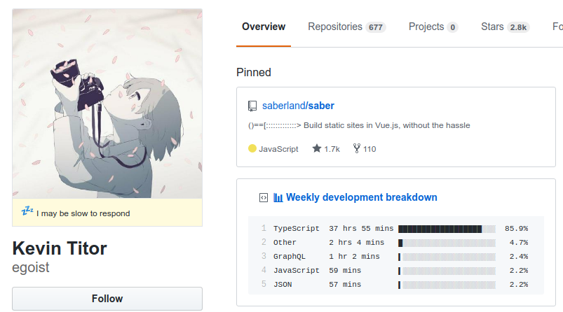
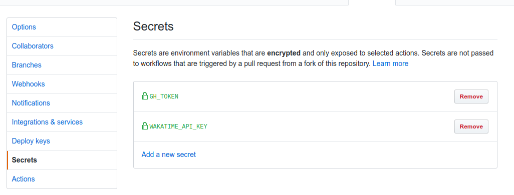
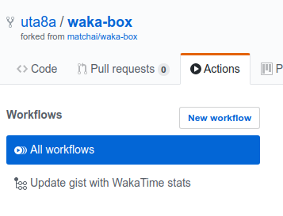
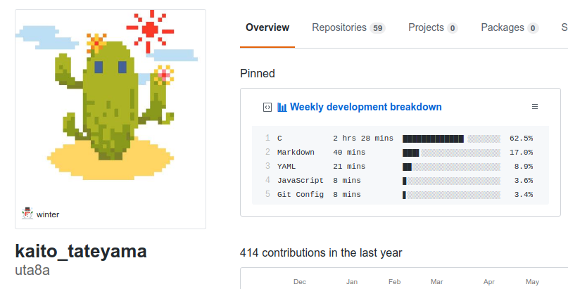

この記事は [広島大学 IT エンジニアアドベントカレンダー] の 4 日目です。  
僕は OSS 界隈で活躍している人の GitHub を見るのが好きです。contribution の数も、有名な OSS へ送った issue や pull request の数も僕とは桁違いで、こうなれたらなあと思います。また、そういった方々は中規模のプロジェクトを作っていることが多いので、プロジェクトのディレクトリ構成とか、どのツールを使っているのか？といった状況を学べます。また、コードを書いて生活する人にとって、GitHub は仕事場のひとつのようなものだと思います。その人の仕事場へのこだわりのようなものを pinned や profile, 所属団体から感じるのは楽しいことで、眺めるだけで時間があっという間に過ぎていきます。  
さて、そんな感じでフロントエンド周りの方々を調べていると ([egoist さん]) の pinned に不思議なものを見つけました。

(写真は 2019-12-02 時点のもの)  
Weekly development breakdown という項目で、どうやら 1 週間に書いたコードの時間となんの言語で書いたかが示されているようです。  
僕もこれやってみたい！というわけで、この記事では、この表を pinned に表示することを目標としてやっていきましょう。

# 仕組み

この表は [waka-box] を使っています。自分のエディタにプラグインを入れておくと一週間のうち何時間コードを書いたか、を示してくれる、"WakaTime"という Web サービスがあり、その API を利用して、gist に表を作っています。  
例えば僕の場合、VSCode に Extension で [WakaTime] を入れています。API を利用するための secret key を入れたら後は何もせずコードを書けば大丈夫です。

# [waka-box] の導入

基本的に [waka-box] の README に従えばできます。自分が詰まったところを捕捉しながら書きます。

## 準備

1. gist を作る(GitHub) -> gist の URL をメモしておく このときの gist は description 以外上書きされるので、gist の中身はなんでもよいです。
2. gist だけにチェックを入れた token を発行(GitHub) -> メモしておく
3. WakaTime のアカウントを作る(wakatime)
4. wakatime の secret key を手に入れる -> メモしておく  
   今 3 つメモしたと思います。1 の gist の URL は公開してもよく、**2,4 は公開してはいけません！**取り扱いに注意しましょう。

## [waka-box] を入れる

https://github.com/matchai/waka-box を自分の GitHub へと fork します。  
準備で手に入れた 3 つの値を入れていきます。gist の id は `.github/workflows/schedule.yml` にすでにある値を書き換えます。  
gist token と wakatime secret key は

Settings の

Secrets に書き込みます。2 つの値を書き込むと上の図のようになります。  
そして、gist を pinned に置きます。完成です！

## 動作確認

### GitHub Actions

GitHub Actions で WakaTime API から情報をとってきて gist に書き込みを行うので、きちんと Actions が動いているか確かめる必要があります。

上の図のように、Workflows に表示があれば OK です。10 分ほど待つと、gist が変化するはずです

### gist に反映されない！

API からデータをとってくるときは**前日から 7 日間のデータをとってきているようです。**僕の場合は、最初 gist に何も書き込まれずファイルが消滅して、次の日 00:00 以降最初の Action でデータが反映されました。

### Action が動かない！

2019/12/20 時点では、waka-box を clone した後に、`.github/workflows/schedule.yml` を一旦削除し、commit して github へ push した後に再度同じ内容の `.github/workflows/schedule.yml` を作り直さないと Action が動かないようです。

参考(私の commit log です)  
delete https://github.com/uta8a/waka-box/commit/64e351d872941cca0b92245929e10a5b20fb2f34  
re-add https://github.com/uta8a/waka-box/commit/079eb1d7d425b4f45b5cfc7aca89c6e1ac4e2a66

# 終わりに

以上です！意外とコードを書いているつもりでも書いていなかったりするので、目安にして精進していきたい...！

<!-- link -->

[広島大学itエンジニアアドベントカレンダー]: https://adventar.org/calendars/4481
[egoistさん]: https://github.com/egoist
[wakatime]: https://wakatime.com/vs-code
[waka-box]: https://github.com/matchai/waka-box
