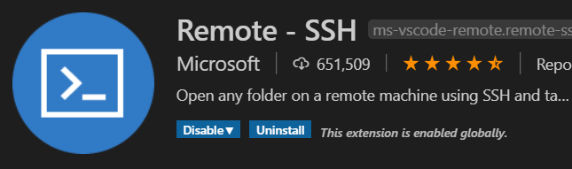
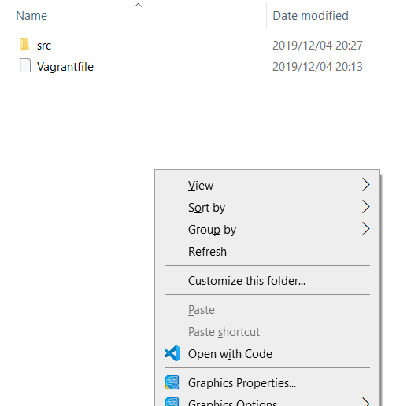
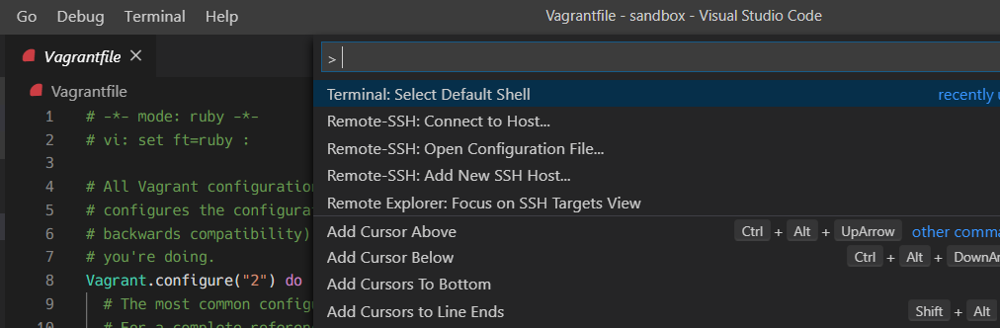
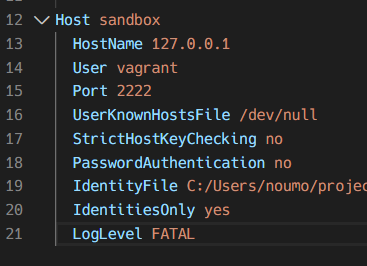
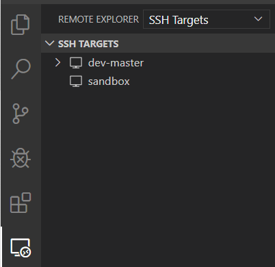
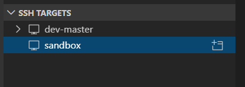
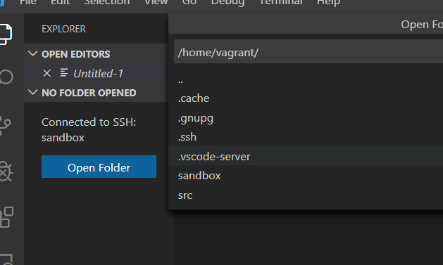

この記事は [広島大学 IT エンジニアアドベントカレンダー] の 9 日目です。  
私は大学に Windows 機と Linux(Ubuntu)機の 2 台の laptop を持っていっています。空きコマにさあコード書くぞ〜！と思ったときに開くのはいつも Ubuntu。Linux 機の方が貧弱なスペックなのですが、コード書くまでにかかる時間は Windows より Linux の方が速いのです。(私は Windows では仮想環境で Ubuntu を立ち上げてその中で開発するのでそれはそう)  
しかし Windows でも快適に開発したい！というわけで、自分なりに快適だと思った環境をメモしておきます。
[Remote Development using SSH](https://code.visualstudio.com/docs/remote/ssh)を見ると詳しくちゃんとしたことが書いてあるので、こちらも参考にしてください。

# 目標

- 仮想環境で SVG を wget して、それを VSCode からファイルクリックすると見れる！という環境を構築する(なぜこれが目標なのかというと、[@imiko](https://twitter.com/es__135) さんが仮想環境で生成した svg を楽に見たいと言っていたので)

# 環境

以下の環境で確認しています。

```
Windows 10 Home
Vagrant 2.2.6
VirtualBox 6.0.14
VSCode 1.41.0
```

- 仮想環境は`bento/ubuntu-18.04`を使用しています。

**ホストでインストールするもの**

- VirtualBox
- Vagrant
- VSCode

VSCode で必要な Extension

- Remote-SSH  
    


# 手順

**Vagrant から仮想環境の立ち上げ**  
VSCode を立ち上げます。  
  
`Open Code`で Vagrantfile のあるフォルダを開き、`` Ctrl+` ``で VSCode 内でターミナルを開き、Windows のターミナルから`vagrant up`します。

**SSH Configuration**  
はじめてのときは SSH 接続するために config を書いておく必要があります。  
  
`Ctrl+Shift+p`で command palette を開き、`Remote-SSH: Open Configuration FIle...`を開きます。  
次に、Windows のターミナルで`vagrant ssh-config`と打ち込みます(vagrant up した状態で、vagrantfile が存在するディレクトリで行ってください)  
以下のような内容が出てくると思います。それを Remote-SSH で開いたファイル`C:\Users\$UserName\.ssh\config`にコピペします。  
  
これで SSH の設定はできました。

**SSH で仮想環境に接続する**  
以下の 2 点が達成できているでしょうか。

- `vagrant up`している
- SSH Config 周りが設定できている  
  それでは、SSH 接続していきましょう。  
    
  SSH 接続できるアイコンがあるのでそれを押して、SSH TARGETS を選びます。今回は sandbox を選びました。  
    
  sandbox を選択したときに出現する、右のアイコンをクリックしてください。VSCode の新しい Window がポップアップしたと思います。おそらく初めて接続した時はは RSA finger print についての警告が出てくると思うのですが Yes で OK です。  
  これで接続ができました。`` Ctrl + ` ``でターミナルに接続すると、仮想環境のターミナルになっていると思います。  
  今回は`mkdir sandbox`して、Open Folder では`sandbox`を選択しました。  
    


**SVG を表示する**  
今回はテストなので、wget で SVG ファイルを引っ張ってきましょう。[Testing SVG files in GitHub Gists](https://gist.github.com/AmeliaBR/193a8f36eb637af1684201821afd5f66)を利用しました。  
仮想環境上のターミナルで、以下を実行します。

```bash
wget https://gist.githubusercontent.com/AmeliaBR/193a8f36eb637af1684201821afd5f66/raw/2f695692701db7be18333926b41b7e9c15944d73/basic-marker.svg
```

`sandbox/`以下にファイルが保存されました。  
VSCode の Extension を入れます。[SVG Viewer](https://marketplace.visualstudio.com/items?itemName=cssho.vscode-svgviewer)を入れました。このとき、SSH で接続した仮想環境上で開いている VSCode でインストールすることが重要です。 <!-- (どうやらHost環境とSSH接続した先ではExtensionの共有がされないようです) --> Extension が`SSH:UBUNTU-Installed`のようになっていれば SSH 接続先でその Extension が使えます。詳しくは [Managing Extensions](https://code.visualstudio.com/docs/remote/ssh#_managing-extensions)を見てください。
これでファイルを開いてから svg viewer の機能を使えば SVG が見れるようになりました。VSCode のファイル上で右クリックして SVG Viewer の機能を選択すればよいです。

**終了時**  
終わる時は SSH 接続を切って、`vagrant halt`を忘れずに。

# Tips

**ファイル管理はどうする？**  
Windows では共有フォルダを作ってやると npm install とかでうまくいかないことが多かったので、今は共有フォルダは作っているけどそこはほしいファイルを`mv ./hoge ../host_directory/`して移すために使っています。開発は共有フォルダではやらずに、git で管理するという感じです。

**ブラウザとかどうする？**  
vagrantfile で`config.vm.network`あたりを設定してあげるとそれほど困りません。  
あと、Nuxt.js で開発しているとき`localhost:3000`で立ち上げて Linux ターミナルのリンクをクリックしたら自動でホスト側のリンクに変換されて chrome で開いたのですがこの機能はなんですか...

**ホスト → 仮想環境上にファイルを送りたい！**  
エクスプローラを開いて VSCode の EXPLORER にドラッグアンドドロップでファイルを送信できます。なんだこの便利機能...

# 終わりに

以上です。便利なので VSCode を使いましょう！  
何か間違いや指摘などあれば、お手数ですが Twitter: [@kaito_tateyama](https://twitter.com/kaito_tateyama)までお願いします。

<!-- link -->

[広島大学itエンジニアアドベントカレンダー]: https://adventar.org/calendars/4481
