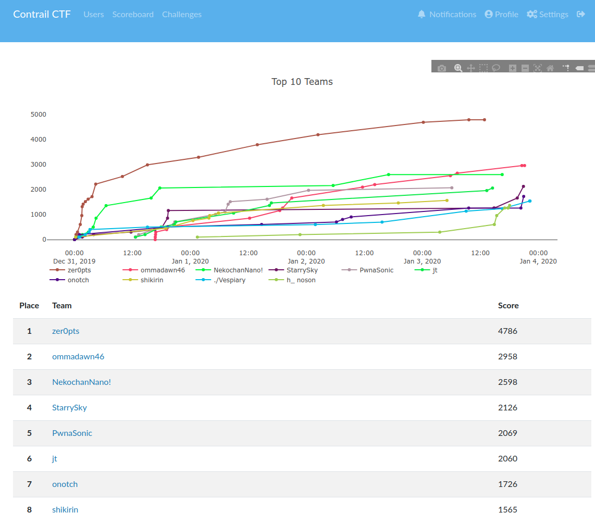

チーム StarrySky は正の点数を得た 78 チーム中、2126 点を獲得して 4 位でした。うち僕は 504 点を獲得しました。  
僕が解いた Lets_Connct、Persistence、alice's password についての Writeup です。



# Lets_Connct[misc]

nc でつなぐよう指示があるのでつなぎ、flag の中身を見ます。

```bash
❯ nc <問題サーバ> 2999
bash: cannot set terminal process group (-1): Inappropriate ioctl for device
bash: no job control in this shell
bash-4.4$ ls
ls
bash
bin
dev
flag
lib
lib32
lib64
bash-4.4$ echo "$(<flag)"
echo "$(<flag)"
Flag has moved to 3000 port on 172.17.0.10.
```

別の場所に flag が移されたようです。nc でつなごうとしますが nc はないと言われてしまいます。

```bash
bash-4.4$ nc 172.17.0.10 3000
nc 172.17.0.10 3000
bash: nc: command not found
```

そこで、`bash nc alternative`と検索をかけると、以下の記事がヒットします  
https://stackoverflow.com/questions/20661320/alternative-to-cat-out-of-a-bash-script  
https://github.com/solusipse/fiche#useful-aliases  
cat がないのでそのまま使うことができません。よく分からないのですが、以下のような手順で flag を得ました。

```bash
bash-4.4$ exec 3<>/dev/tcp/172.17.0.10/3000
exec 3<>/dev/tcp/172.17.0.10/3000
bash-4.4$ while read -t 5 line <&3; do
    echo "$line"
    (( Lines++ ))
donewhile read -t 5 line <&3; do
>     echo "$line"
>     (( Lines++ ))
>
done
ctrctf{b4sh_1s_a_mul7ifuncti0n_sh3ll}
```

flag: `ctrctf{b4sh_1s_a_mul7ifuncti0n_sh3ll}`

# Persistence[forensics]

forensics_persistence.arn というファイルが渡されます。mitsu さんから Autorun で開けると聞いたのでこれはハッキングラボの作り方という本でやったやつだ！！(進研ゼミ感)でテンションを上げました。VM で動かしている Windows10 で[Sysinternals Suite](https://docs.microsoft.com/ja-jp/sysinternals/downloads/sysinternals-suite)をダウンロードして、Autorun64.exe を使っていきます。今回は、素の状態で一度 Autorun を動かし origin.arn を生成してから forensics_persistence.arn と比較を行いました。[こちらの記事](https://www.atmarkit.co.jp/ait/articles/1407/28/news021.html)が参考になります。比較すると緑色のところが差分になるので、そこを見ていくと Evil という項目があり、flag が書いてありました。  
flag: `ctrctf{P3rs1st3nc3_5ch3dul3d_Ta3ks}`

# alice's password[forensics]

Volatility の使い方が試されます。そもそもインストールチャレンジで失敗したのでインストール方法を書いておきます。  
https://github.com/volatilityfoundation/volatility にアクセスしてダウンロードします。vol.py が本体なので、`python path/to/vol.py -f <file> imageinfo`のように使うことができます。mimikatz のような外部プラグインのダウンロードの仕方が分からなかった...(plugins/以下に入れればいけるやろと思ったらうまくいかない)  
`python path/to/vol.py`を`vol`と alias した状態で以下のようにコマンドを打ちました。参考にしたのは[この記事](https://www.andreafortuna.org/2017/11/15/how-to-retrieve-users-passwords-from-a-windows-memory-dump-using-volatility/)と[公式の Wiki](https://github.com/volatilityfoundation/volatility/wiki/Command-Reference)です

```bash
vol -f memdump.mem imageinfo
vol -f memdump.mem hivelist
# 0xfffff8a0063fa010 sam
# 0xfffff8a000024010 system
#
vol -f memdump.mem --profile=Win7SP1x64 hashdump -y 0xfffff8a000024010 -s 0xfffff8a0063fa010 > hashes.txt
```

これで hash が手に入ります。

```text
Administrator:500:aad3b435b51404eeaad3b435b51404ee:31d6cfe0d16ae931b73c59d7e0c089c0:::
Guest:501:aad3b435b51404eeaad3b435b51404ee:31d6cfe0d16ae931b73c59d7e0c089c0:::
Aqua:1000:aad3b435b51404eeaad3b435b51404ee:813ea107eccdab91a1b9c15b67693cb4:::
Alice:1001:aad3b435b51404eeaad3b435b51404ee:19bf8c07d19ea196464115e443854654:::
```

`19bf8c07d19ea196464115e443854654`を[https://crackstation.net/](https://crackstation.net/)にかけると`i<3orange.`と解読されるので、これの md5hash が ZIP のパスワードになります。(うまくいかなかったので最後の md5 から mitsu さんにやってもらった)  
flag: `ctrctf{Y0u_c4n_dump_4nd_cr4ck_hash!}`

# 解けなかった問題

# once_again

# Hacking Battler

# LegacyBlog

# 終わりに

毎度思うけど段階が一個しかない簡単なものしか解けてない。2020 年は勉強して本質が解けるようになりたいです。あと毎回そうだけど今回も mitsu さんが無双していた。  
Contrail の皆さん、年末年始お疲れさまでした。楽しかったです。
