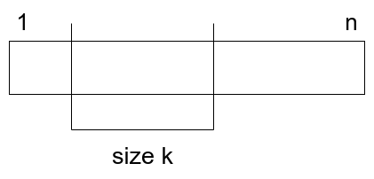

C 問題についてのみ書きます。

# Hello 2020 C New Year and Permutation

**問題**

順列$p_1, p_2, ..., p_n$が与えられる。このとき、部分列$[l,r]$であって$max\(p_l,..,p_r\) - min\(p_l,..,p_r\) = r - l$が成り立つものを framed segment と呼ぶことにする。すべての長さ$N$の順列に対して、framed segment の数を数え上げてその和を素数$M$で割った値を求めよ。

**解法**

順列が与えられて、それに対する framed segment の数を数えると$O\(N!\)$になってしまい計算量的に無理。そこで、**視点を変えて**サイズ$k$の framed segment を横断的に数え上げる方法を考える。  
サイズ$k$の framed segment の位置、内部で使われる数の集合(順番は無視する)を考える。



図のように位置はスタート地点が$1$から$n-k+1$で全部で$n-k+1$通りある。  
また、内部で使われる数は、$r-l+1$個の相異なる数の最大値と最小値の差が$r-l$であることから、連続した$k$個の数なので、これもスライドして考えると$n-k+1$種類ある。

次に、framed segment 外部と内部の順列を考える。これは、内部で$k!$通り、外部で$\(n-k\)!$通りである。

$1 \leq k \leq n$よりこれらを足し合わせて$m$で割れば答えが得られる。

**実装**

最後の足し合わせるところで$O\(N\)$であるので、$N \leq 250000$から各 framed segment のサイズごとは$O\(\log N\)$以下の計算量である必要がある。  
ここで、factorial は$f\(n\) = f\(n-1\) \times n$であることを考えると、これは配列と非常に相性がよく、前計算をしてその配列を使えばよいとわかる。

```
vector<i64> fact(n+1);
fact[0] = 1;
for(i64 i=1;i<=n;i++)fact[i] = fact[i-1]*i%m;
for (k=1;k<=n;k++){
    res += (サイズkのframed segmentの数)
}
```

注意としては、サイズ k の framed segment の数を求める時の overflow である。一つ掛けるごとに MOD をとらなければ違う答えになってしまった。  
計算量は前計算$O\(N\)$, res に足し合わせて$O\(N\)$で全体で$O\(N\)$である。

**コード**

[https://codeforces.com/contest/1284/submission/68567949](https://codeforces.com/contest/1284/submission/68567949)

**感想**

はじめは MOD が関わるライブラリゲーだと思って mod_factorial なる関数を作ったが意味なかった。でもまた同じ思考になるかもしれないので、ライブラリのコメント欄に書いておいた。  
ModInt 理解したい。
