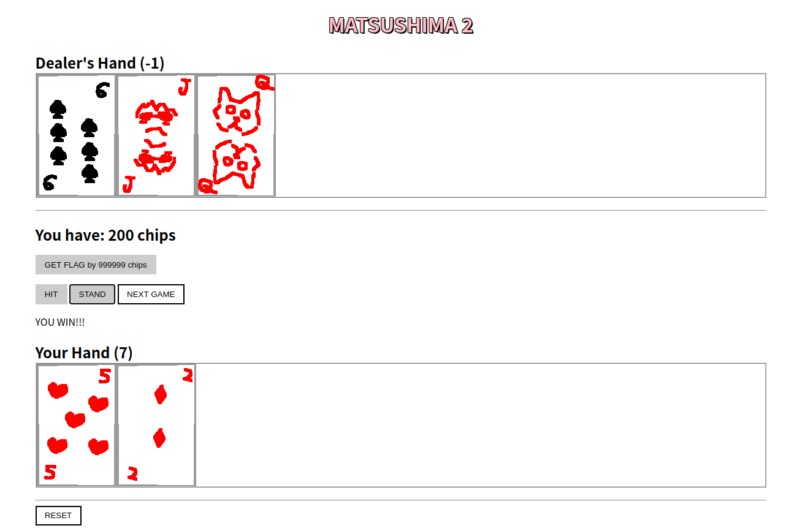
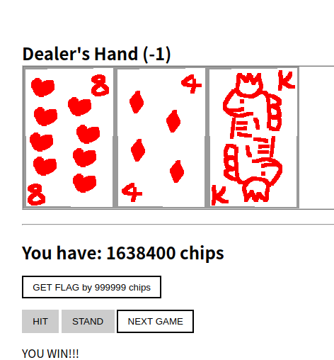
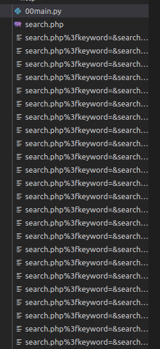

# note

まずは解いたやつを書いておく。

書きかけで、後追いは途中までです。

# 目次

[Welcome](#welcome)  
[Survey](#survey)  
[matsushima2](#matsushima2)  
[limited](#limited)  
[babysort](#babysort)  
[harmagedon](#harmagedon)  
[in question](#in-question)  
[ciphertexts](#ciphertexts)  
[trilemma](#trilemma)  
[authme](#authme)  
[bitcrypto](#bitcrypto)  
[padding oracle](#padding-oracle)  
[Fables of aeSOP](#fables-of-aesop)  
[No pressure](#no-pressure)  
[stratum](#stratum)  
[Tip Toe](#tip-toe)  
[miniblog](#miniblog)  
[readme](#readme)  
[pash](#pash)  
[just sqli](#just-sqli)  
[ochazuke](#ochazuke)  
[confusing](#confusing)  
[padrsa](#padrsa)  
[graphviz++](#graphviz)  
[maze](#mazeu)

(解いたもの)

# Welcome

```
Welcome to InterKosenCTF 2020! All announcement, support, and the welcome flag are available in our Discord.
```

discord の#announcement に flag が貼ってあった。  


```
KosenCTF{w31c0m3_and_13ts_3nj0y_the_party!!}
```

# Survey

```
Please give us your feedback here.
```

アンケートに答えると flag が手に入る。解いた問題が少ないとまともなフィードバックが送れなくて悲しみになるので強くなりたい。

```
KosenCTF{w4s_th1s_ch4ll3ng3_h4rd_4_u?}
```

# matsushima2

```
Do you like poker? I like blackjack! Let's play it here.

matsushima2_a8f90b2a9cff5f0aa8d62010385ffc0c.tar.gz
```



blackjack で遊べる。カードがふるつきさん、ptr-yudai さん、yoshiking さんになっていてかわいい。  
おそらく matsushima2 の意味は SECCON 2018 国内決勝 で出題された松島が元になってそう。[参考](https://st98.github.io/diary/posts/2018-12-24-seccon-2018-domestic-finals.html#%E6%9D%BE%E5%B3%B6)

サーバ側のソースコード(main.py)

```python
from flask import Flask, send_file, request, make_response, jsonify, abort
import random
import jwt
import secret

app = Flask(__name__)
key = secret.key


def blackjack(cards):
    score = 0
    aces = []
    for card in cards:
        card2 = card % 13 + 1
        if card2 == 1:
            aces.append(card2)
        elif card2 >= 10:
            score += 10
        else:
            score += card2

    for a in aces:
        if score + 11 <= 21:
            score += 11
        else:
            score += 1

    if score > 21:
        return -1
    return score


@app.route("/")
def index():
    return send_file("index.html")


@app.route("/card/<int:card_id>.png")
def card(card_id):
    return send_file('images/{}.png'.format(card_id))


@app.route("/initialize", methods=["POST"])
def initialize():
    cards = list(range(13 * 4))
    random.shuffle(cards)

    player_cards = [cards[0]]
    dealer_cards = [cards[1]]
    player_score = blackjack(player_cards)
    dealer_score = blackjack(dealer_cards)
    state = {
        'player': player_cards,
        'dealer': dealer_cards,
        'chip': 100,
        'player_score': player_score,
        'dealer_score': dealer_score,
    }

    response = make_response(jsonify(state))
    state['cards'] = cards[2:]
    response.set_cookie('matsushima', jwt.encode(state, key, algorithm='HS256'), httponly=True, samesite='strict')
    return response


@app.route("/hit", methods=["POST"])
def hit():
    state = request.cookies.get('matsushima', None)
    if state is None:
        return abort(400)

    state = jwt.decode(state, key, algorithms=['HS256'])
    if state['chip'] <= 0:
        return abort(400)

    next_card = random.randrange(0, len(state['cards']))
    card = state['cards'][next_card]
    state['cards'] = state['cards'][:next_card] + state['cards'][next_card+1:]

    state['player'] = state['player'] + [card]
    state['player_score'] = blackjack(state['player'])
    if state['player_score'] < 0:
        state['chip'] = 0

    response = make_response(jsonify({
        'player': state['player'],
        'dealer': state['dealer'],
        'chip': state['chip'],
        'player_score': state['player_score'],
        'dealer_score': state['dealer_score'],
    }))

    response.set_cookie('matsushima', jwt.encode(state, key, algorithm='HS256'), httponly=True, samesite='strict')
    return response


@app.route("/stand", methods=["POST"])
def stand():
    state = request.cookies.get('matsushima', None)
    if state is None:
        return abort(400)

    state = jwt.decode(state, key, algorithms=['HS256'])
    if state['chip'] <= 0:
        return abort(400)

    while True:
        next_card = random.randrange(0, len(state['cards']))
        card = state['cards'][next_card]
        state['cards'] = state['cards'][:next_card] + state['cards'][next_card+1:]

        state['dealer'] = state['dealer'] + [card]
        state['dealer_score'] = blackjack(state['dealer'])
        if state['dealer_score'] < 0 or state['dealer_score'] >= 17:
            break

    if state['dealer_score'] < state['player_score']:
        state['chip'] = state['chip'] * 2
    else:
        state['chip'] = 0

    response = make_response(jsonify({
        'player': state['player'],
        'dealer': state['dealer'],
        'chip': state['chip'],
        'player_score': state['player_score'],
        'dealer_score': state['dealer_score'],
    }))

    response.set_cookie('matsushima', jwt.encode(state, key, algorithm='HS256'), httponly=True, samesite='strict')
    return response


@app.route("/nextgame", methods=["POST"])
def nextgame():
    state = request.cookies.get('matsushima', None)
    if state is None:
        return abort(400)

    state = jwt.decode(state, key, algorithms=['HS256'])
    if state['chip'] <= 0:
        return abort(400)

    if len(state['dealer']) < 2:
        return abort(400)

    if state['dealer_score'] >= state['player_score']:
        return abort(400)

    cards = list(range(13 * 4))
    random.shuffle(cards)
    state['player'] = [cards[0]]
    state['dealer'] = [cards[1]]
    state['cards'] = cards[2:]
    state['player_score'] = blackjack(state['player'])
    state['dealer_score'] = blackjack(state['dealer'])

    response = make_response(jsonify({
        'player': state['player'],
        'dealer': state['dealer'],
        'chip': state['chip'],
        'player_score': state['player_score'],
        'dealer_score': state['dealer_score'],
    }))

    response.set_cookie('matsushima', jwt.encode(state, key, algorithm='HS256'), httponly=True, samesite='strict')
    return response


@app.route('/flag')
def flag():
    state = request.cookies.get('matsushima', None)
    if state is None:
        return abort(400)

    state = jwt.decode(state, key, algorithms=['HS256'])
    if state['chip'] >= 999999:
        return jsonify({
            'flag': secret.flag,
        })
    else:
        return abort(400)


if __name__ == '__main__':
    from gevent import monkey
    monkey.patch_all()

    from gevent.pywsgi import WSGIServer

    http_server = WSGIServer(('0.0.0.0', 5000), app)
    http_server.serve_forever()

```

コードを読むと、初期値 100chips, 勝てば倍になっていき、999999chips を超えると flag が手に入る仕組み。  
2 つ方針を考えた。1 つは、jwt の脆弱性を利用するもの。alg で None とか、間違って secret が手に入っちゃうとか、jwt を発行するときに値を好き放題入れられるとかを考えたけどうまくいかなかった。理由としては、すべてサーバ側で処理していることが挙げられる。2 つめは、ブラックジャックで次に来るカードをすべて予測して勝利するもの。(乱数に脆弱性のある暗号問でよくあるやつ)さて、jwt の中身は、以下のようになっている。(jwt.io を用いた)

```js
{
  "player": [
    1
  ],
  "dealer": [
    7
  ],
  "chip": 200,
  "player_score": 2,
  "dealer_score": 8,
  "cards": [
    45,
    24,
    40,
    15,
    18,
    21,
    6,
    42,
    49,
    46,
    5,
    11,
    44,
    33,
    47,
    32,
    22,
    25,
    38,
    41,
    28,
    23,
    39,
    13,
    16,
    27,
    2,
    48,
    26,
    4,
    14,
    3,
    17,
    19,
    36,
    50,
    0,
    31,
    43,
    12,
    34,
    30,
    9,
    37,
    51,
    8,
    10,
    29,
    35,
    20
  ]
}
```

cards が書いてあるじゃん！！2 つめの方針いける！！と思ったが、`/stand`や`/hit`の処理を見るとわかるように結局 randrange しているので予測はできない。  
うんうん悩んでいたら、そもそも cookie だけでしかやりとりしていないことに気づいた。これは jwt はブラックボックスのままで、負けたら手前の状態の cookie を保存しておいてそれをもう一度セットすれば負ける前の状態に戻れるのでは？→ できた！死に戻りできる！(アニメの見すぎ)  
というわけで勝ったら next game を押し、cookie をメモしておいて負けたら cookie をセットして...という形で手作業でやっていった。14 回勝てば目標額を超えるので、手作業でも間に合う。cookie の変更は chrome devtools > applications からやった。



```
KosenCTF{r3m3mb3r_m475u5him4}
```

こういうときサッと自動化できたら強いんだろうな...

# limited

```
Our website had been attacked by someone. Did the attacker successfully steal the admin's secret?

limited_2a6f6c5f14589179b1ce3e73937cae45.tar.gz
```

pcap ファイルが渡されて、それを見ていく問題。こういうのって、pcap ファイルのみで完結する場合と、その中で指定された IP のサーバが生きててそこと通信する場合の 2 つがあると思うんだけど、今回は pcap ファイルのみで完結するものだった。  
Network 問は HTTP Stream を抜き出して、どんなやりとりがなされたかが分かればあとはプログラミングコンテストになりがちな気がするので工夫が大変そう。かといって、CTF ではないけど[求む！TLS1.3 の再接続を完全に理解した方(Challenge CVE-2020-13777)](https://jovi0608.hatenablog.com/entry/2020/06/13/104905)みたいなやつだとえげつなくて解けないのでうーんという感じ。でも Network 問でこれからも HTTP Stream 抜き出してホイみたいな問題が出続けるとも限らないので、ちゃんと暗号化された通信の勉強もしないとなぁ...うう  
本題に入ります。  
wireshark を用いていくつかのパケットで follow HTTP stream して中身をみていくと、 `GET /search.php?keyword=&search_max=%28SELECT+unicode%28substr%28secret%2C+1%2C+1%29%29+FROM+account+WHERE+name%3D%22admin%22%29+%25+13 HTTP/1.1` みたいなクエリがたくさんみつかります。これは SQL injection をしているなと思ったので、これらを個別に処理したくなり、wireshark の左上の方のボタンを押して、それぞれの HTTP Stream をすべてファイルにしました。



search.php, クエリが関係なさそうないくつかいらないファイルを消して以下のコードを書きました。(`00main.py`)

```python
import glob
from urllib.parse import parse_qs
import re
a = glob.glob("search*")
print(a)
arr = []
secret = []
for path in a:
    p = "http://example.com?" + path
    q = parse_qs(p)
    if not 'search_max' in q.keys():
        continue
    qq = q['search_max'][0] #regex
    # print(qq)
    m = re.search(r'secret, (\d{1,2}),', qq)
    mm = re.search(r'% (\d{1,2})', qq)
    A = m.groups()[0]
    B = mm.groups()[0]
    b = open(path, "r").read() #regex
    n = re.findall(r'php\?id=(\d{1,2})', b)
    C = 0 if n == [] else max([int(i) for i in n])
    arr.append([int(A),int(B),C])
# secret get
arr.sort(key=lambda x:x[0])
print(arr)
index = 0
prob = [65]
for elem in arr:
    A = elem[0]
    B = elem[1]
    C = elem[2]

    if index != A:
        # init
        index += 1
        secret.append(prob)
        prob = []
        j = 0
        while B*j+C < 123:
            prob.append(B*j + C)
            j+=1
    else:
        rem = []
        for k in prob:
            if k%B != C:
                rem.append(k)
        for ii in rem:
            prob.remove(ii)
print(secret)
for sec in secret:
    if len(sec) == 1:
        print(chr(sec[0]), end="")
# KosenCTFu_c4n_us3_CRT_f0r_LIMIT_1nj3ct10n_p01nt
# KosenCTF{u_c4n_us3_CRT_f0r_LIMIT_1nj3ct10n_p01nt}
```

それぞれのクエリでは、secret の A 番目の文字を X としたとき、  
`ord(X)%B == C`・・・(1)  
となるような A,B,C が得られます。A は 1~50 まで動くので、各 A に対する X が分かれば flag が得られます。複数の式(1)が与えられるので CRT(中華剰余定理)でもいいのですが、範囲が狭いので最初の式で候補を絞って、次の式でその候補から除外していくという方法をとっています。  
これで flag が得られました。

```
KosenCTF{u_c4n_us3_CRT_f0r_LIMIT_1nj3ct10n_p01nt}
```

(後追い)

# babysort

# harmagedon

# in question

# ciphertexts

# trilemma

# authme

# bitcrypto

# padding oracle

# Fables of aeSOP

# No pressure

```
nc misc.kosenctf.com 10002

No pressure_1cbec3179ffae85c628143284fef23c5.tar.gz
```

与えられたソースコードは以下のようになっています

```python
from Crypto.Cipher import ARC4
from hashlib import sha256
from base64 import b64encode
import zlib
import os

flag = open("./flag.txt", "rb").read()

nonce = os.urandom(32)
while True:
    m = input("message: ")
    arc4 = ARC4.new(sha256(nonce + m.encode()).digest())
    c = arc4.encrypt(zlib.compress(flag + m.encode()))
    print("encrypted! :", b64encode(c).decode())
```

...Crypto?とりあえず poetry で pycrypto をいれるなどしました。ARC4 ってなんだろうと思って調べてみたところ、RC4 だと商標にひっかかる？らしく、Alleged-RC4 ということで、実質 RC4 です。  
さて、RC4 はストリーム暗号なので、padding oracle 系のが刺さるのかな、2 文字目は特定できるという話を聞いたこともあるな、といろいろやっていたが全く当たらないので、zlib になにか仕掛けがあるんじゃないか、特に LZ77,ハフマン符号だと flag と似た文字列を message に置けば短くなるはずなので...と思いましたが特にわからなかったです。  
答えを見ます。 [yoshiking さんの作問者 writeup](https://yoshiking.hatenablog.jp/entry/2020/09/07/101829)  
zlib でした。ストリーム暗号なので暗号前と後で長さが不変、それはそう...解けたじゃんつらい...  
[Laika さんの Writeup](https://blog.albina.cc/2020/09/interkosenctf-2020-writeup.html) を参考に書いた(というかほぼコピー)  
どんな処理をしているかというと、encrypt が帰ってきたら b64decode して比較できるようにしておいて、短い長さが来たらありうる文字を更新するという感じ。

```python
from pwn import *
from base64 import b64decode
from string import ascii_letters, digits, punctuation

### --- サーバが閉じているようなので手元で検証しました ---
# s = remote('misc.kosenctf.com', 10002)
s = process(['poetry', 'run', 'python3', 'main.py'])

ch = ascii_letters + digits + punctuation
flag = 'KosenCTF{'

def encrypt(message):
    s.recvuntil('message: ')
    s.sendline(message)
    encrypted = s.recvline().split(b':')[-1].strip()
    encrypted = b64decode(encrypted)
    return encrypted

while True:
    candidate = None
    shortest, longest = 1000, -1
    for c in ch:
        check = flag + c
        length = len(encrypt(check))
        if length < shortest:
            shortest = length
            candidate = c
        longest = max(longest, length)
    if shortest == longest:
        break
    flag += candidate
    print(flag)
print('Result: ', flag)
```

動かした様子は以下の通り(手元なので dummy flag です)

```
$ poetry run python3 pwny.py
[+] Starting local process '/home/uta8a/.poetry/bin/poetry': pid 22642
KosenCTF{h
KosenCTF{ho
KosenCTF{hog
KosenCTF{hoge
KosenCTF{hoge_
KosenCTF{hoge_p
KosenCTF{hoge_pi
KosenCTF{hoge_piy
KosenCTF{hoge_piyo
KosenCTF{hoge_piyo_
KosenCTF{hoge_piyo_f
KosenCTF{hoge_piyo_fu
KosenCTF{hoge_piyo_fug
KosenCTF{hoge_piyo_fuga
KosenCTF{hoge_piyo_fuga}
KosenCTF{hoge_piyo_fuga}K
KosenCTF{hoge_piyo_fuga}Ko
KosenCTF{hoge_piyo_fuga}Kos
KosenCTF{hoge_piyo_fuga}Kose
KosenCTF{hoge_piyo_fuga}Kosen
KosenCTF{hoge_piyo_fuga}KosenC
KosenCTF{hoge_piyo_fuga}KosenCT
KosenCTF{hoge_piyo_fuga}KosenCTF
```

手元での確認なので flag はなし。

# stratum

# Tip Toe

# miniblog

# readme

# pash

# just sqli

# ochazuke

# confusing

# padrsa

# graphviz++

# maze
