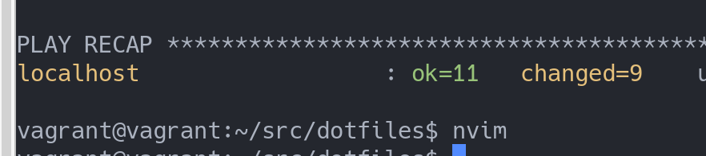

- この記事は [広島大学 IT エンジニア Advent Calendar 2020](https://adventar.org/calendars/5209) の 1 日目です。新しい PC を買って vim を入れて git を入れて...とか、VirtualBox で新しく VM 立ち上げて設定して...と何度も同じことをしていると自動化したくなります。テストを含めてやってしまいましょう！
- [使用技術、キーワード] ansible, goss, Docker, dotfiles, GitHub Actions
- なにか間違いや感想ありましたら [Twitter: @kaito_tateyama](https://twitter.com/kaito_tateyama) か [マシュマロ](https://marshmallow-qa.com/kaito_tateyama) にお願いします。

## # 目次

- まず、**目標**、**環境**、**概要**、**やってみる** でざっくりと PC の初期セットアップする流れを見ていきます。
- 後半は、**用語説明**、**ディレクトリ構成の説明**、**ansible について**、**goss について**、**GitHub Actions について**を通して、セットアップのために使うツールとして ansible、セットアップの事前に行うテストツールとして goss と GitHub Actions を説明します。
- そして**その他**で細かい話やなぜ ansible なのかを述べます。

## # 目標

- neovim を新 PC に入れる作業を自動化する。そのとき、スクリプトがちゃんと動くことを保証するために GitHub Actions で CI を回してテストを行う。

## # 環境

- 使用するコードは [https://github.com/uta8a/dotfiles](https://github.com/uta8a/dotfiles) で公開しています。
- 以下の環境で確認しています。(2020/11/30 現在)

```text
OS: Ubuntu20.04
ansible: 2.9.6
goss: v0.3.15
Docker: version 19.03.8, build afacb8b7f0
docker-compose: version 1.25.0, build unknown
```

## # 概要

- 以下のような手順で PC の初期セットアップをしていきます。

```text
1. PCを買う
    - OSを入れる。(Ubuntu 20.04)
    - credential(SSH keysなど)をダウンロード(USBやクラウド(private storage)経由)
2. https://github.com/uta8a/dotfiles にアクセス
    - install.ubuntu-20.sh の中身をコピー
    - 手元でinstall.ubuntu-20.shにそれを書き込み、chmod +xしてから実行 # ここでansibleとgitが入る
3. git clone https://github.com/uta8a/dotfiles して手元にリポジトリを持ってくる
    - cd dotfiles
    - ansible-playbook main.yml -K # ansibleを実行してセットアップ
```

- 期待される結果として、neovim が使える(nvim コマンドが使える)ようになっていれば OK です。
- **注意** gitconfig など、私個人に依存する情報が入っているので、clone して試すときは後半の仕組みやディレクトリの構造を理解して必要な箇所を変更して行ってください。

## # やってみる

- 今回は新しい PC を用意できなかったので VM(VirtualBox+Vagrant)で行いました。使用したのは `bento/ubuntu-20.04` です。

```text
19:29 $ ./install.ubuntu-20.sh
19:32 $ ansible-playbook main.yml -K # password入力を求められる
19:37 $ nvim # 使えた！
```

- install する量にもよりますが、今回はだいたい 10 分弱くらいセットアップにかかるようです。
- neovim を使うことができるようになりました。やったね！



## # 用語説明

- ansible: [repository](https://github.com/ansible/ansible) / [documents](https://docs.ansible.com/ansible/latest/index.html) / サーバのコマンドラインでやれる設定をコード化できる自動化ツール。複数回実行したときに、サーバの状態が変わらない冪等性(idempotency)が特徴。
- goss: [repository](https://github.com/aelsabbahy/goss) / [documents](https://github.com/aelsabbahy/goss/blob/master/docs/manual.md) / サーバの状態を yaml で指定して、その状態になっているかテストすることができる。
- Docker: [repository](https://github.com/docker) / [documents](https://docs.docker.com/reference/) / 仮想化された環境、コンテナを扱う技術。

## # ディレクトリ構成の説明

```text
.
├── action.yml
├── docker-compose.yml
├── Dockerfile
├── entrypoint.sh
├── goss.yaml
├── install.sh
├── install.ubuntu-20.sh
├── ISSUE.md
├── LICENSE
├── main.yml
├── os
│   └── ubuntu-20.yml
├── README.md
└── roles
    ├── cfg
    │   ├── files
    │   ├── README.md
    │   ├── tasks
    │   │   └── main.yml
    │   ├── tests
    │   │   └── goss.yaml
    │   └── vars
    │       └── main.yml
    └── neovim
        ├── files
        ├── README.md
        ├── tasks
        │   └── main.yml
        ├── tests
        │   └── goss.yaml
        └── vars
            └── main.yml
```

- ひとつひとつ説明していく

| ファイル名           | 説明                                                                                     |
| :------------------- | :--------------------------------------------------------------------------------------- |
| action.yml           | GitHub Actions で使う                                                                    |
| docker-compose.yml   | ローカルで goss validate を回すときに使う                                                |
| Dockerfile           | ローカルと GitHub Actions で使用                                                         |
| entrypoint.sh        | GitHub Actions で、Dockerfile とセットで使う                                             |
| .github              | GitHub Actions workflow                                                                  |
| goss.yaml            | goss で指定する yaml。roles/\*\*/tests/goss.yaml をまとめたもの                          |
| install.sh           | (deprecated なので後で消す)                                                              |
| install.ubuntu-20.sh | PC で一番最初に行う。この段階では git も使えない状態なので GitHub(web)からコピーして使う |
| ISSUE.md             | (for development, メモ)                                                                  |
| LICENSE              | MIT license                                                                              |
| main.yml             | ansible-playbook で指定する。ここで OS の判別を行う。                                    |
| os/                  | Ubuntu20.04, 将来的には macOS など、OS 別に playbook を定義したい。                      |
| README.md            | 説明書                                                                                   |
| roles/               | ansible の roles.(次の章で詳しく説明する)                                                |

## # ansible について

```text
roles/cfg/
├── files
├── README.md
├── tasks
│   └── main.yml
├── tests
│   └── goss.yaml
└── vars
    └── main.yml
```

- `ansible-playbook` を実行したとき、まず指定した yaml( `main.yml` )を見に行って、次にその中で指定された yaml( `os/ubuntu-20.yml` )を見に行きます。 [`os/ubuntu-20.yml`](https://github.com/uta8a/dotfiles/blob/683a89ccffc6bbf439eadefaa08e1f9faf9c05ad/os/ubuntu-20.yml) を見てみましょう。

```yaml
- name: Update apt
  ...
- name: Setup config
  import_role:
    name: cfg
- name: Install neovim & neovim settings
  ...
```

- 一部省略していますが、 `import_role` で `cfg` という名前の role を見に行っていることがわかります。
- では [`roles/cfg`](https://github.com/uta8a/dotfiles/tree/683a89ccffc6bbf439eadefaa08e1f9faf9c05ad/roles/cfg) を見てみましょう。

```yaml
# tasks/main.yml
- name: Install pkgs via apt
  apt:
    pkg:
      - cmake
      ...
  become: yes
- name: Add git configuration
  git_config:
    ...
- name: Create .cache
  file:
    ...
```

- `become: yes` などは ansible の documents を見れば分かるので省略します。
- ここでようやく終着点で、 `apt install` など、必要なパッケージをインストールしたり、file を配置したりします。これらの作業単位を `task` と呼びます。その task をまとめたものが `role` になります。
- ここまでで、ansible が role を見に行って task を実行し、サーバや PC にパッケージをインストールするなどの設定を行っていることが分かりました。

## # goss について

- ここまでで、ansible の動きは分かりました。
- では、それらをテストするにはどうしたらよいでしょうか？実機で実際に ansible を流す前に、Docker のような仮想的な環境を用いてテストを行いましょう！
- ここでは goss というツールを使います。(ansible molecule という選択肢も検討しましたがこちらを選びました。理由はその他で後述)
- goss は以下のようにバイナリをとってきて設定ファイル( `goss.yaml` )を指定すればよいです。

```shell
$ goss -g ./goss.yaml validate
```

- `goss.yaml` を見ていくと、以下のようになっています。

```yaml
gossfile:
  roles/cfg/tests/goss.yaml: {}
  roles/neovim/tests/goss.yaml: {}
```

- ここでは複数の goss の設定ファイルをまとめています。cfg の方を見てみましょう。

```yaml
package:
  vim:
    title: Installed check vim
    installed: true
  git:
    title: Installed check git
    installed: true
file:
  ~/.gitconfig:
    title: File check gitconfig
    exists: true
    contains:
      - "name = uta8a"
```

- ここが具体的にテストを行っているところです。状態を記述していますね。
- 以上で、goss と設定ファイルについて述べてきました。

## # GitHub Actions について

- ここまでで、ansible で設定をする →goss でその状態になっているかテストする流れが分かりました。
- では、これらを Docker 上で行い、 `goss validate` の結果を見てみましょう。
- `.github/workflows/main.yml`

```yaml
name: Test dotfiles on GitHub Actions
on: [push]
jobs:
  skipci:
    runs-on: ubuntu-latest
    steps:
      - run: echo "[skip ci] ${{ contains(github.event.head_commit.message, '[skip ci]') }}"
  test_ubuntu_20:
    name: Test for Ubuntu 20.04
    runs-on: ubuntu-latest
    if: contains(github.event.head_commit.message, '[skip ci]') == false
    steps:
      - name: Checkout the repository
        uses: actions/checkout@v2
      - name: Build docker
        uses: ./
        id: dotfiles
      - name: Message
        run: echo "See Build docker goss output"
```

- skipci で、コミットメッセージに `[skip ci]` が含まれていた場合に後続の `test_ubuntu_20` を行わず skip します。
- `uses` で `./` を指定するとその場所の Dockerfile をビルドします。このとき、Dockerfile の entrypoint.sh で `goss validate` しているので、テストが失敗すれば Exit Status が 0 以外になって GitHub Actions も Fail します。
- 以上で、GitHub Actions で push したら CI を回して、ansible を流して goss でテストする Docker をたてることでテストできることが分かりました。
- 下は GitHub Actions で goss validate が動いている様子です。(5 つのテストが pass している)


## その他

## # なぜ個人環境構築に ansible を選んだのか？

- 冪等性があるからです。
- 例えば、shell script を使うとファイルのダウンロードなど、2 度スクリプトを流したときに困る場面がでてきます。解決するために shell script をたくさん書いて条件分岐するより、ansible を使ったほうがよいと判断しました。

## # apt で大量に入れると時間がかかる

- setup 時に apt で大量に入れると結構時間かかります。これは GitHub Actions でも効いてくるので、時間がかかって不安な場合は verbose 出したほうがいいかもしれない。(`-v, -vv, -vvv`)

```shell
$ ansible-playbook main.yml -K
BECOME password:
[WARNING]: provided hosts list is empty, only localhost is available. Note that the
implicit localhost does not match 'all'

PLAY [Setup environments] **************************************************************

TASK [Gathering Facts] *****************************************************************
ok: [localhost]

TASK [Update apt] **********************************************************************
ok: [localhost]

TASK [cfg : Install pkgs via apt] ****************************************************** # ここでめっちゃ時間かかる
changed: [localhost]

TASK [cfg : Add git configuration] *****************************************************
-- snipped --

TASK [cfg : Create .cache] *************************************************************
changed: [localhost]

TASK [neovim : Install pre requirements] ***********************************************
changed: [localhost]

TASK [neovim : Add repository for nvim] ************************************************
changed: [localhost]

TASK [neovim : Install nvim] ***********************************************************
changed: [localhost]

TASK [neovim : Fetch dein.vim] *********************************************************
changed: [localhost]

TASK [neovim : Install dein.vim] *******************************************************
changed: [localhost]

TASK [neovim : Clean up installer] *****************************************************
changed: [localhost]

PLAY RECAP *****************************************************************************
localhost                  : ok=11   changed=9    unreachable=0    failed=0    skipped=0    rescued=0    ignored=0
```

## # GitHub Actions で自分の Dockerfile を使う

- action.yml, Dockerfile, entrypoint.sh が必要で、それらを workflows から指定すると自前の Docker が組めるという認識をしています。ただあまり深く分かってないです...

## # molecule をあきらめて goss を採用した理由

- molecule は root での動きが想定されている気がします。driver docker で`sudo docker`したいと思ったときに、sudo なし docker にしなければいけない雰囲気があり、回避策が見つけられず断念しました。(個人的に sudo なし docker コマンドを使いたくなかったという理由です)
- また、molecule でテストするとなると、最初に docker と molecule を入れるための ansible を書く必要があり、ansible が 2 段階になり複雑化しそうでした。goss はバイナリを取ってくるだけでよいので、ansible の設定ファイルをすっきりさせることができました。
- 最後に、goss は定期的に回せるスクリプトである点が良いと思いました。ansible molecule はあくまで ansible に対するテストですが、goss は使い方によって定期的に PC の状態を確認する方にも使えます。これは例えば`.bashrc`などに変更があったとき、ローカル PC で goss を回してそれに気づき、dotfiles を更新するといった使い方もできそうです。

## 終わりに

- まとめ
- ⭐ ansible は yaml をたどっていくと、具体的には `roles/**/tasks/main.yml` の中に書いてある処理を行っている。
- ⭐ goss は設定ファイルの yaml に状態を記述してテストする。
- ⭐ GitHub Actions で CI test を回すとき、ci skip なども使える(docuement のみの更新は skip ci する)
