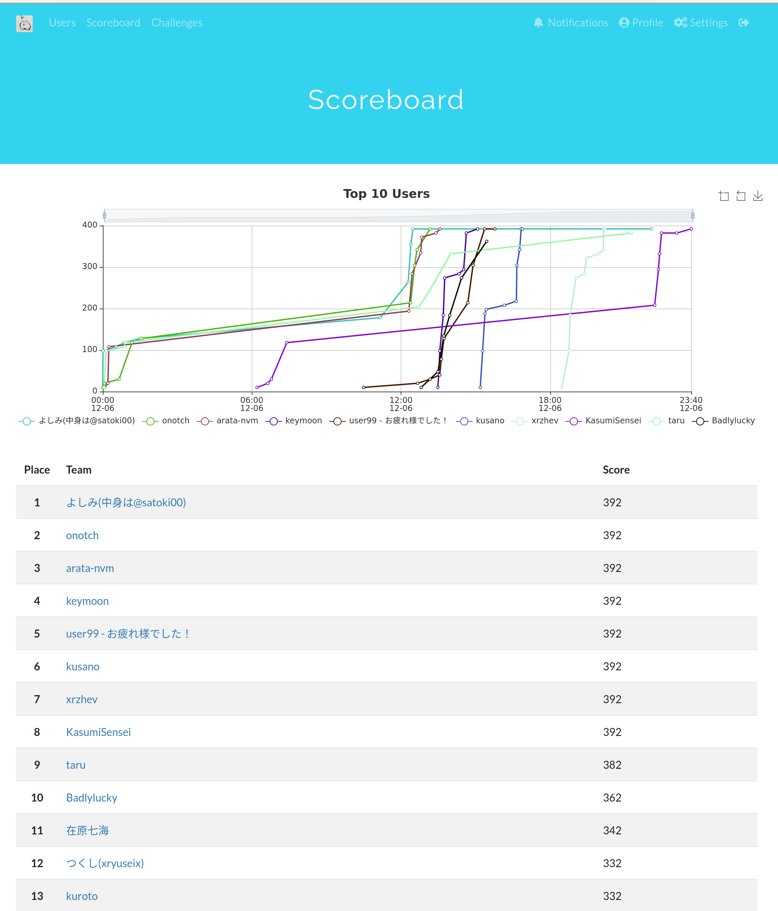

- この記事は [広島大学 IT エンジニア Advent Calendar 2020](https://adventar.org/calendars/5209) の 15 日目です。
- 今回は、12/6 に行われた taskctf の writeup を書いていきます。

# taskctf 概要

- [Tasker さん](https://twitter.com/task4233) が誕生日に開いた CTF です。誕生日は 12 月 5 日のようですが、諸用により一日遅れでの開催となったようです。去年も開催されていて、Amazon Wish List に flag をひそませるなど面白い工夫が見られる、クイズ寄りの CTF です。
- 僕は `KasumiSensei` として出て終了 20 分前にようやく全完しました。CTF で全部解けるのはどんな CTF でも楽しいですし、僕は初めてなのかな？とにかくこの成功した感覚を忘れないようにしよう！と思って writeup を書きます。
- 以下、問題をそれぞれ解説します。




# Welcome

- `taskctf{g00d_luck_h4ve_fun}`

# アンケート

- `taskctf{Th4nk_u_f0r_pl4ying!}`

# guess `` `?v=` ``

```
?v=t1zPpBwRbAw

何やら見覚えのあるパラメータな気がするな
```

- v を query に含むやつが思い浮かびそうで思い浮かばなかった。こんなときは google
- `inurl: v=` で youtube がヒットした。
- 限定公開の動画にたどり着き、その概要欄に Flag があった。
- `taskctf{h0w_w4s_it?}`

# social hacking

- `` guess `?v=` ``の動画でパスワードがむにゃむにゃと言っていて、最初聞こえなかったがその後言い直している。onigirt に誕生日をつける。
- お誕生日 CTF だけど 1 日遅れているので、`onigiri1205` をパスワードとして zip が開けた。
- `taskctf{n0t1ce_soci4l_h4ck1ng}`

# OSINT 3

```
友人が奇抜なTシャツを着てきた。
そもそもこれってどこで売られてるんだ......?
調べて教えて欲しい！

フラグの形式: taskctf{ショップ名}
2020-12-06 12:00 追記:
理不尽が過ぎる問題だったので, 画像を1枚追加しました。
ショップ名は漢字とカタカナのみで構成されています。

2020-12-06 15:48 追記: Max Attemptsを増やしました。
```


- これは追加された写真
- むずかしくて最初は誰も解けていなかった。ヒントが追加されて答えにたどり着けた。
- 試したやつ

```
- taskctf{SUZURI} だめ
- taskctf{ヤマニ} だめ
- taskctf{グラニフ} だめ
- taskctf{ClubT} taskctf{clubt} だめ
- taskctf{スクリーン印刷} だめ
- taskctf{SHALEMON} だめ
```

- いやこういう手作り感あふれる T シャツは SUZURI やろ！(SUZURI はショップではなくプラットフォームだと思うぞ
- ヒントが追加されて、`Tシャツ 広場`で検索すると https://harajukust-parisien.com/?page_id=123 にたどりついた。
- `taskctf{原宿パリジャン}` 正解

## OSINT 2

```
友人が迷ってよく分からない駅で下車してしまったらしい。 駅前の画像を送ってくれたから, どこの駅前か特定してほしい。 駅名は全て漢字です。

フラグの形式: taskctf{駅名}

2020-12-06 12:43追記: 駅名は「駅」という文字までを含みます。

```


- これは簡単。「駅 大仏」でググって画像検索を順に見ていくとあった。
- `taskctf{大船駅}`

# grass flag

```
interesting contributions
checksum(sha256): 72c84c2a356c321b76718fca311995b51d3c8155fd2c743172911222a366ec9a
```

- これめっちゃ悩んだ。空コミットがめっちゃ(135 こ)あって、`git cat-file -p XXX`しても無、特に修正コミットみたいなものもないし...と悩んで hash に意味があるのか？とか思っていた。残るは日付。2002 年？これは...
- ここで`grass git`で検索してそういや GitHub のコミットの草ってあったなと思いだした。一旦日付のみを `git log --pretty=format:"%ad"` で書き出して、以下のコードで可視化した。

```python
"""Date
Wed Mar 12 03:31:14 2003 +0900
Fri Mar 7 03:31:14 2003 +0900
"""
def con(m):
    if m == "Jan":
        return 1
    if m == "Feb":
        return 2
    if m == "Mar":
        return 3
    if m == "Apr":
        return 4
    if m == "May":
        return 5
    if m == "Jun":
        return 6
    if m == "Jul":
        return 7
    if m == "Aug":
        return 8
    if m == "Sep":
        return 9
    if m == "Oct":
        return 10
    if m == "Nov":
        return 11
    if m == "Dec":
        return 12
    return -1

def vert(s):
    days2002 = [31,28,31,30,31,30,31,31,30,31,30,31]
    days = [31,28,31,30,31,30,31,31,30,31,30,31]
    # s[0] s[1] s[2]
    d = 0
    if s[0] == 2002:
        for i in range(s[1]-1):
            d += days[i]
        d += s[2]
        return d
    if s[0] == 2003:
        for i in range(s[1]-1):
            d += days[i]
        d += s[2]
        d += sum(days)
        print(sum(days))
        return d

with open("./Date", "r") as f:
    s = f.read()
    ss = s.split("\n")
    # print(ss)
    al = []
    for iss in ss:
        m = iss.split(" ")[1]
        d = iss.split(" ")[2]
        y = iss.split(" ")[4]
        al.append([int(y),con(m),int(d)])
    print(al)
    ans = ["x"]*365*2
    print(ans)
    for eac in al:
        ans[vert(eac)] = "#"
    print(ans)
    for h in range(7):
        for w in range(365*2//7):
            if ans[7*w+h] == "#":
                print("#", end="")
            else:
                print(" ", end="")
        print("")
```

- 結果

```
 #             #          #    #    #    #                   #
####  ##   ### #  #  ##  #### ###   #    # ####   ##   ##    #
 #      # #    # #  #  #  #    #   #     # # # #    # #  #    #
 #    ###  ##  ##   #     #    #    #    # # # #  ### #  #   #
 #   #  #    # # #  #  #  #    #    #    # # # # #  # #  #   #
  ##  ### ###  #  #  ##    ##  #     ##  # # # #  ###  ##  ##
              #                ##   ## ##                 ##
```

- なんかコードバグらせている気もするが、`taskctf{lmao}`で OK

# Caesar Cipher Translator

- 難読化 js をじっと眺めると、`alert`でなにかできそうだと分かる。その後で`old_alert`が発火している。
- `alert()`を console に貼って、アラートが出るのを確認して、console にもう一度`alert("injected")`を貼ると、Flag が出てきた。
- `taskctf{n1ce_inject10n!}`

# Gacha

```go
package main

import (
	"context"
	"encoding/json"
	"log"
	"net/http"
	"os"
	"os/signal"
	"strconv"
	"syscall"
	"time"
)

func main() {
	srv := &http.Server{Addr: ":3334"}
	http.HandleFunc("/", gachaHandler)

	go func() {
		if err := srv.ListenAndServe(); err != nil {
			log.Printf("shutdown the server with error: %+v\n", err)
		}
	}()

	quit := make(chan os.Signal, 1)
	signal.Notify(quit, syscall.SIGTERM)
	log.Printf("SIGNAL %d received, then shutting down...\n", <-quit)

	ctx, cancel := context.WithTimeout(context.Background(), 5*time.Second)
	defer cancel()
	if err := srv.Shutdown(ctx); err != nil {
		log.Println("failed to shutdown: %+v", err)
		os.Exit(1)
	}
}

func gachaHandler(w http.ResponseWriter, r *http.Request) {
	seed := r.FormValue("seed")
	if len(seed) == 0 {
		seed = "1"
	}
	seedInt, err := strconv.Atoi(seed)
	if err != nil {
		http.Error(w, err.Error(), http.StatusInternalServerError)
		return
	}

	// get current time(HHmmss)
	jst := time.FixedZone("Asia/Tokyo", 9*60*60)
	nowStr := time.Now().In(jst).Format("150405")
	log.Println(nowStr)
	nowInt, err := strconv.Atoi(nowStr)
	if err != nil {
		http.Error(w, err.Error(), http.StatusInternalServerError)
		return
	}

	sm := (seedInt + nowInt) % 100000
	log.Println(sm)
	var flag map[string]string

	if sm == 1337 {
		flag = map[string]string{
			"flag": "taskctf{this_is_dummy_flag}",
		}
	} else {
		flag = map[string]string{
			"flag": "You might not have a luck...",
			"sum":  strconv.Itoa(sm),
		}
	}
	res, _ := json.Marshal(flag)
	w.WriteHeader(http.StatusOK)
	_, err = w.Write(res)
    if err != nil {
		http.Error(w, err.Error(), http.StatusInternalServerError)
		return
	}
}
```

- 1sec ごとに増えていくので、適当な数値を入れてリロードを繰り返す。
- `http://34.82.49.144:3334/?seed=80205`

```
{"flag":"taskctf{Y0u_h4ve_4_gre4t_luck}"}
```

# Evil Eval

```
シーザー暗号の次は, base64をデコードするページを実装したらしい。
とはいえ, この実装ってあまり良くないんじゃ......

flag.txtが同じディレクトリにあるらしいから, それを読みだしてこの実装の危険性を教えてあげて。
```

- `exec("cat ./flag.txt")`がしたいなあと思ってうまくいかない。よく考えると result に値を入れる必要がある。
- `file_get_contents(\"./flag.txt\")`これを base64 encode したものを入れると flag が出てきた。

# 終わりに

- お誕生日おめでとうございます。僕も CTF 開きたいな(作問...)
