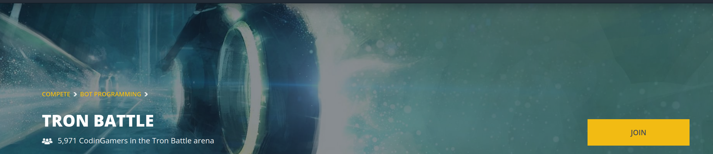
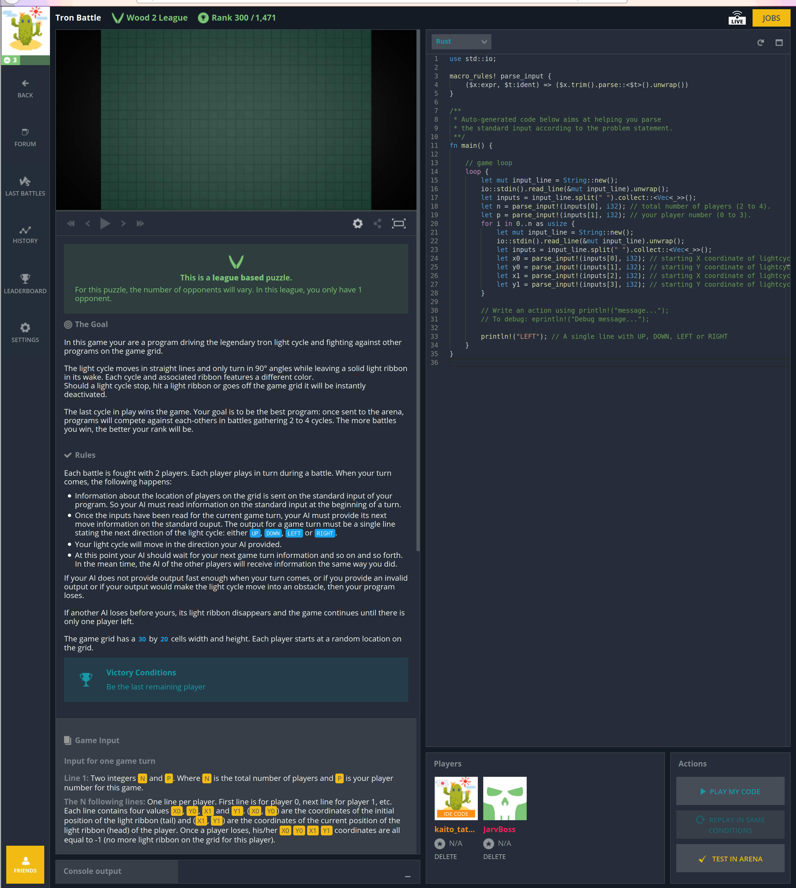
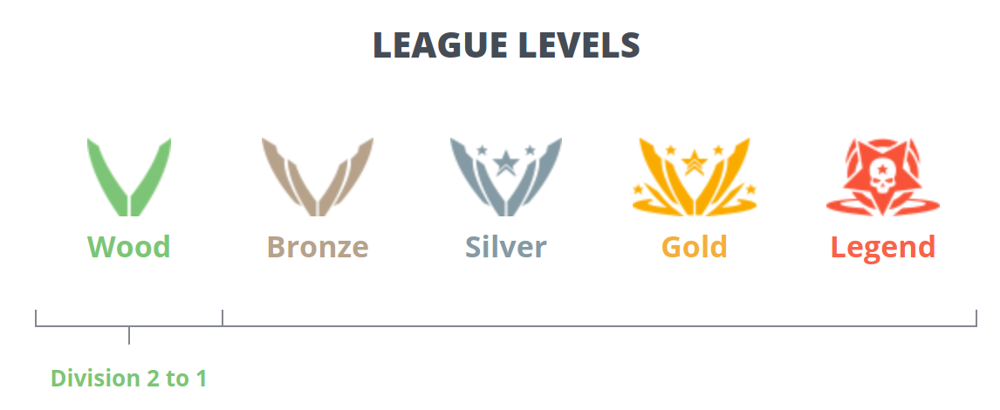
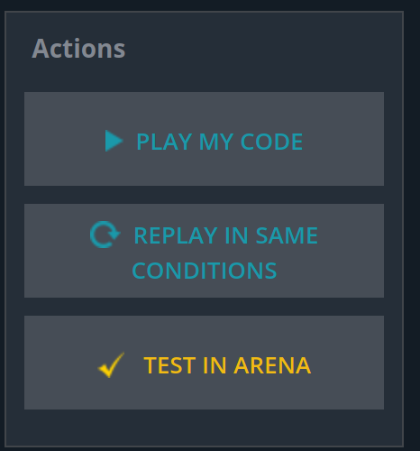
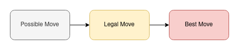
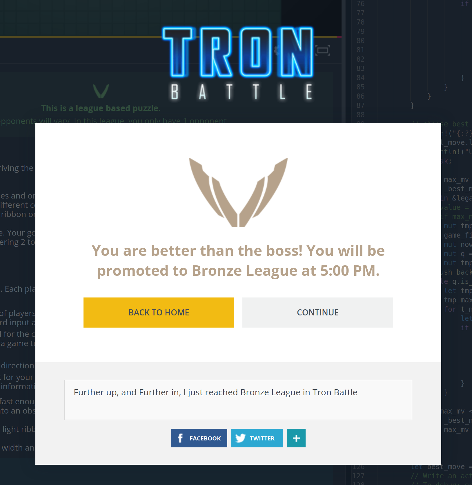

- **2020/12/08 修正** codingame のソース全公開は運営から注意を受けることがあるそうなので、部分公開に変更しました。
- この記事は、[広島大学 IT エンジニア Advent Calendar 2020](https://adventar.org/calendars/5209) の 8 日目です。みんな間に合わせていてえらい。
- 今回は、ゲーム AI プログラミングができるサイト [CodinGame](https://www.codingame.com/home) にチャレンジしてみました。僕は bfs を実装してヤッター！な初心者なので、お手柔らかにお願いします。

# CodinGame ってなに？

- CodinGame, 通称「こどげ」はプログラミングでゲームをして遊べるサイトのようです。よく分かっていませんが、今回紹介するゲーム AI Bot を作って戦わせるタイプの他にも、最適化部門もあるようです。今回は [TRON](https://www.codingame.com/multiplayer/bot-programming/tron-battle) という bot プログラミング部門の入門的な立ち位置のゲームで遊んでいきます。
- 使える言語は [こちらの FAQ](https://www.codingame.com/faq) にまとまっています。僕は Rust を使うので、

```text
Rust: 1.38.0
Includes chrono 0.4.9, itertools 0.8.0, libc 0.2.62, rand 0.7.2, regex 1.3.0, time 0.1.42
```

- 今確認して知ったんですが `rand` crate あるやんけ！線形合同法のコードを引っ張ってきてしまった。

# やってみる

- 2 年ほど前にちょっと触った(サンプル動かした程度)ので、アカウントは作っていました。



- `JOIN` ボタンを押すと以下のような画面に行きます。



- 左上の `Wood 2 League` が自分がいるリーグです。TRON では、 `Wood 2` -> `Wood 1` -> `Bronze` -> `Silver` -> `Gold` -> `Legend` とリーグが上がっていきます。上のリーグに行くには、各リーグの「ボス」に勝利する必要があります。一ケタ順位をとっても上にいけないな〜と思った、そこのお方！(僕のことです) ボスに勝ちにいきましょう。



- 画面の詳しい説明は [CodinGame は BOT(AI プログラム)でバトルするのが正しい楽しみ方かもしれません](https://qiita.com/javacommons/items/b178c924199d1a6d524d) を見るとよいです。
- 基本的には、コードの画面にコードを書いて、`PLAY MY CODE` を押してテストプレイ、`TEST IN ARENA`を押して実戦、です。



# ゲームのルール

- 光をできるだけ長く伸ばす(長い時間生き残る)と勝ちです。壁や、相手の光に当たると消滅してしまい、負けになります。

# とりあえずサンプルを動かす

- 書いてあるものをそのままテストプレイすると、毎回左に動くのでそのまま壁に激突して TRON 人生が終了します。
- これではいけません。

# 改良の前に、コードを書くときのフレームを考える

- いろいろ書き直したり調べていると、以下のように考えるとよいことに気づきました。



- まず、ありうる手として上下右左があります(Possible Move)
- 次に、例えばいまきた道には引き返せない、壁は無理、といった制約から合法な手が決まります(Legal Move)
- 最後に、Legal Move の中から一番よさげな手を選びます(Best Move)

# 最初の改良

- まずは Legal Move を実装して、Best Move のところではランダムに選んでしまうことにしました。
- 線形合同法は Linux Programming お気楽 Rust プログラミング超入門 さんのコードを参考にしました。ありがとうございます。
- 本質的に Best Move を選択するパートは以下になります

```rust
let best_move = legal_move[rng.rand(legal_move.len() as u32 -1) as usize];
```

- このコードで Wood 1 でちょっと勝てるようになりました。
- しかしボスを倒すにはまだまだ足りないようです。

# 次の改良 bfs をしてみる

- 少し考えて、「もしかしてその場で legal move それぞれに対し dfs/bfs を行い、一番遠くに行けるような手を選べば勝てるのでは？」と思いつきました。やってみましょう。
- Best Move を選ぶ部分は以下のようになります。bfs っぽいことをしています。

```rust
// choose best_move
// update this part
eprintln!("{:?}", legal_move);
if legal_move.len() == 0 {
    println!("UP");
    break;
}
let mut max_mv = 0;
let mut _best_move = (0,0); // invalid initial value
for mv in &legal_move {
    // value = bfs(mv.2, mv.3)
    // if max_mv < value { update(_best_move) }
    let mut tmp_game_field = game_field.clone();
    tmp_game_field[mv.3 as usize][mv.2 as usize] = false;
    let mut now = (mv.2, mv.3); // x,y
    let mut q = VecDeque::new();
    let mut tmp_max_mv = 0;
    q.push_back(now);
    while q.is_empty() == false {
        let tmp = q.pop_front().unwrap();
        tmp_max_mv += 1;
        for t_mv in &possible_move {
            let (x,y) = (tmp.0+t_mv.0, tmp.1+t_mv.1);
            if 0 <= x && x <len_x as i32 && 0 <= y && y<len_y as i32 {
                if tmp_game_field[y as usize][x as usize] {
                    // valid
                    tmp_game_field[y as usize][x as usize] = false;
                    q.push_back((x,y));
                }
            }
        }
    }
    if max_mv < tmp_max_mv {
        _best_move = (mv.0, mv.1);
        max_mv = tmp_max_mv;
    }
}

let best_move = _best_move;

```

- これでボスを倒すことができました！やったーー！次は Bronze リーグです！



# 終わりに

- めっちゃビジュアライザが楽しいので対戦中の動画ずーっと眺めてしまいますね。
- 次の目標は silver ですが、Minimax 法とか勉強しないと無理そう感あるので(ただ bronze レベルだとまだ大丈夫らしい？)勉強していかんとなあ。
