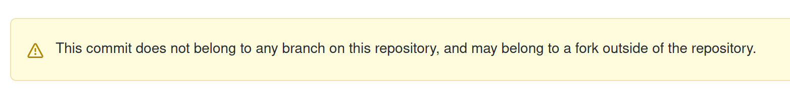
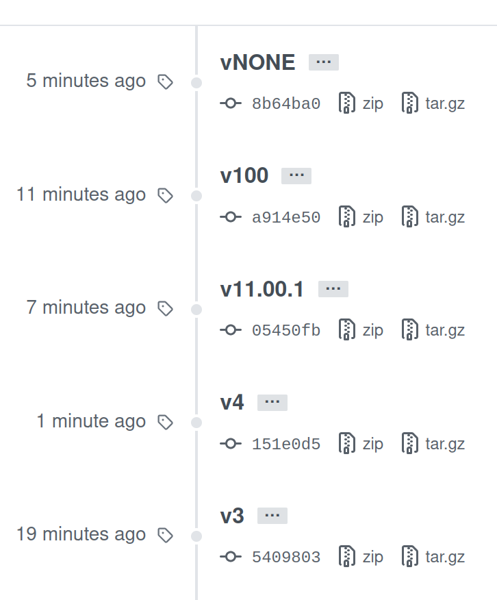

人のコードを読んでいいところを学んでいこうと思います。traP の traQ, NeoShowcase, camphor-の relaym あたりは読んでいきたいです。
今回は、色々見て回って[mazrean/separated-webshell](https://github.com/mazrean/separated-webshell)がよさそうだと感じたので読みます。

# 前提条件

- repository: [https://github.com/mazrean/separated-webshell](https://github.com/mazrean/separated-webshell)
- 2021/05/26 時点での`main`ブランチの最新を対象とします。(commit hash: `5c3e14c32cc5582e9768467f02d22217ac1b6759`)
- ソースコードの解説というより、僕が知らなかったことを解説するみたいな方針でブログに残します(ソースコードの解説は製作者にしかできないので)

# コードを読む

### 概要

おそらく、[CPCTF を支えたインフラ](https://trap.jp/post/1303/)で紹介されている、Webshell の中で動いている ssh-separator がこれに当たると思われます。CTF で使うために、SSH した先を各コンテナに振り分けているようです。
記事では、

> また、日付は決まっていませんが Webshell についてのブログ記事も出る予定なのでお楽しみに！

とあるので、traP ブログで解説が出るのを楽しみにしています。

### CI/CD

GitHub Actions を使用していて、Lint を走らせて報告させる`main.yml`, tag を打ったときに release する`release.yml`の 2 つが走ります。

## `main.yml`

mod, build, lint の 3 つの Job が実行されます。

> A workflow run is made up of one or more jobs. Jobs run in parallel by default. To run jobs sequentially, you can define dependencies on other jobs using the jobs.<job_id>.needs keyword.
> **ref.** https://docs.github.com/en/actions/reference/workflow-syntax-for-github-actions

なので、これらの Job は mod が実行された後、`needs`が書かれている build, lint が並列に動作します。

### actions/cache@v2

再利用できる依存関係などのファイルをキャッシュするために使う。このリポジトリでは、mod で go の外部ライブラリをキャッシュさせた後、build, lint で使用している。
使い方は、Go の場合は[actions/cache の Go の example](https://github.com/actions/cache/blob/main/examples.md#go---modules)を見て、[GitHub Docs > 依存関係をキャッシュしてワークフローのスピードを上げる](https://docs.github.com/ja/actions/guides/caching-dependencies-to-speed-up-workflows)を見ておけばよさそう。

### actions/upload-artifact@v2

CI 上でテストの結果を HTML に出力してどこかに持っていきたいときや、生成物をダウンロードしたいときに GitHub 側に一時的に保存することができる Action。
[GitHub Docs > ワークフロー データを成果物として保存する](https://docs.github.com/ja/actions/guides/storing-workflow-data-as-artifacts)や、[actions/upload-artifact](https://github.com/actions/upload-artifact)を見ておけばよさそう。
成果物は、GitHub の Actions タブから個別のページに行くと誰でもダウンロード可能。なので、credential は artifact に含めてはいけない。

### システムパスの追加

https://docs.github.com/ja/actions/reference/workflow-commands-for-github-actions#adding-a-system-path
ここにあるように、`$GITHUB_PATH`に追記すると PATH を追加できる。

### reviewdog

[reviewdog](https://github.com/reviewdog/reviewdog)は様々な言語、linter に対応している結果をプルリクに通知してくれるツール

### golangci-lint

[golangci-lint](https://github.com/golangci/golangci-lint)は linter 集。あくまで linter 集なので、どの linter を使っているのか？という話が重要そう。
このリポジトリでは、[.golangci.yml](https://github.com/mazrean/separated-webshell/blob/main/.golangci.yml)で決められているので見ていく。
合わせて、[Go 公式の linter、Golint が非推奨になった](https://zenn.dev/sanpo_shiho/articles/09d1da9af91998)と[golangci-lint Enabled By Default Linters](https://golangci-lint.run/usage/linters/#enabled-by-default-linters)を読んだ。

- golangci-lint でデフォルトで ON になっているもの: govet, errcheck, staticcheck, unused, gosimple, structcheck, varcheck, ineffassign, deadcode, typecheck
- deprecated: golint
- golangci-lint でデフォルトで OFF になっているもの: gofmt

このあたりは開発者の好みもありそう。
その他眺めてたら、以下 2 つが面白そうだと感じた。

- [misspell](https://github.com/client9/misspell): 変数名英語のスペルミスチェック(ただし最終リリースが 2018 年)
- [wastedassign](https://github.com/sanposhiho/wastedassign): 意味のない代入を報告

## `release.yml`

### git tag と GitHub Actions 発火

このリポジトリでは、`on.push.tags`と`on.push.branches-ignore`を用いて tag を打った時のみそこに対して Actions を実行するようになっている。
ここで GitHub Docs を見てみると、

> \# Push events to v1.0, v1.1, and v1.9 tags
> **ref:** https://docs.github.com/en/actions/reference/workflow-syntax-for-github-actions#example-including-branches-and-tags

とあったので、もしかして 1 桁の v9 までで、2 桁の v12 とかって打てないのか...？と思って挙動を調べた。
以下のようにして調べた。

```shell
git tags -a 'v1' -m 'ok'
git push --tags
git push
```

- tag は remote に明示的に push する必要がある

`git push --tags` ですべての local のタグを remote に push できる。
remote の tag は GitHub の release 項目から確認できる

- `v*` は `v100` や `vABC` にもマッチする

2 桁以上や文字でも大丈夫。

- `v*.*.*` は `v4` にマッチしない。`v1.0.0` や `vX.Y.Z` にはマッチする。
- `v..` を試そうとすると、local で `fatal: 'v..' is not a valid tag name.` となって打てない
- 先に `git push --tags` すると、release に反映されるが main ブランチにはコミットが存在せず、該当コミットを release から見に行くと以下のようにどこのブランチにも属してないですと言われる。でも CI は回る。



- relase での tag の表示の順番は tag 名でソートされる。以下は 1 分前の最新のコミットの v4 が表示上は下に行っている様子



結論としては、制限しないなら `v*` でよくて、制限かけたいなら `tags-ignore` も用いて制限かけていくのがよさそう。
バージョン付け手動 Only は大変そうで、Actions に載せて手動と自動まぜるみたいなことできたらいいのかな。

### Build Kit

https://matsuand.github.io/docs.docker.jp.onthefly/develop/develop-images/build_enhancements/
https://www.slideshare.net/AkihiroSuda/buildkit
これらの記事を読んだ。Dockerfile の各ステージを並列実行することで高速化できたり、root 権限なしで実行できたりするらしい。

### ghcr と github packages

個人的に Docker Image を保存したいとき、private なら課金が必要になる可能性があるが GCR(Google Container Registry)など、public なら Docker Hub を検討していたが、2020 年 11 月から Docker Hub の無料プランは pull 制限がかかるようになり使いづらくなって移行先として GitHub Packages や ghcr(GitHub Container Registry)の利用を検討するようになった。
Docker Image は save/load で tar.gz に固めて VPS に直接送って展開することもできるが、継続的に CI/CD をしていくと面倒になってくるので、Registry を使う方がよいケースも多い。

ghcr は public beta。以下の記事が詳しい。現在は Personal Access Token が必要で、`secrets.GITHUB_TOKEN`でできる Packages に比べると少し手間がかかる。
https://www.kaizenprogrammer.com/entry/2020/09/03/060236

### 使っているライブラリ

(draft: コード本体を読まないと使い方わからないものも多いので、後回し)

### コード本体

(draft: DI やクリーンアーキへの理解が必要そうなので、かなり時間かかりそう)

# まとめ

https://docs.github.com/ja/actions
これすべて目を通しておいたほうがよさそう。

# 最後に

やっぱり強い人の手頃な大きさのリポジトリを読んで公式ドキュメントと照らし合わせて勉強していくの参考になる〜
公開してくれていることに感謝です 🙏
(draft)
