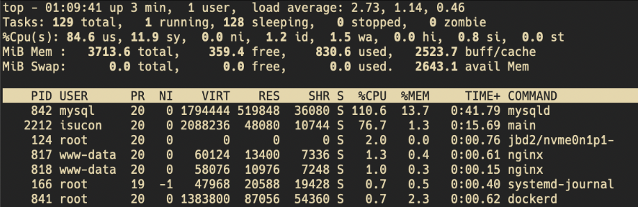
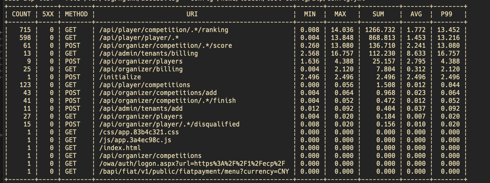

# ISUCON12予選で0点だったので反省する

ブログを書くまでがISUCONです！ということで、点数も低くやれたことも少ないので恥ずかしいところも大きいですが書こうと思います。

## 概要

- SQLiteからMySQLへの移行判断材料が直感に頼っていて計測の結果ではないのがまずかった
- 複数台構成できたっぽいのは成長だったが、複数台構成にすると決めた判断材料も計測から少しズレた推論の結果なのであまり良くないタイミングだった
- 次回はもっとアプリケーションコードと当日マニュアルを読んで落ち着いてから計測すると良さそう

## 前提と行った準備

- ISUCONは今回で3回目
  - 初回はISUCON9, 友人とSSHの仕方調べていたら終わった
  - 2回目はISUCON10, 確かSSHの接続の仕方が特殊でようやく接続できた時にはあまり時間がなかった
- 今回はちょっと頑張りたかったのでISUCON本を読んだ
  - private\_isuをAWS環境を立ててなぞった
- Goは一通り書けるが、DBに関心が向かないのでN+1の解消とかは分かってない、キャッシュもノータッチという状態

## 当日のタイムライン

### 前日

クーポンを適用する、private repoを作る、最初の一時間ですることを決める

### 9:55 予選問題の動画公開

- エージェント？SPY×FAMILYか？
- マルチテナントサービス
- ISUPORTS→サービスの名前はMakefileで大事なのでメモ
- ISUCON SaaS たくさんの企業がSaaSを使いたい→いい世界線だ
- ISUPORTS リーダーボード機能の処理速度に問題がある→ということはリーダーボードに対処するのがメインになりそう
- 2つ目の問題は開始が8時間後であるということ→これはいつもの問題だな

### 10:00 問題公開

- 当日マニュアルが長い
- とりあえずSSHを確認してenv\_checkerを全てのインスタンスで回して確認(ハズレインスタンスを引いていたらいけないので)
- c5.large 2 4 EBS のみ 最大 10 最大 4,750 x3
- IntelマシンなのでArmではない
- bench回した



- 落ち着いて、他のサーバでもbench
- 初期スコア **2959**

### 10:30 バックアップ完了

- [traPのISUCON初心者向け講習会](https://trap.jp/post/1614/) でバックアップする方法が書かれていたのでこれを真似する。今回はMySQLとnginx構成なので変更も少ない
- ここでappがdockerに乗っていることに気づく。計測ツール入れるのが面倒だと判断してdockerから剥がすことにする。
- topの挙動が、mysqlが100%を超えている状態からmain(app)が支配的になるという2つのピークがあるように見える→DBを分離したらいいと思って複数台構成に取り掛かる(この判断は後述するように微妙だったかも)
- 大量の.dbファイルを発見してオイオイという気持ちになる。これは絶対MySQLに載せるやつやろと判断する(後述するようにこの判断材料が直感なのが良くない)

### 11:08 alp一回目回せる

- alpが何も表示されなくて焦っていたが、よく見たらMakefileが途中で失敗して最後まで行かなくて `deploy-nginx-conf` が動いておらず、設定ファイルが反映されていなかった。
- 1回目のalpを回す。alpで指定するパスは当日マニュアルの得点に関係しそうなものを手動コピペした



- rankingめちゃくちゃ重い。scoreboardに相当しそう。

**この時点でのやることリスト**

- [ ] appをdockerから剥がして動作させる
- [ ] rankingに取り組む
  - sqlite3のdb initial\_dataをmysqlに入れる。tenant idを保持する方法を考える
  - 移行後DBのIndexをはる
- [ ] docker daemonを切る

### 12:00 docker剥がした

dockerをisu1サーバで剥がしてdaemon化した。

### 14:00 バルクインサート失敗

ずっとSQliteからMySQL移行をしていた。一行ずつINSERTでは遅いことがわかったので、バルクインサートをしようとした。

エラーが出た。一行当たり16MBまでしか受け付けないらしい。対象の行は262MBくらいだったのでとりあえず50等分にしてみる

sedに慣れていなくて時間を溶かす

### 15:00 DB用サーバを立てる

- isu2サーバのdockerを止めてsystemctl disableする
- バルクインサートが通らない

### 16:30 LOAD DATA INFILEでMySQL移行に成功する(？)

以下のようなクエリで一番重い player\_score の移行に成功した(多分)

アプリ側のコードもそれに合わせて書き換える

```sql
LOAD DATA INFILE '/var/lib/mysql-files/hoge.csv' INTO TABLE player_score FIELDS TERMINATED BY ',';
```

### 17:10 整合性チェックが通らない

```text
Jul 23 08:11:50 ip-192-168-0-11 main[61353]: {"time":"2022-07-23T08:11:50.855873549Z","id":"","remote_ip":"127.0.0.1","host":"admin.t.isucon.dev","method":"GET","uri":"/api/admin/tenants/billing?before=21","user_agent":"isucandar","status":200,"error":"","latency":236423007211,"latency_human":"3m56.423007211s","bytes_in":0,"bytes_out":1503}
```

latencyがやばいのはわかる。原因はおそらくタイムアウトなのでどこかの処理が重いのだろうと思って `billing` を読む

データベースの初期化部分で `init.sh` がおかしいのかなと思って直したりした。

### 18:00 終了

結局整合性チェックを通せず、終了。得点は **0**

## 反省ポイント

> topの挙動が、mysqlが100%を超えている状態からmain(app)が支配的になるという2つのピークがあるように見える→DBを分離したらいいと思って複数台構成に取り掛かる

これはおそらく初期化でDBが重くなっている。また続くmainのピークも本当にdbの読み書きで重いのか(sqliteのせいなのか)はこの時点で不明。したがって、この考察が間違ってそうであることがわかる。複数台構成はマシン性能を上げるようなもので本質的な改善とは言えないのでここで何かやった気になるのはまずい。

ここではtopだけでは判断できないとしてalpで判断すべき。得点はalpを見てリクエスト数の変化を見たらどう上げたらいいか、点数の内訳がどのエンドポイントへのクエリなのかという構成が分かる。

> 大量の.dbファイルを発見してオイオイという気持ちになる。これは絶対MySQLに載せるやつやろと判断する

sqliteに対して直感で決めているのが良くない。計測で上のtopの挙動からも分かるようにDBやファイルアクセスが支配的とは言えないので後回しでもいい。

## わかったこと

- 計測から得られる結果に対し合理的な判断ができているか、落ち着いて書き出してみた方がいい。時間のロスに気を取られるけど違う選択肢をとってロスする時間の方が大きい。
- アプリケーション改善を実質入れられていない。次回はバックアップとったら、秘伝のタレとかインフラとかより先に初手計測してgoのコード変更に注力するように練習で心がけてみる。インフラ系は練習しておけば後からでも間に合いそうなことが分かったのでアプリ中心で改善を入れるようにしてみる。
