<!-- titleは自動で入る -->

RustyKeysという6つのキーの自作キーボードを組み立てて、ソフトウェアのサンプルを動かして"KOBA789"の文字をタイプしました。この記事では組み立ての様子やソフトウェア周りで詰まったところを書きます。

# 購入時

BOOTHで [RustyKeys](https://booth.pm/ja/items/3787019?BOOTH-APP-CLIENT-VERSION=xnaxvwidh) を購入しました。メール見返すと2022/04/25(月)に購入したみたいです。確か、Twitterで「組み込みRustが自作キーボードで学べるやつが出るらしい」と話題になっていました。すごい人気だろうと思ったので販売時間前にスタンバイして待ち構えてスッと購入しました。

私はBOOTHで商品を購入すると満足してしまって、届く頃にはすっかり忘れてしまうタイプの人間です。したがって開封することもなく時は流れていたのですが、友人がKeyBall61を組み立てているのをみて「あっやらなきゃ」と思い出しました。2023年に立てた100個の抱負にも「RustyKeysを完成させる」と書きました。

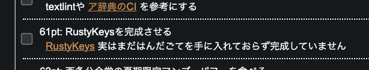

# 作業前準備

2つの記事を参考にしました。

- 本家: [RustyKeys ビルドガイド](https://rusty-keys.koba789.com/)
- へいほぅさんによる詳細なビルドログ: [RustyKeys ビルドログ](https://blog.h3y6e.com/posts/rustykeys-buildlog/)

へいほぅさんの記事で [遊舎工房の工具セット](https://shop.yushakobo.jp/products/a9900to) を買うと工具がまとまって手に入ると知ったので、このセットを購入しました。

## 持ち物確認

- RustyKeys ビルドガイド にもあるように、内容物を確認しました。

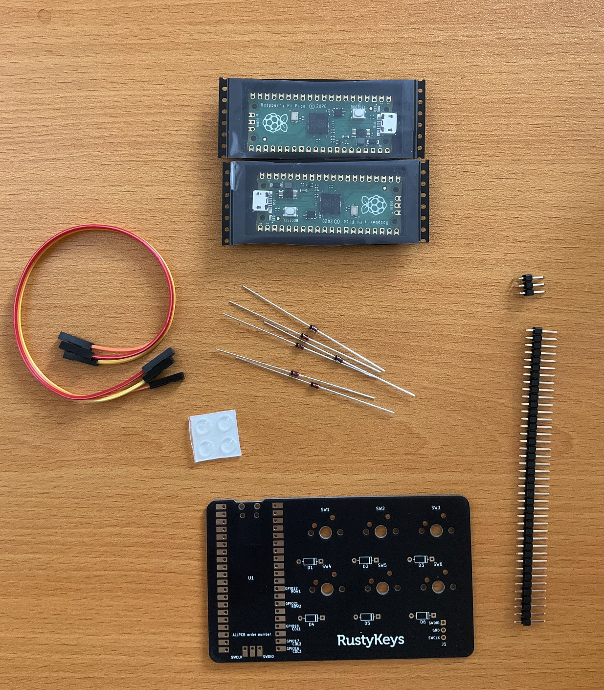

- 工具以外に準備したものは以下の通りです。
  - USB micro-B ケーブル 2本
    - Amazonで買いました。
  - Cherry MX (互換)キースイッチ6つ
    - [【お試しパック】CHERRY MXスイッチ スピードシルバー軸 10個セット](https://www.diatec.co.jp/shop/det.php?prod_c=4473) を買いました。
    - 別にスピードシルバーでなくてもいいと思うけど、試したかったので。
  - キーキャップ6つ
    - AliExpressで以前購入した魔法系のキースイッチが余っていました
    - [KBDiy Keycaps Store - KBDiy 132 Keys Constellation PBT Keycaps XDA Profile MX Switch Anime Cute Keycap for DIY Mechanical Gaming Keyboard Custom Set](https://www.aliexpress.com/item/1005004401468449.html)

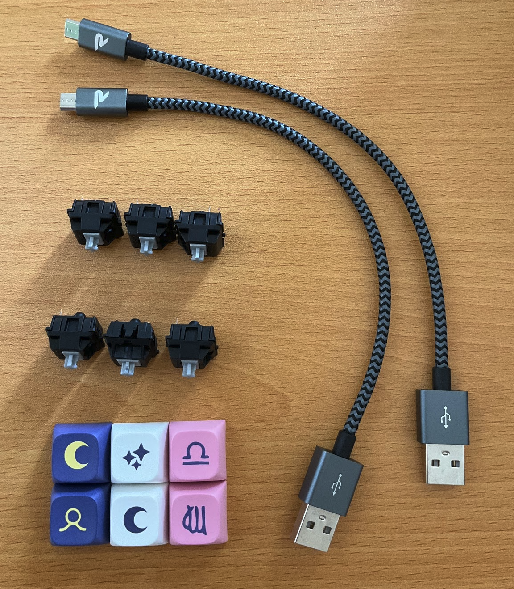

# 組み立て

ビルドガイドを見た方がいいと思うので、写真と簡単な説明だけ載せます。

ニッパでピンヘッダを半分にします。切った瞬間、ピンヘッダの半分が吹っ飛んでいくので固定した方がいいかもしれない。

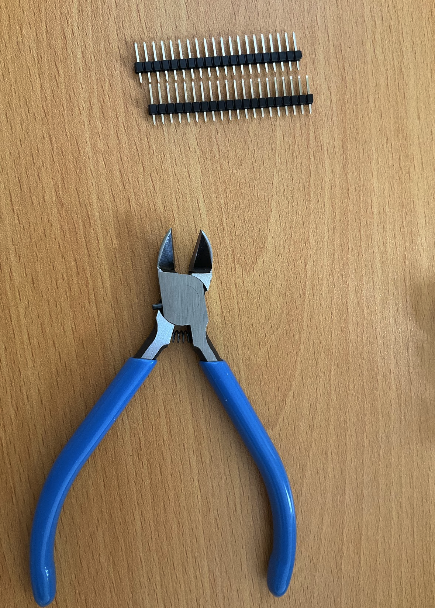

ダイオードをピンセットで捻じ曲げます。感覚を掴むのに苦労しました。

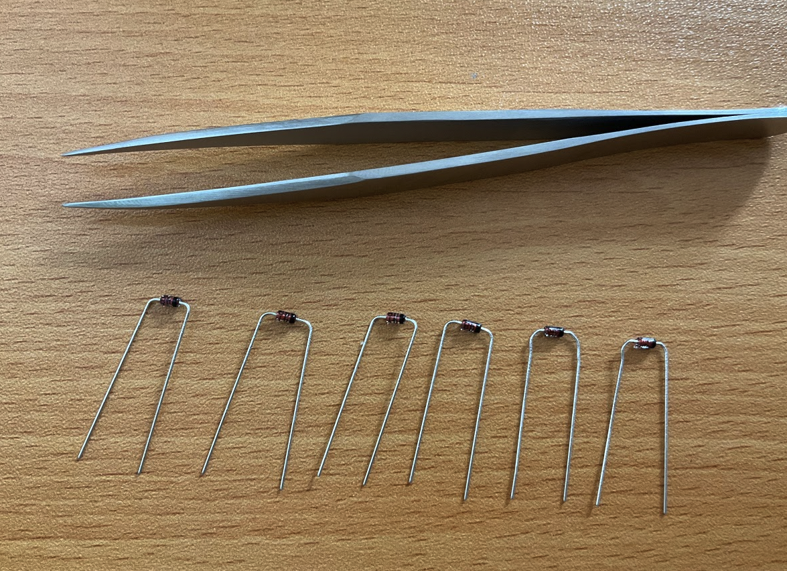

へいほぅさんのビルドログで知ったのですが、はんだ付けする前にマスキングテープで部品を固定すると良いです。

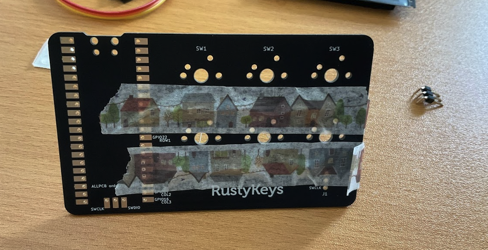

ダイオードのはんだ前

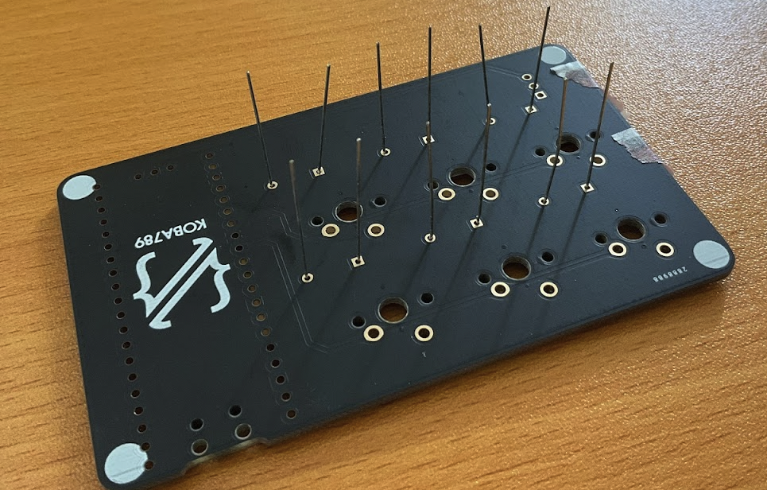

ダイオードのはんだ後

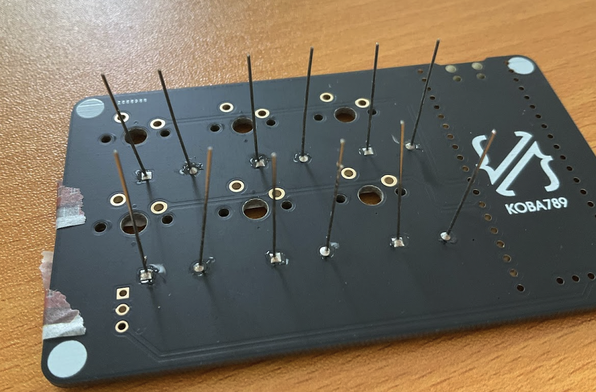

ダイオードの足をニッパで切る時は、吹っ飛んで行かないようにマスキングテープで固定

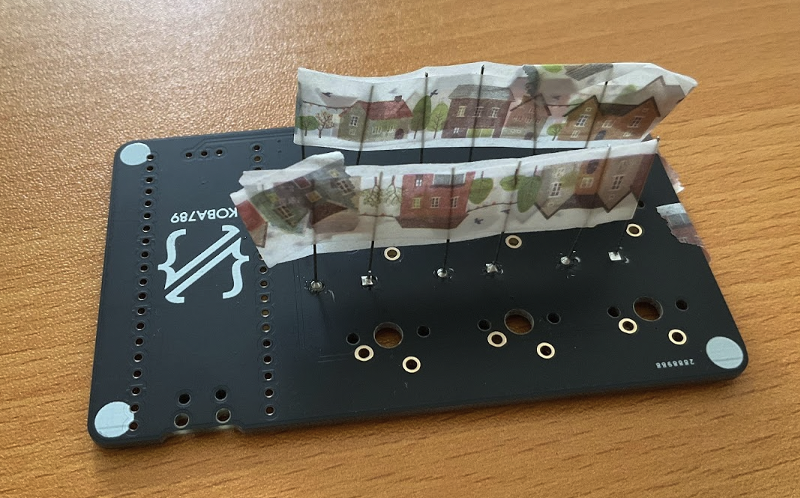

無事にダイオードの足を切りました

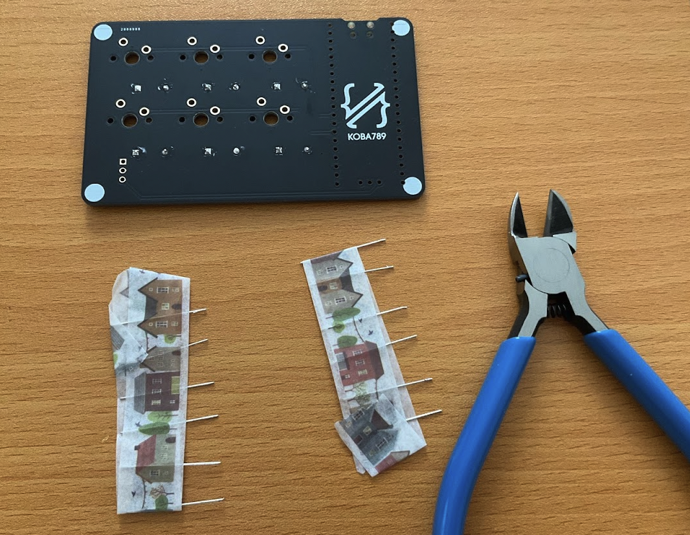

3つ足のはんだ付けは写真撮り忘れたのですが、これもマスキングテープで固定するとやりやすいです

Raspberry pi picoもはんだ付けします

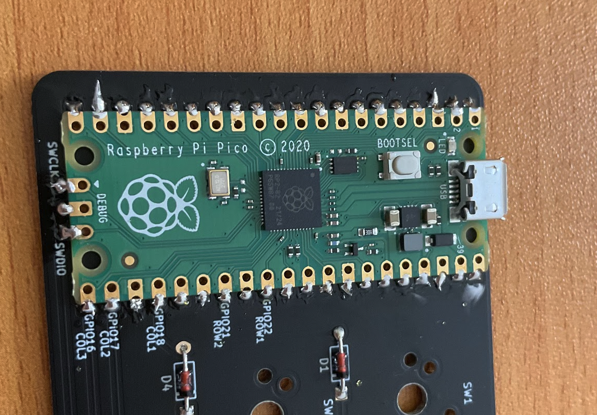

キースイッチの裏もはんだ付けします。これを固定する方法がわからず、気合いでやったらスイッチの向きが揃わなくて悲しい

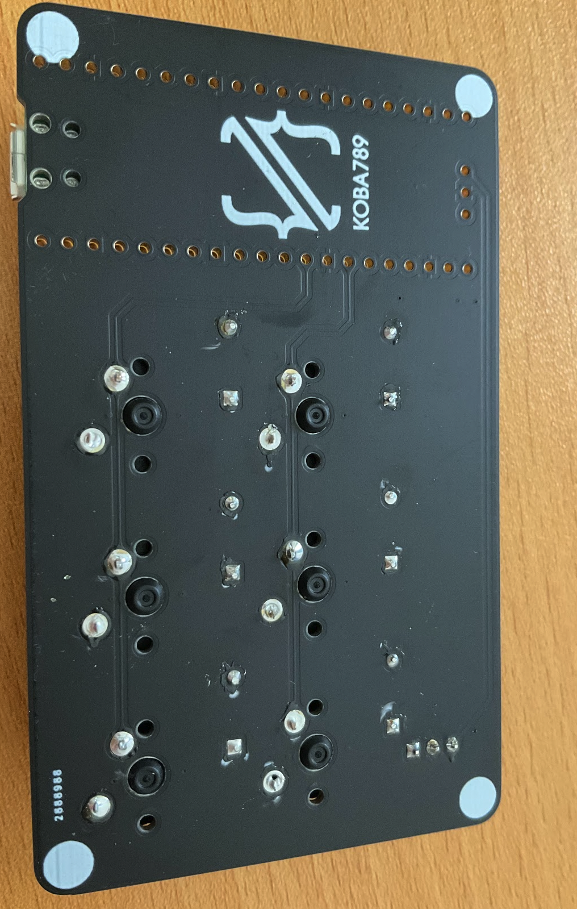

ガタガタだけど、完成です

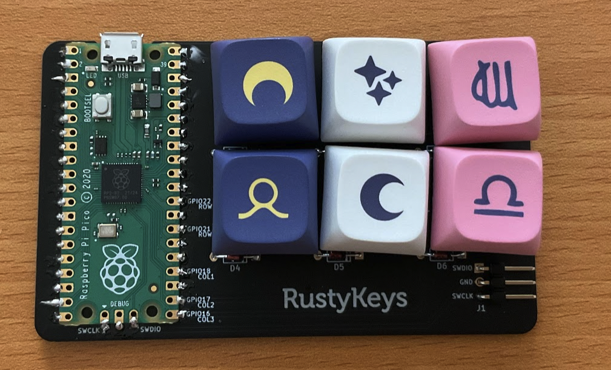

デバッグ用のpicoもはんだ付けしましょう。

# ソフトウェア周り

流れ: M1 macでやろうとする→失敗→Ubuntu serverでやろうとする→失敗→M1 macで再挑戦→できた

M1 macでは `brew install capstone` や `rustup target add thumbv6m-none-eabi` をもう一度実行した後やったらいけた。何が効いたのか不明

## 見かけたエラー集

- `Found pico uf2 disk /media/RPI-RP2 Error: Os { code: 13, kind: PermissionDenied, message: "Permission denied" }`
  - Ubuntu serverでrust-dapで出たエラー
  - これは権限の問題なので、mountするときにuid, gidを設定すると消える
  - `sudo mount -o uid=1000,gid=1000 /dev/sda1 /media/RPI-RP2` みたいにするとmount時に権限を設定できる。
- `Error: no probe was found.`
  - Common reasons for this are faulty cables or missing permissions.
  - For detailed instructions, visit: https://github.com/knurling-rs/probe-run/tree/2f138c3#troubleshooting
  - Ubuntu serverで `rusty-keys/firmware/hello` を動かそうとして出たエラー
  - おそらく、権限が違うはずだが解決できなかった。
  - M1 macに切り替えた
- `Error: "Unable to find mounted pico"`
  - rust-dapのところで、M1 macでpicoが見つからないというエラー
  - finderではRaspberry piは見えない
  - `sudo dmesg` してもRaspberry piらしいものが見つからない
  - 白いボタン(BOOTSEL)を押しながらRaspberry piと開発PCをUSB接続すると認識してエラーが消えた
- これで動いた

## KOBA789をタイプする

KOBA789をタイプするのに苦戦している様子

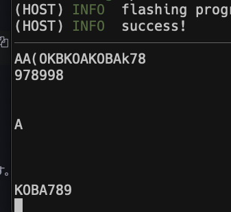

# 終わりに

はんだ付けはほぼ経験なかったのでかなり苦戦しました。でもRaspberry piのはんだ付けがトレーニングになったので少し自信がつきました。

作業時間ははんだ付けなどが2時間30分、ソフトウェア周りが1時間30分くらいでした。ソフトウェア周りはよく整備されているので僕のようにハマらなければすぐ行けると思います。

ソフトウェア周り、ファームウェアについてはサンプルコード動かしただけなので、組み込みRustができるとはまだ言えない気がします。でもとりあえず動く感動は大事で、Rustってすごい！と改めて思いました。コードを読んだり改変してみたいです。

RustyKeysを作ってくださったKOBA789さん、ありがとうございます。
