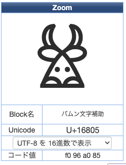
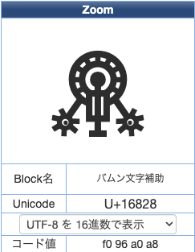

<!-- titleは自動で入る -->
弟3回です。[Primitive Type `char`](https://doc.rust-lang.org/std/primitive.char.html) を調べました。今回は文字コードについて知らなかったのでUnicodeやUTF-8周辺を調べて事前知識をつける回でした。

UnicodeとUTF-8の違いを初めて理解した、というレベルの理解なので、何かありましたら [kaito_tateyama](https://twitter.com/kaito_tateyama) までご連絡ください。意見とか感想とか、こういうの読むといいよ〜というアドバイスも歓迎です。

# 🦀 会の流れ

- 参加: [kaito_tateyama](https://twitter.com/kaito_tateyama), [いかなご](https://twitter.com/ikanag0) さん
- 時間: 5/27(土) 20:30 - 23:40(勉強会を終えた後雑談して結局25:00くらいまで話してた)
- 形態: オンライン、discordで通話 + hackmdでドキュメント共有
  - 今回はdiscordの調子がよくなくて、画面共有せず進めた
- 内容: Rustの [Primitive Type `char`](https://doc.rust-lang.org/std/primitive.char.html) のAPI以外の前半箇所を理解して、その後UnicodeやUTF-8について調べた。
- やり方
  - 初めに [Primitive Type `char`](https://doc.rust-lang.org/std/primitive.char.html) のドキュメント前半を1段落ずつくらい互いに意味が分かるように訳をする。読む途中で生じた疑問はhackmdにメモしてとりあえず解決しない。
  - 読み終えたら、Unicode, UTF-8周りを調べて先ほど生じた疑問を解決したり、新しい疑問が生まれて解決する
  - 大体疑問が今はそんなに気にならないやつだけになったので、時間も来たし終了

# 💻 技術

## 事前知識: Unicodeについてざっくり

文字をデジタルに表現するには？と考えた時、単純には以下の事柄を考慮する必要がある。

- 「文字」と「文字の表記」は分けて考える
  - 例えば、「あ」という文字はfontによって見た目が異なる
- 「文字」と「文字のデジタル表現」は分けて考える
- 「文字列」をデジタル表現する時に、どのようにバイト列に変換するか考える。また、バイト列をどのように文字列に変換するか考える。

それぞれ、以下のようにUnicodeでは定められている。

- Abstract Character: 「文字」のこと
  - [pdf: definition D7 in Section 3.4, Characters and Encoding](https://www.unicode.org/versions/Unicode15.0.0/ch03.pdf#G2212) に記載
  - 組織や、テキストデータの表現として使われる情報の単位
  - 具体的な形式を持たないので、「glyph」とは異なる概念 => 文字の表記とは分けている、抽象的な文字という概念がこれ。
- Unicode codespace: 0から10FFFFまでの整数値
- Code point: Unicode codespace内の値
- Encoded character: abstract characterとcode pointの対応関係。
  - つまりこれが文字と文字のデジタル表現の変換表
- UTF-8: UTFの一つ。Unicode code pointの列をバイト列に変換する。この変換はlosslessなので、適切なバイト列をUnicode code pointの列に変換できる。
  - UTF-8は列に関する変換方法、Unicodeは世界中のテキストとして書かれる文字をデジタル表現するための規格。Unicodeという大きな規格のなかにUTF-8が変換方法として載っているイメージ。

## Primitive Type `char` について

[Primitive Type `char`](https://doc.rust-lang.org/std/primitive.char.html) のドキュメント

`char` は1つの文字を表す。ここで言う文字とは、Unicodeで定義されている `Unicode scalar value` (USVとも略される) を指す。

Unicode scalar valueについては以下のUnicode用語集を参考にした。つまり、`[0, 0x10FFFF]` かつ `[0xD800, 0xDFFF]`(surrogate code point) 以外の範囲の Unicode code pointを指す。

> Unicode Scalar Value. Any Unicode code point except high-surrogate and low-surrogate code points. In other words, the ranges of integers 0 to D7FF and E000 to 10FFFF inclusive. (See definition D76 in Section 3.9, Unicode Encoding Forms.)
> -- [Glossary of Unicode Terms](https://www.unicode.org/glossary/#unicode_scalar_value) より

以下のように `char` の範囲でない文字はリテラルとしてコンパイルエラーになる。(`\u`の形式でなんでも書けると思っていた...)

```rust
// コンパイルエラー
['\u{D800}', '\u{DFFF}', '\u{110000}'];
```

以下のようにコンパイルエラーが出る。 `unicode escape must not be a surrogate` とか親切。

```text
   Compiling playground v0.0.1 (/playground)
error: invalid unicode character escape
 --> src/main.rs:4:3
  |
4 | ['\u{D800}', '\u{DFFF}', '\u{110000}'];
  |   ^^^^^^^^ invalid escape
  |
  = help: unicode escape must not be a surrogate

error: invalid unicode character escape
 --> src/main.rs:4:15
  |
4 | ['\u{D800}', '\u{DFFF}', '\u{110000}'];
  |               ^^^^^^^^ invalid escape
  |
  = help: unicode escape must not be a surrogate

error: invalid unicode character escape
 --> src/main.rs:4:27
  |
4 | ['\u{D800}', '\u{DFFF}', '\u{110000}'];
  |                           ^^^^^^^^^^ invalid escape
  |
  = help: unicode escape must be at most 10FFFF

error: could not compile `playground` due to 3 previous errors
```

USVはUTF-8にエンコードされる文字集合と一致し、`char` と `str` は互いに変換しても安全になる。
全てのUSVは `char` として有効である。

また、USVはsurrogate部分がちょうど中抜けになっているのだが、この範囲はコンパイラが `char` の型に含まれないことを認識しているので、以下のように中抜けのmatchに対して non-exhaustive matchのコンパイルエラーは発生しない。

```rust
// コンパイルが通る
let c: char = 'a';
match c {
    '\0' ..= '\u{D7FF}' => false,
    // ここsurrogate code point部分が中抜けになっている
    '\u{E000}' ..= '\u{10FFFF}' => true,
};
```

また、文字列表現に関して、`char` は一文字4byteである一方で、 `String` はUTF-8 encodeされるので、1文字4byteとは限らない。以下のように `Vec<char>` の方がメモリを多く使用する。

```rust
let s = String::from("love: ❤️");
let v: Vec<char> = s.chars().collect();

assert_eq!(12, std::mem::size_of_val(&s[..]));
assert_eq!(32, std::mem::size_of_val(&v[..]));
```

12は実際には以下のように1byteが6つ + ハートの絵文字で6byte使用で計12byte分となっている。ハートの絵文字以外にも、複数のコードポイントで1文字に見える場合がある。

[playground link](https://play.rust-lang.org/?version=stable&mode=debug&edition=2021&gist=81ff5594f95fc86e6e0731780873c1d0)

```rust
let my_string = "love: ❤️";

for (index, c) in my_string.char_indices() {
  let mut buf = [0; 4];
  c.encode_utf8(&mut buf);
  println!("Character at index {}: {:?}", index, buf);
}
```

実行結果は以下のようになる。
ASCIIの範囲は1byte扱いで、ハートが3byteが2つで表現されている。

```text
Character at index 0: [108, 0, 0, 0]
Character at index 1: [111, 0, 0, 0]
Character at index 2: [118, 0, 0, 0]
Character at index 3: [101, 0, 0, 0]
Character at index 4: [58, 0, 0, 0]
Character at index 5: [32, 0, 0, 0]
Character at index 6: [226, 157, 164, 0]
Character at index 9: [239, 184, 143, 0]
```

## その他

### `_` は特別で、 `match` で絶対通らないパスも書ける

以下のように、Optionに対して `Some` と `None` が網羅されていたら `_` にマッチすることはないが、 `_` を書くことができる。

[playground link](https://play.rust-lang.org/?version=stable&mode=debug&edition=2021&gist=7ed2056ecaed0517617cc87b7a191a90)

```rust
#![allow(unused)]
fn main() {
    let c: Option<i32> = None;
    match c {
        Some(_) => true,
        None => false,
        _ => unreachable!(),
    };
}
```

## Trojan Source

Unicode悪用といえば [Trojan Source](https://www.itmedia.co.jp/news/articles/2111/02/news155.html) が一時有名でしたね

Rustは [ソースとしてはvalidなので、linterで警告を出す方針](https://techblog.paild.co.jp/entry/2023/05/26/135944#:~:text=CVE%2D2021%2D42574%20(Unicode)) で対処しているようです。

## 残った疑問

### `const fn` なのに `from_u32` はruntime errorなのはなぜ？

ドキュメントのサンプルコード、 [`char::from_u32`](https://doc.rust-lang.org/std/primitive.char.html#method.from_u32) は `const fn` なのでコンパイル時にエラーになるはずだが、なぜ実行時エラーになる？
`const fn` についてもっと知った方が良さそう。

```rust
// Panics; from_u32 returns None.
char::from_u32(0xDE01).unwrap();
```

### `match` の範囲にその他部分を入れる

例えば、Invalidな型を含む範囲をmatchのアームのパターンに入れた時に、どういう振る舞いをするか？
コンパイラは、 中抜きの `range` のような `char` 型をどうやって作成しているのか？

例えば、以下のように `char` 型がとり得ないInvalidな値をmatchのアームのパターンに含めてもコンパイルは通る

[playground link](https://play.rust-lang.org/?version=stable&mode=debug&edition=2021&gist=957c2685dbcede7c4c1278a940027d0f)

```rust
let c: char = 'a';
match c {
    '\0' ..= '\u{10FFFF}' => true, // サロゲートを含む？
    _ => false
};
```

### その他疑問

- `std::char` にイテレータがあるという記載があったがなんのためなのかどこにあるのか調べたい
  - そもそもない？記載がどこかも忘れてしまったので本当に何もない可能性がある
- 異体字セレクタ
- 絵文字の家族のやつとかの指定方法
- Rustが実際Unicodeをどう扱っているか
  - 表示としてはおそらくfontの責務になる。
  - でも `uppercase` とか、文字を変換するところはデカい変換テーブルがコンパイラに埋め込まれているのでは？

# 💬 いろいろ

- 時間管理大事。23:30に終えたら20分くらいは雑談で延長してもいいがそれ以上は良くない。
  - 会で満足し切るのは良くなくて、ちょっと物足りないくらいが次回へのモチベになる。
- [Unicode文字一覧表](https://tools.m-bsys.com/ex/unicode_table.php) が楽しい。おすすめはバムン文字です。



<div style="text-align:center;">牛さんみたい</div>



<div style="text-align:center;">オーパーツでしょこれ</div>

- リガチャ、ZWJ、unicode-bidi、幽霊文字、縦書き、UTF-8の変換アルゴリズムとか、TSGCTFで出題されたffi, グリフウィキなどの話題が出ました。メモする気合いが足りないので諦めます...

# 🖊️ 参考

- サンプルコードはRustの公式ドキュメントを参考・引用しました。
  - [https://doc.rust-lang.org/std/primitive.char.html](https://doc.rust-lang.org/std/primitive.char.html)
- Unicodeでわからない単語はGlossary of Unicode Termsをまず当たって、その後仕様のpdfを読みに行きました。
  - [https://www.unicode.org/glossary/](https://www.unicode.org/glossary/)

# ➡️ 次回

`char` の実装を読みに行きます。
