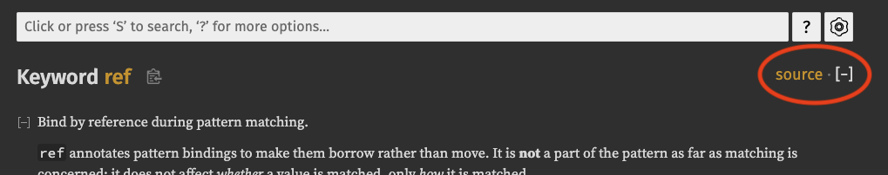

<!-- titleは自動で入る -->
第5回です。(#todo ここにTLDR書く)

# 🦀 会の流れ

- 参加: [kaito_tateyama](https://twitter.com/kaito_tateyama), [いかなご](https://twitter.com/ikanag0) さん
- 時間: 6/11(日) 20:30 - 23:17(勉強会を終えた後雑談して24時くらいに解散)
- 形態: オンライン、discordで通話 + hackmdでドキュメント共有、必要に応じてRust playgroundを画面共有してコード書く
- 内容: [`ref`](https://doc.rust-lang.org/std/keyword.ref.html) keywordのドキュメントを読んで、実際の `compiler/` 以下のパーサ周りの実装を読み、関連するissueを眺めた。
- 流れ:
  - 初めに雑談、会の流れに追加したい話があったので共有
  - `ref` のDocsを読む
  - `compiler/` 以下の実装を読みにいく
  - `ref` に関連するissueを探す
  - 二人とも疲れてきたので切り上げた

# 💻 技術

## [`ref`](https://doc.rust-lang.org/std/keyword.ref.html) のドキュメントを読む

[`ref` のドキュメント](https://doc.rust-lang.org/std/keyword.ref.html)

> Bind by reference during pattern matching.

この場合のBindは値の束縛だと思われる。「パターンマッチの中で参照によって値を束縛する。」

>  It is not a part of the pattern as far as matching is concerned: it does not affect whether a value is matched, only how it is matched.

これ難しかった。マッチに関心がない => `ref` はマッチするかどうかに関係ない、という意味で「マッチするかどうかに `ref` は関係がなく、どのようにマッチするか(どのように値を束縛するか)に影響する」

この後の `&` vs `ref` でも似たような話が展開されている。

この中で特に疑問はなく、実装を眺めた。

## identifier patterns

[The Rust Reference / identifier patterns](https://doc.rust-lang.org/reference/patterns.html#identifier-patterns)

`&` vs `ref` から飛べるリンク。これを眺めると、以下のような構文になっていることが分かる。

```text
ref? mut? IDENTIFIER (@ patternNoTopAlt)? 
```

例えば、以下のコードは正しい。 `e @ 1 ..= 5` というのがアーム部分に入っている。

```rust
let x = 2;

match x {
    e @ 1 ..= 5 => println!("got a range element {}", e),
    _ => println!("anything"),
}
```

## `ref` 実装の実体を探す

Rustのドキュメントは写真のように source から実装に飛べるのでstdの関数はそれでうまく行ったのだが、`ref` は実体にすぐに飛べそうではなかった。



実際、`ref_keyword` しかない。

```rust
mod ref_keyword {}
```

そこで以下のように検索をかけた。

- コードをcloneしてくる
- VS Codeで検索する。クエリ: `"ref"` (double quoteあり。なしだとコードとして使われている`ref`がヒットする)
  - ここでrust-analyzerやrustfmtがヒットしてしまうので、file to excludeを3点マークから選択して、 `src/tools` を指定してexclude
  - Open in editorをクリックすると展開されてコピペ可能になる

検索の結果としては、以下のようにAST pretty周りやborrow checker, HIRなどが出てきた。

```text
10 results - 9 files

compiler/rustc_ast_pretty/src/pprust/state.rs:
  1412                  if *by_ref == ByRef::Yes {
  1413:                     self.word_nbsp("ref");
  1414                  }

compiler/rustc_borrowck/src/diagnostics/mutability_errors.rs:
  1315      let pattern_str = tcx.sess.source_map().span_to_snippet(span).ok()?;
  1316:     if pattern_str.starts_with("ref")
  1317:         && pattern_str["ref".len()..].starts_with(rustc_lexer::is_whitespace)
  1318      {

compiler/rustc_hir_analysis/src/outlives/implicit_infer.rs:
  111              ty::Ref(region, rty, _) => {
  112:                 debug!("Ref");
  113                  insert_outlives_predicate(tcx, rty.into(), region, field_span, required_predicates);

compiler/rustc_hir_pretty/src/lib.rs:
  1768                  if by_ref == ByRef::Yes {
  1769:                     self.word_nbsp("ref");
  1770                  }

compiler/rustc_middle/src/mir/interpret/error.rs:
  345              match self {
  346:                 Self::Ref => "ref",
  347                  Self::Box => "box",

compiler/rustc_span/src/symbol.rs:
  54          Pub:                "pub",
  55:         Ref:                "ref",
  56          Return:             "return",

library/std/src/keyword_docs.rs:
  1125  
  1126: #[doc(keyword = "ref")]
  1127  //

src/librustdoc/html/highlight.rs:
  426      Some(match text {
  427:         "ref" | "mut" => Class::RefKeyWord,
  428          "false" | "true" => Class::Bool,

tests/ui/issues/issue-11869.rs:
  11          "in" => "in_",
  12:         "ref" => "ref_",
  13          ident => ident
```

しかしparser周りが出てこない。
いかなごさんが見つけてくれたが `ref` は実際には `kw::Ref` として扱われている。
後で調べたら、検索の中の `compiler/rustc_span/src/symbol.rs` が `"ref"` と `Keywords::Ref` の対応に相当する。 参考: [対応の該当箇所](https://github.com/rust-lang/rust/blob/a51ad131e6ba90ec2da67f35a44531494a9f07f3/compiler/rustc_span/src/symbol.rs#L55)

```rust
symbols! {
    // ,,,
    Keywords {
        ...
        Ref:                "ref",
```

## `ref` のパーサ周りの処理

parser周りで見つけたのは以下の部分。参考: [compiler/rustc_parse/src/parser/pat.rs](https://github.com/rust-lang/rust/blob/34d64ab7a21f704adb496ee2749242fc3511f0f8/compiler/rustc_parse/src/parser/pat.rs#L379-L382)

```rust
} else if self.eat_keyword(kw::Ref) {
    // Parse ref ident @ pat / ref mut ident @ pat
    let mutbl = self.parse_mutability();
    self.parse_pat_ident(BindingAnnotation(ByRef::Yes, mutbl))?
}
```

コメントを読むと分かるが、identifier patternをパースする形になっていて、 `ref ident @ pat` の形か、 `ref mut ident @ pat` の形に合致する。
以下の処理になっていることが推測される。

- `eat_keyword` でkeyword `ref` をパースして消費
- `parse_mutability` で `mutbl` 変数に `mut` があるかないかを格納
- `parse_pat_ident` で `@ pat` あたりをパースする
- 以上でパース完了

patはpatternの略で、mutblはmutableの略だと思われる。

[parse_pat_ident](https://github.com/rust-lang/rust/blob/34d64ab7a21f704adb496ee2749242fc3511f0f8/compiler/rustc_parse/src/parser/pat.rs#L827-L849) の実装を調べる。

```rust
/// Parses `ident` or `ident @ pat`.
/// Used by the copy foo and ref foo patterns to give a good
/// error message when parsing mistakes like `ref foo(a, b)`.
fn parse_pat_ident(&mut self, binding_annotation: BindingAnnotation) -> PResult<'a, PatKind> {
    let ident = self.parse_ident()?;
    let sub = if self.eat(&token::At) {
        Some(self.parse_pat_no_top_alt(Some(Expected::BindingPattern))?)
    } else {
        None
    };

    // Just to be friendly, if they write something like `ref Some(i)`,
    // we end up here with `(` as the current token.
    // This shortly leads to a parse error. Note that if there is no explicit
    // binding mode then we do not end up here, because the lookahead
    // will direct us over to `parse_enum_variant()`.
    if self.token == token::OpenDelim(Delimiter::Parenthesis) {
        return Err(EnumPatternInsteadOfIdentifier { span: self.prev_token.span }
            .into_diagnostic(&self.sess.span_diagnostic));
    }

    Ok(PatKind::Ident(binding_annotation, ident, sub))
}
```

`parse_pat_ident` は `ident` または `ident @ pat` の形をパースする。
なんとなくは分かるが、以下のコメント部分が難しい。

```text
// Just to be friendly, if they write something like `ref Some(i)`,
// we end up here with `(` as the current token.
// This shortly leads to a parse error. Note that if there is no explicit
// binding mode then we do not end up here, because the lookahead
// will direct us over to `parse_enum_variant()`.
```

結論としては以下のようになった。

- まず `ref Some(i)` がダメで、その時は `(` でparse errorになる。
- `binding mode` と、 `parse_enum_variant()` が謎
  - [`BindingMode`の定義](https://github.com/rust-lang/rust/blob/34d64ab7a21f704adb496ee2749242fc3511f0f8/compiler/rustc_middle/src/thir.rs#L573)は，`ByValue`と`ByRef(BorrowKind)`の`enum`
  - [`parse_enum_variant()`の定義](https://github.com/rust-lang/rust/blob/34d64ab7a21f704adb496ee2749242fc3511f0f8/compiler/rustc_parse/src/parser/item.rs#L1329)
- `BindingMode`が指定されていないときは`(`で終わらないはず
    - `Some(i)`みたいなケースがこれに該当して，そのときは`parse_enum_variant()`でうまくパースできる
    - 裏を返せば，`(`で終わっているということは `ref Some(i)` みたいな形で，これはinvalid

以上で `ref` のパーサ周りは一通り眺めた。雰囲気分かったかも？くらいの温度感ではある。

### パースできなさそうなケースを考えてみる

先ほどの `ref` パーサ周りの処理を眺めると、構造体 `A` について、以下のようなコードの処理はどうなるだろうかという疑問が生まれた。

[Rust playground link](https://play.rust-lang.org/?version=stable&mode=debug&edition=2021&gist=3f5adc53e21bd51b239d535b27800675)

```rust
enum E {
    A {
        a: i32,
    }
}
fn f(e: E) {
    use E::*;
    match e {
        ref A { a } => (),
    }
}
```

このコードでは、`ref` の後に `ident {` が出てくる。`ident (` ではないからエラーにならなさそう。
しかし実行すると正しくエラーになって落ちる。

```text
error: expected one of `=>`, `@`, `if`, or `|`, found `{`
 --> src/main.rs:9:15
  |
9 |         ref A { a } => (),
  |               ^ expected one of `=>`, `@`, `if`, or `|`
```

おそらくident部分に `A { a }` が含まれるのだろうか？ここも分からなかった。

ここら辺で `ref` 実装に関しては撤退。

## issueを眺める

普通に `ref` だけでissue検索するとデカいので、 `is:issue is:open in:title ref` のようにtitleだけに絞って検索をかけるなど工夫をした。

### [ref in or-pattern less powerful than match ergonomics #105778](https://github.com/rust-lang/rust/issues/105778)

去年12月にOpenで今まで音沙汰なさそうなIssue。

以下のように、Or patternでは本来マッチするべきものがエラーになる。
マッチのアームでは `x` となっているが、実際は Orで前者がtupleの最初にマッチ、後者がtupleの後ろにマッチするので、コンパイルが通らない方のコードは本来通って欲しいことになる。

```rust
// コンパイルが通らない
fn bind_by_ref(x: Option<u32>, y: Option<&u32>) {
    match (x, y) {
        (Some(ref x), _) | (_, Some(x)) => {}
        _ => {}
    }
}

// コンパイルが通る
fn match_ergonomics(x: Option<u32>, y: Option<&u32>) {
    match (&x, y) {
        (Some(x), _) | (_, Some(x)) => {}
        _ => {}
    }
}
```

以下のようなエラーメッセージが出る。

[Rust playground link](https://play.rust-lang.org/?version=stable&mode=debug&edition=2021&gist=6183dae107f727739111dd64188734d1)

```text
   Compiling playground v0.0.1 (/playground)
error[E0409]: variable `x` is bound inconsistently across alternatives separated by `|`
 --> src/main.rs:4:37
  |
4 |         (Some(ref x), _) | (_, Some(x)) => {}
  |                   - first binding   ^ bound in different ways

For more information about this error, try `rustc --explain E0409`.
error: could not compile `playground` (bin "playground") due to previous error
```

これは直すの難しそうだけど、エラーメッセージもbindingした `ref x` と後ろのbound in different waysの `x` は別物のはずでおかしい気がするし、改善したさがある。

### [Error message suggests using & and mut when matching on fields behind a &mut, rather than &mut or ref mut #74617](https://github.com/rust-lang/rust/issues/74617)

これは2020年のなので今やるとエラーメッセージが少し違うけど、、今でもエラーがおかしそうなIssue。

```rust
struct S {
    field: Option<String>,
}

fn f(arg: &mut S) {
    match arg.field {
        Some(s) => s.push('a'),
        None => {}
    }
}

fn main() {
    let mut s = S {
        field: Some("a".to_owned()),
    };
    f(&mut s);
    println!("{:?}", s.field);
}
```

[Rust playground link](https://play.rust-lang.org/?version=stable&mode=debug&edition=2021&gist=615bc2dccb4dd984ee81fa6679293ba8)

```text
   Compiling playground v0.0.1 (/playground)
error[E0507]: cannot move out of `arg.field` as enum variant `Some` which is behind a mutable reference
 --> src/main.rs:6:11
  |
6 |     match arg.field {
  |           ^^^^^^^^^
7 |         Some(s) => s.push('a'),
  |              -
  |              |
  |              data moved here
  |              move occurs because `s` has type `String`, which does not implement the `Copy` trait
  |
help: consider borrowing here
  |
6 |     match &arg.field {
  |           +

error[E0596]: cannot borrow `s` as mutable, as it is not declared as mutable
 --> src/main.rs:7:20
  |
7 |         Some(s) => s.push('a'),
  |                    ^^^^^^^^^^^ cannot borrow as mutable
  |
help: consider changing this to be mutable
  |
7 |         Some(mut s) => s.push('a'),
  |              +++

Some errors have detailed explanations: E0507, E0596.
For more information about an error, try `rustc --explain E0507`.
error: could not compile `playground` (bin "playground") due to 2 previous errors
```

このエラーメッセージの通りに、`&arg.field` にして `mut s` にしてもエラーになる。
`ref mut s` にするか、もしくは `&mut arg.field` のどちらかがいいですよみたいなエラーメッセージが本来出て欲しい。diagnostics関連はfirst issueに良いと言われるので取り組みたいけど難しそう...

これは結構遭遇しそうな形をしているので直したさがある。

### [Suggestion for as_mut_ref method on *mut T is <*const T>::as_ref rather than <*mut T>::as_mut #83695](https://github.com/rust-lang/rust/issues/83695)

2021年のissue。以下のように間違って `as_mut_ref` という存在しないメソッド名を書いた時に出るエラーメッセージがおかしいというもの。

```rust
fn main() {
    let p: *mut () = std::ptr::null_mut();
    p.as_mut_ref();
}
```

[`as_mut_ref`](https://qnighy.hatenablog.com/entry/2017/05/28/070000) は昔あったキーワード説がある。

現在は以下のようなエラーメッセージになる

[Rust playground link](https://play.rust-lang.org/?version=stable&mode=debug&edition=2021&gist=7722ded06b0b65315c9b1c3788648ca8)

```text
   Compiling playground v0.0.1 (/playground)
error[E0599]: no method named `as_mut_ref` found for raw pointer `*mut ()` in the current scope
 --> src/main.rs:3:7
  |
3 |     p.as_mut_ref();
  |       ^^^^^^^^^^ help: there is a method with a similar name: `as_mut`
  |
  = note: try using `<*const T>::as_ref()` to get a reference to the type behind the pointer: https://doc.rust-lang.org/std/primitive.pointer.html#method.as_ref
  = note: using `<*const T>::as_ref()` on a pointer which is unaligned or points to invalid or uninitialized memory is undefined behavior

For more information about this error, try `rustc --explain E0599`.
error: could not compile `playground` (bin "playground") due to previous error
```

helpが出るようになった。このhelpはいい線行っているのにnoteの方ではおかしいエラーメッセージが出ている。

- `<*const T>::as_ref()` の`*const T`は`*mut T` が正しい
- `as_ref` ではなく、 `as_mut` を提案すべき

このエラーもdiagnostics系なので取り組んでみたいけど難しそう...

## どうやって似ている単語をサジェストしているのだろうか

typoした時に、どのようにしてsimilar nameを提案しているのだろうか？
[Add levenshtein distance based suggestions everywhere #30197](https://github.com/rust-lang/rust/issues/30197) を読むと、マクロとか以外の場所では[レーベンシュタイン距離](https://ja.wikipedia.org/wiki/%E3%83%AC%E3%83%BC%E3%83%99%E3%83%B3%E3%82%B7%E3%83%A5%E3%82%BF%E3%82%A4%E3%83%B3%E8%B7%9D%E9%9B%A2)に基づいて類似度判定を行ってそうなことが分かる。

## その他

### `ref` は値つきのenumならどこでも使えそう

`Some(ref x)` の用法をよくみるけど、Optionに限った話ではないな...

### rustcを読むに当たってのVS Code setup周り

rustc-dev-guideの [Suggested Workflows / Visual Studio Code](https://rustc-dev-guide.rust-lang.org/building/suggested.html#visual-studio-code) が参考になる。

`./x.py setup vscode` と打つと `.vscode/` 以下にrust-analyzer向けの設定が出てくる。

実際にやってみるとrust-analyzerの設定が `./x.py check` に変わってはいるが定義ジャンプとかはできなかったので、もう少し調べたい。

### `TODO` や `FIXME` で検索すると面白い

結構コメントで `TODO` や `FIXME` がいっぱい出てくる。

IEEE-754の浮動小数点数周辺でFIXMEがたくさんコメントに書かれていたり、gccバックエンドで[TODOしか書いてないコメント](https://github.com/rust-lang/rust/blob/b550eabfa6f371270c02644a19ad45415938fd68/compiler/rustc_codegen_gcc/src/debuginfo.rs#L49) があった。やはり貢献できるところはまだまだ残ってそう。

gccバックエンドで命名に悩む様子も見られる

```text
// FIXME(eddyb) find a common convention for all of the debuginfo-related
// names (choose between `dbg`, `debug`, `debuginfo`, `debug_info` etc.).
```

# 💬 いろいろ

## 会の進め方に、時間が余ったらissueを眺めるを追加

今の流れは以下の通り

- ドキュメント読む
- 疑問が出たらソースコード読んで解決

会の趣旨としては、「Rustに詳しくなる」に加えて「Rustに貢献する」もあるので、Rustのソースコードが読めている今、issueにも目を通していけると考えた。
そこで以下のように会の流れを変更した。

- ドキュメント読む
- 疑問が出たらソースコード読んで解決
- 時間が余ったら、(余らなかったらskip) 👈 new!
  - issueを眺める

issueは膨大なので、眺め方を以下のように決めた。

- stdで勉強したキーワードでissueを検索して、出てきたissueの背景理解をする
- issueはOpenに限る
  - Closeだと歴史探訪になる可能性があり、やる気が出にくい
  - Openを起点にしてCloseを調べるのはやる気出るのでOK
- issue検索だと難しいから、githubでファイルcommit logを眺めるのもいいかも
- 簡単なissueのラベルに絞る
  - [適切なラベルのView](https://github.com/issues?q=is%3Aopen+is%3Aissue+org%3Arust-lang+no%3Aassignee+label%3AE-easy%2C%22good+first+issue%22%2Cgood-first-issue%2CE-medium%2CE-help-wanted%2CE-mentor+-label%3AS-blocked+) から絞る。参考: [rustc-dev-guide / Easy or mentored issues](https://rustc-dev-guide.rust-lang.org/#easy-or-mentored-issues)

実際にやってみた感想としては小さくRust playgroundでコードを書く機会になるので良かった。
例えばエラーメッセージの改良のissueだったら実際にplaygroundにコピペしてエラーメッセージ出してみたり、少し変更してエラーメッセージがどう変わるか見たりした。また、issueをOpenなものに絞っているので改善のためにどうしたらいいだろうかということを考えることができた。

今後も時間が余ればこの枠を設けたい。

## Clippyとかもやりたい

一人でissueに取り組むかというとそうではないので、モブプログラミングをしながらClippyのissueのうちbeginner向けのものに取り組むのやりたい。

# 💪 残った疑問や今後やりたいこと

- [`symbols!` マクロ](https://github.com/rust-lang/rust/blob/a51ad131e6ba90ec2da67f35a44531494a9f07f3/compiler/rustc_span/src/symbol.rs#L22) は文字列とコンパイラ内部での表現の対応を行うmacroっぽいので調べたい
- identifier patternの ident には `A { a }` のように`{`を含むシンボルが入るのか？
  - パースできなさそうなケースを考えてみる の章より
- `ref` パーサ周辺
  - `parse_pat_ident` 理解したいけどむずい
    - 関数名から推測できるけどそれ以上はわからん
  - ゆるい理解に止まる

# 🖊️ 参考

# ➡️ 次回

次回は `as` 編。解決したい疑問は以下の通り

- 型周りの話がしたい。TypeScriptの `as` と異なる点が理解できると嬉しい。
  - `as` できる基準とか
- `as` で範囲を超える場合の挙動を知る
  - デカい値を突っ込んだ時の壊れ方、おそらくコンパイルエラーでは防げないからpanic？
