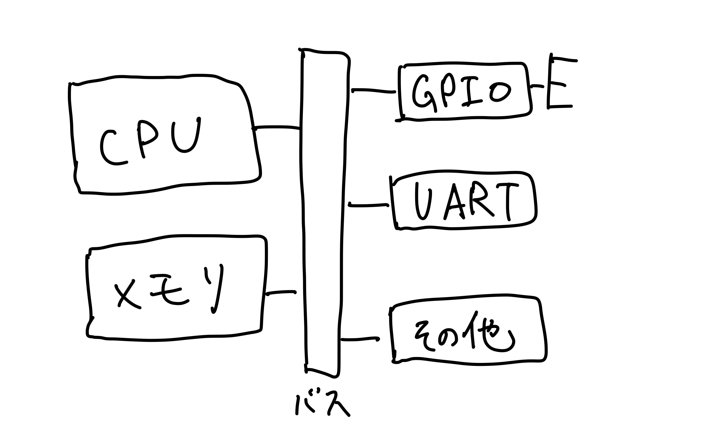
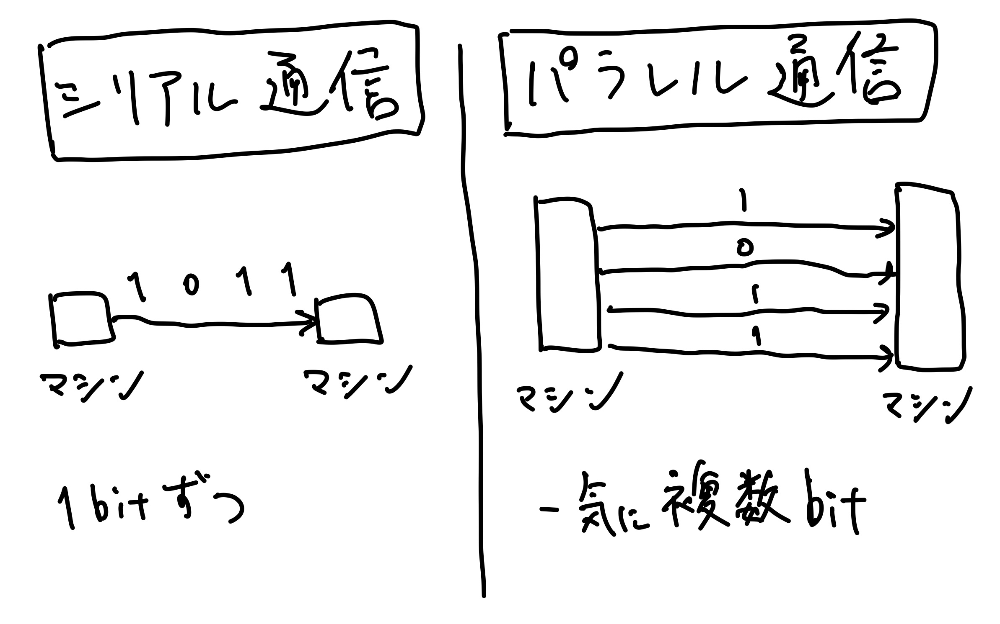

<!-- titleは自動で入る -->
社の同期と、「なんか技術オタク語りしたいよね」というノリで業務に全く関係なく自分の趣味進捗や技術的な話題で盛り上がる会をしています。隔週で行っていて今回が5回目です。
こちらはその記録と、分からなかったことを個人的に復習をして追記したものになります。

# 会について

参加者は8人でした。それぞれが最初に話したいネタを書いて、順番に心ゆくまで双方向に雑談をします。時間が来たら切り上げる形式です。全部で2時間くらいの会でした。(途中参加・途中抜け自由なので自由に抜けていったりしました)
今回は特にテーマもないので「最近の趣味進捗や話したいこと」という題材でネタを出しました。

# Arduinoやその他ボードの話

[Arduino Uno R4 Minima](https://www.switch-science.com/products/9000) という新しいArduinoのボードが出たという話。
まずArduinoって聞いたことくらいしかないな、という話が出たのでマイコンの説明がされました。

- マイコンは今使っているPCよりも非力なCPUとちっちゃいメモリで動いている
  - マイコンは安くて消費電力が低いのが嬉しい
- Linuxがまともに動かないようなボードもある
  - Q. どうやってプログラムを動かすんですか？→A.ベアメタル=OSがなく、フラッシュメモリからプログラムを読み出して実行する環境 で動かします。
- GPIOがあるボード
  - カメラ越しにGPIOのピンを見せたりしました。
- 意外とみんなマシンを持っていて、zoomのカメラ越しにボードを見せ合いました。
  - FPGAを持っている人が4人
  - microbit
  - Raspberry pi 4, Raspberry pi pico(自作キーボードのRustyKeysの一部として)
  - RISC-Vボード: Visionfive 2
  - ARMのボード
  - M5stack paper

## なぜボードの一部はLinuxがまともに動かない？

メモリが少ないからです。
Linuxをどう定義するかにもよるのですが、無理なくLinuxを動作させるためには最低でも数MBは必要で、それに対してArduinoの例えばArm Cortex-M4のRAMは数百KBくらいしかないし、外部RAMも搭載していません。

OSがなくてもプログラムを動かすことはできて、Arduinoだとこのピンに1を書き込むとある機能が使えます、みたいなところがうまく抽象化されているのでArduino IDEでポチッと簡単にプログラミングできるそうです。

## マイコンの構造

コンピュータの計算装置が外部とデータのやり取りをするために、バスを介して周辺機能を使う必要があります。
例えば、以下のような周辺機能があります。

- UART: Universal Asynchronous Receiver Transmitter は非同期にシリアル通信が行えます。
- GPIO: General Purpose Input/Output は入出力に使えるデジタル信号の出入り口として機能します。

参考: [CPUとメモリだけでは動かない！マイコン活用に必須の「周辺機能」とは](https://www.renesas.com/jp/ja/support/engineer-school/mcu-programming-peripherals-01-gpio)

## UARTとは？

2つの機器が通信をするとき、1ビットずつデータを送る通信方式のことをシリアル通信と言います。

それに対して、複数ビットを複数のケーブルで同時に送る通信方式のことをパラレル通信と言います。

パラレル通信だと同時に送った各ビットがどの順番か整理する必要があるので規格が複雑になります。そこで、マイコンやマイコンとPCを繋ぐ際には比較的単純なシリアル通信が使用されます。

**UARTはこのシリアル通信の規格であるRS-232で使われる通信方式のことです。** 元々はその通信を行うチップを指していましたが、現在ではこのあたりは結構用語が雑に使われています。

実際に私はFPGAとPCで通信をするときにUARTを使いました。

参考:
- [シリアル通信とは,パラレル通信との違い～制御工学の基礎あれこれ～](https://taketake2.com/M44.html)
- [シリアル通信で Hello, FPGA (2) | ACRi Blog](https://www.acri.c.titech.ac.jp/wordpress/archives/660)

## GPIOとは？

**GPIOは、入力、出力に使えるデジタル信号の出入り口です。**
例えば、スイッチのON/OFFをマイコン側に伝える入力を受け付けたり、LEDと繋いでマイコンで演算した結果を出力することが可能です。

私はLEDと繋いだり、二酸化炭素センサと繋いで使用しました。

雑談会では自作キーボードのRustyKeysを見せて、「Raspberry pi picoのトゲトゲのここがGPIOで〜」という話をしました。

参考: [GPIO | Renesas](https://www.renesas.com/jp/ja/support/engineer-school/mcu-programming-peripherals-01-gpio)

## 低レイヤーになぜ興味を持つのか？

「低レイヤーになんで興味を持つんですか？」という質問が出たので低レイヤー語りをしていた人々から回答

- コンピュータってどうやって動いているんだろう？の究極系で、好奇心から
- 東大CPU実験への憧れがある
- 縛りプレイが楽しい(制限がある環境下で起こるデバッグとか、そこでするプログラミングが楽しい)

色々話をすると、そもそも学習することに対して、「仕事に役立ちそう！→やるか〜」というタイプで仕事を軸に持っている人と、「なんか面白そう！→やるか〜」と好奇心を軸に持っている人がいて面白かったです。違いが分かっておもろいな、どちらもいいね〜という結論になりました。

## その他

- 「EABI, いいABI」(ダジャレ)
  - ARMにはOABIとEABIがある。参考 - [EABIとOABI - ひまじめ](https://sites.google.com/a/oidon.net/www/linux/arm-eabi-oabi)
- クレジットカードを読み取る店頭の決済端末はARMで動いている
  - [クレジットカード決済端末とは？種類や導入メリットを解説](https://www.alij.ne.jp/terminal) を見ると、例えばA8という端末はARM Cortex-A7らしい。
- M5Paperでtogglで時間計測中 or notを表示させることで、togglで計測しっぱなしで止め忘れるのを防いでいる話
- 「スマホはいいですよね、メモリが無限にある」
  - マイコンの話してたらスマホのメモリが無限に見える
- マイコンの面白ポイントをプレゼンしてほしい・通販番組風にマイコンボードの推しポイントを語ってほしいなどの声もありました
- microbitはRustのドキュメントが丁寧: [Discovery](https://docs.rust-embedded.org/discovery/microbit/)
- RISC-Vはいいぞ [PicoRV32 - A Size-Optimized RISC-V CPU](https://github.com/YosysHQ/picorv32)

# マストドンのサーバを建てた話

[mastodon](https://joinmastodon.org/ja) というSNSはOSSで公開されていて誰でもVPSのようなマシンを借りて用意するなどして自前でSNSをホスティングできます。それをやってみたら意外と簡単にできたよという話。

マストドンを建てる手順通りにやるとうまく行くらしいです。しかしDevelopmentの方は公式ドキュメント通りにやっても詰まるところがあったそうで、少し注意が必要そうでした。

マストドンは日本語での検索にデフォルトで対応していないので、日本語の形態素解析を行うようにパッチを当てる必要があります。Kuromojiを当てている話がされました。(そこからElasticsearchの話につながっていった)

## jemallocの話

マストドンのメモリ使用量が2.4 ~ 3GBとVPS上で動かしたりするにしては結構食うという話題から、Rubyってマルチスレッドだっけ？マストドンを建てる公式手順にjemallocが書かれているけどjemallocの効果って本当にあるんだっけ？というところが話題になりました。

主に [Ruby: mallocでマルチスレッドプログラムのメモリが倍増する理由（翻訳）｜TechRacho by BPS株式会社](https://techracho.bpsinc.jp/hachi8833/2022_06_23/50109) を理解しようとしていました。

ここはまだ記事を書いている人が理解できていないのであやふやです。

[jemalloc について調べたのでまとめた](https://zonomasa.hatenablog.com/entry/jemalloc_about) を読むと、jemallocはglibcに比べてマルチコア環境やフラグメンテーションが起こ理やすい環境でメモリ使用量の削減に寄与しそうに見えます。
mallocはメモリを確保してくれるもの、という認識しかなかったので [malloc(3)のメモリ管理構造](https://www.valinux.co.jp/technologylibrary/document/linux/malloc0001/) を読むと、メモリを管理する入れ物としてのArenaというものが大事であることが分かります。

これ以上はちょっとよく分かってないのでRubyでjemallocを使うと本当に効果があるのかどうか個人的には理解できてないです。雑談会では何人かは記事を理解していたようでした。

有名な [malloc動画](https://youtu.be/0-vWT-t0UHg) をまだ理解していないので理解しなきゃなあと思いました。

## Elasticsearchの話

Elasticsearchが好きな人から色々Elasticsearchの話を聞きました。馴染みがない人もいたので、色々説明してもらいました。

### ElasticsearchとRDBとの何となくの対応

参考: [Elasticsearchで最初にぶつかるワードたち](https://qiita.com/a4_nghm/items/94ed0640ed8a15ce1592)

Elasticsearchでいう **Index** はRDBのテーブルを指す。
Elasticsearchでいう **document** はRDBのrowを指す。

「Indexはテーブル」と聞くと、Google検索のイメージで「検索って一つの大きな空間があってそこから探すイメージだから、Indexは一つなのでは？」と思ったのですが、例えばユーザごとの環境でIndexが分かれているというのはある(他人の環境に対して検索できたらやばいので、そこは分かれてそう)

## その他

- ドキュメントは階層構造ではなくフラットな構造であるべきで、検索機能が強力であって欲しいから検索に興味を最近持っている。その点Scrapboxは良い 参考: [Scrapboxの良さ](https://scrapbox.io/nishio/Scrapbox%E3%81%AE%E8%89%AF%E3%81%95)
- 高速な全文検索アルゴリズムであるFM-indexの紹介がありました。 参考: [ハクビシンにもわかる全文検索](https://qiita.com/erukiti/items/f11f448d3f4d73fbc1f9)
  - ただ、ElasticsearchはFM-indexではなさそうで、[All About Elasticsearch Algorithms and Data Structures](https://www.elastic.co/jp/elasticon/conf/2016/sf/all-about-elasticsearch-algorithms-and-data-structures) をみたらわかりそう？というところまで行きました。

# 未定義動作とC++の話

[// なぜかこの行がないと動かない - Qiita](https://qiita.com/BlueRayi/items/996e09ac50880d8c9f53) を説明しつつ、未定義動作とは何か？について説明する話。

## 配列外アクセスができてしまう話

[その53 C言語を使ったことがない人がびっくりしそうなC言語の特徴 - YouTube](https://youtu.be/nTHqvKnCyLc) の話

- Goだと配列外アクセス時にruntime errorが出るが、Cだと配列外アクセスができてしまう(未定義動作)
- これをコンパイルオプションとリンクオプションでAddressSanitizer( `-fsanitize=address` )を用いてC言語でも実行時エラーを出せるようになります。

## AddressSanitizerはなんでリンクオプションも必要なのか？

- コンパイル時にオブジェクトファイルに謎のアセンブリを埋め込んで配列外アクセスを検出できるようにしてそうなのは想像がつくけど、リンク時もやるのはなぜ？という疑問
- libasan.soというshared libraryがdynamic linkされているようなので、リンク時にもオプションが必要なのでは？という結論になった。

nmコマンドなどで.soファイルのシンボルがリストアップできる。
参考: [c++ - How do I list the symbols in a .so file - Stack Overflow](https://stackoverflow.com/questions/34732/how-do-i-list-the-symbols-in-a-so-file)
