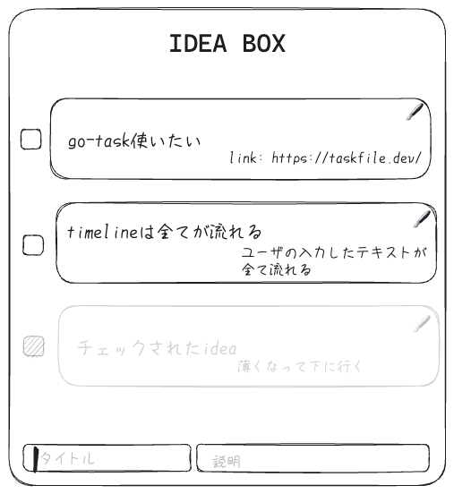

<!-- titleは自動で入る -->
[ideabox-vscode-extension](https://github.com/uta8a/ideabox-vscode-extension) という、VS Codeの拡張機能を作っています。まだ未完成なのですが、現時点で開発途中で試したことを記録に残します。

# 要約

- go-task/taskは便利
- 開発を2手で正当性が保証できるようにすると開発が億劫ではなくなる
- 昔書いたコードは忘れるので、ドキュメント真面目に書くと継続した開発が楽

# ideabox-vscode-extensionの概要

[ideabox-vscode-extension](https://github.com/uta8a/ideabox-vscode-extension) は、開発途中にちょっとしたアイデアを書き溜めておける、Markdown viewerです。

個人開発の途中で、「あっ、そういやフォーマッタ入れるの忘れてた」「エラーログを丁寧に出したい」といった、後でもいいが改善したいアイデアが浮かぶことがあります。この時、私はよくリポジトリ内で `docs/idea.md` のようなファイルで、Markdownのタスクリストを用いてメモを管理しています。しかし、だんだんメモが増えてくると、完了したやつ下に自動で行ってくれないかな、とか並び替えを楽にしたいな、という気持ちが出てきます。
そこでideaboxです。

# go-task/task の導入

VS Code Extension

# 実際にユーザが行う動作としてのE2Eテストを書く

# git reset & git rebase スタイルの開発

# Rebase and mergeでPRを取り込む

# ドキュメントを真面目に書いてみる

# 今起きている問題

# まとめ

