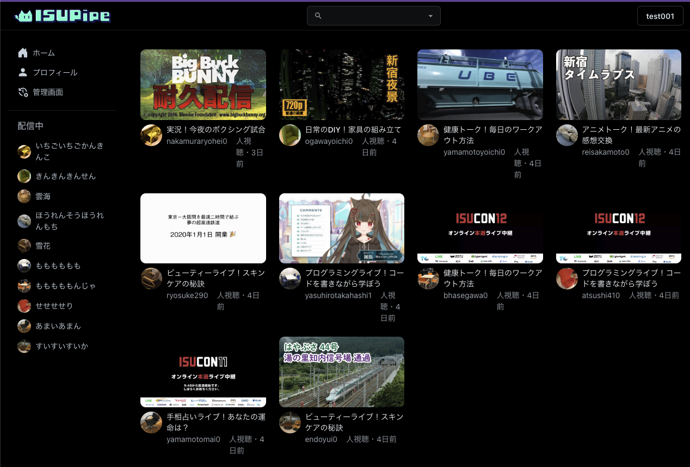

<!-- titleは自動で入る -->
ISUCON13の練習環境をさくらのクラウドで立てます。

まず、ISUCONに参加された方がクーポンを使って練習環境を立てる時は制限事項に注意しましょう。クーポン発行時の画面に書いてあったアレです。

特に今回効いてくる部分は2番目の項目です。引用します。

```txt
２． 利用にあたっては、以下のルールを遵守願います。

- クラウドアカウントについて
    - ISUCON13予習環境用のクラウドアカウントを新規作成の上、作成したクラウドアカウントに対してクーポンコードを登録願います。
- ゾーンについて
    - サーバー等のリソースの作成は、東京第１ゾーンにて行ってください。それ以外のリージョン、ゾーンへの作成は禁止といたします。
- サーバーについて
    - 作成するサーバーのスペックは、下記スペック以下で行ってください。下記より高スペックなサーバーの作成は禁止といたします。
        - 仮想CPUコア数：4以下
        - メモリ：8G以下
        - ディスク：20GB/SSDのみ
- スイッチについて
    - スイッチの作成は、最大1つまでといたします。
```

制限事項通り、クラウドアカウントを新規に作成してクーポンを適用した状態から始めました。

# 前提

- サーバは1台。ベンチとサーバは同一サーバ上で動かす。
- 使用するツール
  - terraform: [yamamoto-febc/sacloud-terraform-isucon](https://github.com/yamamoto-febc/sacloud-terraform-isucon)
  - 上のterraformで、内部的にcloud-initを使用: [matsuu/cloud-init-isucon](https://github.com/matsuu/cloud-init-isucon)

# サーバを立てる

[yamamoto-febc/sacloud-terraform-isucon](https://github.com/yamamoto-febc/sacloud-terraform-isucon) を使用します。READMEが丁寧なので読みます。

ざっくり以下のような流れです。

- `isucon13/variables.tf` を編集する
- APIキーを発行してセット
- `terraform init && terraform apply` を実行する

`isucon13/variables.tf` は以下のような感じです。

```tf
variable "public_key_path" {
  default = "~/.ssh/<ここに自分のSSH public key のパスを書く>"
}

variable "zone" {
  default = "tk1a" # 東京第1ゾーン
}
```

APIキーは以下のように発行できます。

- [さくらのクラウドホーム](https://secure.sakura.ad.jp/cloud/?#!/service/select/) へ移動
- APIキー > アカウントをクリック > 追加ボタンをクリック
- アクセスレベルは「作成・削除」、その他のサービスへのアクセスへのチェックはなし
- ここで出てくるアクセストークンとアクセストークンシークレットをREADMEを見て環境変数にセット

terraform planの結果は以下のような感じでした。ディスクとサーバが作成されます。

```txt
Terraform used the selected providers to generate the following execution plan. Resource actions are
indicated with the following symbols:
  + create

Terraform will perform the following actions:

  # sakuracloud_disk.isucon13 will be created
  + resource "sakuracloud_disk" "isucon13" {
      + connector         = "virtio"
      + id                = (known after apply)
      + name              = "isucon13"
      + plan              = "ssd"
      + server_id         = (known after apply)
      + size              = 20
      + source_archive_id = "XXX"
      + zone              = "tk1a"
    }

  # sakuracloud_server.isucon13 will be created
  + resource "sakuracloud_server" "isucon13" {
      + commitment        = "standard"
      + core              = 2
      + cpu_model         = (known after apply)
      + disks             = (known after apply)
      + dns_servers       = (known after apply)
      + gateway           = (known after apply)
      + hostname          = (known after apply)
      + id                = (known after apply)
      + interface_driver  = "virtio"
      + ip_address        = (known after apply)
      + memory            = 4
      + name              = "isucon13"
      + netmask           = (known after apply)
      + network_address   = (known after apply)
      + private_host_name = (known after apply)
      + user_data         = <<-EOT
            #cloud-config
            (cloud configの中身は省略)
        EOT
      + zone              = "tk1a"

      + network_interface {
          + mac_address     = (known after apply)
          + upstream        = "shared"
          + user_ip_address = (known after apply)
        }
    }

Plan: 2 to add, 0 to change, 0 to destroy.

Changes to Outputs:
  + ip_address = (known after apply)
```

# SSHログインする

sshログインする際に、ubuntuユーザでログインするけどisuconユーザ上で作業するので、以下のようなconfigを書くと良いでしょう。

```txt
Host isu
  HostName <IP address>
  User ubuntu
  IdentityFile ~/.ssh/ssh_private_key_filename
  RemoteCommand sudo su - isucon
  RequestTTY yes
```

# ベンチマークを実行するまで

sshログインしたら、`sudo lsof -i:80` やsystemctlでサービスが稼働してるか確認しましょう。
僕の場合はcloud-initがまだ動いていたようで、「sshログインできるけどcloud-initが終わってないからサービスは動いていない」という状態でした。

`sudo cat /var/log/cloud-init-output.log` でcloud-initのログが確認できます。finishみたいな文字が出たら完了したということなので、ブラウザで動作確認 & ベンチマーク実行をします。

ブラウザ確認は [cloud-init-isuconのREADME](https://github.com/matsuu/cloud-init-isucon/tree/ffe6b14b742fd92dfd84f5d29151b0d789a5c7b2/isucon13#%E3%83%96%E3%83%A9%E3%82%A6%E3%82%B6%E3%81%A7%E5%8B%95%E4%BD%9C%E7%A2%BA%E8%AA%8D%E3%81%8C%E3%81%A7%E3%81%8D%E3%81%AA%E3%81%84) を見て `.local` にアクセスできるように `/etc/hosts` を編集してからアクセスします。

ベンチマークについても、 [cloud-init-isuconのREADME](https://github.com/matsuu/cloud-init-isucon/tree/ffe6b14b742fd92dfd84f5d29151b0d789a5c7b2/isucon13#bench) を見て実行します。

ブラウザ確認できた様子



ベンチ確認できた様子 初期スコア2550点です。


ベンチマークを回している間topを眺めていたのですが、ベンチ 100% DB 80% その他 20% という感じだったので、改善を複数個入れたらもう限界が来そうです。ベンチマーカーは別サーバに分けた方がいいかもしれないです...

# 終わりに

ISUCON、毎年終わったら喉元過ぎればなんとやらで悔しさを忘れて練習しないので、今回は1週間以内に練習を開始することに決めていました。
ISUCON13のコードがすぐに公開されて、さらにterraformやcloud-initが整備されるのはすごくて、運営の方々やコミュニティを支えている方々に本当に感謝です。
