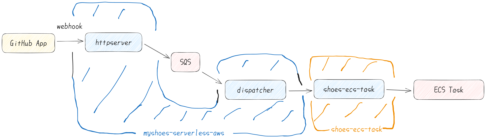

<!-- titleは自動で入る -->

[whywaita/myshoes-serverless-aws](https://github.com/whywaita/myshoes-serverless-aws) のコードを読んでみたので、順番に読んでいく様子をメモします。

# 実際にRunnerが動くまでの流れ

最初に、ざっくりブログやREADMEを読んで概要をつかみます。

GitHub Appからwebhookが飛んで、jobがECS上で動くまでの流れは以下のようになっています。 参考: [GitHub-hostedライクにAmazon ECSとAWS Lambdaでself-hosted runnerを管理するツールを作った \| なぜにぶろぐ](https://blog.whywrite.it/2023/12/04/release-myshoes-serverless-aws/)

webhookを受け取ってECS Taskに渡すまでの間にhttpserverとdispatcherというのが存在しています。(下の図の青い部分)
これらはAWS Lambdaとして実装されていて、コードはそれぞれ [`lambda/httpserver`](https://github.com/whywaita/myshoes-serverless-aws/blob/main/lambda/httpserver/main.go) と [`lambda/dispatcher`](https://github.com/whywaita/myshoes-serverless-aws/blob/main/lambda/dispatcher/main.go) にあります。

ECS Taskを起動する部分は別リポジトリにあって、 [`shoes-ecs-task`](https://github.com/whywaita/shoes-ecs-task/blob/main/main.go) をみると良いです。(下の図のオレンジ色の部分)



また、myshoesの用語として、Datastore, Stadiumを説明します。

Datastoreは以下のinterfaceを満たすような、セルフホストランナーに関わる情報を保存するストレージです。myshoesでinterfaceが定義されていて、Target, Job, Runnerの3つのリソースを扱います。

実体としてはmyshoesではMySQLやインメモリといったように差し替え可能になっていて、今回はこのDatastoreがSQSになっています。

[interfaceのコードへのリンク](https://github.com/whywaita/myshoes/blob/85c90827862db031ff6656f7295faa73a0f456e7/pkg/datastore/interface.go#L30-L56)

```go
// Datastore is persistent storage
type Datastore interface {
	CreateTarget(ctx context.Context, target Target) error
	GetTarget(ctx context.Context, id uuid.UUID) (*Target, error)
	GetTargetByScope(ctx context.Context, scope string) (*Target, error)
	ListTargets(ctx context.Context) ([]Target, error)
	DeleteTarget(ctx context.Context, id uuid.UUID) error

	// Deprecated: Use datastore.UpdateTargetStatus.
	UpdateTargetStatus(ctx context.Context, targetID uuid.UUID, newStatus TargetStatus, description string) error
	UpdateToken(ctx context.Context, targetID uuid.UUID, newToken string, newExpiredAt time.Time) error

	UpdateTargetParam(ctx context.Context, targetID uuid.UUID, newResourceType ResourceType, newProviderURL sql.NullString) error

	EnqueueJob(ctx context.Context, job Job) error
	ListJobs(ctx context.Context) ([]Job, error)
	DeleteJob(ctx context.Context, id uuid.UUID) error

	CreateRunner(ctx context.Context, runner Runner) error
	ListRunners(ctx context.Context) ([]Runner, error)
	ListRunnersByTargetID(ctx context.Context, targetID uuid.UUID) ([]Runner, error)
	GetRunner(ctx context.Context, id uuid.UUID) (*Runner, error)
	DeleteRunner(ctx context.Context, id uuid.UUID, deletedAt time.Time, reason RunnerStatus) error

	// Lock
	GetLock(ctx context.Context) error
	IsLocked(ctx context.Context) (string, error)
}
```

また、Stadiumはランナーが動く環境を指します。今回はECSです。shoes-ecs-taskに実装があり、ここも差し替え可能になっています。(ECS以外を選んでもOK)

# 実際にコードを読んでみる

それでは実際にコードを読んでいきます。

## Makefile

[whywaita/myshoes-serverless-aws](https://github.com/whywaita/myshoes-serverless-aws) にMakefileがあるのでここから読み進めます。

[`whywaita/myshoes-serverless-aws:Makefile#L17`](https://github.com/whywaita/myshoes-serverless-aws/blob/b586d89f3d7b031ccd395ef2afb8e9bdcc76cc67/Makefile#L17) を読んで、ビルド対象は `./lambda/httpserver` だと分かりました。同様に [`whywaita/myshoes-serverless-aws:Makefile#L25`](https://github.com/whywaita/myshoes-serverless-aws/blob/b586d89f3d7b031ccd395ef2afb8e9bdcc76cc67/Makefile#L25) を読んで `./lambda/dispatcher` が2つ目のビルド対象だと分かります。

Makefileを読むと、この2つのgo buildで得たバイナリはそれぞれ `./tmp` 以下にwgetで取って置いた `shoes-ecs-task-linux-amd64` とまとめてzipで固めています。

ここで lambda って2つバイナリ置いてどうなるんだっけ...？となったので少し調べます。

## lambdaに2つバイナリが置いてある

ここではdispatcherに注目して読みます。後でhttpserverの方も読みましたが、shoes-ecs-taskとの関係は似ていたので省略します。

lambdaが起動した時のエントリポイントはどちらになるのでしょう？これは [`example/terraform`](https://github.com/whywaita/myshoes-serverless-aws/blob/b586d89f3d7b031ccd395ef2afb8e9bdcc76cc67/examples/terraform/main.tf#L102) を見て解決しました。

```terraform
resource "aws_lambda_function" "dispatcher" {
  filename      = "../../dist/lambda/dispatcher.zip"
  function_name = "myshoes_dispatcher"
  role          = aws_iam_role.lambda.arn
  handler       = "dispatcher"
  runtime       = "go1.x"

  source_code_hash = filebase64sha256("../../dist/lambda/dispatcher.zip")

  timeout = 30

  environment {
    variables = {
      AWS_SQS_QUEUE_URL         = aws_sqs_queue.myshoes-queue.url
      DEBUG                     = true
      STRICT                    = false
      PLUGIN                    = "/tmp/shoes-ecs-task"
      GITHUB_APP_ID             = ""
      GITHUB_APP_SECRET         = ""
      GITHUB_PRIVATE_KEY_BASE64 = ""
      MODE_WEBHOOK_TYPE         = "workflow_job"

      ECS_TASK_CLUSTER        = aws_ecs_cluster.myshoes.name
      ECS_TASK_DEFINITION_ARN = aws_ecs_task_definition.myshoes.arn
      ECS_TASK_SUBNET_ID      = ""
      ECS_TASK_REGION         = ""
      ECS_TASK_NO_WAIT        = "true"
    }
  }
}
```

`function_name = "myshoes_dispatcher"` とあるので、dispatcherがエントリポイントになっています。

ではzipに含まれるもう一つのバイナリ、shoes-ecs-taskはどのように扱われるのでしょうか。

コードを読むと、以下の2つのステップで使われていることが分かりました。

- [`dispatcher` の `init()`](https://github.com/whywaita/myshoes-serverless-aws/blob/b586d89f3d7b031ccd395ef2afb8e9bdcc76cc67/lambda/dispatcher/main.go#L23-L31) で同梱してるshoes-ecs-taskバイナリを `/tmp` 以下に置く処理をする
- lambdaに渡す環境変数で [`PLUGIN`](https://github.com/whywaita/myshoes-serverless-aws/blob/b586d89f3d7b031ccd395ef2afb8e9bdcc76cc67/examples/terraform/main.tf#L116) として `/tmp/shoes-ecs-task` を指定している
- `PLUGIN` 環境変数については [myshoesのdocs](https://github.com/whywaita/myshoes/blob/85c90827862db031ff6656f7295faa73a0f456e7/docs/01_01_for_admin_setup.md?plain=1#L88-L91) に記述があります。myshoes-providerのバイナリのパスを指定しています。

**lambdaに2つバイナリが置かれる: まとめ**

- エントリポイントは `dispatcher`, `httpserver` の方
- 一緒に同梱される `shoes-ecs-task` は起動時に `/tmp` に置かれてmyshoes providerとして使われる。

## `example/terraform` を読む

terraformの全体構成が気になったので把握します。

- [`examples/terraform/main.tf#L5-L65`](https://github.com/whywaita/myshoes-serverless-aws/blob/b586d89f3d7b031ccd395ef2afb8e9bdcc76cc67/examples/terraform/main.tf#L5-L65)
  - ここら辺は権限をIAM policyでセットしてそれをattachしてる部分
- [`examples/terraform/main.tf#L67-L98`](https://github.com/whywaita/myshoes-serverless-aws/blob/b586d89f3d7b031ccd395ef2afb8e9bdcc76cc67/examples/terraform/main.tf#L67-L98)
  - httpserverの部分。function_nameが `myshoes_httpserver` で、environmentの `PLUGIN` がshoes-ecs-taskのバイナリを指している
- [`examples/terraform/main.tf#L100-L138`](https://github.com/whywaita/myshoes-serverless-aws/blob/b586d89f3d7b031ccd395ef2afb8e9bdcc76cc67/examples/terraform/main.tf#L100-L138)
  - dispatcherも似た感じ
- [`examples/terraform/main.tf#L140-L189`](https://github.com/whywaita/myshoes-serverless-aws/blob/b586d89f3d7b031ccd395ef2afb8e9bdcc76cc67/examples/terraform/main.tf#L140-L189)
  - ECS周りがここ。Fargate。
  - docker imageに myoung34/github-runner-base を使用している
- [`examples/terraform/main.tf#L191-L195`](https://github.com/whywaita/myshoes-serverless-aws/blob/b586d89f3d7b031ccd395ef2afb8e9bdcc76cc67/examples/terraform/main.tf#L191-L195)
  - SQSがここ

登場人物としては AWS Lambda, ECS, SQS という感じでした。

## ランナー部分を眺める

ここまででlambdaの起動、AWSリソースの全体像が分かりました。ではランナーの起動周辺はどうなっているのでしょうか。
shoes-ecs-taskを眺めます。

[`run()`](https://github.com/whywaita/shoes-ecs-task/blob/dd9793e279f72778184c52073610264af82c9fac/main.go#L39-L56) を眺めると、 [`hashicorp/go-plugin`](https://github.com/hashicorp/go-plugin) を用いているようです。

実際にECS Taskを実行する部分は [`AddInstance()`](https://github.com/whywaita/shoes-ecs-task/blob/dd9793e279f72778184c52073610264af82c9fac/main.go#L125-L138) に書いてあります。
処理としては、セットアップスクリプトをワンライナーにしてECSにconfigと一緒に `runTask()` に渡しています。

[`runTask()`](https://github.com/whywaita/shoes-ecs-task/blob/dd9793e279f72778184c52073610264af82c9fac/main.go#L146-L202) をみると、`RunTaskInput` でECS Taskに渡す情報を作っています。ここでおそらくoverrideをすれば [Cookpadさんの事例のように複数種類のランナーを提供できる](https://www.docswell.com/s/s4ichi/5RXQLG-cookpad-self-hosted-runner-infra) のでしょうか。

ランナー起動周りも大体分かりました。

## 分かったこと、分からないこと

分かったこと

- myshoes-serverless-awsのアーキテクチャ
- myshoes-serverless-awsとshoes-ecs-taskの関係

分からないこと

- go-pluginの仕組み
  - myshoesがどのようにpluginを使うのか
- スケーリング戦略
  - パッと見た感じwebhookで飛んできた情報をECS Taskへ投げているので、ECS起動速度時間分は待たされそう
  - myshoes側で何かやっている可能性もあるので、スケーリング戦略がmyshoesでどう扱われているか調べたい

主に抽象化された部分を認めればmyshoes-serverless-awsは理解したけど、myshoes側の抽象化されている中身が気になります。
myshoes, チラッとしか眺めてないですがうまく抽象化してそうですごい。

# これからやりたいこと

- 実際に動かしてみる
  - 検証したいこと: 起動時間、docker系actionsの利用体験

# 参考資料

- [GitHub-hostedライクにAmazon ECSとAWS Lambdaでself-hosted runnerを管理するツールを作った \| なぜにぶろぐ](https://blog.whywrite.it/2023/12/04/release-myshoes-serverless-aws/)
  - 作者のwhywaitaさんによる解説記事。アーキテクチャや、作られた背景としてのCookpadさんの記事との違いなどが書かれていて参考になりました。
- [whywaita/myshoes-serverless-aws: Auto-scaling VirtualMachine runner 🏃 for GitHub Actions on AWS with serverless](https://github.com/whywaita/myshoes-serverless-aws/tree/main)
  - 実装のうち、DatastoreにSQSを使うための部分。
- [whywaita/shoes-ecs-task: myshoes provider for Amazon ECS.](https://github.com/whywaita/shoes-ecs-task)
  - 実装のうち、ランナーが実際に動かす部分(Stadium)のためのコード。
- [whywaita/myshoes: Auto-scaling VirtualMachine runner 🏃 for GitHub Actions](https://github.com/whywaita/myshoes)
  - Datastore部分のinterfaceを理解する際に参照した。
