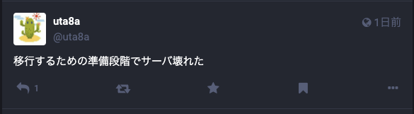

<!-- titleは自動で入る -->

日本時間の2023/12/17(日)夜に以下の2つの対応を行ったところ、自鯖のマストドンが使用できなくなりました。

- サーバのドメインの管理をGoogle DomainsからCloudflareに移行
- 運用しているマストドンはサーバ上で直接動いていたので、コンテナ環境への移行のためk3sを導入

この自鯖に起きた障害は2023/12/17から2023/12/19にかけて継続し、2023/12/19(火)の朝に復旧しました。

正直訳わからなさすぎて一回VPSリセットからやり直そうかとも思ったのですが、結果としてリセットすることなく原因特定と復旧に至ったので、その過程を振り返ります。(結構しょうもないミスしてるなと思いますが、恥を晒していくぞという気持ちです)

# 概要

ドメイン移行とk3sの導入を一緒に行った結果、問題の切り分けが難しくなってしまい復旧までに時間がかかった。

# 背景

- マストドンのインスタンスをさくらのVPSで運用
- マストドンの利用者は僕一人
- ドメインはGoogle Domainsで管理していたが、Cloudflareに移行
- マストドンのアカウント引越しをしようと思っている
  - サーバ上で直接マストドンのプロセスを動かしているが、コンテナ運用に切り替えたいので、勉強も兼ねてk3sを導入したい

# 時系列に起きた出来事

以下は日本時間の出来事です。

**2023-12-17 18:00頃 Google DomainsからCloudflareへのドメイン移行準備**

Google workspaceを利用してたので、独自ドメインに紐づくメール、Goole Driveを移行。また、GPG keyもメールアドレスが紐づいていたのでGitHubやKeybaseから削除する対応を行っていました。(Keybaseは削除できず、結局アカウントごとリセット)

Google workspaceの解約を完了。

続いて、Nameserverをcloudflareに変更。

cloudflare > Domain Registration > Transfer Domainsで対象のドメインが選択できなかったため、少し待ちました。

**2023-12-17 21:12 Domain Transfer**

Transfer Domainsで選択可能になったため、ドメインを移行。選択可能になるまで1,2時間かかったと思います。

ここでドメイン移行が完了。

**2023-12-17 22:00 k3sを入れてサーバ再起動→障害発生**

ドメインが移行できたので、k3sを入れました。この時k3sに特に設定はせずデフォルトを使用。

次に、Deploymentを作成。Podを3つ作成してそれぞれnginxが動いています。また、Serviceを作成してNodePortで30000番ポートに流すようにしました。
ここは当時仕組みがよくわかっていなくて、マストドンのリバースプロキシとしてホストOSでnginxが動いていたので、NodePortで30000番ポートに出るようにしてから `localhost:30000` をnginxのVirtual Hostを用いて指定すれば別ドメインでnginxが出せると思っていました。

`sudo reboot` を実行。

**2023-12-17 22:38 障害が発生したことに気づく**

マストドンの自鯖へアクセスできなくなりました。サーバへのSSHはできる。



僕一人しか利用していないので、障害告知は必要ないけど、自分を落ち着かせるために別のインスタンスのアカウントで呟きました。

ブラウザからマストドンのURLへアクセスすると、NXDOMAINが出ているのでDNSの問題かと思い、色々調べ始めました。

**2023-12-17 22:53 諦めて寝る**

DNSの問題だろうと思って時間が経つのを待ってみてから動こうと判断。この日は眠りました。

**2023-12-18 朝 時間が経っても解決しないのでおかしいと思い始める**

一晩経ってもNXDOMAINが引き続き出ており解決しないのでDNS以外の可能性を疑い始めます。この時点では切り分けのためにCloudflareのDNS Proxyモードは切ってDNS Onlyにしています。

色々調べていると、AWSのRoute53のトラブルシューティングガイドに辿り着きました。

[Troubleshoot NXDOMAIN responses when using Route 53 as the DNS service \| AWS re:Post](https://repost.aws/knowledge-center/route-53-troubleshoot-nxdomain-responses)

これに沿ってやってみたところ、そもそもdigでAレコードが正しく引けていないことに気づきました。

```text
$ dig mstdn.sns.uta8a.net

...
;mstdn.sns.uta8a.net.		IN	A

;; AUTHORITY SECTION:
uta8a.net.		274	IN	SOA	ns-cloud-b1.googledomains.com. cloud-dns-hostmaster.google.com. 79 21600 3600 259200 300
...
```

しかもSOAレコードがGoogle Domainsのものになっています。Google Domainsから移行したはずでは？

さらにAWSのトラブルシューティングガイドを参考に試すと、ネームサーバをcloudflareのものにすると正しくAレコードが引けることが判明。

```text
$ dig mstdn.sns.uta8a.net @chad.ns.cloudflare.com

...
;; ANSWER SECTION:
mstdn.sns.uta8a.net.	60	IN	A	<IPアドレス>
...
```

これはネガティブキャッシュと言って、権威DNSサーバから該当ドメインが存在しないという回答を得てDNSキャッシュサーバがそれをキャッシュしている状態を指すそうです。
今回はこのネガティブキャッシュにヒットしてしまっているようでした。

調べたところ、このキャッシュが消えるまでMINTTL?の推奨値の最大値である24時間ほど待てば良さそうに感じたので、12/18の夜に作業を再開することにしました。

**2023-12-18 夜 digで正しく引けることを確認**

digでネームサーバを指定せずに正しくIPアドレスが引けることを確認。

DNS周りの問題は解決したと考えて、アプリケーションと証明書(https)に関心が移ります。

`lsof` でポートを使用しているプロセスを確認。nginxのみが動いているようです(これは後に嘘だと判明します。traefikも動いていたようです。)

```text
$ sudo lsof -i:443
[sudo] password for <username>:
COMMAND  PID     USER   FD   TYPE DEVICE SIZE/OFF NODE NAME
nginx   5434     root    8u  IPv4  82827      0t0  TCP *:https (LISTEN)
nginx   5434     root    9u  IPv6  82828      0t0  TCP *:https (LISTEN)
nginx   5435 www-data    8u  IPv4  82827      0t0  TCP *:https (LISTEN)
nginx   5435 www-data    9u  IPv6  82828      0t0  TCP *:https (LISTEN)
nginx   5436 www-data    8u  IPv4  82827      0t0  TCP *:https (LISTEN)
nginx   5436 www-data    9u  IPv6  82828      0t0  TCP *:https (LISTEN)
nginx   5437 www-data    8u  IPv4  82827      0t0  TCP *:https (LISTEN)
nginx   5437 www-data    9u  IPv6  82828      0t0  TCP *:https (LISTEN)
```

色々やって以下が分かりました。

- ap.uta8a.netはhttpsで証明書エラー、httpアクセスすると404になる
- `dig mstdn.sns.uta8a.net` の結果はまちまちで、SOAでgoogle domainが出てくることもある
- `dig ap.uta8a.net` は正しくAレコードが引ける

この日も諦めて寝ました。

**2023-12-19 朝 最小構成を試す**

一晩寝て頭をリセットできたので、nginxの設定を変更し、まず1つのドメインで静的サイトを表示させることを試みました。

するとap.uta8a.netが404になりました。これは流石におかしいと思い、切り分けのためにcloudflareのOpportunistic EncryptionとAutomatic HTTPS Rewritesが怪しいのでOFFにして、Origin server certificateをCloudflareで生成し、nginxの設定でセットしました。

それでもうまくいかないので、色々調べるとそもそも `http://<IPアドレス>/` へアクセスすればDNSの影響を受けないことに気づきます。

それでも404なのでDNSではないサーバ側がおかしいと判断。

そもそも、これまでの調査でnginxのアクセスログもエラーログも空だったことを思い出し、もしかしてk3sが悪さしている？と考えて k3sのkill-allとuninstallを実行。

すると `http://<IPアドレス>/` でnginxのwelcomeページが表示されました。まじか〜、lsofでnginxだけだったから油断したけどやっぱり切り戻しをまず第一にするべきだったか〜。

その後httpsでアクセスすると、NET::ERR_CERT_AUTHORITY_INVALIDが出てくるのでcloudflareで生成したcertificateからcertbot利用へ切り替え。

これで最小構成でhttpsでアクセスできるようになりました。

**2023-12-19 朝 自鯖mastodonの復旧**

以下の2点が残っています。

- k3sをやっぱり入れたい
- mastodonを動かしたい

k3sから取り組みます。

[k3s and nginx conflicts on port 80 for IPv4 · Issue #2403 · k3s-io/k3s](https://github.com/k3s-io/k3s/issues/2403#issuecomment-956220875) を参考に、k3sを80 -> 8088, 443 -> 8443 にポート変更しました。

また、ホストOS上のnginxでは `proxy_pass http://127.0.0.1:8088;` とすることでk3sへリクエストを転送します。

これでk3sとnginxが共存できるようになりました。

続いて、mastodonを復旧させます。これはnginxの設定を元に戻せばいけました。対応過程でmastodonのupgradeも済ませたので復旧完了。

**2023-12-19 8:19 復旧完了**

めでたしめでたし

# 根本原因

根本的にはk3sとnginxが同居できない点を知らずに両方入れたことがよくなかったです。

# 今後の対策

すぐに問題解決するためのフロー

- 切り戻しをする。
- ドメイン移行をした後は、digを行って何度かdigをした結果が一致すること、正しいレコードが引けていることを確認すること。

# 教訓

- 変更を複数同じ日に入れない
  - 特にDNS関連は時間をおいた方がいい
- 切り戻しを最初に行うように気をつける
