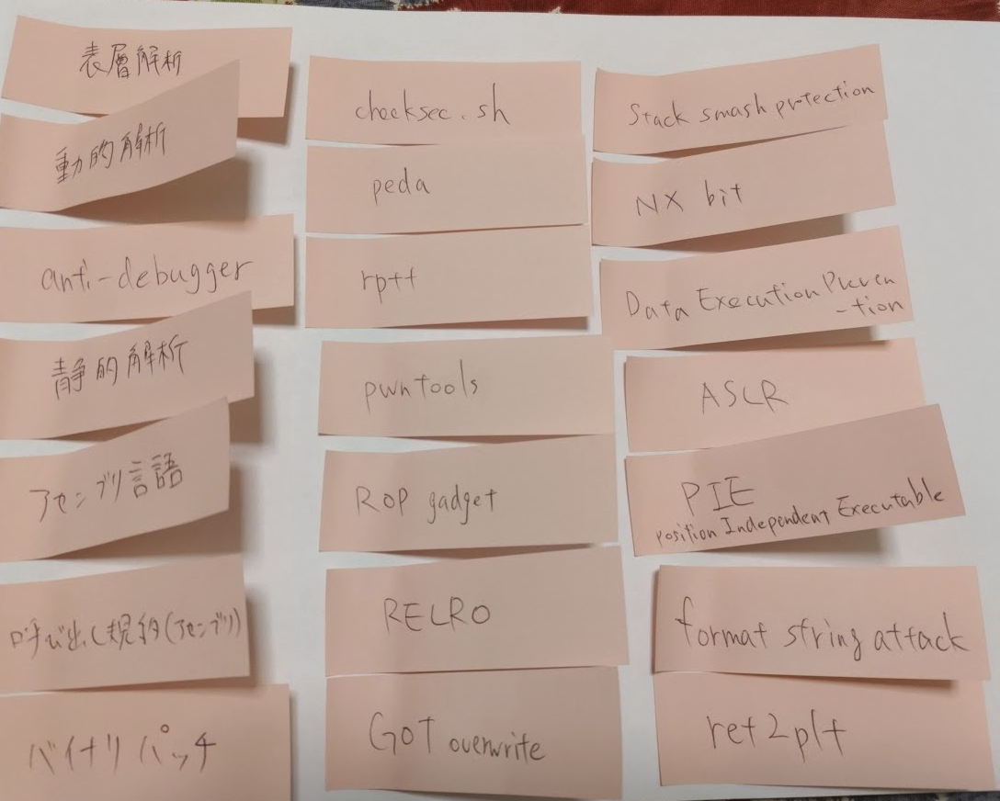
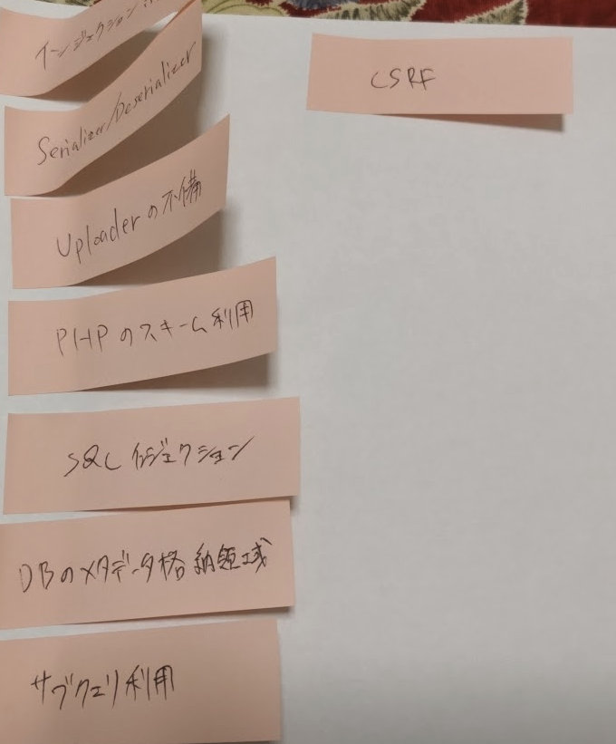

<!-- titleは自動で入る -->
セキュリティコンテストチャレンジブック (ハリネズミ本) を読みました。昔読んだことがあったのですが、[エンジニアの知的生産術 を読んだ - diaryです](https://blog.uta8a.net/diary/2024-02-02-engineer-knowledge-productivity) でCTFについての単語や概念を集めて付箋に書いている作業をしていて、情報量を多くしたかったので再度読みました。

現在だと [詳解セキュリティコンテスト](https://www.amazon.co.jp/dp/4839973490)、通称迷路本を読むべきだとは思いますが、ハードルが低くてさっくりと読める方に手を出すか〜と思ってハリネズミ本を読みました。

50ページ/25分のペースで読み進めて270ページを3時間くらいで読み終えました。
結果的に付箋の数が20個くらいだったのが90個近くになったのでよかったです。

# 読んで思ったこと

- 不正アクセス禁止法まわり、[情報刑法I サイバーセキュリティ関連犯罪](https://www.koubundou.co.jp/book/b605096.html) を積んでいるので読みたいな
- バイナリ実行環境は仮想環境を使えば大丈夫と思っていたが、よく考えるとcapabilityなどによるVMが使用可能なリソースの制限も同時にかける必要がありそうだなと気づいた
- Revで「自前の処理をしていると、システムトレーサでは追いかけにくい」というのは難しい問題でVMの解析を求められることが多いことと関係しているのかな。
  - システムトレーサーを独自のVMに対して実装する問題とかあったりするのかな
- そもそもVMってなんだろう？brainfxckのコンパイラはVMに該当するのかな
  - あるルールに沿った命令列を解釈して実行結果を返す機械を全体的にVMと呼ぶのかな
- anti-decompiler問題で、かつ手動でデコンパイルするのが効率がいい問題を作るにはどうしたらいいだろう？
  - 手動デコンパイルの勧めを見て思った
  - 難読化すればanti-decompilerは達成できるけど手動が難しくなるからこれは違いそう
- デコンパイル結果にメモをつけるのやりたい
  - ghidra, radare2でやる方法を知りたい
- `(echo '...';cat | ./bin)` の用法初めて知った
- TCP通信が独自のアルゴリズムで暗号化されている問題面白そう
- 最近ネットワーク問題が出なくなったのってなんでなんだろう？もしかして出てるのかな。TLSの登場で暗号化を解く必要があるという点が障壁になってたりするのかな。
- ネットワーク + eBPFで作問できないだろうか？
- 壊れたpcapファイルの修復、壊れたPDFファイルの修復と似ていてforensicsの問題として解いてみたい
- 独自プロトコルの通信でwiresharkの絞り込みが効かないようなものがあると面白そう
- Webって結構広い領域で、かつ具体的な部分にはトレンドがあって流れが激しいので抽象的な学びが多い印象がある。例えばDeserializerとか、Uploaderとか、そういうレベルで見ると変わってないんだけどPerlとかPHPとかのレイヤで見ると確実に移り変わっている気がする
- メタキャラクタの利用によってインジェクションするのはどこも共通の構造かも
  - HTMLもSQLもそう

# 付箋

関連する単語を拾っていた

眺めてて思ったけどハリネズミ本には暗号がないんですね

# Next

- ちょっといくつか手を動かしてみたくなったので、たとえば「VMが何か調べて簡単なものをC言語で作ってみる」のように小さく設定して取り組んでみる。
- 付箋が100枚になったら一旦止めて、グループ化してみたり違いを考えてみて気になりポイントを見つけて取り組むきっかけにする。
