<!-- titleは自動で入る -->
[エンジニアの知的生産術 を読んだ](https://blog.uta8a.net/diary/2024-02-02-engineer-knowledge-productivity) で「情報量が多いというのは、付箋100個くらいが目安。ここをスタート地点にして整理すると気になりポイントを得ることができる。その気になりポイントをメモすることで調べたり考えたりする知的生産術のとっかかりになる」という雰囲気を学びました。
そこで前々からCTFは範囲が広くてイマイチ分かった気になっているけど実は全然分かっていないよなと感じていたので、CTFを題材にして書籍で紹介されていたKJ法っぽいものを試すことにしました。
初めに20枚ほど、次に [セキュリティコンテストチャレンジブック (ハリネズミ本) を読んだ](https://blog.uta8a.net/post/2024-02-03-hedgehog-ctf) を読んで追加で70枚ほど付箋を用意できたので、さらに 詳解セキュリティコンテスト や色々なwriteupをサラッと眺めて単語を集めてきました。

今回は付箋を集めてみた感想と、気になりポイントをメモしておきます。

# 背景

CTFについては2018-2019年頃にハマっていたのでもう最近は出ていません。一方でCTFへの憧れ(というか競技的な意味での強さへの憧れ)のようなものはなんとなく持っていて、就職して色々余裕が出てきたタイミングだしもう一度取り組みたい、と思いつつきっかけがないまま時間が過ぎていました。

取り組んでいた当時も今も、「自明な問題はなんとなく調べて解けるけどちょっと難易度が上がると途端に時間をかけても解けない状態に入る」という現象があります。僕は結構解けない問題に対して粘るのは好きですが解けない体験を重ねるとやる気を失います。
さらに自明な問題は2018-2019年頃の SECCON Beginners の地方講義で出るレベル帯を指していて、僕は [CTF初心者の手引き - ふるつき２](https://furutsuki2.hatenablog.com/entry/2022/10/07/191905) でいうところの「CTFについて全く知らない人」を脱しつつあり「CTFについて多少は知識があるが、実践的な問題は解けないという人」のあたりに位置していると思っています。

このレベル帯だと実力のちょい上の意味で5月頃にあるSECCON Beginners CTFやWaniCTFあたりが取り組むべきCTFだと思っています。

まあ何もしていないので実力が上がらないのはそうなんですが、2023年末に人々の年末振り返りをひたすら眺めていた時に競技全般の話ではっとなることがありました。

> 初心者にありがちな「体系的に知識を身につけることができず解法への道筋のパターンが分からず、その結果いつまで経っても解ける問題の幅が広がらず実力もつかない」ような状態
> https://sizu.me/zatsu308/posts/42fmmn06bm73

「闇雲に問題を解いても実力が上がるより先にモチベが尽きるし、まずは全体像を眺めてみよう」という思いが出てきました。そう思っていた頃にエンジニアの知的生産術の本を読み、付箋100枚用意して自分の頭の中にあるCTF周りの知識を整理して今後やってみたことを列挙するのはアリだなあ、と考えてやったみたという背景になります。

# 集めた付箋

明らかに「grep」とかCTF用語ではないだろうと思いつつ、エンジニアの知的生産術の本ではとにかくこれは以前書いた単語かな？とか余計なオーバーヘッドをかけずにサクサク付箋を量産していくべきという趣旨のことが書かれていたので気にしないことにします。間違った単語や重複もありそうなので気をつけて。

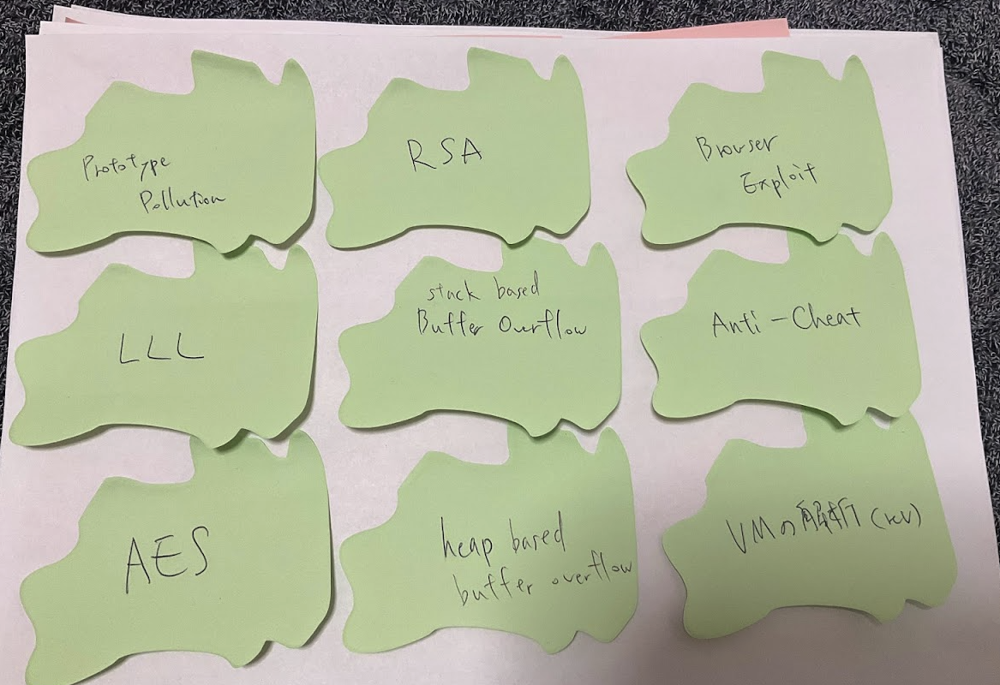
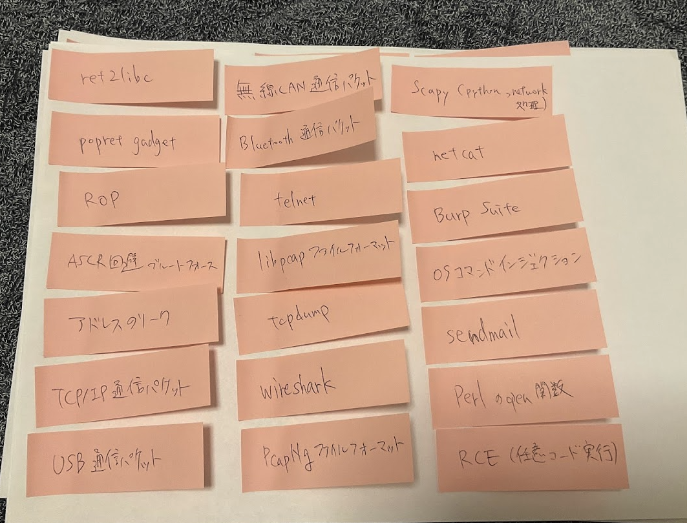
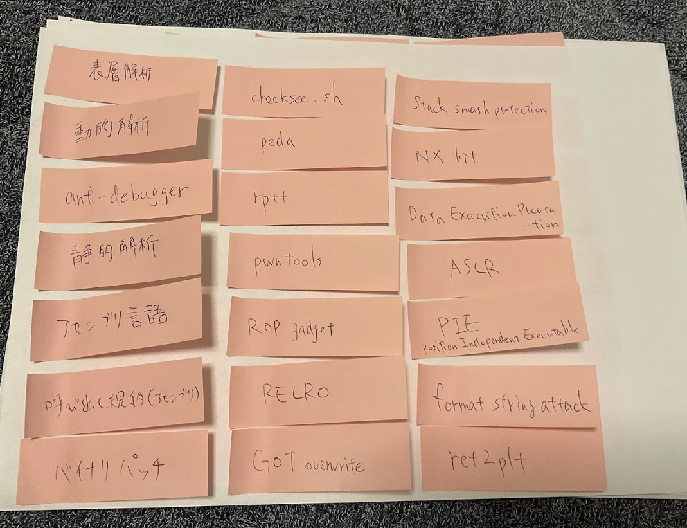
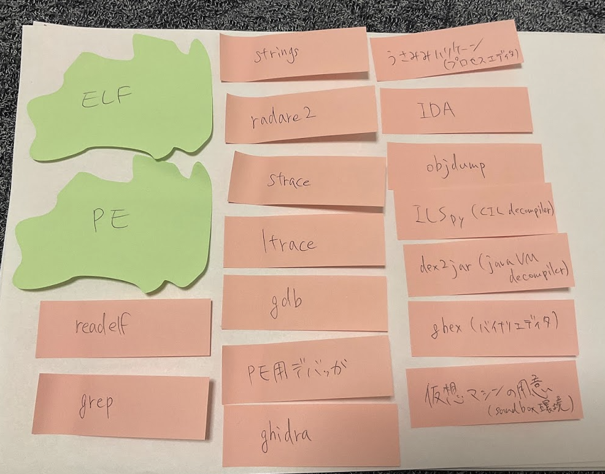
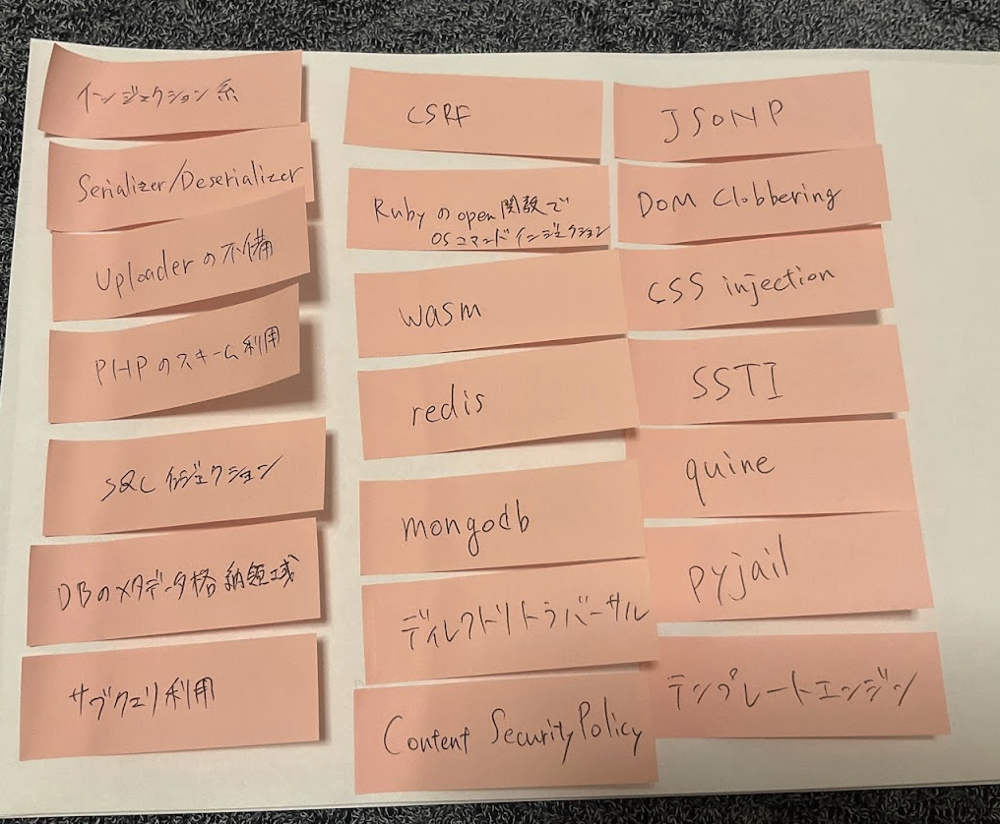
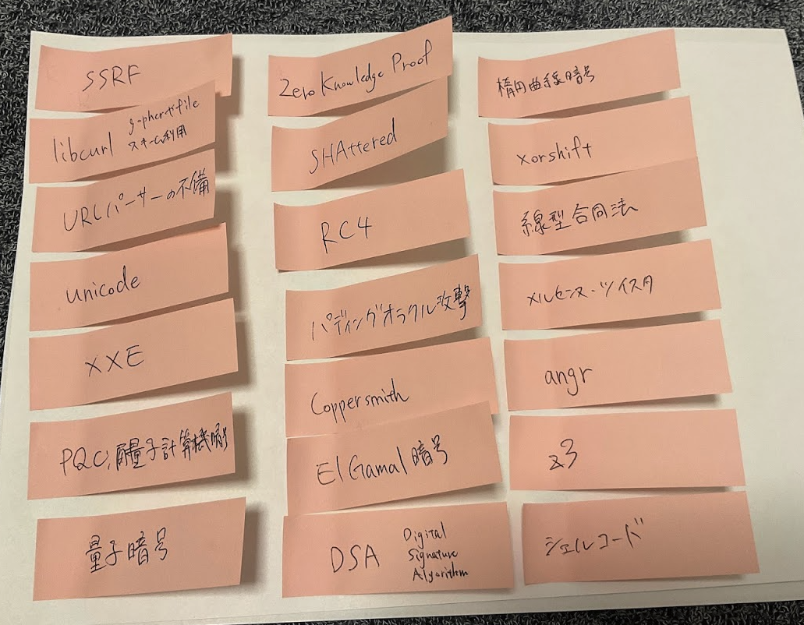
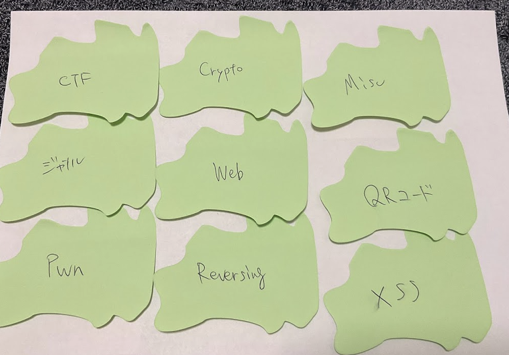
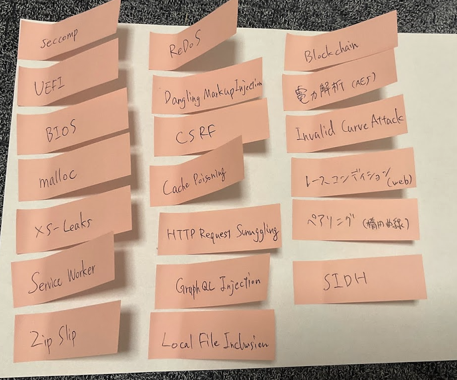

全部で140枚の付箋にそれっぽい単語を書きました。

これをグループ化してみます。客観的なグループ化をしてしまうと事前に自分が持っている枠組み以上のものが出てこないとのことだったので、ちょっと主観的になるよう頑張ります。

# グループ1: ツール

ツールっぽいものを集めてみました。

# グループ2: フォーマットっぽいもの

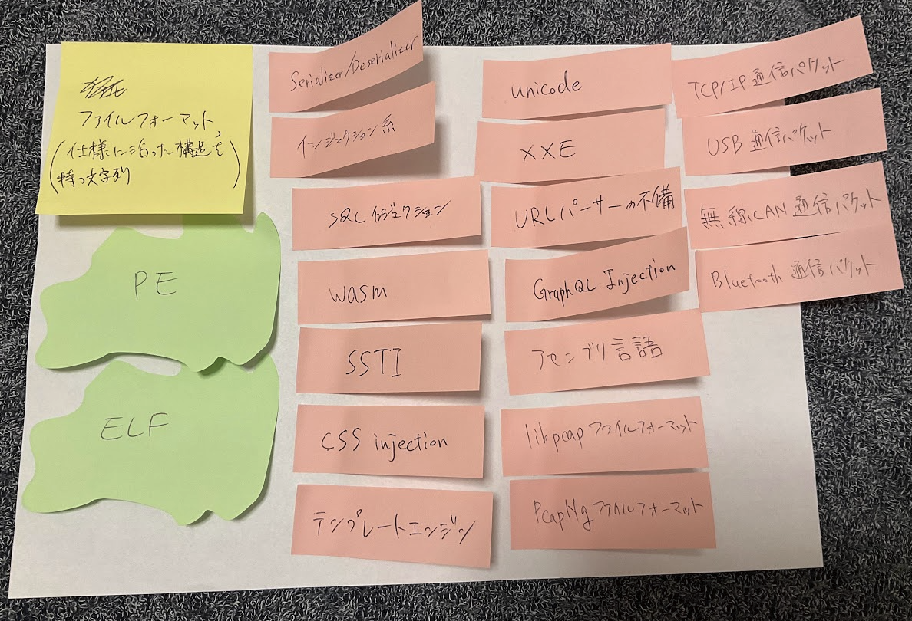

ファイルフォーマットというか、仕様に沿った構造を持つ文字列という観点で関連するものを持ってきました。

# グループ3: 知らないこと

グループ1,2の時点ですでになんか薄々感じていた「僕は実は何も知らないのでは...」という気持ちがはっきりしてきたので、一旦「自信を持って人に教えられるレベルで知っているとは言えないもの」つまり「知らないこと」を集めてみました。

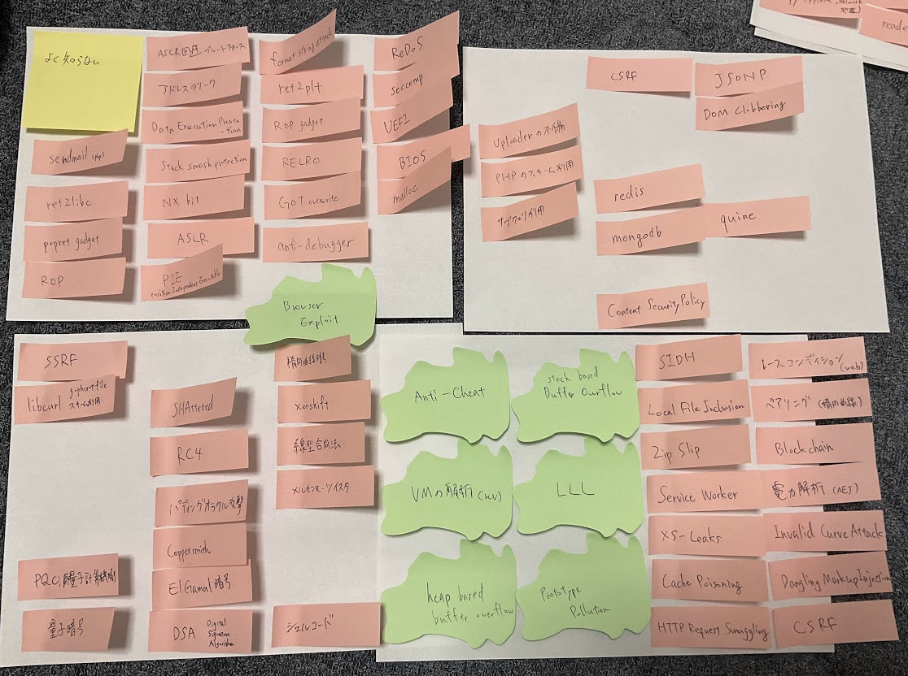

オイオイオイ全部か？
まあ知らないということがはっきりしたのはいいことなので良しとします。

# グループにできなかったもの

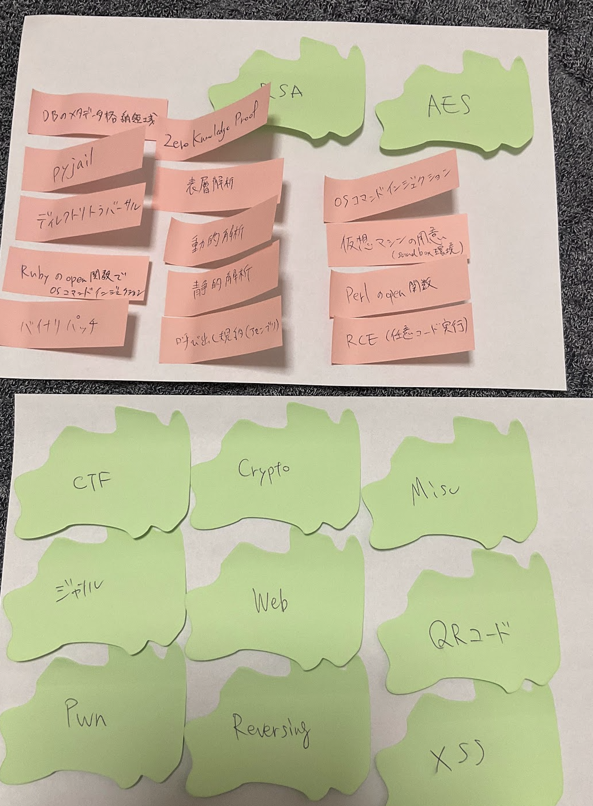

単なるジャンルで粒度が大きすぎるものや、問題として出てきたらある程度自信を持って解けるトピック、知っているものが残りました。
この辺は再度学習してもすでに知っていることを繰り返すだけになるので雑にskipしても良さそうです。

# 気になりポイント

まとめている途中で頭の中に浮かんだことを雑にメモしました。

- ツールをCTFの開催期間中に習得するのは時間がもったいない。有名ツールについては以下を意識したいかも。
  - ツールをすぐに使える環境構築をしておく
  - ツールが使える環境をメンテナンスする(ツールのバージョン管理)
  - 練習を事前にしておいて、チートシートを自分用に作っておくと良いかも
  - 動作原理を理解しておいて、ツールが効かない場面の条件を理解しておく
- ツールがなんとなく使い方わからなくてやる気なくなったことがあるので、ツールに習熟することで不必要なモチベの低下を避けられるかもしれない
  - gdbなんもわからね〜って言って放り投げたけどpedaを使ったらわかりやすくて嬉しかった記憶がある
- ツールは低レイヤのものが多い印象。Webのツールってあまり見ないかも？
  - これはWebだとPayloadをぶっ放す系が多いのでCTFでは好まれないというのはありそう
- 低レイヤのツールって、アーキテクチャ x 用途別(disasm, decompile, debugger)の分だけ存在してそうなので数が多い
  - このツールはCIL用で、このツールはx86用みたいな
- ツールの習熟なしにいきなり問題の本質に取り組める点はWebやCryptoの障壁の低さかもしれない
- ツールの環境を作って、ミニマルな例で素振りをしよう
- 命令列やクエリ、仕様に沿った文字列があれば、Injectionが作り出せそう
  - jqのクエリで問題にするみたいなのもあったような
- Deserialization系の問題は、「AというフォーマットからBというフォーマットへの変換処理」がまずいことに起因する。同じ構造でURLパーサの不備もまとめられそう。
- 1ファイル、1クエリ、に対してInjectionが入れられる？例えば通信パケットのように複数回のやり取りで1つの意味を成す場合にはInjectionは難しそう。
- ascii文字列で構成されるフォーマットやクエリはInjectionがしやすいが、バイナリ列に対するInjectionもあってもいいかもしれない。
  - 例1: ELFファイルの中に何か挟んで問題サーバで実行されるような問題
  - 例2: ext4とかでフォーマットされたバイナリに任意のバイナリ列を挟むことができて、問題サーバではそれをマウントして処理を実行するのでその処理をバグらせることを目標にする問題
- Webだとwasmパーサを調べると面白そう
- テンプレートエンジンは色々あるので網羅的に調査してみたい
- Webは手法に名前が付いていることが多い
- Pwnの手法の名前があまり見当たらないのは僕が単に知らないだけだと思う
- 与えられた一見制限のある状況を活用して任意の処理が実行できると面白みがあると言えそう
  - RCE, ROP, quine, polyglot
- 実は自信を持って知っていると言えることが少ないことが分かったので、まずは手を動かして知っていると言える範囲を増やすことが重要そう
  - Redisをdockerで建てて色々クエリを投げてみたりチュートリアルをしてみるとか

# 終わりに

全体像をつかむ以前に、自分が知っていることと知らないことが切り分けられたのがよかったです。あと意外と書き出してみてぼんやり眺めていると普段頭の中にあるだけでは思い浮かばない発想が浮かんできたのでよかったです。
