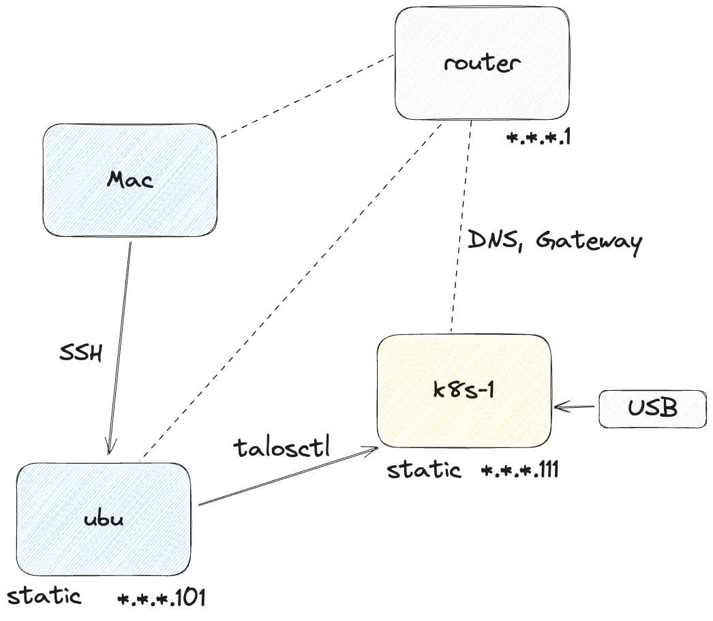
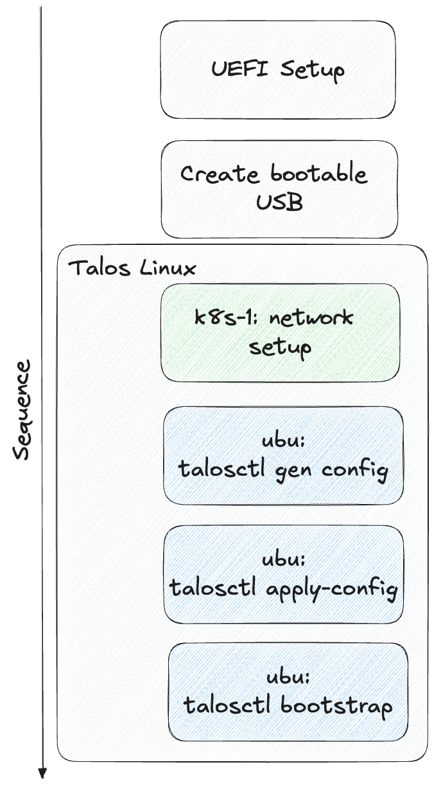

<!-- titleは自動で入る -->
おうちk8sのためにマシンを買いました。物理的に別のマシンで組んでみたかったので3台買っちゃいました。もやし生活です。
ウキウキでマシンが届くのを待ち、いざ届いたらUSB周りでOSのインストールに苦労してへとへとになりました。そしてふと我に返りました。

「あれ？k8sしか使わないならUbuntu serverより適したホストマシン向けOSがあるんじゃないか？」

これが2日にわたる Talos Linux 実機 インストールバトル の始まりでした...

# 実機に入れるOSの選定

まずクラウドネイティブな世界を何も知らないので、「OS CNCF」とか「OS クラウドネイティブ k8s」とかでたくさん検索しました。結論として以下の知識を得ました。

- CoreOS
  - Container Linux と改名
  - Ignition というプロビジョニングの仕組みを使っている
  - boot時に別でHTTPサーバを用意する必要がある
- Flatcar Container Linux
  - [入門 モダンLinux](https://www.oreilly.co.jp/books/9784814400218/) で知った
  - CoreOS(Container Linux) のフォーク
  - Ignitionはこっちも使える
- [Talos Linux](https://www.talos.dev/)
  - kubernetes向けにデザインされたLinux
  - セキュリティに特化している印象がある
  - sshすら入ってない。外部のマシンから talosctl というコマンドを用いてOSにアクセスする。決められた操作しかできない。
  - 日本語記事だと @mochizuki875 さんの記事が参考になる。というかパッと見つけられたのこの方の記事だけだった。感謝... [コンテナ専用OS Talos Linuxを用いたKubernetesクラスタ（構築編）](https://zenn.dev/mochizuki875/articles/4453b2ce113bd2)
- [K3OS](https://github.com/rancher/k3os)
  - 現在はGitHubリポジトリがarchiveされている。後継はRancher Elemental
  - k3sが動作するために必要なものしか入っていない

個人的に難易度が高そうな順に、Talos Linux(SSHできない)、CoreOS(SSHできそう)、Ubuntu server(慣れてる)だったので、OSを一度インストールしたらもう別の試そうとは思わないだろうし... ということでTalos Linuxを選びました。

真面目な理由としては、元々Ubuntu serverを選択予定だったけど autoinstall がなかなかうまく動作しなかったので、3台全部に手作業したり、ansibleを打つのもクラウドネイティブっぽくないなあ...と思ったのでsetup済みの小さなイメージが欲しかったのも大きいです。

# Talos Linux の特徴

詳しくは [コンテナ専用OS Talos Linuxを用いたKubernetesクラスタ（構築編）](https://zenn.dev/mochizuki875/articles/4453b2ce113bd2) がよくまとまっているので、個人的に気になっている特徴を書きます。

- SSHが不可能で、外部からCLI ( `talosctl` ) を用いて制御する
  - talosctlは設定ファイルをもとにapplyするので、k8sを動かすホストOSの設定もほぼas Codeで管理できる(実際はsecretがモロに書かれているのでGit管理は出来なさそう。また、最初のセットアップはディスプレイで繋いで手で実機に繋いだキーボードに打つ必要がある)
- OSのイメージが小さい
  - 100MB程度なので、USBに書き込んで差すという一連の作業を繰り返す時間コストがUbuntu serverとかに比べて小さい
- k8s ready
  - setupが済めば apt install とかなしにすぐにkubectlが通る

今はインストールに成功しただけなので、運用していくうちにセキュリティ周りの特徴を学びたいです。かなりステートレスな構成らしいので、Volumeの永続化とかどうするんだろうとかは気になる。

# Talos Linux 実機 インストール方法(うまくいった)

Control plane node 1台のみのsetupをします。

## 環境

- Mac
  - 基本後述するubuマシンにSSHしてそこで作業します
- Talos Linuxを入れる先: ThinkCentre M75q Tiny Gen5(AMD)
  - k8s-1と呼ぶことにします
  - キーボードとディスプレイ、LANケーブルが繋がっています
- talosctlを打つ外側マシン: ThinkCentre M75s Small Gen2(AMD)
  - ubuマシンと呼ぶことにします
  - Ubuntu server 22.04 LTS
  - k8s-1マシンとは同一LAN内にあります
- USBメモリ



## 手順(大雑把な図)



## 手順(詳細)

- k8s-1: UEFIのSecure bootをDisabledにする
- Mac: [Talos Linux Image Factory](https://factory.talos.dev/) で、以下の手順でISOを払い出す
  - Hardware Type: Bare-metal Machine
  - Choose Talos Linux Version: 1.7.6 (2024/09/16当時の最新)
  - Machine Architecture: amd64, SecureBootはOFF
  - System Extensions: siderolabs/amdgpu-firmware (20240513), siderolabs/amd-ucode (20240513)
  - Customization: なし
  - First Boot から ISO のリンクをクリックするとmetal-amd64.isoがダウンロードされる
- Mac: USBメモリに書き込む
  - `mount` と `diskutil list` でUSBメモリがマウントされていないことを確認
  - 筆者の環境では `sudo dd if=Downloads/metal-amd64.iso of=/dev/disk4 bs=256m status=progress` で書き込んだ。(`disk4` とかは環境により異なる)
- k8s-1: モニタとキーボードと有線のLANケーブルを接続
- k8s-1: k8s-1マシンにUSBメモリを差して起動
  - Lenovoの画面が見えたら急いでEnterを押す
  - F1でUEFI設定画面...みたいな画面に遷移するので、F12を押して一時起動デバイスとしてUSB HDDを選択。ここでUSBが無ければおかしいのでUSBを変えたりISOイメージを変えたりする。
- k8s-1: Try installみたいなのと、Reset installみたいなのが選択できる画面に遷移する。Try installを選択
  - 左上にLinuxのペンギンがいくつか出現する→起動ログが流れる→サマリー画面 へと遷移する
- k8s-1: 上にipとかhealth状態が出ていて、下にログが流れる画面に遷移したら、以下の行動ができる
  - F1を押すとSummary画面に遷移する。ログが眺められるので、基本talosctlで操作した後Summary画面を眺めながらデバッグすることになる
  - F2を押すとMonitor画面に遷移する。System Resourceが見れる(メモリ使用率とか)あんまりデバッグに役立たないのであまり見ない
  - F3を押すとNetwork Config画面に遷移する。最初はここで設定をして、ubuからtalosctlが通るようにする。
- k8s-1: F3を押して、Network Config画面に遷移する。以下のように設定する
  - ルーターのIPアドレスが `*.*.*.1` だとする。以降prefixの `*.*.*` は共通。
  - hostname: `k8s-1`
  - dns: `*.*.*.1` ルータと同じ
  - eth: `none` か `enp*` が選択できる。`enp*` を選択。
  - ip: `dhcp` か `static` が選択できる。`static` を選択。
  - address: `*.*.*.111/24` を選ぶ。静的IPアドレスなので、既存の機器と被らないようにしつつ、 `/24` のように `/` ありの値を指定する。
  - gateway: `*.*.*.1` ルータと同じ
  - Saveを押すと、再起動なしに設定が反映される
- k8s-1: Summary画面を眺めて、エラーが出ていないか確認する
  - ログが止まっていれば良さそう。
  - ログが出続けていて、「network unreachable」とか「timeout」とか出てたらやり直す。やり直す際にはUSBを焼いてからTry installとReset installの画面でReset installを選択して、configをまっさらにした状態で再度Try installを選択する。
- Mac: ubuマシンへSSHして、talosctlで接続確認をする
  - talosctlはaqua等でインストールできる。[aqua-registryのtalosctlのリンク](https://github.com/aquaproj/aqua-registry/blob/42fc1cb1cf401b60960f8e229e1c721076fb895a/pkgs/siderolabs/talos/pkg.yaml#L2)
- ubu: 動作確認目的でdiskの状態確認
  - `talosctl disks --nodes *.*.*.111 --insecure` でdiskの状態を確認する
  - USB( `/dev/sda` )とNVMe( `/dev/nvme0n1` )が出てくる
  - この段階でUSBを引き抜く(メモリ上で動いているのでTalos Linuxは落ちない)
  - 再度 `talosctl disks --nodes *.*.*.111 --insecure`
  - NVMe( `/dev/nvme0n1` )のみが出てくることを確認
- ubu: configの生成
  - `talosctl gen config home-k8s https://*.*.*.111:6443` を実行
  - 実行したディレクトリに `controlplane.yaml` と `talosconfig` と `worker.yaml` が生成される
- ubu: configの編集
  - `controlplane.yaml` を開いて以下のように編集

```yaml
    install:
        disk: /dev/nvme0n1 # /dev/sda から NVMeの方に変更する
        image: ghcr.io/siderolabs/installer:v1.7.6
        wipe: true # falseではなくtrueにする。NVMeの既存データを消して上書きする
```

- ubu: apply
  - `talosctl apply-config -f controlplane.yaml --nodes *.*.*.111 --insecure` を実行
  - k8s-1側を見ると、 `*.*.*.111:6443` を探してtimeoutしている様子が見える
- ubu: bootstrap
  - 今回は最初のnodeなので、bootstrapが必要。
  - `talosctl bootstrap --nodes *.*.*.111 --endpoints *.*.*.111 --talosconfig=./talosconfig`
  - k8s-1側は画面が暗くなるが、電源ランプはついている状態になる
- ubu: 動作確認目的で再度disk確認
  - `talosctl disks --nodes *.*.*.111 --endpoints *.*.*.111 --talosconfig=./talosconfig`
  - NVMeが出てくる
- ubu: rebootやshutdown
  - `talosctl reboot --nodes *.*.*.111 --endpoints *.*.*.111 --talosconfig=./talosconfig`
    - 起動するまでwaitしてくれる
  - `talosctl shutdown --nodes *.*.*.111 --endpoints *.*.*.111 --talosconfig=./talosconfig`
    - 電源落としたい時はこれ。再度電源をつけるときはマシンの電源をつければ特にk8s-1側での入力なく立ち上がってきてtalosctlが通るようになる

# インストールバトルログ

時系列順でバトルログを書きます。

## SecureBoot対応ISOイメージで起動しない

どうやってISO作るんやろと眺めていたら、[ISO](https://www.talos.dev/v1.7/talos-guides/install/bare-metal-platforms/iso/) にSecureBootに関する記述があった。

> `metal-<arch>-secureboot.iso` supports booting on only UEFI systems in SecureBoot mode (via Image Factory)

これいけるやんと思ってImage FactoryでSecureBootをONにしてISOを作ってみた。
k8s-1に差して起動！ ...起動しない

「Secure Boot Violation Invalid signature detected. Check Secure Boot Policy in Setup」

というエラーが出る。Enterボタンを押すと次のbootable mediaを探しに行く。
UEFIで3rd party CAみたいなのはONにしているので、本当にダメそう。

## SecureBootの設定を変更

UEFIのSecureBootの設定を眺めていると、Customの鍵を設定できそうな気配がある。

SecureBootのKey Managementに入り、PK, KEK, dbの3つを変更する。この際、Talos LinuxのUSBのディレクトリの中に入っているPK.auth, KEK.auth, db.authをそれぞれ指定する。

この状態で設定を保存して再起動して、F12で一時起動デバイスにUSBを指定する。

...

「Secure Boot Violation Invalid signature detected. Check Secure Boot Policy in Setup」の画面が出る。

だめかあ。と思ってEnterを押すと、なぜか次の瞬間Talos Linuxの起動モードに入る。なんだこれ

結局、動くとはいえ起動のたびにEnterを押す必要があるので、SecureBootは諦めることにした。

## SecureBootを諦めて起動

Image FactoryからSecureBootをOFFにしてISOイメージを作成してUSBに書き込んで起動。

TryとResetみたいな画面が出るので、Tryを選択するとSummary画面に遷移する。

## Network Configで苦戦する

最初Network Configでかなり苦戦した。原因は2つ

- USB、もしくはSSDの方に設定が残っているのをResetし忘れる
  - 最初、[hardware way](https://github.com/siderolabs/kubernetes-the-hardware-way/blob/4745e104f51ad193a69f87119071ec739efc725d/docs/04-config.md) を参考にやっていた時にあまり説明を読まずに `https://k8s-0:6443` を指定した。当然k8s-0はどのDNSでも解決されない環境だったので到達できない。この設定がUSBを再度焼いても残っていた。(おそらくNVMe側で残っている) ログを見てk8s-0を発見してUSBを焼き直したのにこれは変だと気づいて、USBを差した時のTryとResetの画面でResetを選択して、再起動後に再度Tryを選択したらConfigは消えた。
- ネットワーク周りがよく分からない
  - 多分Addressのrange内にDNSやGatewayが存在している必要がある？このあたりまだよくわかってない
  - 色々試した
    - DNSを空にする→1.1.1.1, 8.8.8.8を見にいくので1.1.1.1:53に `*.*.*.111` を問い合わせに行って失敗する
    - Gatewayを空にする→network unreachableになる
    - DHCP→talosctlが通るが、設定で `*.*.*.111` に変更すると次回からtalosctlが証明書エラーで通らない
      - おそらくIPの変更はk8s-1マシン側でセットするのが賢明
    - DNS, Gatewayを `*.*.*.1` に設定して Address を `*.*.*.111/26` にする→network unreachableになる

エラーは以下が出た

- network unreachable

k8s-1側のSummary画面で出てた。多分Static IPの設定がおかしいので、k8s-1のNetwork Config画面を見直す。

- timeout

`rpc error: code = Unavailable desc = connection error: desc = "transport: Error while dialing: dial tcp *.*.*.150:50000: i/o timeout"`

k8s-1でDHCP設定して、talosctlでIPを変更したら起きた。
IP周りはk8s-1マシン側でいじることにした。

- 証明書エラー

`error fetching logs: rpc error: code = Unavailable desc = connection error: desc = "transport: authentication handshake failed: tls: failed to verify certificate: x509: certificate signed by unknown authority (possibly because of \"x509: Ed25519 verification failure\" while trying to verify candidate authority certificate \"talos\")"`

pingは通るけどtalosctlは通らないという状態。k8s-0の昔のconfigが残っていたのでtimeoutが発生している。Try installかReset installの画面でResetを選択して、まっさらな状態でやり直す。

## ストレージのConfigがよく分からん

USBからは起動するけども、USBを引き抜いてapply-configで再起動が走るとNVMeからTalos Linuxが立ち上がらず、bootable mediaがNVMe側にないと判定されてPXE bootの画面に遷移するようになりました。

これはSSDにインストールできてないのが原因で、僕の場合は2つ原因がありました。

- `disk: /dev/sda` になっている
  - USBが刺さっているとこれが通るので、途中でUSBを引き抜くようにしました(多分あまり良くない)
  - 正確にはinstall先を指定するので、 `disk: /dev/nvme0n1` に変更する。
- `wipe: false` になっている
  - なんかこれ入れないと書き込まれない？
  - ディスクを消してOSを入れてもらいます。 `wipe: true` に変更する。

`controlplane.yaml` を編集しても良いし、 `patch.yaml` みたいな適当なoverride用のYAMLを書いて `--config-patch "@patch.yaml"` オプションを使って `apply-config` をしても良い。

## 起動したので確認

手順(詳細) にうまく行ったやり方は書いた。以下を確認している

- talosctl rebootで再起動できる: IPは変わらない
- talosctl shutdownで電源を落とせる: 電源ボタンを押して再起動してもIPは変わらない
- ぶちっと電源ボタンを押して切る後に電源ボタンを押して再起動: IPは変わらない(停電などを想定している)

これでboot周りは大丈夫だろう。あとはOSのupgradeとか、証明書のローテとかが怖いかも。

# 困りポイント

- 外部からのtalosctlが全てなので、network unreachableになると実機の電源をぶちっと切ってUSBを焼き直したりして再起動してreset installからやり直しになることが多い
  - あんまりPCの電源をボタン押してぶちっと切るのは良くない

# Next

- 2台目、3台目のインストール
- kubectlが通るか確認
- なんかアプリ動かしてみる

# 参考文献

公式

- [Quickstart \| Talos Linux](https://www.talos.dev/v1.7/introduction/quickstart/): Quickstartでdockerでの動画が流れる。動いている様子を見るのに良い
- [Getting Started \| Talos Linux](https://www.talos.dev/v1.7/introduction/getting-started/): インストール手順。diskの話とか載ってる。あとendpointsとnodesという用語の解説はtalosctlを打つ際に重要
- [ISO \| Talos Linux](https://www.talos.dev/v1.7/talos-guides/install/bare-metal-platforms/iso/): ベアメタルにインストールする際のISOの場合。基本はImage Factoryでやるのが良いだろう
- [CLI \| Talos Linux](https://www.talos.dev/v1.7/reference/cli/): talosctlで困ったらここを見る

@mochizuki875 さんの記事が雰囲気を掴むのに最適。仮想サーバーを使って構築されている。

- [コンテナ専用OS Talos Linuxを用いたKubernetesクラスタ（構築編）](https://zenn.dev/mochizuki875/articles/4453b2ce113bd2)
- [コンテナ専用OS Talos Linuxを用いたKubernetesクラスタ（検証編）](https://zenn.dev/mochizuki875/articles/43c65c91505419)

あとは実機に入れた時の参考として、公式のsiderolabsによるKubernetes The Hardware Wayがある

- [siderolabs/kubernetes-the-hardware-way: Bootstrap Kubernetes the hardware way. Using Talos Linux.](https://github.com/siderolabs/kubernetes-the-hardware-way)

Goran Nushkov さんによるRaspberry Pi 4へのTalos Linuxインストール記事も参考になった

- [Installing Talos Linux on Raspberry Pi 4 - Kubito](https://kubito.dev/posts/talos-linux-raspberry-pi/)
