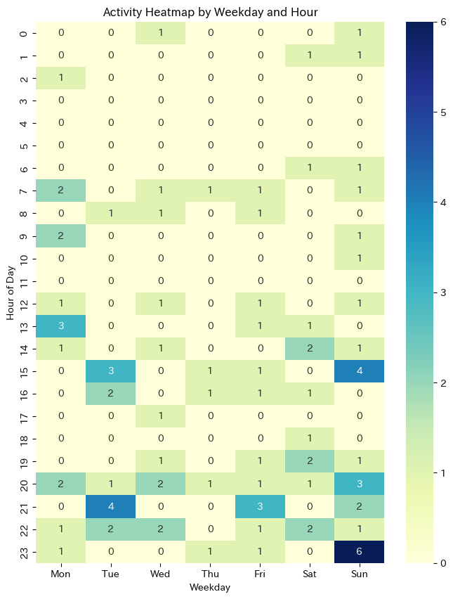
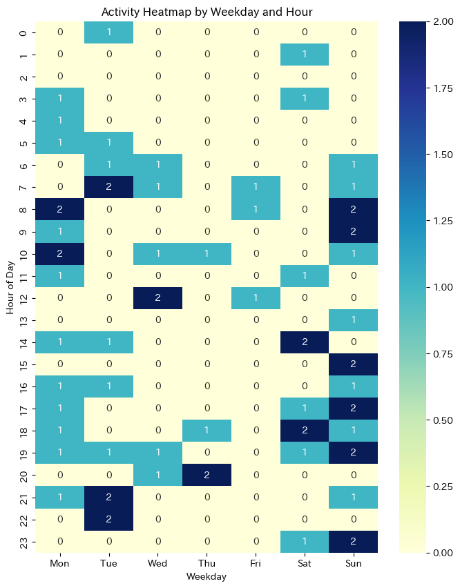

<!-- titleは自動で入る -->

# 解決したい課題・明らかにしたいこと

技術的なアウトプットが少ないのが気になっている。手を動かしてみたはいいけれど、まとめることをしないので結局忘れてしまい、再度興味を持った時には振り出しに戻っている。
できれば外向けにまとめる時間を作ることで、ある技術ネタに再度興味を持った時にその記事を読んで思い出せる。まとめる過程で新しい手を動かすネタとかやる気とかが生まれるかもしれない。
以上より、技術的なアウトプットをもっと増やしたい。

# データで解決できる形に落とし込む

技術的なアウトプットを増やすなら時間を取るしかない。ただ一方で、これまで自分がブログを書いてきたデータから「何時に技術ブログを書きたくなるか？」「技術に限らず、日記でも良いとしたら何時にアウトプットしたくなるのか？」がもし分かったら、その時間は空けておけばアウトプットができる可能性が高まる。また、気持ちが高まらない時間帯に無理にアウトプットしようとしないという方針も取れる。

以上から、「ワンタイムの分析で、何曜日の何時にブログを書きたくなるか？を技術と日記に分けてそれぞれ明らかにする」ことにする。

# 前置き

簡単のため、過去のブログデータ全てを用いる。つまり、期間による変化(学生の時と社会人の時)は無視する。

# やってみよう

方針は以下の通り。

- ステップ1: [uta8a/blog](https://github.com/uta8a/blog) リポジトリのMarkdownを読み込み、時刻を抽出する。
- ステップ2: pythonで横軸を週、縦軸を24時間として可視化する
- ステップ3: 解釈する

ステップ1: 以下のような使い捨てdenoスクリプトを書いた。最初のコメントはGitHub Copilotへの指示で、残りはほとんどCopilotに書いてもらった。(いくつか手直ししてる)

```ts
// read `_content/diary/*/_index,md` and collect frontmatter's `changelog[0].date` to array
// use deno
import { walkSync } from "jsr:@std/fs/walk";
import { parse } from "jsr:@std/yaml";

const changelogDates = [];
for (const entry of walkSync("_content/diary")) {
  if (entry.isFile && entry.name === "_index.md") {
    const content = await Deno.readTextFile(entry.path);
    const frontmatter = content.split("---")[1];
    const { title, changelog } = parse(frontmatter);
    if (changelog) {
      changelogDates.push([title, changelog[0].date]);
    }
  }
}
console.log(JSON.stringify(changelogDates));
```

以下で実行するとタイトルと時刻のセットが出てくる。

```shell
deno run -A script.ts
```

ステップ2: colabでpythonコードを動かすことにした。コードは以下の通り(だいぶ試行錯誤したのでいらないコードも混じっている)

```python
import json
# dataにdenoスクリプトの出力を `"""` で囲んで入れる
data = """
[["大事な人を大事にするということですね","2021-04-11T17:24:16.000Z"],["[感想] 「somunia / 気になるあの娘 - ...
"""

!pip install japanize_matplotlib #pltの日本語化のため

import numpy as np
import pandas as pd
import requests
import json
import datetime

import seaborn as sns
import matplotlib.pyplot as plt
import japanize_matplotlib
import matplotlib.patches as patches #長方形の描画

df = pd.read_json(data)

df["created_at"] = pd.to_datetime(df[1], format='ISO8601')
df.head()

df["created_at_jst"] = pd.to_datetime(df["created_at"], utc=True).dt.tz_convert("Asia/Tokyo")

df["year"] = df["created_at_jst"].dt.year
df["month"] = df["created_at_jst"].dt.month
df["day"] = df["created_at_jst"].dt.day
df["hour"] = df["created_at_jst"].dt.hour

df.head()

df["value"] = 1

df['weekday'] = df['created_at_jst'].dt.dayofweek  # 月曜日=0, 日曜日=6
df['hour'] = df['created_at_jst'].dt.hour

# Pivot table で週ごとの時間帯ごとのデータ集計
heatmap_data = df.pivot_table(index='hour', columns='weekday', values='value', aggfunc='sum', fill_value=0)

print(heatmap_data)

heatmap_data = heatmap_data.reindex(range(24), fill_value=0)

# ヒートマップを作成
plt.figure(figsize=(8, 10))
sns.heatmap(heatmap_data, cmap="YlGnBu", cbar=True, annot=True, fmt="d",
            xticklabels=["Mon", "Tue", "Wed", "Thu", "Fri", "Sat", "Sun"],
            yticklabels=range(24))
plt.xlabel("Weekday")
plt.ylabel("Hour of Day")
plt.title("Activity Heatmap by Weekday and Hour")
plt.show()
```

コードのポイント

- 一旦 `df["created_at_jst"] = pd.to_datetime(df["created_at"], utc=True).dt.tz_convert("Asia/Tokyo")` で日本時間に変換する。これがないとdatetimelike objectにならないっぽい
- `dayofweek` で曜日が取れて便利
- `heatmap_data = heatmap_data.reindex(range(24), fill_value=0)` をしないと、データがない時間帯がskipされてしまって描画した時に上に寄せられて下の方(23時とか)が描画されないことになる。いわゆる欠損埋めが必要なので、`reindex` で埋める。

以下のようなグラフが出力された

日記の方



技術の方



# 解釈

## 日記の方

データを見て思ったこと

- 平日昼とかに書いているのは学生時代のデータだろう。
- 日曜午後から月曜午前がピーク、火曜午後もピーク
- 水曜から土曜は少ない

解釈

- 夜にガッと言語化して書き散らすみたいな体感を裏付けるデータになった。体感とデータが一致している。
- 日記を書く気力を土日で養って、気力ゲージが貯まるのが日曜午後とかなのかも？
- 土日休んで日曜夜に本気出すタイプか

ここからわかること

- 日記を書く時間を取りたいなら日曜夜は空けておいてゆっくりしよう

## 技術の方

データを見て思ったこと

- 0,1,2の3値なので偏りはよく分からない
- 日曜に書いてる
- 日曜全体と月曜午前、火曜夜がピーク
- 水曜木曜金曜は少ない

解釈

- おそらく土日に探求して日曜に探求内容を出力している
- 火曜は謎

ここからわかること

- 技術記事を多く書くのは日曜、月曜午前、火曜夜。ここは空けておこう。

# まとめ

日常からデータサイエンスを用いてなんかおもろいことしたい。
アイデアを思いつくのが大変で、課題を適切にデータで解決できる形に落とし込めるとあとはやるだけという感じ。

今回だと火曜夜が割と非自明だったので、ここのブログのタイトルを調べたりすると何かわかるのかもしれない。
