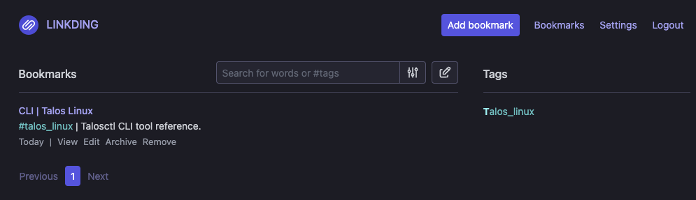

<!-- titleは自動で入る -->
[おうちk8sをはじめて2ヶ月が経過したが進捗がなく、涙](https://blog.uta8a.net/diary/2024-11-10-home-k8s-blocker) に書いたように、おうちk8sに憧れてなんとなくマシンを3台買ったのにあんまり活用できてなかったので、進捗を出そうと頑張った記録です。

# 進捗報告まとめ

- linkdingというBookmarkサービスをおうちk8sにデプロイした
- 最初に小さな構成としてVolumeはemptyDirを使った
- 次にVolumeをPVCに変更しようと思い、PVを作成するためのソフトウェアを調べた
- longhornを選択して、Talos Linuxとlonghornが噛み合うように設定した
- longhornを動かすことに成功して、linkdingのVolumeをPVCに変更できた

# 前回の振り返り

前回の記事: [おうちk8sをはじめて2ヶ月が経過したが進捗がなく、涙](https://blog.uta8a.net/diary/2024-11-10-home-k8s-blocker)

前回のgerritを立てるところで詰まった原因は、「helmで詰まるとやばい」ところにある。特にVolume周りの知識がない状態だと、アプリケーション起因でうまく立ち上がらないのか、それともVolume周りの設定起因なのかの切り分けが難しく結局断念した。

そこで今回は、もっとシンプルなサービスを、helmなどを使わずにデプロイすることでVolume自体の学習に集中する。

# linkdingについて

[sissbruecker/linkding](https://github.com/sissbruecker/linkding) はミニマルなBookmarkサービスで、DBはsqliteを使っている。

[installation](https://linkding.link/installation/)にdockerでのセットアップが書かれている

```bash
docker run --name linkding -p 9090:9090 -v {host-data-folder}:/etc/linkding/data -d sissbruecker/linkding:latest
```

まずはこれを参考に動かしてアプリ側で詰まらないようにしておく。

- `/etc/linkding/data` にsqliteのデータが保存されてそう(ref. [Backups](https://linkding.link/backups/))
- ポートは9090番で動作する
- 初期ユーザは環境変数で `LD_SUPERUSER_NAME` と `LD_SUPERUSER_PASSWORD` で設定できる (ref. [Options](https://linkding.link/options/))

# k8sのVolumeについておさらい

[Volumes | Kubernetes](https://kubernetes.io/docs/concepts/storage/volumes/) を眺めると、Volumeは共有ストレージのようなもので、Podがクラッシュした時に状態が失われる問題と、複数コンテナ間でファイルを共有できない問題を解決する機能になっている。

VolumeにはTypeがある。今回関連するのは以下のType。

- configMap: 設定をPodに注入するために使う。環境変数とか設定ファイルとか。
- emptyDir: Podに紐付く。Podと同じライフサイクルなのでPodが削除されるとデータも消える。
- persistentVolumeClaim(PVC): PersistentVolume(PV)リソースをPodにマウントする。PVはPodとは別のリソースなので、Podが削除されてもデータは失われない。

# 記録

## linkdingをおうちk8s上で動かす

まずシンプルな構成で動かすことにする。[linkdingのCommunity](https://linkding.link/community/) を眺めるとk8s manifest例があったのでそれを見る。

manifest例 [linkding-k8s-s3](https://github.com/jzck/linkding-k8s-s3/blob/843875f87cf9cd7512747e4cf57128e443e1c0b9/manifest.yaml) をみると、litestreamというSQLite用のレプリケーションツールを使ってemptyDirに置いたsqliteのデータをS3へバックアップする方針を取っている。

今回はS3は使わないので、litestreamに関する部分を消した。
以下の部分は参考にできそう。

```yaml
    spec:
      volumes:
        - name: data
          emptyDir: {}
```

一個一個調べながら書いていく。

- [Namespace](https://kubernetes.io/docs/tasks/administer-cluster/namespaces/#creating-a-new-namespace)
- configMap: 今回はlitestream関連がいらないので使わない
- [StatefulSets](https://kubernetes.io/docs/concepts/workloads/controllers/statefulset/): `selector.matchLabels` が気になった。これはどのPodをDeploymentsの対象とするかのラベルセレクター(参考: [Kubernetesの初学者がlabelについて気になること - Carpe Diem](https://christina04.hatenablog.com/entry/kubernetes-labels))

`kubectl apply -f manifest.yaml ` でデプロイした。
Podの様子はRunningになってそう。大丈夫。

続いて外からアクセスするためにTailscaleで繋ぐ。
[Kubernetes operator · Tailscale Docs](https://tailscale.com/kb/1236/kubernetes-operator) を参考にして、helm upgradeする

```bash
$ helm upgrade \
  --install \
  tailscale-operator \
  tailscale/tailscale-operator \
  --namespace=linkding \ 
  --set-string oauth.clientId="xx" \ 
  --set-string oauth.clientSecret="xx" \
  --wait

Release "tailscale-operator" does not exist. Installing it now.
Error: Unable to continue with install: CustomResourceDefinition "connectors.tailscale.com" in namespace "" exists and cannot be imported into the current release: invalid ownership metadata; annotation validation error: key "meta.helm.sh/release-namespace" must equal "linkding": current value is "gerrit-operator"
```

エラーが出た。
`kubectl get crd connectors.tailscale.com -o yaml` を叩いてみると、確かにこの前消したはずのgerrit-operatorがいる

```bash
$ kubectl get crd connectors.tailscale.com -o yaml

metadata:
  annotations:
	  meta.helm.sh/release-name: tailscale-operator
    meta.helm.sh/release-namespace: gerrit-operator
```

release-namespaceがよく分かっていない。後から思ったけどこれはNamespaceごとにデプロイするものじゃなくて、"tailscale-system"みたいなNamespaceにデプロイして他のNamespaceから参照するものなのか？

この時は以下の手順で消していった

```bash
kubectl get crds -oname | grep "tailscale" | xargs kubectl delete
kubectl get clusterrole -oname | grep "tailscale" | xargs kubectl delete
kubectl get clusterrolebinding -oname | grep "tailscale" | xargs kubectl delete
kubectl get ingressclass -oname | grep "tailscale" | xargs kubectl delete
```

これでようやく `helm upgrade` が動く

```bash
$ kubectl -n linkding describe ing ingress-linkding-tailscale
Name:             ingress-linkding-tailscale
Labels:           <none>
Namespace:        linkding
Address:          <tailscaleから払い出されたドメイン>
Ingress Class:    tailscale
Default backend:  <default>
TLS:
  SNI routes linkding
Rules:
  Host        Path  Backends
  ----        ----  --------
  *           
              /   linkding:80 (*.*.*.*:9090)
Annotations:  <none>
Events:       <none>
```

これでURLにアクセスしたらlinkdingが見れた。

この時のcommit: [c9c2853684392e9514e994a72155f008aa7f9bc2](https://github.com/uta8a/infra/pull/2/commits/c9c2853684392e9514e994a72155f008aa7f9bc2)

- emptyDirを使っている
- tailscaleで外に出ている

これでシンプルな構成ができた。

## Talos Linuxとlonghornの設定

次はPVCを使いたい。
調べてみたところ、[longhorn](https://longhorn.io/)が良さそうだったのでこれをデプロイする。

helmはもしヤバくなった時にデバッグできる自信がないので、 [Install with Kubectl](https://longhorn.io/docs/1.7.2/deploy/install/install-with-kubectl/) のドキュメントを見ながらやっていく。

```bash
kubectl apply -f https://raw.githubusercontent.com/longhorn/longhorn/v1.7.2/deploy/longhorn.yaml
```

applyしたら、11分立ってもinitが終わらない。ドキュメントをみると2分くらいで立ちそうな見た目をしているのでおかしいと思い、キャンセル
調べてみると、Talos Linuxの場合は [Talos Linux Support](https://longhorn.io/docs/1.7.2/advanced-resources/os-distro-specific/talos-linux-support/) の手順を踏む必要があった。

やることは3つ

- System ExtensionsをTalos LinuxのOS設定に追加
- Pod Security Admissionを `enforce: privileged` に変更
- Data path mountsを設定

ちなみにうまくいっていない時の状態はこんな感じになったりする。extraMounts設定をして、Pod Securityも設定して、Extensionがない状態だとこんな感じ。

```bash
$ kubectl get pods \
--namespace longhorn-system \
--watch
NAME                                        READY   STATUS             RESTARTS      AGE
longhorn-driver-deployer-57c5fd5677-9tk4w   0/1     Init:0/1           0             23s
longhorn-manager-fnjgn                      1/2     CrashLoopBackOff   1 (7s ago)    23s
longhorn-manager-mpl9n                      1/2     CrashLoopBackOff   1 (16s ago)   23s
longhorn-ui-d476cbd9d-t4fsx                 1/1     Running            0             23s
longhorn-ui-d476cbd9d-trjmq                 1/1     Running            0             23s
longhorn-manager-mpl9n                      1/2     Error              2 (19s ago)   26s
longhorn-manager-mpl9n                      1/2     CrashLoopBackOff   2 (5s ago)    31s
longhorn-manager-fnjgn                      1/2     Error              2 (19s ago)   35s
longhorn-manager-fnjgn                      1/2     CrashLoopBackOff   2 (6s ago)    41s
```

### System Extensionsの設定

Extensionsが入ってない状態だった。

```bash
$ talosctl get extensions --nodes <IP> --endpoints <IP> --talosconfig=./talosconfig
NODE   NAMESPACE   TYPE   ID   VERSION   NAME   VERSION
```

最初は `talosctl apply-config` でいけるかと考えていた。

```yaml
customization:
  systemExtensions:
    officialExtensions:
      - siderolabs/iscsi-tools
      - siderolabs/util-linux-tools
```

この変更を `machine.install.image` に反映させて `talosctl apply-config`

```bash
$ talosctl apply-config -f controlplane.yaml --nodes <IP> --endpoints <IP> --talosconfig=./talosconfig
Applied configuration without a reboot
```

rebootをする

```bash
$ talosctl reboot --nodes <IP> --endpoints <IP> --talosconfig=./talosconfig
watching nodes: [<IP>]
    * <IP>: post check passed
```

でもExntensionsが入ってない。

色々やった結果、「installerはupgrade時にiso入れ替えが起こるタイミングで使用される」ということが分かった。
そこで `talosctl upgrade` を実行

```bash
$ talosctl upgrade --nodes <IP> --endpoints <IP> --talosconfig=./talosconfig --preserve --image='factory.talos.
dev/installer/613e1592b2da41ae5e265e8789429f22e121aab91cb4deb6bc3c0b6262961245:v1.8.3'
WARNING: <IP>: server version 1.7.6 is older than client version 1.8.3
watching nodes: [<IP>]
    * <IP>: post check passed
```

(本当は色々紆余曲折あったが割愛、preserveつけずにやったらデータ破壊したりして大変だった)

これでExtensionsが入った

```bash
[22:22:18] uta8a@rustacean: infra/home-k8s 🌱 learn-volume 
$ talosctl get extensions --nodes <IP>,<IP>,<IP> --endpoints <IP> --talosconfig=./talosconfig

NODE            NAMESPACE   TYPE              ID   VERSION   NAME               VERSION
<IP>   runtime     ExtensionStatus   0    1         iscsi-tools        v0.1.6
<IP>   runtime     ExtensionStatus   1    1         util-linux-tools   2.40.2
<IP>   runtime     ExtensionStatus   2    1         schematic          613e1592b2da41ae5e265e8789429f22e121aab91cb4deb6bc3c0b6262961245
<IP>   runtime     ExtensionStatus   0    1         iscsi-tools        v0.1.6
<IP>   runtime     ExtensionStatus   1    1         util-linux-tools   2.40.2
<IP>   runtime     ExtensionStatus   2    1         schematic          613e1592b2da41ae5e265e8789429f22e121aab91cb4deb6bc3c0b6262961245
<IP>   runtime     ExtensionStatus   0    1         iscsi-tools        v0.1.6
<IP>   runtime     ExtensionStatus   1    1         util-linux-tools   2.40.2
<IP>   runtime     ExtensionStatus   2    1         schematic          613e1592b2da41ae5e265e8789429f22e121aab91cb4deb6bc3c0b6262961245
```

### extraMountsの設定

commit: [8609f0d5f0d05d91e866535c6610ad22f0079f2b](https://github.com/uta8a/infra/pull/2/commits/8609f0d5f0d05d91e866535c6610ad22f0079f2b)

多分workerだけでいい気もするが、設定した

### Pod Security Admissionの設定

commit: [e2be62ca1b83e9f6a9f975cb7e411b3169ad343c](https://github.com/uta8a/infra/pull/2/commits/e2be62ca1b83e9f6a9f975cb7e411b3169ad343c)

フォーマッタが入っているが、実質差分はこちらのlabelsのみ

```yaml
kind: Namespace
metadata:
  name: longhorn-system
  labels:
    pod-security.kubernetes.io/enforce: privileged
    pod-security.kubernetes.io/enforce-version: latest
    pod-security.kubernetes.io/audit: privileged
    pod-security.kubernetes.io/audit-version: latest
    pod-security.kubernetes.io/warn: privileged
    pod-security.kubernetes.io/warn-version: latest
```

これでlonghornが動作した。

```bash
$ kubectl -n longhorn-system get pods                                        
NAME                                                READY   STATUS    RESTARTS        AGE
csi-attacher-698944d5b-kzn8t                        1/1     Running   0               5m5s
csi-attacher-698944d5b-ld2qm                        1/1     Running   0               6m42s
csi-attacher-698944d5b-lmpzx                        1/1     Running   1 (112s ago)    5m4s
csi-provisioner-b98c99578-62j64                     1/1     Running   1 (112s ago)    6m42s
csi-provisioner-b98c99578-vkrqg                     1/1     Running   0               5m5s
csi-provisioner-b98c99578-zrbq8                     1/1     Running   0               5m5s
csi-resizer-7474b7b598-7gl8r                        1/1     Running   0               5m4s
csi-resizer-7474b7b598-7wkcq                        1/1     Running   1 (112s ago)    5m4s
csi-resizer-7474b7b598-r9mmh                        1/1     Running   0               6m42s
csi-snapshotter-774467fdc7-64m47                    1/1     Running   0               5m3s
csi-snapshotter-774467fdc7-7grv5                    1/1     Running   1 (115s ago)    6m42s
csi-snapshotter-774467fdc7-lznwq                    1/1     Running   0               5m4s
engine-image-ei-51cc7b9c-hgqkk                      1/1     Running   0               7m17s
engine-image-ei-51cc7b9c-wcp8x                      1/1     Running   0               3m28s
instance-manager-3a87944663e094a108abea000e1186d3   1/1     Running   0               6m47s
instance-manager-433e3e043ebf59e3e5a6f8d1885b8705   1/1     Running   0               2m41s
longhorn-csi-plugin-pkf6n                           3/3     Running   0               6m42s
longhorn-csi-plugin-prk54                           3/3     Running   2 (3m11s ago)   3m28s
longhorn-driver-deployer-57c5fd5677-977zd           1/1     Running   0               5m3s
longhorn-manager-25slx                              2/2     Running   0               3m28s
longhorn-manager-sbv4m                              2/2     Running   0               7m39s
longhorn-ui-d476cbd9d-l57qq                         1/1     Running   0               5m5s
longhorn-ui-d476cbd9d-lrvnv                         1/1     Running   0               5m3s
```

emptyDirからPVCに変更してapply

```bash
kubectl apply -f ./manifest.yaml
```

commit: [6de6cd0b299938bb22eeb733ceb1aa81cb174410](https://github.com/uta8a/infra/pull/2/commits/6de6cd0b299938bb22eeb733ceb1aa81cb174410)

(secretはsecrets.yamlを作ってそこに書き込むなどかなり雑にやっている)

できた！ちゃんとPodを消してもデータが残る。



# 感想

- PVC, PVを使い方の側面から理解した
- Talos Linuxは難しい
- 次はまた別のサービスに挑戦したい(CI/CD, Observabilityあたりが気になっている)
- Identity Aware Proxyをマネージドで借りて自宅サーバの前段において、認証が通った人のみ自作サーバにアクセスできる環境を作ってみたい。おうちクラウドみたいなのを作って、友人に一部のリソースを貸し出すみたいなのも作れそう。
